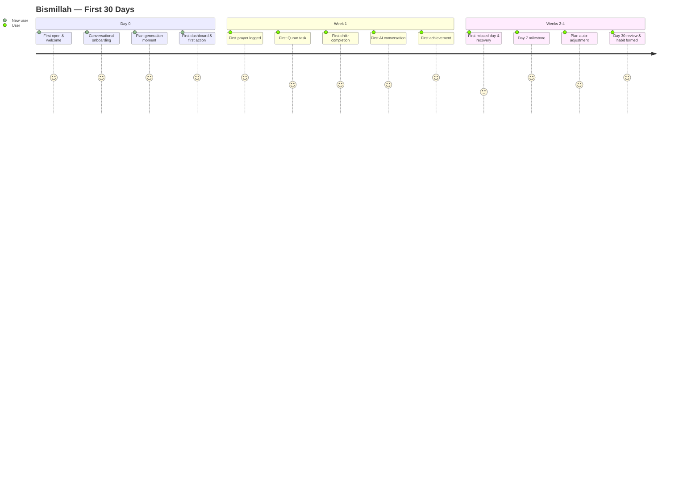

# Bismillah — Master Product Requirements Document

| | |
|---|---|
| **Document** | 01_PRODUCT_PRD.md |
| **Version** | 1.0 |
| **Date** | 2026-07-08 |
| **Status** | Approved baseline — all future product documents derive from this PRD |
| **Governing document** | [CLAUDE.md](../CLAUDE.md) — Bismillah Engineering Constitution |

---

## Table of Contents

1. [Executive Summary](#1-executive-summary)
2. [Product Vision](#2-product-vision)
3. [Mission Statement](#3-mission-statement)
4. [Product Philosophy](#4-product-philosophy)
5. [Problem Statement](#5-problem-statement)
6. [Why This Product Should Exist](#6-why-this-product-should-exist)
7. [Market Opportunity](#7-market-opportunity)
8. [Competitor Analysis](#8-competitor-analysis)
9. [Positioning Strategy](#9-positioning-strategy)
10. [Target Audience](#10-target-audience)
11. [User Personas](#11-user-personas)
12. [Jobs To Be Done](#12-jobs-to-be-done)
13. [User Pain Points](#13-user-pain-points)
14. [User Goals](#14-user-goals)
15. [Product Goals](#15-product-goals)
16. [Success Metrics](#16-success-metrics)
17. [North Star Metric](#17-north-star-metric)
18. [Product Principles](#18-product-principles)
19. [Design Principles](#19-design-principles)
20. [Islamic Content Principles](#20-islamic-content-principles)
21. [AI Assistant Principles](#21-ai-assistant-principles)
22. [Onboarding Strategy](#22-onboarding-strategy)
23. [Personalization Strategy](#23-personalization-strategy)
24. [User Journey](#24-user-journey)
25. [Information Architecture](#25-information-architecture)
26. [Navigation Architecture](#26-navigation-architecture)
27. [MVP Scope](#27-mvp-scope)
28. [Out of Scope for MVP](#28-out-of-scope-for-mvp)
29. [Version 2 Roadmap](#29-version-2-roadmap)
30. [Version 3 Vision](#30-version-3-vision)
31. [Gamification Strategy](#31-gamification-strategy)
32. [Notification Strategy](#32-notification-strategy)
33. [Premium Strategy](#33-premium-strategy)
34. [Monetization Principles](#34-monetization-principles)
35. [Privacy Strategy](#35-privacy-strategy)
36. [Security Strategy](#36-security-strategy)
37. [Accessibility Strategy](#37-accessibility-strategy)
38. [Offline Experience](#38-offline-experience)
39. [Localization Strategy](#39-localization-strategy)
40. [Analytics Strategy](#40-analytics-strategy)
41. [Technical Considerations](#41-technical-considerations)
42. [Risk Analysis](#42-risk-analysis)
43. [Ethical Considerations](#43-ethical-considerations)
44. [Content Strategy](#44-content-strategy)
45. [Definition of MVP Success](#45-definition-of-mvp-success)
46. [Final Product Vision](#46-final-product-vision)

---

## 1. Executive Summary

**Bismillah is a premium Islamic lifestyle companion** — a mobile app that helps Muslims build consistent worship habits through a personalized daily plan, beautiful design, gentle motivation, and a carefully constrained AI assistant.

**Who it serves.** Muslims at every practice level — from a convert who doesn't yet know how to pray, to a busy professional who prays but wants more consistency, to a hafiz-in-training tracking daily Quran memorization. The product launches with full Turkish, English, and Arabic support and is designed for a global audience from day one.

**Why it matters.** The dominant Islamic apps today are utilities: prayer time tables, ad-cluttered Quran readers, simple counters. They tell users *when* to pray but not *how to grow*. Millions of Muslims feel spiritually inconsistent and don't know what small step to take today. No existing app answers the question every screen of Bismillah is built around: **"What should I do now?"**

**What makes it different.**

1. **Personalization is the product.** Onboarding builds a spiritual profile; the app generates a realistic daily plan and a dashboard that adapts to it. A beginner and an advanced user open two visibly different apps.
2. **Premium wellness-grade design.** The calm of Calm, the habit mechanics of Duolingo, the clarity of Apple Health — applied to Islamic life. No ads, no clutter, no 2012-era UI.
3. **Trustworthy content architecture.** Quran, Hadith, scholarly opinion, and AI explanation are always visually and structurally separated. The AI teaches and motivates; it never rules.
4. **Gentle by design.** No guilt mechanics, no fear-based streaks, no shame notifications. Missing a day triggers encouragement, not punishment.

**Business model.** Freemium subscription via RevenueCat. The free tier is a genuinely complete worship companion; Premium adds depth (advanced AI coaching, unlimited conversations, advanced statistics, hatim planning, family plans). Core worship tools are never paywalled.

**MVP.** Onboarding → personalized Today dashboard → prayer, Quran, and dhikr tracking → dua library → daily ayah and reflection → AI assistant (v1) → streaks, XP, achievements → profile and settings, with a localization and notification foundation. Built on Flutter, Riverpod, GoRouter, Firebase, Isar, and RevenueCat per the Engineering Constitution.

---

## 2. Product Vision

Bismillah becomes **the daily companion for Muslims worldwide** — the app a Muslim opens after Fajr the way others open a fitness ring or a meditation app, and the first app anyone recommends when someone says *"I want to get closer to my deen but I don't know where to start."*

The ten-year picture:

- **A companion, not a utility.** Users don't open Bismillah to look something up; they open it because their day is organized around it. It knows their pace, celebrates their consistency, and meets them with mercy when they fall behind.
- **The trust standard.** When Bismillah shows a hadith, users trust the sourcing. When the AI explains a concept, users see clearly that it is an explanation, not a ruling. Scholars can recommend the app without hesitation.
- **Whole-family, whole-year.** From a child's first surah to a grandparent's hatim, from an ordinary Tuesday to the last ten nights of Ramadan, Bismillah scales with the moment and the person.
- **Global from the core.** Not an English app with translations — an app whose Turkish, English, and Arabic experiences each feel native, expanding to Urdu, Indonesian, French, Malay, and beyond.

We will know the vision is being realized when users describe Bismillah not as "a prayer app" but as **"the app that helped me become consistent."**

---

## 3. Mission Statement

> **Help Muslims grow closer to Allah through small, consistent daily actions — with beautiful design, authentic knowledge, intelligent personalization, and sincere encouragement.**

Every feature, screen, and notification must serve this mission. If a proposed feature does not help a real person pray more consistently, read Quran more regularly, remember Allah more often, or understand their faith more deeply — it does not ship.

---

## 4. Product Philosophy

Bismillah is built on seven experiential commitments:

1. **Peace over stimulation.** The app is a refuge from noisy feeds, not another one. Screens breathe. Animations soothe. Nothing blinks, begs, or interrupts.
2. **One clear next step.** Every screen answers *"What should I do now?"* The user is never presented with a wall of options and left to figure it out.
3. **Realism over ambition.** A plan the user can actually complete beats an impressive plan they abandon. Bismillah always prefers "one page of Quran daily, sustained" over "one juz daily, abandoned in a week."
4. **Mercy in the mechanics.** Habit systems are engineered around the hadith that the most beloved deeds to Allah are the most consistent, even if small. Recovery is always one tap away; guilt is never a mechanic.
5. **Trust is the brand.** Content authenticity, honest monetization, and privacy discipline are product features, not compliance checkboxes.
6. **Premium is respect.** Muslims deserve software of the same quality as the best wellness and productivity apps. Craftsmanship is a form of respect for the user and the subject matter.
7. **The AI serves, never presides.** Intelligence personalizes and encourages. It does not judge, rule, or pretend to authority it does not have.

The app must always feel: peaceful, premium, modern, trustworthy, personal, gentle, motivating, beautiful, and useful every day.

The app must never feel: cheap, cluttered, old-fashioned, judgmental, fear-based, overwhelming, or like a generic Islamic app clone.

---

## 5. Problem Statement

Muslims who want to practice more consistently face a compounding set of problems that existing apps do not solve:

**1. Inconsistency in worship.** The most common spiritual struggle is not disbelief but discontinuity — praying for a week, stopping for a month, and feeling too discouraged to restart. There is no product designed around *restarting gently*.

**2. No personal path.** Islamic knowledge online is vast but unstructured. A beginner searching "how to start praying" finds fatwa forums, hour-long lectures, and contradictory advice — but no realistic plan calibrated to *their* level and *their* available 15 minutes a day.

**3. Overwhelming or shallow apps.** Existing Islamic apps are either kitchen-sink utilities (20 features, no guidance) or single-purpose tools (a counter, a timetable). Neither answers "what should I do today?"

**4. Poor design quality.** Most Islamic apps look and feel a decade old: dense menus, harsh colors, banner ads over Quran text. This quietly signals that Islamic software is second-class — and pushes design-conscious users away.

**5. Ad-based disrespect.** Monetizing sacred content with interstitial ads breaks trust and reverence. Users routinely cite ads over Quran pages as the reason they abandoned an app.

**6. Motivation without manipulation is missing.** Generic habit apps have good mechanics but no Islamic context — and some use streak-shame patterns that are spiritually counterproductive. Islamic apps mostly have no motivation system at all.

**7. Knowledge anxiety.** Beginners and converts are often afraid to ask basic questions ("Do I have to pray in Arabic?") in public forums. They need a private, patient, non-judgmental place to learn — that will not invent answers.

**8. Spiritual disconnection with no on-ramp.** Many Muslims describe feeling distant from their faith and not knowing the first step back. The cost of that first step is currently very high; Bismillah's job is to make it one tap.

---

## 6. Why This Product Should Exist

**The behavior shift already happened.** Hundreds of millions of people now manage sleep, fitness, focus, and mental health through beautifully designed mobile companions. Muslims are part of that same audience — but no product applies that model to Islamic life at a premium quality bar. The expectation exists; the product does not.

**The generational moment.** A young, mobile-first, global Muslim generation grew up with Headspace and Duolingo. They will not tolerate ad-heavy, cluttered apps — and they are actively looking for tools that fit both their aesthetic standards and their faith.

**AI finally enables real personalization — and raises real risk.** Personalized spiritual coaching at scale was impossible before capable language models. But the same technology, applied carelessly, will produce invented hadith and fake fatwas. This category *needs* a product that leads with restraint and content integrity. If a trustworthy actor doesn't define the standard, an untrustworthy one will.

**Nobody owns "consistency."** Prayer times are commoditized. Quran text is commoditized. The unowned, defensible position is the *habit layer* — the personalized plan, the gentle accountability, the daily companion relationship. That is a position that compounds: every day of user data makes the plan better and switching costs higher.

**It is worth doing, independent of the market.** Helping one person restore their daily prayers is intrinsically valuable. A product built with that sincerity — and disciplined execution — earns trust no marketing budget can buy.

---

## 7. Market Opportunity

> **Note:** Figures below are directional assumptions for planning, clearly labeled. No fabricated precision.

**Structural tailwinds:**

- **A very large, young, mobile-first audience.** The global Muslim population is on the order of ~2 billion, with a median age well below the global average and smartphone-first internet adoption across Turkey, Indonesia, MENA, South Asia, and Western diasporas. *(Assumption: total addressable audience of practicing or aspiring-to-practice Muslim smartphone users is in the hundreds of millions.)*
- **Proven demand at the utility level.** Leading Islamic apps report user bases in the tens to hundreds of millions of downloads — demonstrating category demand while competing almost entirely on utility, not on growth or experience.
- **Wellness subscription behavior is established.** Meditation, fitness, and habit apps have normalized $5–15/month subscriptions for daily wellbeing companions. Spiritual wellbeing is a natural extension of the same wallet. *(Assumption: willingness-to-pay among engaged Muslim professionals in target markets is comparable to meditation app benchmarks.)*
- **Habit-tracking and streak mechanics are culturally mainstream.** Duolingo made daily-streak learning a global norm. The mechanics transfer directly to worship consistency — if applied with mercy instead of pressure.
- **AI assistants are now expected.** Users increasingly assume a personal-growth app will include intelligent guidance. A well-governed Islamic AI assistant is a differentiator today and table stakes tomorrow.
- **Ramadan is a built-in annual growth engine.** Every year, a global cohort of Muslims looks for tools to structure their best month. Ramadan reliably multiplies category downloads and is a natural conversion and reactivation moment.

**Strategic beachheads:** Turkey (Turkish-first experience, large market, founder proximity), English-speaking diaspora (US/UK/EU — high willingness to pay, underserved converts), and Arabic-speaking Gulf markets (high ARPU, strong design sensitivity). *(Assumption: these three language markets are sufficient for MVP validation and initial subscription revenue.)*

**The gap:** the market has *utilities with huge reach* and *niche tools with good ideas*, but no *premium personalized companion*. That is the opening.

---

## 8. Competitor Analysis

| Competitor type | What they do well | Where users feel friction | What Bismillah does differently |
|---|---|---|---|
| **Muslim Pro** (mega-utility) | Massive feature breadth; accurate prayer times; huge install base; strong Ramadan presence | Cluttered UI; heavy ads; past privacy controversies damaged trust; no guidance — 20 tools, zero direction | One personalized plan instead of 20 tools; no ads ever; privacy as a stated principle; calm premium UI |
| **Athan (IslamicFinder)** | Reliable prayer times and qibla; established brand | Utility-only; dated design; ad-supported; no habit or growth layer | Prayer times are a *supporting feature* inside a growth companion, not the product |
| **Quranly** | Genuinely good Quran habit loop; streaks; gentle tone | Single-purpose (Quran reading only); limited personalization; whole Islamic life is out of scope | Same habit-loop quality, extended across prayer, dhikr, dua, and learning in one coherent plan |
| **Pillars** | Beautiful, modern, minimal prayer tracking; proof that Muslims respond to premium design | Narrow scope (prayer logging); light on content, learning, and personalization | Match its design bar, then add the plan, content depth, AI guidance, and full worship breadth |
| **Tarteel** | Excellent AI recitation feedback; strong technical moat in its niche | Serves memorizers/reciters specifically; not a daily life companion | Complementary niche — Bismillah orchestrates the *daily plan* layer; recitation depth can come later (V3) |
| **Dhikr & Dua apps** | Simple, focused counters and collections | Commodity functionality; no sourcing rigor; no motivation system; abandoned quickly | Dhikr/dua as *habits inside a plan* with sourced content and streak mechanics, not standalone counters |
| **Quran reader apps** (Quran.com app, Ayat, etc.) | Authoritative text, translations, audio | Reference tools, not companions; no habit formation; reading progress lives nowhere | MVP tracks reading habits and links out-of-scope depth to references; V2 builds the reading experience in |
| **Generic habit trackers** (Habitica, Streaks, etc.) | Mature habit mechanics and psychology | Zero Islamic context — no prayer times, no Arabic, no content, no spiritual tone; guilt-prone streak design | Islamic-native habit engine: prayer-time-aware scheduling, worship-specific habits, mercy-based recovery |
| **AI chatbot apps** (generic + Islamic GPT wrappers) | Instant answers; conversational comfort; low friction for embarrassing questions | Hallucinated hadith and rulings; no source separation; no persistent relationship with the user's actual practice | Constrained assistant that knows the user's plan and progress, cites content classes explicitly, and refuses to act as a mufti |

**How Bismillah avoids becoming another clone:** it does not compete on any single feature. Prayer times, Quran text, and counters are commodities — Bismillah treats them as *inputs* to the thing no competitor has: **a personalized, adaptive, mercy-based daily growth plan** delivered with top-1% design quality. The moat is the combination: personalization depth × content trust × design bar × gentle-motivation system. Any competitor can copy a feature; copying the coherence is a rebuild.

---

## 9. Positioning Strategy

**Chosen positioning:**

> **"Your personalized daily Islamic companion."**

**Alternatives considered:**

| Candidate | Strength | Why not primary |
|---|---|---|
| "The Headspace for Muslims" | Instantly communicates category and quality | Defines us by another brand; ceiling is "clone"; weak in Muslim-majority markets where Headspace is less known |
| "Build your Islamic habits" | Concrete, action-oriented | Reduces the product to a habit tracker; misses content, learning, and companionship |
| "Grow closer to Allah, one day at a time" | Emotionally resonant, mission-true | Beautiful as a *tagline*, but not a *positioning* — doesn't say what the product is |
| "The most beautiful Islamic app" | Leverages the visible differentiator | Design is how we win attention, not why users stay; invites shallow comparison |

**Why the chosen positioning wins:** each word carries the strategy — *personalized* (the differentiator), *daily* (the habit and retention model), *Islamic* (the domain and values), *companion* (relationship, not utility; gentle, not authoritative). It is honest, ownable, and translates cleanly into Turkish (*"Kişisel günlük İslami yol arkadaşın"*) and Arabic (*"رفيقك اليومي الإسلامي الشخصي"*).

**Positioning guardrails:** never market as a fatwa source, never claim scholarly authority, never position against Islam's institutions — Bismillah is a companion *alongside* mosques, teachers, and scholars, and its marketing should say so.

---

## 10. Target Audience

**Primary audience (MVP focus):**

- **Consistency seekers** — Muslims who pray sometimes and feel bad about the gaps; the largest and most underserved segment. They need structure, mercy, and a realistic plan.
- **Practicing improvers** — Muslims with a stable prayer base who want to add Quran, dhikr, and learning depth. They need tracking, depth, and challenge.
- **Beginners and converts/reverts** — users starting near zero who need patient, judgment-free, step-by-step guidance and a safe place to ask basic questions.

**Secondary audience (served at MVP, optimized later):**

- **Busy professionals and students** — time-poor users who need worship to fit into a dense schedule; high subscription potential.
- **Quran-focused learners** — users whose main goal is reading/memorization consistency; served by MVP tracking, fully served by V2 Quran depth.
- **Spiritually disconnected returners** — users in a low period who need the gentlest possible on-ramp; a key Ramadan-acquisition segment.

**Future audiences (V2–V3):**

- **Parents and families** — family plans, kids mode, shared goals.
- **Advanced students of knowledge** — structured learning paths, scholar-reviewed depth.
- **Elderly users** — accessibility-first large-type experience.
- **Additional language markets** — Urdu, Indonesian/Malay, French, German expansion.

**Explicitly not a target:** users seeking fatwa services, Islamic social networking, or matrimonial features. Bismillah does not build for these.

---

## 11. User Personas

### Persona 1 — "Yusuf" · The Beginner

- **Age range:** 18–25 · **Background:** University student in Istanbul; raised culturally Muslim, practice was occasional at home
- **Practice level:** Prays occasionally (Fridays, Ramadan); cannot yet read Arabic script; knows short surahs by heart
- **Goals:** Learn to pray all five prayers properly; understand what he's reciting; stop feeling like a "bad Muslim"
- **Pain points:** Doesn't know where to start; embarrassed to ask basics; online answers are contradictory and often harsh; existing apps assume knowledge he lacks
- **Motivations:** A quiet sense that he's missing something; friends who pray seem grounded; wants change before life gets busier
- **Needs from Bismillah:** A zero-judgment starting plan ("learn Fajr first"), transliteration and audio support, beginner Q&A with the assistant, visible early wins
- **How Bismillah serves him:** Onboarding detects beginner level → dashboard shows *one* prayer goal, a 5-minute lesson, and a short dhikr; the assistant answers "do I have to pray in Arabic?" patiently, with sources separated; XP and streaks make week one feel like progress, not failure

### Persona 2 — "Amina" · The Busy Professional

- **Age range:** 28–38 · **Background:** Product manager in London; second-generation British Muslim; high app-quality standards
- **Practice level:** Prays most prayers but loses Fajr and consistency during crunch weeks; reads Quran mainly in Ramadan
- **Goals:** Protect her five prayers against her calendar; add 10 minutes of Quran daily; feel spiritually anchored, not just busy
- **Pain points:** Existing Islamic apps feel unprofessional and ad-ridden; generic habit apps don't understand prayer times; guilt spiral after missed prayers leads to avoidance
- **Motivations:** Uses Headspace and a fitness ring; believes what gets measured gets managed; willing to pay for quality
- **Needs from Bismillah:** Prayer-time-aware smart reminders, a compact daily plan that fits 20 minutes, weekly progress insight, an interface she'd happily show colleagues
- **How Bismillah serves her:** Onboarding captures her tight schedule → plan concentrates Quran after Maghrib; gentle Fajr recovery flow instead of a broken streak; premium statistics and the AI coach make her the core subscription customer

### Persona 3 — "Mehmet" · The Practicing Muslim Seeking Consistency

- **Age range:** 35–50 · **Background:** Engineer in Ankara; prays five daily prayers; mosque on Fridays
- **Practice level:** Solid obligatory practice; sporadic Quran reading; wants to add sunnah prayers and structured dhikr
- **Goals:** Finish a hatim this year; make morning/evening adhkar automatic; deepen rather than maintain
- **Pain points:** His practice plateaued years ago; no tool tracks the *depth* dimensions he cares about; most apps target beginners or are toys
- **Motivations:** Age and gratitude; wants his children to see a father who grows; finds satisfaction in completed plans
- **Needs from Bismillah:** Advanced tracking (sunnah, adhkar, hatim progress), meaningful statistics, content that respects his level
- **How Bismillah serves him:** Onboarding detects advanced level → dashboard emphasizes Quran pages toward hatim, morning/evening adhkar checklists, and monthly goals; V2 hatim planner is built for him

### Persona 4 — "Fatima" · The Quran Learner

- **Age range:** 20–30 · **Background:** Medical student in Amman; native Arabic speaker
- **Practice level:** Prays consistently; studied tajweed as a child; wants to rebuild a daily Quran relationship and memorize Juz Amma
- **Goals:** A page a day without fail; track memorization; understand tafsir themes of what she reads
- **Pain points:** Reading streaks die during exam periods; reference apps don't track habits; nothing plans around her academic calendar
- **Motivations:** Quran was her anchor as a teenager; wants it back as an adult
- **Needs from Bismillah:** A Quran-centric plan, flexible goal resizing during exams, reflection prompts tied to what she read
- **How Bismillah serves her:** Onboarding sets Quran as primary goal → Quran-focused dashboard; when she reports low time, the plan shrinks instead of breaking; the assistant discusses themes of her current surah with clear "AI explanation" labeling

### Persona 5 — "David / Dawud" · The Convert

- **Age range:** 25–40 · **Background:** Software developer in Texas; converted eight months ago; no Muslim family; small local community
- **Practice level:** Learned salah mechanics from YouTube; anxious about mistakes; reads Quran in English translation
- **Goals:** Pray correctly and confidently; build knowledge foundations in the right order; feel less alone in his practice
- **Pain points:** Every question feels stupid to ask publicly; conflicting madhhab answers confuse him; apps assume cultural knowledge he never received; occasional harshness online wounds him
- **Motivations:** Chose this faith deliberately; deeply sincere; wants structure that matches his convert reality
- **Needs from Bismillah:** A patient, private assistant for basics; structured "foundations" learning path; acknowledgment that multiple valid opinions exist; a tone that never shames
- **How Bismillah serves him:** Convert-aware onboarding path → foundations-first plan; the assistant answers beginner fiqh questions by explaining mainstream positions, noting differences, and pointing to scholars for personal rulings; achievements celebrate firsts ("First full week of Fajr")

### Persona 6 — "Khadija" · The Parent / Family User

- **Age range:** 35–48 · **Background:** Mother of three in Dubai; part-time teacher; family's spiritual organizer
- **Practice level:** Consistent personal practice; struggles to build structure for her children
- **Goals:** Keep her own habits strong while modeling them; eventually shared family goals and kid-appropriate content
- **Pain points:** Kids' Islamic apps are low-quality games; no product connects her practice with her family's; her own growth gets deprioritized
- **Motivations:** Raising children who love (not fear) their deen; leading by visible example
- **Needs from Bismillah:** A personal plan that survives a chaotic schedule now; family plans and kids mode later
- **How Bismillah serves her:** MVP serves her personal practice with flexible scheduling; V2 family groups and V3 kids mode make her household the expansion path; she is the family-plan subscription buyer

### Persona 7 — "Selim" · The Spiritually Disconnected User

- **Age range:** 22–35 · **Background:** Freelance designer in Berlin; stopped praying three years ago after a difficult period; scrolls Islamic content at 2am but takes no action
- **Practice level:** Currently near zero; strong childhood foundation; heavy guilt
- **Goals:** Find a way back that doesn't require pretending the gap never happened; one small real step
- **Pain points:** Guilt is the barrier, not information; every restart attempt began too big and collapsed; religious spaces feel like they'll ask where he's been
- **Motivations:** Quiet longing; Ramadan approaching; the sense that "later" is becoming "never"
- **Needs from Bismillah:** An on-ramp measured in minutes, zero guilt language, acknowledgment that coming back slowly is valid
- **How Bismillah serves him:** Onboarding lets him say honestly where he is → the plan starts with *one* daily action (a single dhikr, one ayah); recovery-focused notifications ("A new day, a new page"); the assistant meets "I haven't prayed in years, where do I start?" with mercy and a concrete first step

---

## 12. Jobs To Be Done

1. **When** I feel spiritually disconnected, **I want** Bismillah to give me one small realistic action today, **so I can** start returning without being overwhelmed by everything I've missed.
2. **When** I finish onboarding, **I want** a plan calibrated to my actual level and available time, **so I can** trust the app understands me rather than prescribing a generic ideal.
3. **When** a prayer time approaches during my workday, **I want** a gentle, well-timed reminder, **so I can** pray on time without the app nagging me like an alarm clock.
4. **When** I complete my daily plan, **I want** to see my consistency grow visibly, **so I can** feel the compounding of small deeds the way I feel it in a fitness app.
5. **When** I miss a day (or a week), **I want** the app to help me restart immediately without shame, **so I can** break the guilt-avoidance spiral that killed every previous attempt.
6. **When** I have a basic question about my faith, **I want** to ask privately and get a careful, source-separated explanation, **so I can** learn without embarrassment and without being misled.
7. **When** I read Quran, **I want** my progress remembered and reflected in my plan, **so I can** build a real relationship with the Book instead of restarting from Al-Baqarah every Ramadan.
8. **When** Ramadan approaches, **I want** the app to help me prepare and intensify realistically, **so I can** make it my best month instead of an ambitious plan that collapses by day five.
9. **When** I sit down for morning or evening adhkar, **I want** a beautiful, focused dhikr experience, **so I can** be present in remembrance instead of fiddling with a clunky counter.
10. **When** I look back at my month, **I want** an honest, encouraging picture of my worship, **so I can** adjust my goals from evidence rather than vague feelings.
11. **When** life gets suddenly busy, **I want** to shrink my plan without losing my history, **so I can** stay consistent at a smaller scale rather than quitting entirely.
12. **When** I choose an Islamic app, **I want** design and monetization that respect me and the content, **so I can** use it daily without ads over Quran text or guilt-based upsells.

---

## 13. User Pain Points

**Practice pain points**

- **The restart problem.** Worship collapses after interruptions (illness, travel, low iman periods) because restarting feels like admitting failure. No product engineers the restart.
- **The knowledge-to-action gap.** Users know *that* they should pray/read/remember; the missing piece is *structure* — what, when, how much, in what order.
- **All-or-nothing planning.** Self-made plans are heroic and brittle. When "read 20 pages daily" breaks, users abandon reading entirely.

**Product pain points**

- **Utility without guidance.** Timetables and counters answer "when/how many," never "what should I do now."
- **Visual and experiential neglect.** Cluttered layouts, harsh colors, banner ads on sacred text — signaling disrespect and driving churn among design-conscious users.
- **Notification spam.** Existing apps blast identical reminders to everyone, training users to disable notifications entirely — destroying the channel that habit formation needs.
- **No memory.** Apps don't remember progress, adapt goals, or acknowledge growth; every open is a cold start.

**Emotional pain points**

- **Guilt as a wall.** Shame is the single biggest barrier to return, and most religious messaging (and some app design) amplifies it.
- **Fear of judgment when asking basics.** Beginners and converts self-censor questions, stalling their growth for years.
- **Isolation of practice.** Growth attempted alone, with no gentle accountability, quietly fades.

**Trust pain points**

- **Unsourced content.** Fabricated or weak hadith circulate freely in apps; users can't tell what's reliable.
- **AI hallucination fear.** Users have seen chatbots invent religious rulings; they need visible guardrails before trusting AI near their deen.
- **Data misuse history.** Publicized data scandals in this category make privacy a top-of-mind concern, especially for Western-diaspora Muslims.

---

## 14. User Goals

**Practical goals**

- Pray five daily prayers on time, sustainably
- Build a daily Quran reading habit measured in consistency, not volume
- Establish morning/evening adhkar and post-prayer dhikr routines
- Learn duas for daily life situations and actually use them
- Complete concrete milestones: first full week, first month, first hatim, memorized surahs
- Fit worship reliably into a demanding schedule

**Emotional goals**

- Replace guilt with a sense of forward motion
- Feel understood and met at their actual level, not measured against an ideal
- Feel proud (in the healthy sense) of visible consistency
- Ask questions without fear of judgment
- Feel accompanied rather than alone in their practice

**Spiritual goals**

- Grow genuinely closer to Allah through sustained small deeds
- Develop presence (khushu) in prayer, not just completion
- Build a lifelong relationship with the Quran — reading, understanding, reflecting
- Make remembrance of Allah a default of daily life rather than an event
- Arrive at each Ramadan stronger than the last, and keep its gains afterward

Bismillah's design must always connect the practical layer (tracking, plans, streaks) to the spiritual layer (intention, reflection, closeness to Allah). The metrics serve the meaning — never the reverse.

---

## 15. Product Goals

1. **Deliver a personalized plan users actually complete.** The core product promise: onboarding produces a daily plan realistic enough that a majority of active users complete it on most days.
2. **Become a daily habit within the first week.** The product must earn a place in the user's day by day 7 — through plan value, not notification pressure.
3. **Make consistency visible and motivating.** Streaks, XP, and progress views must make small daily deeds feel compounding, in a tone of mercy.
4. **Be the most beautiful app in the category — measurably.** App store reviews and user interviews should spontaneously cite design quality; internal bar: indistinguishable in polish from top-tier wellness apps.
5. **Establish content trust from day one.** 100% of Quran/hadith/dua content sourced and classified; AI answers always labeled; zero verified content-authenticity incidents.
6. **Prove the freemium engine.** A free tier good enough to love, a premium tier valuable enough to buy — without ever paywalling core worship or exploiting guilt.
7. **Launch trilingual, for real.** Turkish, English, and Arabic experiences that each feel native — including full RTL — at MVP, not "coming soon."
8. **Build the platform for the roadmap.** MVP architecture (personalization engine, content system, habit engine) must directly support V2 (Ramadan mode, hatim planner, premium deepening) without rework.
9. **Start generating revenue within 90 days of public launch.** Target: **at least 10,000 TL gross monthly revenue within the first 3 months after public launch.** Notes: (a) this is a product/growth target, not a guarantee; (b) primary scenario: ~200 paying users × ~50 TL/month; (c) a controlled paid-growth test budget of 1,500 TL/month exists post-launch (see 08_BUSINESS_MODEL §14); (d) net revenue accounting must subtract store commission (~15%), AI costs, Firebase costs, and the ad budget. Bismillah+ is **on sale from public launch day** — premium is no longer deferred to V2 (decision record: 08_BUSINESS_MODEL §6).

---

## 16. Success Metrics

> **Note:** All targets are launch-phase assumptions to be recalibrated against real data after the first 90 days. Benchmarks are directional, drawn from consumer habit/wellness app norms.

**Activation**

| Metric | Definition | Target (assumption) |
|---|---|---|
| Onboarding completion | % of installs completing onboarding → plan generated | ≥ 70% |
| Activation | % of new users completing ≥1 plan action on day 0/1 | ≥ 50% |
| Time-to-first-value | Median time from open to first completed action | < 10 minutes |

**Retention & engagement**

| Metric | Definition | Target (assumption) |
|---|---|---|
| D1 retention | % of new users returning day 1 | ≥ 45% |
| D7 retention | % returning day 7 | ≥ 30% |
| D30 retention | % returning day 30 | ≥ 20% |
| DAU/WAU/MAU | Standard active-user counts | Tracked; DAU/MAU ≥ 40% (habit signal) |
| Plan completion rate | % of active days where the daily plan is fully completed | ≥ 50% |

**Worship habit outcomes** (the metrics that matter most)

| Metric | Definition | Target (assumption) |
|---|---|---|
| Prayer tracking completion | Avg. prayers logged per active user per day | ≥ 3.5 of 5 |
| Quran consistency | % of Quran-goal users completing reading ≥4 days/week | ≥ 40% |
| Dhikr completion | % of dhikr-goal users completing daily dhikr | ≥ 50% |
| Streak health | Median active streak length; % using streak recovery after a miss | Median ≥ 5 days; recovery ≥ 30% |

**AI assistant**

| Metric | Definition | Target (assumption) |
|---|---|---|
| Assistant engagement | % of WAU using the assistant weekly | ≥ 25% |
| Conversation quality | Thumbs-up rate on answers | ≥ 85% |
| Safety compliance | Flagged answers violating content rules | 0 confirmed incidents |

**Business**

| Metric | Definition | Target (assumption) |
|---|---|---|
| Free → premium conversion | % of MAU subscribed (Bismillah+ live from launch) | 2–3% in first 90 days; 3–5% at maturity |
| Trial → paid | % of trials converting | ≥ 40% |
| Monthly churn | % of subscribers cancelling per month | ≤ 7–10% |
| MRR | Monthly recurring gross revenue | ≥ 10,000 TL by day 90 post-launch |
| Paying users | Active Bismillah+ entitlements | 180–220 by day 90 |
| Ratings | App Store / Play Store average | ≥ 4.7 |

---

## 17. North Star Metric

> ### **Weekly Consistent Worshippers (WCW)**
> **The number of users who complete at least one meaningful worship action — a logged prayer, a Quran reading session, or a completed dhikr set — on 5 or more days in a week.**

**Why this metric:**

- **It measures the mission, not the app.** App opens can be inflated with notifications and dark patterns; five days of real worship actions cannot. WCW only grows if users are genuinely becoming more consistent — which is exactly what Bismillah exists to create.
- **It encodes mercy.** The threshold is 5 of 7 days, not 7 of 7. Perfection is not the standard; sustainable consistency is. This keeps the growth team's incentives aligned with the product's gentle philosophy — we are never tempted to build shame mechanics to protect a "perfect streak" number.
- **It is the engine of everything downstream.** A user who worships with the app 5+ days a week retains, subscribes, and recommends. Retention, conversion, and virality are consequences of WCW, so optimizing WCW optimizes the business *through* the mission rather than around it.
- **It disciplines feature decisions.** Every proposed feature must answer: *does this help more users take real worship actions on more days?* Features that only drive opens, session time, or vanity engagement fail this test by construction.

Supporting guardrail metrics: plan completion rate (is the plan realistic?), streak-recovery usage (are we merciful in practice?), and assistant safety compliance (are we trustworthy?) — WCW must never be grown at the expense of these.

---

## 18. Product Principles

1. **Consistency over intensity.** Always optimize for the smallest sustainable habit, never the most impressive one. "Small and permanent" beats "large and abandoned" in every design decision.
2. **One next step, always.** Every screen must make the user's next action obvious. If a screen presents three equally weighted choices, it is a design bug.
3. **Mercy is a feature.** Missing days is a designed-for state, not an error state. Recovery paths get first-class design attention.
4. **Personal or nothing.** If two different users would be equally served by a screen, ask whether it should adapt. Generic experiences are the competition, not the baseline.
5. **Trust compounds; never spend it.** No dark patterns, no unsourced content, no manufactured urgency, no data games — even when they would move a metric.
6. **Respect the user's time and attention.** Notifications, sessions, and flows should be as short as the job allows. Bismillah succeeds when worship happens, not when screen time grows.
7. **The free experience is sacred.** Core worship tools remain genuinely useful free, forever. Premium adds depth; it never holds the deen hostage.
8. **Authenticity outranks shipping speed.** Content unverified is content unshipped. There is no deadline that justifies inventing a source.
9. **Beauty is part of the product's message.** Craft signals reverence. A misaligned layout on a Quran screen is not a minor bug.
10. **Every feature must fight for existence.** Per the Constitution: no feature ships because competitors have it. Each must trace to a persona, a job-to-be-done, and WCW.

---

## 19. Design Principles

**Visual identity** (per the Engineering Constitution):

| Element | Standard |
|---|---|
| Primary | Deep emerald green — the anchor of the brand |
| Secondary | Forest green — depth, states, gradients |
| Background | Warm white — light, calm, spacious |
| Accent | Soft gold — *very limited*: achievements, sacred moments, premium |
| Semantic | Soft green (success), soft red (errors, never for missed worship) |
| Cards | Rounded corners, soft shadows, generous internal padding |
| Icons | Simple outline set, single visual weight throughout |
| Decoration | Subtle Islamic geometric patterns — texture and delight, never noise; always low-contrast, never behind body text |

**Typography & layout**

- Elegant, highly readable type hierarchy; generous line height; comfortable reading sizes by default
- Arabic text (Quran, duas, dhikr) set in a dignified, tested Arabic typeface, always larger than surrounding UI text, with correct diacritic rendering
- Large touch targets; one-handed reachability for daily actions; content breathing room over density

**Motion**

- Calm, physics-soft animations; transitions that orient, never perform
- Moments of *earned* delight (completing a plan, unlocking an achievement) — subtle celebration, no confetti storms
- Every animation interruptible; full respect for reduced-motion settings

**Experience rules**

- Every screen answers "What should I do now?" with a single visually primary action
- No clutter, no badges screaming for attention, no more than one CTA per view
- Dark mode planned from the start (V2 ship target) — the palette must be designed with both modes in mind
- **The bar:** Islamic, but never visually outdated. If a screen would look out of place next to Calm or Linear, it is not done.

---

## 20. Islamic Content Principles

These principles are non-negotiable and inherited from the Engineering Constitution:

1. **No invented rulings — ever.** The app and its AI never generate fiqh rulings, halal/haram verdicts, or fatwas. This is enforced in product design, content pipeline, and AI system constraints.
2. **Four content classes, always distinguished.** Every piece of religious content is visibly labeled and visually distinct as one of:
   - **Quran** — verified text, named translation, verse reference
   - **Hadith** — collection, number, and authenticity grading from recognized sources
   - **Scholarly opinion** — attributed to its scholar/school; framed as opinion
   - **AI explanation** — explicitly badged as AI-generated explanation, styled differently, never adjacent-confusable with revelation
3. **Difference of opinion is acknowledged, not resolved.** Where valid scholarly positions differ (prayer details, fiqh practice), the app explains that multiple opinions exist and encourages consulting trusted local scholars for personal rulings. The app never picks a madhhab for the user.
4. **Sensitive topics route to scholars.** Divorce, financial rulings, medical-religious questions, and similar personal matters always receive a respectful redirect to qualified human scholars.
5. **Sourcing is a launch gate.** No dua, hadith, or Quranic text ships without verification against recognized sources. Unverifiable content is cut, not caveated.
6. **Sacred content is handled with visible reverence.** No ads near sacred text (there are no ads at all), no truncated ayahs for layout convenience, correct Arabic orthography, careful handling of Allah's names in UI copy and truncation.
7. **The user's religious autonomy is respected.** Bismillah guides practice logistics (when, how much, what next) — it never claims spiritual authority over the user.

---

## 21. AI Assistant Principles

**Identity:** The assistant is a *knowledgeable, humble companion* — a patient study partner, not a mufti, not an imam, not a sheikh. Its authority extends to organization, explanation, and encouragement; it ends where religious rulings begin.

**The assistant MAY:**

- Explain beginner and intermediate concepts (what wudu is, why prayers have set times, what a surah's major themes are) — always as labeled explanation
- Suggest duas and dhikr for situations, drawn only from the app's verified library
- Build and adjust personalized daily/weekly plans using the user's profile and progress
- Motivate gently, celebrate consistency, and help users restart after gaps
- Summarize the user's progress and reflect patterns back ("Your Fajr consistency doubled this month")
- Help users reflect with journaling-style prompts
- Explain Quranic themes carefully, citing which translation/tafsir tradition an explanation draws on
- Suggest learning paths ordered for the user's level

**The assistant MUST NOT:**

- Issue fatwas or definitive rulings, even when pressed ("just tell me yes or no")
- Invent, paraphrase-as-quote, or grade hadith; it may only cite hadith present in the verified content library
- Present generated text as revelation or imply divine authority
- Shame, guilt, or pressure the user under any circumstance
- Claim to replace scholars — sensitive/personal rulings always route to "consult a trusted local scholar," warmly
- Speculate on theological controversies or inter-group polemics

**Behavioral requirements:**

- Every response involving religious content carries the AI-explanation label; quoted Quran/hadith/dua render as their own content class with sources
- Tone mirrors the user's chosen preference (from onboarding) within the warm/respectful band; never clinical, never preachy
- The assistant is context-aware: it knows the user's level, plan, and recent activity, and grounds encouragement in real data
- Refusals are graceful: when declining a fatwa request, the assistant explains *why*, offers what it *can* do (explain the concept, note differing opinions), and points to scholars
- Provider-agnostic by architecture (per the Constitution) — principles live in the product layer, enforced identically across any underlying model

---

## 22. Onboarding Strategy

Onboarding is Bismillah's first product moment and its personalization engine's data source. It must feel like **a warm conversation with someone who genuinely wants to help** — modeled on the best of fitness/wellness onboarding (Noom's conversational pacing, Headspace's calm, Duolingo's momentum) but with Islamic warmth.

**Design rules**

- One question per screen; large friendly type; progress indicated subtly (no anxious "step 3/16" pressure — a soft progress arc)
- Every question explains *why* it's asked in one gentle line ("So we can plan around your day")
- No account required until the end (auth after value is visible); every question skippable except language
- Duration target: under 3 minutes for a fast user, under 5 with consideration
- Tone: warm, zero judgment — answer options never rank the user ("I'm just beginning" sits beside "Every prayer, alhamdulillah" with equal visual dignity)

**The conversation flow (16 questions, grouped):**

*Welcome* — Bismillah greeting; one-line promise; language selection (Turkish / English / Arabic) first so the rest of onboarding is native.

1. Preferred language *(TR/EN/AR)*
2. Your name *(what should we call you?)*
3. Location *(for prayer times — with clear privacy explanation; manual city entry as alternative to GPS)*
4. Current prayer routine *(from "I'm just starting" to "All five, consistently")*
5. How many daily prayers do you usually perform? *(0–5 slider, judgment-free framing)*
6. Do you read Quran currently? *(never / rarely / sometimes / regularly)*
7. Can you read Arabic script? *(yes / learning / not yet)*
8. Do you read Quran translation? *(yes / sometimes / no)*
9. Would you like to build a dhikr habit? *(yes / already have one / not now)*
10. Do you make dua regularly? *(shapes dua library prominence)*
11. What is your biggest Islamic growth goal? *(prayer consistency / Quran relationship / dhikr & remembrance / learning my deen / overall reconnection)* — **the primary personalization key**
12. What do you struggle with most? *(consistency / knowledge / motivation / time / guilt about the past)*
13. How much time can you dedicate daily? *(5 / 10 / 20 / 30+ minutes)*
14. Do you prefer gentle reminders? *(frequency & style preferences)*
15. What tone should the app use? *(gentle & soft / motivating & energetic / minimal & quiet)*
16. Would you like a 30-day personalized plan? *(yes — recommended / just the daily basics)*

**The payoff moment**

After the final answer: a calm, beautiful generation screen — *"Preparing your personalized Islamic growth plan…"* — with 2–3 seconds of soft animation summarizing what Bismillah understood ("A realistic plan for 10 minutes a day, focused on prayer consistency"). Then the user lands directly on **their personalized Today dashboard**, with their first action one tap away.

Account creation (Firebase Auth: Apple/Google/email) is requested *after* the dashboard is shown — sign in to save your plan — converting from demonstrated value, not upfront demand.

**Onboarding metrics:** per-question drop-off tracked (see §40); target ≥70% completion; every question must earn its place in the funnel or be cut.

---

## 23. Personalization Strategy

Personalization is Bismillah's main differentiator: **the app should never show two different users the same experience when their needs differ.**

**Inputs:**

- **Declared (onboarding):** level, goals, available time, struggles, tone, language, location
- **Behavioral (ongoing):** completion rates per habit type, active times of day, streak patterns, notification response, assistant topics
- **Temporal:** day of week, Islamic calendar (Ramadan, Dhul-Hijjah, Fridays), prayer times, local season

**The personalization engine adapts four layers:**

1. **The daily plan** — which actions, how many, what size (a 5-minute user gets one ayah + one dhikr; a 30-minute user gets a Quran session + lesson + full adhkar)
2. **The dashboard** — which modules appear, in what order, with what prominence
3. **The tone** — copy variants (gentle / motivating / minimal) across app and notifications
4. **The assistant** — level-appropriate answers grounded in the user's actual plan and history

**Dashboard examples:**

| User state | Today dashboard composition |
|---|---|
| **Beginner (Yusuf)** | One prayer goal (start with Fajr or current-time prayer) → 5-min foundations lesson → one short dhikr. Vocabulary explained inline. Big early-win celebrations. |
| **Regular prayer user (Mehmet)** | Five-prayer tracker front and center → sunnah add-ons → Quran pages toward monthly goal → morning/evening adhkar checklists. |
| **Quran-focused (Fatima)** | Today's reading goal with resume-point → reflection prompt on current surah → prayer tracker compact → memorization review slot (V2). |
| **Dhikr-focused** | Morning/evening adhkar as primary cards with beautiful counter experience → post-prayer dhikr prompts → prayer/Quran compact. |
| **Ramadan (any user, V2)** | Fasting tracker → suhoor/iftar times → intensified Quran plan toward hatim → taraweeh log → nightly dua focus. |
| **Low-consistency / returning (Selim)** | One single action, large and warm ("Today: one ayah") → yesterday is never mentioned → streak shown only once it exists → recovery framing throughout. |
| **Advanced user** | Dense-but-calm full tracker: five prayers + sunnah, hatim progress, adhkar, monthly goals, deeper statistics preview. |

**Adaptation rules (behavioral):**

- Plan completion < 40% over a week → the plan *shrinks* (with a kind message: "Let's make this week lighter — consistency first")
- Completion > 90% over two weeks → gentle growth offer (never automatic increase)
- 3+ missed days → recovery mode: minimal plan, warm re-entry, no streak talk
- Consistent completion time-of-day → plan items and reminders migrate toward the user's real rhythm

**Principles:** personalization is always *explainable* ("Your plan is lighter this week because you told us exams are coming"), always *user-overridable* (manual goal editing), and never *creepy* (no inferred sensitive attributes; see §35).

---

## 24. User Journey

**First app open.** Warm branded welcome — emerald calm, a single line of promise, one button. No feature tour, no permission storm. Within 10 seconds the user is in the onboarding conversation.

**Onboarding (minutes 0–4).** The 16-question conversation (§22). Feels like being understood, not registered.

**Plan creation (minute 4).** The payoff: "Preparing your personalized Islamic growth plan…" → a plan summary in human words → the Today dashboard.

**First dashboard experience (minutes 4–6).** The dashboard shows 2–4 cards maximum (per profile). The topmost card is *doable right now* — deliberately: the current/next prayer, a 2-minute dhikr, or one ayah. Sign-in prompt appears only after this screen has delivered value.

**First prayer tracking (day 0–1).** At the next prayer time, a gentle notification. Logging is one tap; marking prayed feels satisfying (soft animation, XP tick). If the time passes unlogged, no guilt — the card simply offers "log it when you're ready."

**First Quran task (day 0–2).** Sized to onboarding answers: an ayah with translation for beginners; a page goal with a resume bookmark for readers. Completing it triggers the first reflection prompt.

**First dhikr completion (day 0–2).** The counter experience: full-screen calm, large Arabic with transliteration/translation, haptic count, completion glow. Designed to be the most beautiful dhikr experience on any platform.

**First AI interaction (week 1).** The assistant introduces itself contextually on day 2–3 ("I noticed Quran is your focus — want me to explain what you're reading?"). First-use makes constraints charmingly clear: what it can do, what it routes to scholars.

**First achievement (day 1–3).** Early, honest, and warm: "First Prayer Logged," "Three Days With Bismillah." Gold accent moment; shareable card (optional, off by default).

**First missed day (whenever it comes).** The critical journey. Next open: no red, no broken-streak drama. "A new day, ready when you are" + a one-tap small action. Streak recovery (§31) is offered once, kindly.

**Day 7 experience.** A weekly reflection moment: consistency picture, kindest-true framing ("You prayed on time 19 times this week"), one insight, one adjustable goal for week 2. This is the WCW checkpoint.

**Day 30 experience.** The monthly milestone: a beautiful month-in-review (worship totals, streak story, growth vs. week 1), a meaningful achievement, an invitation to set next month's intention — and the natural conversion moment for Bismillah+ (live from launch, §27.19): "Your next 30 days, deeper."

---

## 25. Information Architecture

**Decision: five bottom tabs, with the AI assistant as a persistent companion entry-point rather than a tab.**

The brief suggested six tabs (Today, Quran, Prayer, Learn, Assistant, Profile). Six bottom tabs exceed mobile ergonomics best practice (5 max) and dilute focus. More importantly, the assistant is a *cross-cutting companion* — it should be reachable from anywhere, in context, not parked as a destination. This also keeps the product's center of gravity on *doing* (worship) rather than *chatting*.

```mermaid
graph TD
    A[Bismillah] --> T[🏠 Today]
    A --> P[🕌 Prayer]
    A --> Q[📖 Quran]
    A --> L[🎓 Learn]
    A --> PR[👤 Profile]
    A -.persistent companion button.-> AI[✨ Assistant]

    T --> T1[Personalized daily plan]
    T --> T2[Next prayer card]
    T --> T3[Daily ayah & reflection]
    T --> T4[Streak & XP summary]

    P --> P1[Prayer times & tracker]
    P --> P2[Qibla]
    P --> P3[Dhikr counter & adhkar]
    P --> P4[Dua library]

    Q --> Q1[Reading tracker & goals]
    Q --> Q2[Daily ayah archive]
    Q --> Q3[Progress & hatim view]

    L --> L1[Learning paths]
    L --> L2[Daily hadith & reflections]
    L --> L3[Foundations for beginners]

    PR --> PR1[Stats & achievements]
    PR --> PR2[Goals & plan settings]
    PR --> PR3[Settings / language / notifications]

    AI --> AI1[Contextual chat]
    AI --> AI2[Plan adjustments]
    AI --> AI3[Beginner Q&A]
```

**Tab rationale:**

- **Today** — the home and heart: the personalized plan, next prayer, daily content, progress pulse. Most sessions start and end here.
- **Prayer** — the worship toolkit: times, tracking, qibla, dhikr, duas. Grouping dhikr/dua under Prayer keeps "acts of worship" in one mental bucket and saves a tab.
- **Quran** — the relationship with the Book: goals, tracking, progress. (Full reading experience is V2; MVP tracks and motivates.)
- **Learn** — structured growth: learning paths, daily hadith, reflections, beginner foundations. Kept separate from Quran deliberately: learning is a *different mode* (study) than reading (worship).
- **Profile** — identity and mastery: statistics, achievements, goals, settings.
- **Assistant (persistent)** — a soft floating companion button available on all five tabs, opening as a contextual sheet: on Quran it offers to discuss the current surah; on Today it offers plan help. Full-screen chat one gesture deeper.

---

## 26. Navigation Architecture

**Framework:** GoRouter with typed routes; bottom navigation preserves per-tab state (parallel navigation stacks); deep links supported from day one (notifications must land users *exactly* where the action is).

**Navigation layers:**

1. **Bottom tab bar (persistent).** Five tabs; active tab in emerald; re-tapping a tab pops its stack to root. The bar hides during immersive experiences (dhikr counter full-screen, onboarding, celebrations).
2. **Nested screens (push).** Standard hierarchical pushes within a tab — e.g., Prayer → Dua library → Dua detail; Profile → Statistics → Monthly view. Back affordance always visible; swipe-back honored on iOS.
3. **Modal flows (bottom sheets & full-screen modals).**
   - *Bottom sheets* for quick actions that shouldn't lose context: logging a prayer from Today, quick goal edit, assistant contextual chat, streak-recovery offer
   - *Full-screen modals* for immersive/ceremonial moments: onboarding, dhikr counter session, achievement celebrations, monthly review, (later) paywall
4. **The assistant layer.** The companion button opens a half-height contextual sheet (aware of the current screen); expandable to full-screen conversation. Never interrupts uninvited.

**Key user paths (tap-budgeted):**

| Job | Path | Taps |
|---|---|---|
| Log the prayer just prayed | Notification → one-tap log (or Today → prayer card tap) | 1–2 |
| Complete today's Quran task | Today → Quran card → "Done" (or open reader V2) | 2 |
| Do morning adhkar | Today → adhkar card → counter session | 2 |
| Find a dua for travel | Prayer → Duas → category → dua | 3 |
| Ask the assistant a question | Companion button → type | 2 |
| Check monthly progress | Profile → Statistics | 2 |
| Adjust plan size | Today → plan header → edit (or ask assistant) | 2–3 |

**Rules:** any daily-plan action reachable in ≤2 taps from app open; no action ever more than 4 taps deep; notifications always deep-link to the exact actionable screen; system back never exits the app from a nested screen (Android predictive back supported).

---

## 27. MVP Scope

MVP delivers the complete core loop: **personalized plan → daily worship actions → gentle motivation → visible growth.** Ambitious but shippable; every module below is required for the loop to work.

Priorities: **P0** = MVP cannot ship without it · **P1** = required for MVP quality bar, could ship days behind P0 in a beta.

### 27.1 Onboarding — P0
- **Purpose:** Build the spiritual profile that powers all personalization; deliver the "this app understands me" moment.
- **User value:** A plan calibrated to their real life in under 5 minutes, with zero judgment.
- **Requirements:** 16-question conversational flow (§22); language-first; per-question skip; plan-generation payoff screen; profile persisted locally (Isar) and synced post-auth (Firestore).
- **Acceptance criteria:** Completable in ≤5 min; every question skippable except language; abandoning mid-flow resumes at the same question; ≥70% completion instrumented; generated plan visibly reflects answers (beginner ≠ advanced output); full TR/EN/AR including RTL.

### 27.2 Authentication — P0
- **Purpose:** Identity for sync, data ownership, and continuity — without blocking first value.
- **User value:** Progress is safe across devices; sign-in is one tap.
- **Requirements:** Firebase Auth — Sign in with Apple, Google, email/password; anonymous-first session upgraded to full account without data loss; account deletion (Constitution requirement) reachable from settings.
- **Acceptance criteria:** Auth requested only *after* first dashboard; anonymous → registered migration preserves 100% of profile/progress; deletion removes user data and confirms; auth errors have human, non-technical messages in all three languages.

### 27.3 Personalized Today Dashboard — P0
- **Purpose:** The product's heart — answers "What should I do now?" every time the app opens.
- **User value:** One glance = today's realistic plan and the single next action.
- **Requirements:** Card-based composition driven by the personalization engine (§23); plan states (fresh/partial/complete/recovery); next-prayer awareness; daily content slot; streak/XP pulse; pull-to-refresh; offline rendering from cache.
- **Acceptance criteria:** Dashboard differs visibly across at least 4 profile archetypes; top card is always actionable now; loads to interactive < 1s warm / < 2s cold (Constitution); completing all cards produces a calm celebration state; renders fully offline with last-synced data.

### 27.4 Prayer Tracking — P0
- **Purpose:** The anchor habit — the five daily prayers, logged with one tap.
- **User value:** A truthful, motivating picture of their most important obligation.
- **Requirements:** Five daily prayers with on-time/late/missed/qada states; one-tap logging from card, notification, and Prayer tab; day/week history view; optional sunnah tracking (advanced profiles); all writes offline-first (Isar → Firestore sync).
- **Acceptance criteria:** Logging is 1 tap from notification, ≤2 from app; state changes are instant (optimistic UI); no guilt styling on missed (neutral, never red); history accurate across timezone changes; syncs correctly after offline days.

### 27.5 Prayer Times — P0
- **Purpose:** Accurate, trusted times — the utility foundation the anchor habit needs.
- **User value:** Reliable times for their exact location, with sensible defaults.
- **Requirements:** Location-based calculation (GPS or manual city); selectable calculation methods (Diyanet, MWL, ISNA, Umm al-Qura, Egyptian) with locale-aware default; madhhab-aware Asr option; monthly view; qibla direction; full offline calculation.
- **Acceptance criteria:** Times match the reference authority for the chosen method within ±1 minute; works fully offline once location is set; method changes recalculate immediately; qibla accurate with compass calibration hint; travel updates location (with permission) or prompts.

### 27.6 Quran Reading Tracker — P0
- **Purpose:** Turn Quran reading from a Ramadan event into a daily relationship.
- **User value:** A right-sized daily goal, a remembered position, visible consistency.
- **Requirements:** Goal types (ayahs/pages/minutes per day) sized by onboarding; manual session logging with resume bookmark (surah:ayah); weekly consistency view; overall progress toward completion visualized; adjusts with plan resizing.
- **Acceptance criteria:** Beginner default ≠ reader default; logging a session ≤3 taps; bookmark persists and restores exactly; consistency view shows honest week picture; goal edits apply from today without corrupting history.

### 27.7 Dhikr Tracker & Counter — P0
- **Purpose:** Make remembrance a beautiful daily ritual, not a chore counter.
- **User value:** The most peaceful dhikr experience on mobile; morning/evening routines that stick.
- **Requirements:** Preset sourced dhikr sets (morning adhkar, evening adhkar, post-prayer tasbih, sleep); full-screen counter — large Arabic, transliteration, translation, haptic tick, target progress, completion glow; custom dhikr with personal targets; daily plan integration.
- **Acceptance criteria:** Counter usable one-handed with eyes closed (full-screen tap target + haptics); set completion recorded to plan/streak/XP; Arabic renders flawlessly at large sizes; sets work offline; every preset item carries its source.

### 27.8 Dua Library (MVP) — P0
- **Purpose:** Verified duas for real-life moments, findable in seconds.
- **User value:** The right dua, with meaning and source, when they need it.
- **Requirements:** ~15–20 curated categories (morning/evening, prayer-related, travel, anxiety & hardship, gratitude, family, forgiveness, sleep, sustenance…); each dua: Arabic, transliteration, translation (TR/EN/AR), source citation; favorites; search; fully offline.
- **Acceptance criteria:** 100% of duas source-verified before ship (§44); find-by-situation ≤3 taps; search works across all three languages; favorites persist offline and sync; Arabic typography meets Quran-grade rendering standards.

### 27.9 Daily Ayah — P0
- **Purpose:** A daily drop of Quran for every user, including those with no reading habit yet.
- **User value:** 30 seconds of connection and reflection each morning.
- **Requirements:** One curated ayah/short passage daily — Arabic + translation + one-line reflection context (labeled by class per §20); appears on Today; archive of past ayahs; shareable as a beautiful image card (optional).
- **Acceptance criteria:** Rotation curated (no jarring out-of-context verses); renders offline from cached batch; share card is watermark-tasteful and correctly attributed; reflection text clearly separated from the verse itself.

### 27.10 Daily Hadith / Reflection — P1
- **Purpose:** Daily bite-size authentic knowledge; the seed of the Learn tab.
- **User value:** One trustworthy, applicable teaching per day.
- **Requirements:** Curated daily hadith (with collection, number, grading) or short reflection (labeled as reflection); lives in Learn tab + optional Today card; archive.
- **Acceptance criteria:** Every hadith carries collection + grading; zero unverified items; class labeling (hadith vs. reflection) visually unmistakable; offline from cache.

### 27.11 AI Assistant (MVP) — P0
- **Purpose:** The personal companion — beginner Q&A, plan help, gentle motivation (§21).
- **User value:** A private, patient, trustworthy place to ask and be encouraged.
- **Requirements:** Chat via persistent companion button; provider-abstraction layer (Constitution); system constraints enforcing §20/§21 (no fatwas, no invented hadith, labeled explanations, scholar redirects); context awareness (profile, plan, recent progress); conversation history; free-tier daily message allowance (generous; exact number tuned in beta) to control cost — framed as fair use, never as a guilt gate.
- **Acceptance criteria:** Red-team suite of fatwa-seeking/hadith-invention prompts passes 100% (refusal + redirect behavior); religious explanations visibly labeled; answers reference the user's actual plan when relevant; graceful offline/degraded state; responses stream with < 2s first-token target; TR/EN/AR conversation quality verified by native reviewers.

### 27.12 Streaks — P0
- **Purpose:** Make consistency visible and valuable — with mercy engineered in (§31).
- **User value:** Feel the compounding of daily faithfulness; survive a bad day.
- **Requirements:** Daily streak driven by plan-action completion; streak recovery mechanic (one graceful recovery per rolling window); recovery/travel-aware messaging; streak display on Today and Profile.
- **Acceptance criteria:** Streak increments on any qualifying worship action (aligned to WCW definition); missing a day triggers warm recovery flow, never red-alert UI; recovery honest (marked as recovered, not faked); timezone-safe.

### 27.13 XP & Levels — P1
- **Purpose:** A gentle progression spine connecting all worship actions (§31).
- **User value:** Every small deed visibly counts toward growth.
- **Requirements:** XP per completed action (weighted by effort, capped daily to prevent grinding); levels with Islamic-growth-themed names; level progress on Profile; subtle XP feedback on completion (never intrusive).
- **Acceptance criteria:** XP values balanced so a 5-min user and 30-min user both feel fair progress; no action farmable (caps enforced); level-up moment is a calm gold celebration; XP never displayed in a way that ranks users against others.

### 27.14 Basic Achievements — P1
- **Purpose:** Celebrate real milestones with warmth (§31).
- **User value:** Moments of earned joy that mark genuine growth.
- **Requirements:** ~20 launch achievements across firsts (first prayer logged, first dhikr set), consistency (7-day, 30-day), volume (100 prayers, first juz'), and recovery ("Strong Return" — came back after a gap); achievement gallery on Profile; celebration modal with gold accent.
- **Acceptance criteria:** Every achievement reachable by a real user in normal use; recovery achievements exist (mercy is celebrated, not just perfection); no achievement shames by absence; celebration respects reduced-motion.

### 27.15 Profile — P1
- **Purpose:** The user's growth home: identity, stats, goals, achievements.
- **User value:** "Look how far I've come" at a glance.
- **Requirements:** Name/greeting; streak, level, XP summary; core statistics (prayers this week/month, Quran consistency, dhikr totals); achievement gallery; goal & plan editing entry; settings entry.
- **Acceptance criteria:** Stats match tracker data exactly (single source of truth); goal edits propagate to next day's plan; loads offline; empty states are encouraging (day-1 user sees promise, not zeros).

### 27.16 Settings — P0
- **Purpose:** Control, trust, and compliance surface.
- **User value:** Everything adjustable; nothing hidden.
- **Requirements:** Language switch (TR/EN/AR, immediate, full RTL flip); prayer calculation method & madhhab; notification preferences (per-type toggles, quiet hours); tone preference; theme (light at MVP; dark listed "coming soon" honestly); account management incl. deletion; privacy policy & data export request; about/licenses.
- **Acceptance criteria:** Language change applies instantly, everywhere (no restart, no leftover strings); every notification type individually controllable; account deletion flow completes in-app (Constitution/§35); settings honest — no dead toggles.

### 27.17 Localization Foundation — P0
- **Purpose:** Trilingual from birth — TR/EN/AR as first-class experiences (§39).
- **User value:** The app feels *made in their language*, not translated to it.
- **Requirements:** Full string externalization (Flutter ARB, ICU plurals); RTL layout audit across every MVP screen; locale-aware dates incl. Hijri; Arabic-script typography system; native-speaker review pass for all three languages.
- **Acceptance criteria:** Zero hardcoded strings (lint-enforced); every screen RTL-verified with screenshots; Hijri dates correct incl. method offset setting; native reviewers sign off on tone (warm, not machine-translated) per language.

### 27.18 Notifications Foundation — P0
- **Purpose:** The habit loop's timing engine — gentle by architecture (§32).
- **User value:** The right nudge at the right moment; silence when they want it.
- **Requirements:** Local scheduled notifications for prayer times (offline-reliable) + plan reminders; FCM for content/re-engagement (sparingly); per-type opt-in during contextual moments (not a day-0 permission wall); quiet hours; tone-matched copy variants; deep links to the exact action.
- **Acceptance criteria:** Prayer notifications fire on time offline (local scheduling, timezone-safe, DST-safe); permission requested in context with explanation (Constitution privacy principle); every notification deep-links to its action in ≤1 tap; frequency caps enforced (§32); disabling any type is 2 taps from Settings.

### 27.19 Premium / Bismillah+ Launch Monetization — P0 *(added per 08_BUSINESS_MODEL CR-01)*
- **Purpose:** Bismillah+ on sale from public launch day; sustainable revenue without ever paywalling core worship.
- **User value:** Optional depth — advanced AI coaching, unlimited assistant, deep 30-day programs, advanced statistics — behind an honest, gentle paywall.
- **Requirements:** RevenueCat subscription infrastructure (single `plus` entitlement); paywall screen (single page, dismissible, no lock icons, price/trial/cancel clarity); subscription management surface (`/settings/subscription`); premium entitlement state (local cache, offline-readable); server-side subscription event tracking via webhook; Bismillah+ launch package per 08 §5; monthly + annual + early-supporter pricing per 08 §7.
- **Acceptance criteria:** Free scope (08 §4) fully intact — no previously free capability gated; paywall appears ONLY at natural conversion moments (08 §8) and NEVER in recovery mode, after missed worship, during onboarding, in the first 14 days automatically, on sacred content screens, or under scholar-referral answers (08 §9); purchase works for anonymous users (no account required); restore purchases works; trial terms and cancellation path visible on the paywall; ethical monetization rules (08 §18) pass QA checklist.

---

## 28. Out of Scope for MVP

Explicitly **not** in MVP — with the reason, so future debates start from the rationale:

| Excluded | Why |
|---|---|
| **Full in-app Quran reader (mushaf, audio, word-by-word)** | Massive scope; commodity availability elsewhere; MVP validates the *habit layer* first. V2 flagship. |
| ~~Premium subscription & paywall~~ **(REVISED — now IN scope, §27.19)** | Decision changed by 08_BUSINESS_MODEL §6: Bismillah+ ships at public launch. New tiering — **MVP/launch:** Bismillah+ launch package (advanced AI coach, unlimited assistant, deep programs, advanced stats) · **V1.x:** hatim planner, premium themes, deeper monthly reports · **V2:** family plan, Ramadan+ depth layer, advanced subscription segmentation. Core worship stays free forever. |
| **Social network / community features** | High moderation cost & spiritual-showing-off risk; retention must come from personal value first. Community challenges reconsidered V3. |
| **Scholar marketplace / Q&A with scholars** | Requires vetting infrastructure and liability handling we must design carefully. V3 as scholar-*reviewed content* first. |
| **Fatwa system of any kind** | Permanently out of scope by principle (§20) — not a roadmap item. |
| **Full Hajj/Umrah guide** | Seasonal, deep, standalone-scale content project. V3. |
| **Kids mode** | Distinct UX/content/safety (COPPA-class) requirements deserve dedicated design. V3. |
| **Family groups & shared plans** | Depends on stable single-user habit engine. V2. |
| **Full tafsir library** | Licensing + scholarly review pipeline needed; daily-ayah reflections cover MVP need. V2+. |
| **Advanced community/group challenges** | Needs social foundation that doesn't exist yet. V3. |
| **Ramadan mode** | MVP ships mid-cycle; Ramadan 2027 (~Feb) is V2's flagship deadline with proper design time. |
| **Widgets (home/lock screen)** | High-value but platform-specific effort; V2 fast-follow. |
| **Wearables** | Premature at MVP scale. V3. |
| **Complex subscription experiments (pricing tests, offers)** | No subscription yet; experimentation infra follows the V2 paywall. |
| **Tarteel-style recitation AI** | Deep ML specialty; possible V3 partnership/build decision later. |
| **Dark mode** | Palette designed for it from day one, but shipping two polished themes at MVP risks the quality bar. V2, early. |

Discipline note: this list is a *commitment device*. Anything here entering MVP requires an explicit trade-out and a WCW justification.

---

## 29. Version 2 Roadmap

**Theme: Depth & Devotion.** MVP proved the daily loop; V2 deepens each pillar and opens revenue. Target window: the two quarters after MVP stabilization, with **Ramadan (Feb–Mar 2027) as the immovable flagship deadline.**

**V2 pillars (in priority order):**

1. **Premium deepening.** Bismillah+ is already live from launch (§27.19); V2 deepens it: family plan, Ramadan+ depth layer, advanced subscription segmentation, and richer coach programs — while V1.x has already added the hatim planner, premium themes, and deeper monthly reports. Free scope never shrinks.
2. **Ramadan mode.** The category's Super Bowl: fasting tracker, suhoor/iftar times, taraweeh log, intensified (but realistic) Quran plans toward hatim, last-ten-nights focus, Ramadan challenges & badges, post-Ramadan "keep the gains" transition plan. Ships ≥4 weeks before Ramadan 2027.
3. **Advanced Quran experience.** In-app reading: clean mushaf-style + translation reading modes, audio recitation, per-ayah bookmarking/notes, reading sessions auto-feeding the tracker (closing MVP's manual-logging gap).
4. **Hatim planner.** Plan a full Quran completion around a date (Ramadan, personal goal); adaptive re-planning when behind (mercy mechanics applied to the long arc).
5. **Advanced AI coaching (premium).** Weekly reflective check-ins, plan renegotiation conversations, pattern insights ("Your consistency dips on weekends — want a weekend-shaped plan?"), Ramadan-specific coaching.
6. **Advanced analytics & insights.** Monthly reports, trend views, prayer punctuality patterns, best-time insights — presented as encouragement, never surveillance.
7. **Expanded achievements & seasonal events.** Dhul-Hijjah/Muharram/Ramadan seasonal content and challenges; deeper achievement tree incl. long-arc consistency awards.
8. **Family groups (foundation).** Shared household space: mutual encouragement (dua for each other, gentle nudges), shared challenge participation — *not* surveillance of each other's worship (privacy-first design; each member controls visibility).
9. **Widgets.** Home/lock-screen: next prayer countdown, today's plan status, streak. High-frequency touchpoints that reduce app-open friction.
10. **Dark mode.** The designed-for second theme ships polished.

---

## 30. Version 3 Vision

**Theme: A Companion for Every Muslim, Everywhere, at Every Stage.** V3 turns a personal habit product into a life-stage platform.

- **Family Islamic growth plans.** Full family accounts: parent-guided child plans, family goals (a household hatim), shared Ramadan rhythms — with age-appropriate autonomy and privacy boundaries per member.
- **Kids mode.** A dedicated child experience: first surahs, prayer learning through gentle interactivity, parental progress visibility, zero manipulative game mechanics, child-data compliance (COPPA/GDPR-K) by design.
- **Scholar-reviewed content system.** A formal review pipeline where recognized scholars/institutions review and badge content ("Reviewed by …"); the trust moat made visible and institutional. Partnerships with respected bodies per region.
- **Voice AI assistant.** Hands-free companionship: ask while commuting, listen to explanations, voice-logged tracking ("I prayed Asr") — with the same §21 constraints, now in speech.
- **Smart daily spiritual coaching.** The personalization engine matures into proactive coaching: noticing patterns across months, suggesting seasonal intentions, preparing users for life moments (new parent, travel, grief support through duas) — always suggestive, never presumptuous.
- **Hajj & Umrah mode.** Step-by-step pilgrimage companion: rites guidance (with scholarly review), location-aware duas, group coordination for families, offline-first for Makkah/Madinah connectivity reality.
- **Community challenges.** Opt-in collective goals (a mosque's youth group reading challenge, a global Ramadan hatim count) — designed around collective encouragement, never leaderboard piety-ranking.
- **Global localization wave.** Urdu, Indonesian, Malay, French, German, Bengali — each with native content review, local prayer-calculation defaults, and cultural adaptation, not just translation.
- **Wearables.** Watch complications for prayer times, wrist dhikr counter with haptics, prayer logging from the wrist — worship without the phone.

**V3 test for every feature:** does it deepen the companion relationship across a *lifetime* — childhood to parenthood to pilgrimage — while preserving the calm, trust, and mercy of the core product?

---

## 31. Gamification Strategy

**Doctrine: motivation, not addiction.** Gamification exists to *reward effort and consistency* — to make the spiritual reality of compounding small deeds *felt*. It must never manufacture anxiety, exploit compulsion, or gamify sincerity itself.

**Mechanics:**

- **XP** — every completed worship action earns XP, weighted by effort and capped daily (no grinding worship like a game economy). XP answers "did my small deed count?" with a visible *yes*.
- **Levels** — a long-arc progression with growth-themed names (e.g., *Beginning → Consistency → Devotion*…), spanning months not days. Levels celebrate the journey; they carry no competitive comparison.
- **Streaks** — the consistency heartbeat, with **mercy engineered in**:
  - Any qualifying worship action sustains the streak (aligned with WCW — not all-or-nothing plan perfection)
  - **Streak recovery:** one graceful recovery per rolling window (e.g., complete today + a small extra intention to mend yesterday) — honest UI (a mended link, not a fake unbroken chain)
  - No red flames, no countdown anxiety, no "you're about to lose everything" notifications — ever
- **Badges/Achievements** — celebrate firsts, consistency milestones, volume milestones, and **recovery** ("Strong Return") — because coming back *is* the achievement. No badge shames by its absence.
- **Challenges** — opt-in, time-boxed, realistic (e.g., "Fajr week," "One page a day for 10 days"); failure state is simply "try again," with history kept private.
- **Monthly goals** — user-set (with suggested defaults) monthly intentions; month-end review celebrates progress toward, not just attainment of.
- **Seasonal events** — Ramadan challenges (V2), Dhul-Hijjah ten-days focus, Muharram — riding the real Islamic calendar's natural motivation waves.

**Hard rules (the anti-manipulation constitution):**

1. Never punish — no XP loss, no level demotion, no streak-shaming copy
2. Never rank users against each other in worship (no public leaderboards of piety)
3. Never gate worship behind game mechanics (dhikr counter works at level 0 forever)
4. Never monetize anxiety (no "pay to restore your streak" — recovery is free and merciful)
5. Gamification is skippable: a "minimal mode" hides XP/levels for users who find them distracting — worship tracking works fully without the game layer
6. Copy always points at the meaning: celebrations reference the deed ("30 days of remembering Allah"), not the number

---

## 32. Notification Strategy

**Philosophy:** notifications are *the companion's voice* — so they must be gentle, useful, personalized, respectful, and rare enough that each one is welcome. One spammy week destroys the channel forever; the strategy optimizes for *long-term permission retention*, not short-term opens.

**Notification types:**

| Type | Trigger | Example (gentle tone) | Default |
|---|---|---|---|
| Prayer reminders | Prayer time (local, offline-reliable) | "It's time for Asr 🕌" (+ optional pre-reminder) | On (asked in context) |
| Quran reminder | User's chosen reading slot | "Your page is waiting — 5 quiet minutes?" | Opt-in |
| Dhikr reminder | Morning/evening adhkar windows | "A calm start: morning adhkar" | Opt-in |
| Dua reminder | User-chosen moments (e.g., Friday) | "It's Friday — a good hour for dua" | Opt-in |
| Daily plan reminder | User's typical active time (learned) | "Today's plan is small and ready" | On, 1/day max |
| Reflection reminder | Evening, if day had activity | "Before sleep: one line about today?" | Opt-in |
| Streak recovery | Morning after a missed day (max 1) | "A new day, a fresh page. One small step?" | On |
| Ramadan reminders (V2) | Suhoor/iftar/taraweeh windows | "Iftar in 30 minutes in Istanbul" | Seasonal opt-in |

**Rules of engagement:**

- **Contextual permission:** never a day-0 permission wall — ask when enabling the first relevant feature, with a one-line why (Constitution privacy principle)
- **Per-type control** + quiet hours + one-tap "fewer notifications" in Settings (2 taps max)
- **Frequency caps:** hard ceiling of 3 non-prayer notifications/day (prayer reminders are user-configured worship utility, capped only by the 5 prayers + optional pre-alerts); recovery messages max 1, then silence — absence is respected, and re-engagement waits for FCM campaigns measured in weeks, not days
- **Tone-matched:** copy variants follow the user's onboarding tone choice (gentle / motivating / minimal)
- **Never:** guilt copy ("You're losing your streak!"), fake urgency, engagement-bait ("Someone mentioned you…" — there is no such feature), or interruptions during prayer times themselves
- **Deep-link discipline:** every notification lands on its exact action, one tap from done
- **Measured by outcome:** notification success = action completed within 30 min, not tap-through; per-type opt-out rate is a first-class health metric (§40)

---

## 33. Premium Strategy

**The line: free = a complete worship companion; premium = depth, intelligence, and breadth.** A free user must be able to live their entire daily worship life with Bismillah forever, gladly. Premium is for users who want to go *deeper* — more intelligence, more insight, more scope.

**Free tier (complete, forever):**

- Full onboarding & personalized daily plan
- Prayer times, tracking, qibla — complete
- Quran reading tracker with goals & progress
- Dhikr counter & full preset adhkar sets
- Dua library — complete
- Daily ayah & daily hadith
- AI assistant with a generous daily message allowance
- Streaks (incl. free recovery), XP, levels, core achievements
- All three languages, offline core, no ads — ever

**Premium — "Bismillah+" (on sale from public launch day; revised per 08_BUSINESS_MODEL §6):**

| Feature | Why it's fairly premium |
|---|---|
| Advanced AI coach (weekly check-ins, plan renegotiation, pattern insights) | High ongoing compute + the deepest personalization value |
| Unlimited AI conversations | Direct cost driver; free allowance stays genuinely useful |
| Personalized 30-day programs (goal-specific deep plans) | Authored + AI-composed premium content |
| Advanced statistics & monthly insight reports | Depth layer on free tracking (free keeps core stats) |
| Hatim planner with adaptive re-planning | Advanced long-arc tooling |
| Premium themes (incl. exclusive calligraphy-inspired sets) | Pure delight, zero worship-function |
| Family plan (V2 family groups; up to 6 members) | Multi-account value |
| Ramadan premium layer (advanced Ramadan analytics/coaching) | *Core Ramadan mode stays free* — monetizing the basics of Ramadan would violate §34 |

**Packaging & pricing** *(assumptions, validated in closed beta before launch; detail in 08 §7):* monthly (~49.99 TL) + discounted annual (~399.99 TL, ≈33% off) + early-supporter annual (~299.99 TL, price-protected for life); family plan arrives in V2; regional pricing (Turkey priced to market, not USD-converted); 7-day free trial, clearly communicated, easy cancel; no lifetime tier (ongoing AI costs).

**Launch package** (day-0 premium set): advanced AI coach + unlimited conversations + personalized deep programs + advanced statistics. Hatim planner and premium themes follow in V1.x; family plan and Ramadan+ depth in V2 (core Ramadan mode stays free).

**Conversion moments (honest ones):** Day-30 review ("your next 30 days, deeper"), hatim intention ("plan it perfectly"), Ramadan preparation, hitting the AI allowance while engaged. Never: mid-worship interruptions, guilt framing, fake countdowns, recovery mode, the first 14 days automatically, sacred content screens, or onboarding.

---

## 34. Monetization Principles

1. **Never monetize guilt.** No paywall, copy, or offer may leverage religious anxiety, fear of sin, or shame. "Unlock your best Ramadan" is acceptable; "Don't fail Allah this Ramadan" is a fireable offense.
2. **Core worship is never for sale.** Prayer times, prayer tracking, dhikr, duas, Quran tracking, and streak recovery are free permanently. If a feature is *needed to worship*, it cannot be gated.
3. **No ads. Ever.** Advertising near sacred content is disqualifying for the brand; the business is subscriptions, full stop.
4. **Paywalls are polite.** Always dismissible in one obvious tap; never shown during worship flows or immediately after a missed day (kicking users when down is both cruel and brand-fatal); frequency-capped.
5. **Honest pricing mechanics.** Real prices, real trials, no fake urgency or fake discounts; cancellation is easy and findable; trial-ending reminder sent (we *want* only happy subscribers).
6. **Value before ask.** No monetization moment before day 14 of a user's life except passive menu presence; conversion targets engaged users at natural depth-desire moments (§33).
7. **Regional fairness.** Purchasing-power-aware pricing so a student in Cairo and an engineer in London both find it fair.
8. **Sadaqah posture, not charity-washing.** If/when we run giving features or Ramadan donation drives (V3 consideration), 100% pass-through and zero self-congratulation.
9. **The metric discipline:** monetization optimizes *LTV through WCW* — a subscriber who stops worshipping with the app is a failure we don't want to bill.
10. **Core worship stays accessible; premium deepens the journey.** Basic worship tools are never placed behind a paywall; religious pressure, guilt, or fear never sells; the paywall follows the value-after-use principle — shown only after real value has been experienced, at natural moments (08 §8–9), never in onboarding or automatically within the first 14 days.

---

## 35. Privacy Strategy

Worship data is among the most intimate data a product can hold. Bismillah treats it accordingly.

1. **Minimal collection.** We collect only what features require: profile answers, worship logs, settings, device basics for reliability. No contacts, no ad identifiers, no data brokers — ever. Location is used for prayer-time calculation, stored as coarse city-level, and manual city entry is always offered.
2. **Radical transparency.** Every permission request states its reason in plain language at the moment of need (Constitution). The privacy policy is written in human TR/EN/AR, not legalese-only.
3. **Users own their data.** In-app: full data export (machine-readable) and full account deletion that actually deletes (Firestore + backups per retention schedule), confirmed to the user. No dark-pattern retention flows.
4. **Worship data is never monetized or shared.** No selling, no ad targeting, no third-party analytics enrichment. Analytics (§40) are behavioral aggregates for product improvement, with worship specifics pseudonymized; crash/analytics vendors receive no religious-profile payloads beyond what aggregate event names imply.
5. **Regulatory floor, principled ceiling.** GDPR + KVKK (Turkey) compliance as the *minimum*; the internal standard is "would a user feel respected seeing exactly what we store?" — the category's history of data scandals makes privacy a brand pillar, not a footnote.
6. **AI privacy.** Conversations are processed to answer, retained only for the user's own history, never used to train third-party models; the provider abstraction enforces a no-training contractual requirement on any AI vendor. Users can delete conversation history independently of their account.
7. **Children.** MVP is 13+; kids mode (V3) triggers a dedicated child-privacy design (parental consent, minimal child data) before any child feature ships.

---

## 36. Security Strategy

1. **Least privilege everywhere.** Firestore security rules enforce strict per-user data isolation (a user can read/write only their own documents); server-side functions run with scoped service accounts; internal admin access is role-limited and audited.
2. **No secrets in the client.** API keys for AI providers and services live server-side (Cloud Functions proxy); the mobile binary contains no privileged credentials (Constitution: never expose API keys). AI calls are proxied, rate-limited, and abuse-monitored.
3. **Data protection in transit and at rest.** TLS for all traffic; Firebase-managed encryption at rest; sensitive local data in Isar protected by platform-level encryption (Keychain/Keystore-backed).
4. **Authentication hardening.** Firebase Auth with modern flows (Sign in with Apple/Google preferred over passwords); email flows with verification; session revocation on password change; anonymous-account upgrade path audited against hijacking.
5. **Input validation & abuse resistance.** All user input validated client- and server-side; AI prompt-injection defenses in the assistant pipeline (system-prompt isolation, output filtering against content rules); rate limiting on all write and AI endpoints.
6. **Supply-chain hygiene.** Dependency review and automated vulnerability scanning in CI; minimal dependency surface per Constitution's maintainability standard.
7. **Incident readiness.** Crashlytics + structured logging (no PII in logs); a written incident-response runbook (detect → contain → notify per GDPR/KVKK timelines) before public launch.
8. **Independent review.** A third-party security review of rules, functions, and auth flows before V2's payment launch (money raises the stakes).

---

## 37. Accessibility Strategy

Worship tools must serve *every* Muslim — including elderly users, low-vision users, motor-impaired users, and screen-reader users. Accessibility is a launch requirement, not a retrofit.

**Standards & commitments:**

- **Target: WCAG 2.1 AA equivalents** across the app; accessibility acceptance is part of Definition of Done (Constitution)
- **Dynamic type:** full support for OS-level font scaling up to 200% without broken layouts — tested per screen; the primary personas include older users (Mehmet's parents use this app)
- **Contrast:** all text meets AA contrast on warm-white; the emerald/gold palette is contrast-verified in both future themes; no meaning conveyed by color alone (prayer states carry icons + labels)
- **Screen readers:** TalkBack/VoiceOver coverage for every interactive element; semantic labeling of worship states ("Asr, prayed on time"); Arabic content announced with correct language tagging so screen readers switch voices; the dhikr counter fully usable non-visually (haptic + audio count feedback)
- **Touch & motor:** minimum 48dp touch targets (Constitution: large targets); one-handed reachability for all daily actions; no gesture-only critical paths (every swipe action has a tap alternative); dhikr counting via full-screen tap or volume-button option
- **Motion & cognition:** reduced-motion honored on every animation incl. celebrations; simple navigation (Constitution); one-primary-action screens double as cognitive accessibility; plain-language mode inherent to the "gentle/minimal" tone options
- **Audio (V2+):** recitation and audio content get transcripts/text equivalents by default
- **Process:** accessibility audit per release; screen-reader smoke test in TR/EN/AR (RTL screen-reader behavior verified); at least one assistive-technology user in each beta cohort

---

## 38. Offline Experience

Connectivity must never stand between a Muslim and their worship. **Offline-first is the architecture, not a feature** (Isar local database as source of truth, Firestore as sync layer — per Constitution).

**Fully functional offline:**

- **Today dashboard** — renders the current plan from local data; actions completable offline
- **Prayer times & qibla** — calculated locally once location is set; notifications locally scheduled (no network dependency for the anchor habit)
- **Prayer tracking** — logging writes to Isar instantly; syncs later
- **Dhikr counter & adhkar sets** — entirely local
- **Dua library** — bundled/cached in full, searchable offline
- **Quran progress & bookmark** — local read/write
- **Daily ayah & hadith** — served from a pre-fetched batch (e.g., 30 days cached ahead)
- **Streaks, XP, achievements** — computed locally, reconciled on sync

**Degraded gracefully (online-dependent):**

- **AI assistant** — requires connectivity; offline state offers cached recent conversations plus a warm "I'll be here when you're back online," and surfaces offline-capable alternatives (duas, dhikr)
- **Content refresh & sync** — queued and automatic on reconnection

**Sync rules:** background sync on reconnect; last-write-wins with per-field merge for worship logs (multi-device safety); conflict cases never lose a logged worship action; sync status subtly visible in Settings, never nagging in the main experience.

**Test bar:** a user on a 10-day trip with no data plan must be able to complete their entire daily plan, every day, and return to find everything synced and streaks intact.

---

## 39. Localization Strategy

Turkish, English, and Arabic are **first-class product languages from day one** — chosen to cover the launch beachheads (§7) and to force the architecture (RTL, Hijri, non-Latin typography) to be right from the start.

**Architecture:**

- Flutter ARB/intl pipeline; zero hardcoded strings (lint-enforced); ICU message format for plurals/genders (Turkish agglutination and Arabic dual/plural forms handled correctly)
- Locale-aware everything: dates (incl. **Hijri calendar** display with settable method offset), numerals (Eastern Arabic numerals optional for AR users), first day of week, time formats
- **Full RTL support for Arabic:** mirrored layouts, RTL-aware iconography (directional icons flip; qibla/compass logic does not), bidirectional text handling where Arabic worship content embeds in TR/EN UI (a constant, everywhere — tested as such)

**Typography:** a dedicated Arabic type system — a dignified, highly readable Arabic face for UI and a Quran-appropriate face for sacred text, with correct diacritics rendering at all sizes; Turkish diacritics (ı/İ, ş, ğ) verified across the chosen Latin face and all-caps transforms (the classic Turkish-İ bug is a release blocker)

**Content localization (beyond strings):**

- Duas/dhikr/hadith ship with all three translation sets, each *natively reviewed* — no machine-translation-only religious content, ever
- Tone localization: the warm/gentle brand voice is *re-authored* per language by native writers (Turkish warmth ≠ literal English warmth ≠ Arabic register), including all notification copy
- Prayer-time defaults are locale-aware: Diyanet method default for Turkey, sensible regional defaults elsewhere, always user-changeable (§27.5)

**Cultural sensitivity:** region-aware examples and imagery; awareness that Arabic users span many countries (Modern Standard Arabic for UI, no dialect assumptions); Turkish religious vocabulary follows common Diyanet-style usage; English serves both native speakers and ESL diaspora (plain English standard)

**Process:** translation keys reviewed in context (screenshot-based review); native QA pass per release per language; per-language app-store listings and metadata; the localization pipeline itself is MVP scope (§27.17) so V3's language wave (Urdu, Indonesian, French…) is an addition, not a rebuild.

---

## 40. Analytics Strategy

**Purpose:** measure whether Bismillah is fulfilling its mission (WCW and its inputs) and where the product loses people — under the privacy constraints of §35 (aggregate behavioral events, no worship-profile enrichment of third parties, no PII in event payloads).

**Core event taxonomy (Firebase Analytics):**

**Onboarding funnel**
- `onboarding_started`, `onboarding_question_answered` (question_id, skipped?), `onboarding_completed`, `onboarding_abandoned` (last_question_id), `plan_generated` (profile_archetype)
- → Answers: where exactly does the funnel leak? (target ≥70% completion, §22)

**Activation & habit loop**
- `first_action_completed` (action_type, minutes_since_install), `plan_action_completed` (action_type, plan_size), `plan_completed_full`, `plan_resized` (direction, source: auto/user)
- `prayer_logged` (which_prayer, status, source: notification/dashboard/tab), `quran_session_logged` (goal_type, met_goal?), `dhikr_set_completed` (set_type), `dua_viewed`/`dua_favorited` (category)
- → Feeds WCW computation and per-habit consistency metrics (§16)

**Motivation system**
- `streak_incremented`, `streak_broken`, `streak_recovered`, `achievement_unlocked` (id), `level_up` (level), `challenge_joined/completed`
- → Guardrail: recovery usage ≥30% of breaks (mercy is working)

**Notifications**
- `notification_scheduled/sent/opened` (type), `notification_action_completed_30m` (type — the *real* success metric), `notification_type_disabled` (type)
- → Per-type opt-out rate is a first-class health metric (§32)

**AI assistant**
- `assistant_opened` (source_screen), `assistant_message_sent` (topic_class — coarse, non-content), `assistant_feedback` (thumbs), `assistant_scholar_redirect` (fired when the assistant routes to scholars — tracked to verify guardrails fire in the field), `assistant_allowance_reached`
- Message *content* is never sent to analytics.

**Retention & business**
- Standard `session_start`, DAU/WAU/MAU, cohort retention (D1/D7/D30); V2 adds the RevenueCat funnel: `paywall_viewed` (source), `trial_started`, `subscription_started/renewed/cancelled` (with cancellation-reason survey)

**Reporting rhythm:** a WCW dashboard (the number the whole team watches) + weekly funnel/retention review + per-release feature-adoption readouts. Crashlytics + performance monitoring track the Constitution's quality bars (cold launch <2s, crash-free ≥99.8%).

**Discipline:** every event must have a named decision it informs; events nobody reads get deleted. Analytics reviews always pair numbers with the guardrail metrics — growth that degrades mercy or trust metrics is treated as a regression.

---

## 41. Technical Considerations

High-level alignment only (per brief) — implementation detail lives in subsequent architecture documents. The stack is fixed by the Engineering Constitution:

| Concern | Choice | PRD-relevant implication |
|---|---|---|
| Frontend | **Flutter** | One codebase, iOS + Android at premium visual quality; design system built as a reusable component library |
| State | **Riverpod** | Testable, compile-safe state for the personalization-heavy UI |
| Routing | **GoRouter** | Typed routes, deep-link-first navigation (§26), per-tab stacks |
| Backend | **Firebase** | Managed scale for MVP speed; Cloud Functions for server logic (AI proxy, plan generation support) |
| Auth | **Firebase Auth** | Anonymous-first → upgrade flow (§27.2); Apple/Google/email |
| Cloud data | **Cloud Firestore** | Per-user document model matching the offline-first sync design (§38); security rules as the privacy enforcement layer (§36) |
| Local data | **Isar** | The offline-first source of truth for worship data; fast, typed, encrypted-at-rest posture |
| Notifications | **FCM + local scheduling** | Prayer reminders are *locally* scheduled (offline reliability, §32); FCM reserved for content/re-engagement |
| Analytics | **Firebase Analytics** | Event taxonomy per §40; privacy constraints per §35 |
| Crash/perf | **Crashlytics + Performance Monitoring** | Constitution quality bars enforced by dashboards |
| Payments | **RevenueCat** | Live at public launch (single `plus` entitlement, paywall per §27.19/§33); anonymous purchase supported |
| AI | **Provider abstraction** | No direct vendor coupling; server-side proxy holds keys (§36); no-training contractual requirement (§35); provider swappable without client release |
| Architecture | **Clean Architecture, feature-first folders, repository pattern, DI, strong typing** | Features (onboarding, prayer, quran, dhikr, assistant…) as vertical slices matching this PRD's module structure (§27) |

**Cross-cutting requirements this PRD imposes on architecture:** the personalization engine must be a distinct domain layer (rules-based at MVP, evolvable toward smarter models without UI rewrites); the content system must carry source/class metadata (§20) as a first-class schema concern; localization and RTL are foundational, not layered on (§39); performance budget per Constitution (cold launch <2s, smooth scrolling, battery-efficient background behavior — prayer scheduling must not drain batteries).

---

## 42. Risk Analysis

| # | Risk | Category | Likelihood | Impact | Mitigation |
|---|---|---|---|---|---|
| 1 | **AI generates a false ruling or invented hadith** — a single viral screenshot destroys trust permanently | Religious/Trust | Medium | **Critical** | Constrained assistant (§21): no-fatwa/no-hadith-generation system rules; hadith only from verified library; red-team suite as release gate; visible AI-labeling; in-app "report answer" with rapid response runbook |
| 2 | **Content authenticity error** (weak/fabricated hadith, mistranslated dua) ships | Religious/Trust | Medium | High | Verification gate: nothing ships unsourced (§20, §44); reviewer sign-off recorded per item; correction-and-notice process if an error escapes |
| 3 | **Prayer time inaccuracy** in some locations — the fastest way to lose daily trust | Product/Technical | Medium | High | Established calculation libraries + method defaults per region; reference-authority testing matrix (Diyanet et al.); manual method/adjustment controls; beta cohorts across geographies |
| 4 | **The personalized plan disappoints** — feels generic, or unrealistic, killing the core differentiator | Product | Medium | **Critical** | Plan quality is the top design investment; archetype coverage tested with real users pre-launch; behavioral auto-resizing (§23); plan-completion metric watched daily; assistant as manual adjustment valve |
| 5 | **Retention cliff after novelty** (D7→D30 collapse) | Retention | Medium–High | High | The habit loop *is* the product (streak mercy, right-sized plans, §31); week-1 journey engineered (§24); recovery mechanics for lapsers; Ramadan as annual reactivation; WCW guardrails prevent vanity fixes |
| 6 | **Notification fatigue** → permission loss → habit-loop death | Product | Medium | High | §32 caps, per-type control, outcome-based measurement, opt-out-rate as health metric |
| 7 | **Privacy incident or perception** (the category has scars) | Privacy/Trust | Low | **Critical** | §35 minimal-collection architecture; no data sales ever; security review before payments (§36); transparent policy; incident-response readiness with regulatory-timeline compliance |
| 8 | **Sectarian/madhhab controversy** — the app is accused of favoring one school | Religious | Medium | Medium–High | Strict multiple-opinions posture (§20); madhhab-aware settings where practice differs (§27.5); no polemics in content or assistant; content review includes cross-school sensitivity check |
| 9 | **Monetization backlash** ("they're selling the deen") | Monetization/Trust | Medium | Medium | §34 principles visible in product; free tier genuinely complete; no worship paywalls; honest paywall UX; public monetization-principles page |
| 10 | **AI provider cost blowout** as free-tier usage scales | Business/Technical | Medium | Medium | Free-tier allowance (§27.11); provider abstraction enables cost-based routing; caching of common beginner Q&A; server-side rate limits |
| 11 | **Localization quality failure** (machine-feeling Arabic/Turkish, broken RTL) alienates two of three launch markets | Localization | Medium | High | Native re-authoring not translation (§39); RTL audit per screen; native QA gate per release; Turkish-İ class bugs as release blockers |
| 12 | **Scope creep vs. quality bar** — MVP bloats, polish dies, Constitution's "premium mandatory" is violated | Delivery | High | High | §28 as commitment device; P0/P1 discipline; Definition of Done enforced; feature entry requires trade-out |
| 13 | **Platform dependency risk** (Firebase limits/cost at scale, store policy changes) | Technical | Low–Medium | Medium | Repository pattern isolates data layer; costs monitored from day one; no store-policy-sensitive mechanics (no external payment steering games) |
| 14 | **Ramadan deadline slip** — missing the 2027 window costs a year of category momentum | Delivery | Medium | High | Ramadan mode scoped as V2 pillar #2 with a ≥4-weeks-early ship gate; scope cuts pre-authorized (challenges can slip; fasting tracker + times cannot) |

---

## 43. Ethical Considerations

1. **No religious manipulation.** Bismillah must never use the user's faith as a lever against them — not for engagement ("Allah is watching your streak"), not for revenue, not for growth virality. The relationship between a person and Allah is the *purpose* of the product, never its *instrument*.
2. **No guilt-based design.** Guilt is the primary emotional barrier our users face (§13); any mechanic, copy, or notification that amplifies it is a product defect regardless of its metrics. Reviews of new features explicitly ask: "How does this land on the person having their worst month?"
3. **No false authority.** The app never claims, implies, or visually suggests religious authority it doesn't have — in AI answers (§21), in content presentation (§20), or in marketing (§9). Impersonating scholarship is the category's gravest ethical failure; Bismillah's differentiation is *refusing* it loudly.
4. **Protection of sacred content.** Quran and hadith are rendered accurately, sourced, never truncated for design convenience, never adjacent to commerce, and never remixed by AI into pseudo-revelation. Technical bugs affecting sacred text accuracy are severity-critical by policy.
5. **Privacy as an ethical duty, not just compliance.** Worship data reveals a person's most intimate life; §35's rules exist because users *trust* us with it, not because regulators require it. The internal test: every data practice must survive being explained, in full, to our most privacy-conscious user.
6. **Care with AI-generated religious explanation.** Even labeled, constrained AI explanation shapes beginners' understanding of their faith. Mitigations are layered: constraint (§21), labeling (§20), red-teaming (§42-1), a feedback/report loop, and (V3) scholar-reviewed content gradually replacing generated explanation in high-stakes areas.
7. **Honest gamification.** The line between motivation and manipulation (§31) is an ethical line, not a UX preference: no variable-reward exploitation, no artificial scarcity, no dark-pattern retention. We reward *worship that happened*, we never engineer *anxiety about worship that didn't*.
8. **Inclusivity within authenticity.** Bismillah serves Muslims across schools, cultures, and practice levels without gatekeeping anyone's sincerity — while staying within mainstream scholarly consensus in content. Nobody opens Bismillah and is told they are not Muslim enough.
9. **The vulnerable-user standard.** Converts, the spiritually struggling, and the young are our most vulnerable users and our most important ones. Every ethical question above is answered from *their* seat first.

---

## 44. Content Strategy

**Content categories and their verification requirements:**

| Category | Source requirement | Verification gate | Class label (§20) |
|---|---|---|---|
| **Quran** (text, translations) | Canonical text from authoritative digital sources; recognized published translations per language (licensed where required) | Text integrity check against reference; translation edition named in-app | Quran |
| **Duas** | Quran- and Sunnah-sourced collections (e.g., Hisnul Muslim-class references) | Per-dua citation (verse or hadith ref) recorded and displayed; native review of all three translation sets | Quran/Hadith (per source) |
| **Dhikr sets** | Authentic adhkar with sourced counts/times where prescribed | Same per-item citation standard as duas | Hadith/Sunnah |
| **Hadith** | Recognized collections with grading (Bukhari, Muslim, and graded selections from the major collections) | Collection + number + grading displayed; weak narrations excluded from daily rotation (or explicitly graded if contextually included in learning content) | Hadith |
| **Reflections** | Original editorial content (in-house, guided by tone-of-voice rules) | Editorial review; must not assert rulings; labeled as reflection | Reflection (editorial) |
| **Learning modules** | In-house curricula built on mainstream consensus sources; scholarly sensitivity review | Structured review incl. cross-school check (§42-8); V3 upgrades to formal scholar-review badging | Scholarly opinion / editorial |
| **Daily plans** | Product-generated structure (not religious claims) | Product review — plans prescribe *logistics* (what/when/how much), never *rulings* | — |
| **AI explanations** | Generated at runtime within §21 constraints | Continuous red-team + user-report loop; never cached into "content" without human review | AI explanation |

**Editorial voice:** all authored content follows the Constitution's tone (warm, encouraging, never judgmental) and is *authored natively* per language (§39) — the daily reflection a Turkish user reads was written in Turkish, not translated into it.

**Pipeline principles:** every content item carries structured metadata (class, source, grading, translations, review sign-off) from the CMS through the API into the UI — the §20 separation is enforced by *schema*, not by discipline alone. Content corrections propagate to clients without app releases (remote content system), and a public changelog notes any correction to religious content (trust through transparency).

**MVP content volume (curated, verified, trilingual):** ~15–20 dua categories (§27.8), 4+ core dhikr sets (§27.7), 90+ daily ayah entries and 90+ daily hadith/reflection entries (a rotating quarter, refreshed remotely), and the beginner foundations learning path (Learn tab seed).

---

## 45. Definition of MVP Success

MVP is successful when — measured over the first 90 days post-launch — the following are all true:

**1. The core promise works.** ≥70% onboarding completion, and users across at least 4 distinct profile archetypes receive visibly different, appropriately-sized plans (validated by design review + plan-completion data, not just shipped code).

**2. Habits actually form.** D30 retention ≥20%, and — the number that matters — **WCW/WAU ≥ 35%**: at least a third of weekly active users take real worship actions on 5+ days a week. *(Assumption-based targets per §16; recalibrated at day 30.)*

**3. The plan is realistic in practice.** Median plan-completion rate ≥50% of active days, and auto-resizing demonstrably rescues low-completion users (completion recovers after resize events).

**4. Mercy works.** ≥30% of broken streaks use recovery; returning-after-gap users (3+ missed days) reactivate at a rate that beats category norms (baseline established in beta).

**5. Trust holds.** Zero confirmed content-authenticity incidents; zero AI guardrail breaches in the field (report-loop verified); prayer-time accuracy complaints < 0.5% of support volume.

**6. Quality is felt.** Store rating ≥4.7 with design/quality cited spontaneously in reviews; crash-free sessions ≥99.8%; cold launch <2s on reference devices; all three languages pass native-reviewer sign-off in production.

**7. Monetization is live and healthy.** Bismillah+ on sale from launch day (§27.19); by day 90: 180–220 paying users and ≥10,000 TL gross MRR (assumption-based target per §15.9); trial→paid ≥40%; zero verified violations of the ethical monetization rules (08 §18); Ramadan-mode build can start on the MVP codebase without architectural rework.

**8. Users say the right sentence.** In qualitative interviews (≥20 users across the three languages), a majority describe Bismillah in companionship/consistency terms ("it helps me stay consistent," "it understands my level") — not utility terms ("it shows prayer times"). This is the positioning (§9) confirmed in users' own words.

If metrics 1–3 fail, the personalization thesis needs revision before scaling. If 5 fails, everything stops until trust is repaired. If 8 fails, the product is drifting toward being another utility — the one thing it must never become.

---

## 46. Final Product Vision

There is a moment this entire product is built for.

It is 5:40 in the morning. Someone who hasn't prayed Fajr consistently in years feels their phone pulse once, softly. The screen says: *"A new day. One small step?"* They get up. They pray. And when they tap the circle afterward, the app doesn't just count it — it *remembers* it: day 23, their longest run in a decade, three weeks after it welcomed them back from a gap with kindness instead of a broken streak.

That moment — multiplied across millions of mornings, in Istanbul and London and Jakarta and Riyadh — is what Bismillah exists to create.

Bismillah will become **the daily companion for Muslims worldwide**: the most beautiful Islamic app ever made, and the most trustworthy; the app that knows the difference between a beginner's first surah and a hafiz's revision, between a strong month and a struggling one — and meets both with exactly what they need; the app that proves technology can serve faith with reverence: no ads on sacred text, no guilt in its notifications, no invented authority in its answers.

It starts as a personal companion. It grows into a family's rhythm, a Ramadan's structure, a child's first surah, a pilgrimage's guide. It succeeds not when it is opened, but when it is *needed less anxiously and loved more deeply* — when consistency has become the user's own, and the app's role is to quietly keep celebrating it.

Not simply an application. **A trusted companion that helps people grow closer to Allah through consistency, knowledge, and sincere encouragement** — one small daily action at a time, starting, as all good things start, with *Bismillah*.

---

*End of document. This PRD is the strategic foundation for all subsequent Bismillah documents: design system, technical architecture, data model, and feature specifications must trace their decisions back to the sections above.*
