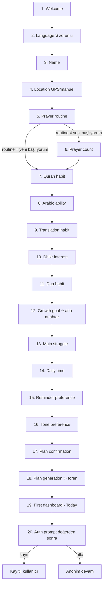

# Bismillah — Onboarding Akış Spesifikasyonu

| | |
|---|---|
| **Doküman** | 04_ONBOARDING_FLOW.md |
| **Versiyon** | 1.0 |
| **Tarih** | 2026-07-08 |
| **Durum** | Onaylı temel — onboarding uygulaması bu dokümana göre inşa edilir |
| **Bağlı dokümanlar** | [CLAUDE.md](../CLAUDE.md) · [01_PRODUCT_PRD.md](01_PRODUCT_PRD.md) · [02_BRAND_GUIDELINES.md](02_BRAND_GUIDELINES.md) · [03_DESIGN_SYSTEM.md](03_DESIGN_SYSTEM.md) |

---

## İçindekiler

1. [Onboarding Genel Bakış](#1-onboarding-genel-bakış)
2. [Onboarding Hedefleri](#2-onboarding-hedefleri)
3. [Onboarding İlkeleri](#3-onboarding-i̇lkeleri)
4. [Akış Özeti](#4-akış-özeti)
5. [Ekran Ekran Detaylı Spesifikasyon](#5-ekran-ekran-detaylı-spesifikasyon)
6. [Soru Metinleri (Copywriting)](#6-soru-metinleri-copywriting)
7. [Cevap Seçeneği Tasarımı](#7-cevap-seçeneği-tasarımı)
8. [Kişiselleştirme Mantığı](#8-kişiselleştirme-mantığı)
9. [30 Günlük Plan Üretim Mantığı](#9-30-günlük-plan-üretim-mantığı)
10. [İlk Today Dashboard Eşlemesi](#10-i̇lk-today-dashboard-eşlemesi)
11. [Değerden Sonra Authentication](#11-değerden-sonra-authentication)
12. [İzin Stratejisi](#12-i̇zin-stratejisi)
13. [Analytics Eventleri](#13-analytics-eventleri)
14. [Veri Modeli Gereksinimleri](#14-veri-modeli-gereksinimleri)
15. [Uç Durumlar (Edge Cases)](#15-uç-durumlar-edge-cases)
16. [Erişilebilirlik Gereksinimleri](#16-erişilebilirlik-gereksinimleri)
17. [Yerelleştirme ve RTL Kuralları](#17-yerelleştirme-ve-rtl-kuralları)
18. [Kullanılan UI Bileşenleri](#18-kullanılan-ui-bileşenleri)
19. [Hareket ve Haptik](#19-hareket-ve-haptik)
20. [Duygusal Güvenlik Kuralları](#20-duygusal-güvenlik-kuralları)
21. [AI Asistan Tanıtımı](#21-ai-asistan-tanıtımı)
22. [Onboarding Tamamlanma Deneyimi](#22-onboarding-tamamlanma-deneyimi)
23. [Kabul Kriterleri](#23-kabul-kriterleri)
24. [Onboarding QA Kontrol Listesi](#24-onboarding-qa-kontrol-listesi)
25. [Nihai Onboarding Yönü](#25-nihai-onboarding-yönü)

---

## 1. Onboarding Genel Bakış

Onboarding, Bismillah'ın **en kritik ürün deneyimidir** — üç nedenle:

1. **Kişiselleştirme motorunun tek veri kaynağıdır.** PRD'nin ana farklılaştırıcısı olan "sana özel plan" (PRD §23), onboarding cevaplarından doğar. Kötü onboarding = jenerik plan = ürün tezinin çöküşü.
2. **Marka vaadinin ilk kanıtıdır.** "Bu uygulama beni yargılamıyor, beni anlıyor" hissi ilk 4 dakikada ya kurulur ya kaybedilir. Kaybedilirse D1 retention'ın konuşulacak bir zemini kalmaz.
3. **Aktivasyon hunisinin kapısıdır.** Hedef: ≥%70 tamamlama (PRD §16). Her gereksiz soru, her baskı hissi bu huniden kullanıcı sızdırır.

**Doküman zincirindeki yeri:** PRD §22 stratejiyi verdi (16 soru, sohbet hissi, değerden sonra auth); Marka Kılavuzu §8–11 dili verdi; Tasarım Sistemi §25 bileşenleri verdi. Bu doküman üçünü **ekran ekran uygulanabilir spesifikasyona** çevirir. Çelişki hâlinde sıra: CLAUDE.md → PRD → Marka → Tasarım Sistemi → bu doküman.

---

## 2. Onboarding Hedefleri

| # | Hedef | Başarı işareti |
|---|---|---|
| 1 | Kullanıcıyı sıcak karşılamak | İlk ekranda tek dokunuşla sohbet başlar; kayıt/izin duvarı yok |
| 2 | Dili ilk sırada almak | Kalan tüm akış kullanıcının dilinde ve doğru yönünde (RTL) akar |
| 3 | Lokasyon almak (namaz vakitleri için) | GPS **veya** manuel şehir — ikisi de eş değerli yol |
| 4 | Namaz alışkanlığını anlamak | Yargısız seviye + vakit sayısı verisi |
| 5 | Kur'an seviyesini anlamak | Okuma alışkanlığı + Arapça yetisi + meal alışkanlığı |
| 6 | Zikir ve dua ilgisini anlamak | Zikir hedefi var/yok + dua alışkanlığı |
| 7 | Ana gelişim hedefini belirlemek | Tek birincil hedef (kişiselleştirmenin ana anahtarı) |
| 8 | Zorlukları anlamak | Ana engel (süreklilik/bilgi/motivasyon/zaman/geçmiş suçluluğu) |
| 9 | Günlük zaman kapasitesini öğrenmek | 5/10/20/30+ dk — plan boyutunun ana girdisi |
| 10 | Bildirim tercihini almak | Stil + sıklık niyeti (sistem izni DEĞİL — o sonra, bağlamda) |
| 11 | Ton tercihini almak | Nazik / motive / minimal — tüm metin varyantlarını sürer |
| 12 | 30 günlük kişisel plan üretmek | Plan onayı + üretim töreni + insan diliyle özet |
| 13 | İlk dashboard'u kişiselleştirmek | İki farklı profil yan yana görsel olarak farklı Today görür |

---

## 3. Onboarding İlkeleri

1. **Her soru yargısızdır.** Hiçbir soru "ne kadar eksiksin" diye ölçmez; "neredesin, oradan başlayalım" diye sorar.
2. **Her ekran tek soru sorar.** İki girdi isteyen ekran tasarım hatasıdır (istisna: konum ekranındaki GPS/manuel ikilisi tek kararın iki yoludur).
3. **Her soru nedenini söyler.** Sorunun altında `type.caption` ile tek satır "neden soruyoruz" açıklaması bulunur.
4. **Dil hariç her soru atlanabilir.** "Atla" her ekranda görünür ama sessizdir (Text Button, `end` üst köşe). Atlanan soru güvenli varsayılanla doldurulur (§14).
5. **Kırmızı, uyarı ve suçluluk dili yasaktır.** Onboarding'de `color.error` yalnızca teknik form hatasında (ör. geçersiz karakter) görünebilir; ibadet cevaplarına bağlı hiçbir renk/ikon uyarısı yoktur.
6. **İbadet seviyesi seçenekleri eşit görsel ağırlıktadır.** "Yeni başlıyorum" ile "Beş vakit, elhamdülillah" aynı kart boyutu, aynı tipografi, aynı sıra düzeni içindedir; hiçbir seçenek önerilen/varsayılan olarak vurgulanmaz.
7. **Kullanıcı asla "kötü Müslüman" hissetmez.** Duygusal güvenlik kuralları (§20) bağlayıcıdır; kopya yazarken yasaklı kelime listesi uygulanır.
8. **Süre 3–5 dakika bandındadır.** Hızlı kullanıcı ≤3 dk, düşünen kullanıcı ≤5 dk. Soru sayısı 16'yı aşamaz; yeni soru eklemek isteyen, bir soru çıkarmak zorundadır.
9. **Progress göstergesi baskı yaratmaz.** İnce dolan yay (Tasarım Sistemi §25); "3/16" sayacı, yüzde ve kalan süre gösterilmez.
10. **Authentication ilk kişisel dashboard'dan SONRA gelir.** Kullanıcı önce planını ve Today ekranını görür; kayıt daveti değer kanıtından sonra, atlanabilir şekilde sunulur (§11).

---

## 4. Akış Özeti

**Yapısal notlar:** Toplam 16 soru + 4 yapısal ekran (welcome, generation, complete/dashboard, auth). Sorular 5 tematik bloğa gruplanır — kimlik (2–4), namaz (5–6), Kur'an (7–9), zikir/dua (10–11), hedef/tercih (12–17); blok geçişlerinde mikro ara ekran YOKTUR (akış kesintisiz), ama soru sıralaması sohbet mantığıyla yumuşak konu geçişi yapar. Tek koşullu dal: `prayer_routine = "Yeni başlıyorum"` seçilirse `prayer_count` sorusu atlanır (veri otomatik `0-1` bandına yazılır) — yeni başlayan birine "kaç vakit kılıyorsun" sormak ölçüm hissi verir.

---

## 5. Ekran Ekran Detaylı Spesifikasyon

Ortak kurallar (tüm soru ekranları): route `/onboarding/<id>`; yerleşim Tasarım Sistemi §25 Question Screen; ilerleme yayı üstte; geri oku her ekranda (welcome hariç); "Atla" dil ekranı hariç her soruda; cevap seçimi + "Devam" ile ilerler (tek dokunuş modeli: radio seçimi anında ilerletmez — kullanıcı seçimini görüp onaylar, yanlış dokunuş anksiyetesi engellenir); tüm metinler ARB anahtarlıdır; analytics ortak eventleri §13'te.

---

### 5.1 `onboarding_welcome`

| Alan | Değer |
|---|---|
| **Amaç** | Sıcak ilk temas; vaadi tek cümlede vermek; sohbeti başlatmak |
| **Soru** | Yok — karşılama ekranı |
| **Cevap tipi** | Tek Primary buton ("Başlayalım") |
| **Skip** | Yok (giriş ekranı) |
| **Kaydedilen veri** | `onboardingStartedAt` |
| **Kişiselleştirme etkisi** | Yok |
| **UI bileşenleri** | Welcome screen (DS §25): `type.display` selam + vaat cümlesi + Primary button; alt bölgede %5 geometrik desen |
| **Erişilebilirlik** | Başlık `header` semantiği; buton min 48dp; ekran okuyucu sırası: selam → vaat → buton |
| **Analytics** | `onboarding_started` |
| **Uç durumlar** | Uygulama ikinci kez açılıyorsa ve onboarding yarımsa → kaldığı sorudan devam (bkz. §15) |
| **Kabul kriteri** | Açılıştan etkileşime <1sn; hiçbir izin/kayıt istenmeden sohbet başlar |

### 5.2 `onboarding_language` 🔒

| Alan | Değer |
|---|---|
| **Amaç** | Kalan akışın dilini ve yönünü belirlemek — bu yüzden İLK soru |
| **Soru** | Dil tercihi |
| **Cevap tipi** | 3 Radio option card: Türkçe · English · العربية (her seçenek KENDİ dilinde ve kendi yazı tipiyle yazılır) |
| **Skip** | **YOK — tek zorunlu soru.** Varsayılan ön-seçim: cihaz dili destekleniyorsa o dil işaretli gelir |
| **Kaydedilen veri** | `language` |
| **Kişiselleştirme etkisi** | Tüm metinler, RTL yönü, namaz adı seti, tarih biçimi, içerik dili |
| **UI bileşenleri** | Radio option card ×3 (DS §24); seçimde `haptic.tap` |
| **Erişilebilirlik** | Her seçenek kendi `lang` etiketiyle işaretli (okuyucu doğru telaffuz eder); Arapça seçildiği an ekran yönü ve okuyucu dili değişir |
| **Analytics** | `onboarding_language_selected` {language} |
| **Uç durumlar** | Arapça seçilince akışın kalanı ANINDA RTL'e döner (sonraki ekrandan değil, "Devam" dokunuşundan itibaren) |
| **Kabul kriteri** | Dil değişimi tam ve anlık; karışık dilli ekran asla görünmez |

### 5.3 `onboarding_name`

| Alan | Değer |
|---|---|
| **Amaç** | Kişisel hitap — "sohbet" hissinin temeli |
| **Soru** | "Sana nasıl hitap edelim?" |
| **Yardımcı metin** | "Sadece selamlaşmak için — istersen boş bırakabilirsin." |
| **Cevap tipi** | Text input (tek satır, max 30 karakter, öneri klavye kapalı) |
| **Skip** | Var → hitap kalıpları isimsiz varyanta düşer ("Hoş geldin" / "Selamünaleyküm") |
| **Kaydedilen veri** | `name` (opsiyonel) |
| **Kişiselleştirme etkisi** | Selamlama başlığı, bildirim metinleri (isimli varyant), asistan hitabı |
| **UI bileşenleri** | Text input (DS §24); klavye açıkken "Devam" klavye üstünde |
| **Erişilebilirlik** | Etiket kalıcı (placeholder etiket değil); hata yalnız teknik (30+ karakter) |
| **Analytics** | `onboarding_question_answered` {question_id: name, skipped: false} |
| **Uç durumlar** | Boş bırakıp "Devam" = atla ile eşdeğer; emoji/rakam kabul edilir (kullanıcının tercihi), yalnız boşluk kırpılır |
| **Kabul kriteri** | İsimsiz akış hiçbir ekranda "null" ya da boşluk sızdırmaz |

### 5.4 `onboarding_location`

| Alan | Değer |
|---|---|
| **Amaç** | Namaz vakitleri için konum — güven diliyle |
| **Soru** | "Namaz vakitlerini senin için doğru hesaplayalım" |
| **Yardımcı metin** | "Konumun yalnızca vakit hesabı için kullanılır; şehir düzeyinde saklanır." |
| **Cevap tipi** | İki eş değerli yol: "Konumumu kullan" (Secondary) + "Şehrimi seçeyim" (Secondary) → şehir arama alanı |
| **Skip** | Var → vakitler şehir seçilene dek gösterilmez; Today'de nazik "şehir seç" kartı çıkar |
| **Kaydedilen veri** | `country`, `city`, `locationMethod` (gps/manual/skipped) |
| **Kişiselleştirme etkisi** | Vakit hesabı, hesaplama yöntemi varsayılanı (TR→Diyanet vb.), iftar/sahur (V2) |
| **UI bileşenleri** | Permission education card (DS §23) + City search field; "Konumumu kullan" dokunuşundan SONRA sistem izni açılır (§12) |
| **Erişilebilirlik** | Şehir araması klavye + okuyucu dostu; sonuç listesi 48dp satırlar |
| **Analytics** | `onboarding_location_method_selected` {method} |
| **Uç durumlar** | İzin reddi → otomatik şehir arama görünümüne düşer, suçlama metni yok; çevrimdışı → şehir listesi paketten (offline) çalışır |
| **Kabul kriteri** | GPS'siz akış eksiksiz tamamlanabilir; izin diyaloğu eğitim kartından önce ASLA açılmaz |

### 5.5 `onboarding_prayer_routine`

| Alan | Değer |
|---|---|
| **Amaç** | Namaz seviyesini yargısız öğrenmek — kişiselleştirmenin en hassas verisi |
| **Soru** | "Günlük namaz ritmin şu an nasıl?" |
| **Yardımcı metin** | "Doğru başlangıç noktasını bulmak için — burada doğru ya da yanlış cevap yok." |
| **Cevap tipi** | 5 Radio option card (eşit görsel ağırlık, §7) |
| **Seçenekler** | Yeni başlıyorum · Ara sıra kılıyorum · Çoğu vakti kılıyorum · Beş vakit, elhamdülillah · Beş vakit + ek ibadetler |
| **Skip** | Var → varsayılan `ara sıra` (orta bant — ne sıfır varsayımı ne ideal varsayımı) |
| **Kaydedilen veri** | `prayerRoutine` |
| **Kişiselleştirme etkisi** | Profil türü, plan namaz bileşeni, Today namaz kartı yoğunluğu; `yeni başlıyorum` → prayer_count atlanır |
| **UI bileşenleri** | Radio option card ×5 |
| **Erişilebilirlik** | Kartlar tek sütun; okuyucu her kartı tam cümleyle okur |
| **Analytics** | `onboarding_question_answered` {question_id: prayer_routine, answer_bucket} |
| **Uç durumlar** | — |
| **Kabul kriteri** | 5 kart aynı boyut/renk/tipografide; hiçbirinde rozet, öneri, vurgu yok |

### 5.6 `onboarding_prayer_count` *(koşullu: routine ≠ "Yeni başlıyorum")*

| Alan | Değer |
|---|---|
| **Amaç** | Plan kalibrasyonu için mevcut vakit bandı |
| **Soru** | "Bir günde genellikle kaç vakit kılabiliyorsun?" |
| **Yardımcı metin** | "Planını bugünkü ritmine göre ölçekleyeceğiz." |
| **Cevap tipi** | Adımlı slider (0–5) — değerin insani karşılığı canlı metinle ("3 vakit — güzel bir zemin") |
| **Skip** | Var → `prayerRoutine`dan türetilen bant (ara sıra→1-2, çoğu→3-4, beş vakit→5) |
| **Kaydedilen veri** | `prayerCount` |
| **Kişiselleştirme etkisi** | Hafta-1 namaz hedefi (mevcut+koruma, asla mevcut+5) |
| **UI bileşenleri** | Slider (DS §24), canlı değer `type.h3` |
| **Erişilebilirlik** | Slider okuyucuda adım adım artırılabilir; değer değişimi sesli bildirilir |
| **Analytics** | `onboarding_question_answered` {question_id: prayer_count, value} |
| **Uç durumlar** | 0 seçimi tamamen geçerli ve yargısızdır — canlı metin: "Sıfırdan başlamak da bir başlangıçtır" |
| **Kabul kriteri** | 0 değerinde hiçbir olumsuz renk/ikon/metin yok |

### 5.7 `onboarding_quran_habit`

| Alan | Değer |
|---|---|
| **Amaç** | Kur'an ilişkisinin mevcut durumu |
| **Soru** | "Kur'an'la şu anki ilişkin nasıl?" |
| **Yardımcı metin** | "Okuma hedefini doğru boyutta kurmak için." |
| **Seçenekler** | Henüz başlamadım · Ara sıra açıyorum · Düzenli okumaya çalışıyorum · Her gün okuyorum |
| **Cevap tipi** | 4 Radio option card |
| **Skip** | Var → `ara sıra` |
| **Kaydedilen veri** | `quranHabit` |
| **Kişiselleştirme etkisi** | Kur'an plan bileşeni boyutu (ayet/sayfa), Quran-focused profil sinyali |
| **Analytics** | `onboarding_question_answered` {question_id: quran_habit} |
| **Kabul kriteri** | "Henüz başlamadım" seçeneği ilk sırada ve tamamen nötr dille |

### 5.8 `onboarding_arabic_ability`

| Alan | Değer |
|---|---|
| **Amaç** | İçerik formatını belirlemek (Arapça metin / transliterasyon / meal ağırlığı) |
| **Soru** | "Arapça harfleri okuyabiliyor musun?" |
| **Yardımcı metin** | "İçerikleri sana en uygun biçimde gösterelim — Arapça bilmek şart değil." |
| **Seçenekler** | Evet, rahat okurum · Yavaş da olsa okurum · Öğreniyorum · Henüz değil |
| **Cevap tipi** | 4 Radio option card |
| **Skip** | Var → `henüz değil` (güvenli varsayım: transliterasyon açık) |
| **Kaydedilen veri** | `arabicAbility` |
| **Kişiselleştirme etkisi** | Transliterasyon varsayılanı (açık/kapalı), Kur'an hedef türü (ayet vs sayfa), Elif-Ba öğrenme yolu önerisi (`henüz değil`/`öğreniyorum` → Learn'de öne çıkar) |
| **Analytics** | `onboarding_question_answered` {question_id: arabic_ability} |
| **Kabul kriteri** | "Henüz değil" cevabı hiçbir eksiklik imasıyla karşılanmaz; yardımcı metin bunu peşinen normalleştirir |

### 5.9 `onboarding_translation_habit`

| Alan | Değer |
|---|---|
| **Amaç** | Meal/anlam ilişkisini öğrenmek |
| **Soru** | "Okuduklarının anlamını (meal) takip eder misin?" |
| **Yardımcı metin** | "Günlük ayet ve okuma deneyimini buna göre ayarlayacağız." |
| **Seçenekler** | Evet, düzenli · Bazen · Henüz değil ama isterim · Şimdilik hayır |
| **Cevap tipi** | 4 Radio option card |
| **Skip** | Var → `bazen` |
| **Kaydedilen veri** | `translationHabit` |
| **Kişiselleştirme etkisi** | Günlük ayet kartında meal vurgusu, yansıma istemlerinin derinliği |
| **Analytics** | `onboarding_question_answered` {question_id: translation_habit} |
| **Kabul kriteri** | Soru, meal okumayanı "eksik" konumlamaz ("Şimdilik hayır" saygın bir seçenek) |

### 5.10 `onboarding_dhikr_interest`

| Alan | Değer |
|---|---|
| **Amaç** | Zikir alışkanlığı hedefi var mı |
| **Soru** | "Günlük zikir alışkanlığı kurmak ister misin?" |
| **Yardımcı metin** | "Sabah-akşam zikirleri ve tesbihatlar için." |
| **Seçenekler** | Evet, isterim · Zaten bir düzenim var · Şimdilik değil |
| **Cevap tipi** | 3 Radio option card |
| **Skip** | Var → `evet, isterim` *(varsayım: zikir en düşük eşikli ibadet — plana küçük dozda girmesi güvenli)* |
| **Kaydedilen veri** | `dhikrInterest` |
| **Kişiselleştirme etkisi** | Plan zikir bileşeni; `zaten düzenim var` → gelişmiş ezkâr setleri; `şimdilik değil` → planda yok, keşfe açık |
| **Analytics** | `onboarding_question_answered` {question_id: dhikr_interest} |
| **Kabul kriteri** | "Şimdilik değil" seçen kullanıcının Today'inde zikir kartı görünmez |

### 5.11 `onboarding_dua_habit`

| Alan | Değer |
|---|---|
| **Amaç** | Dua pratiği ve dua kütüphanesinin görünürlüğü |
| **Soru** | "Dua etmek günlük hayatında ne kadar yer tutuyor?" |
| **Yardımcı metin** | "Dua kütüphanesini sana göre öne çıkaracağız." |
| **Seçenekler** | Sık sık dua ederim · Ara sıra · Nasıl dua edeceğimi öğrenmek isterim |
| **Cevap tipi** | 3 Radio option card |
| **Skip** | Var → `ara sıra` |
| **Kaydedilen veri** | `duaHabit` |
| **Kişiselleştirme etkisi** | Dua kütüphanesi görünürlüğü; `öğrenmek isterim` → beginner dua içerikleri + Learn bağlantısı |
| **Analytics** | `onboarding_question_answered` {question_id: dua_habit} |
| **Kabul kriteri** | "Öğrenmek isterim" cevabı özel bir sıcaklıkla karşılanır (bir sonraki ekran geçişinde mikro onay metni yok — plan özetinde karşılığı görünür) |

### 5.12 `onboarding_growth_goal` ⭐

| Alan | Değer |
|---|---|
| **Amaç** | **Kişiselleştirmenin ana anahtarı** — birincil profil belirleyici |
| **Soru** | "Şu an en çok hangi alanda büyümek istersin?" |
| **Yardımcı metin** | "Planının merkezine bunu koyacağız — diğer alanlar da yanında olacak." |
| **Seçenekler** | Namazda süreklilik · Kur'an'la ilişkimi güçlendirmek · Zikir ve dua alışkanlığı · Dinimi öğrenmek · Genel olarak yeniden bağlanmak |
| **Cevap tipi** | 5 Radio option card (tek seçim — birincil hedef zorlaması bilinçli: odak, planın kalitesidir) |
| **Skip** | Var → `genel olarak yeniden bağlanmak` (en kapsayıcı varsayılan) |
| **Kaydedilen veri** | `growthGoal` |
| **Kişiselleştirme etkisi** | Profil türünün birincil girdisi (§8); Today kart sıralaması; plan ağırlıkları; asistan açılış bağlamı |
| **Analytics** | `onboarding_question_answered` {question_id: growth_goal, answer_bucket} |
| **Kabul kriteri** | Bu cevap değişince üretilen plan ve Today kompozisyonu görünür biçimde değişir (test edilebilir) |

### 5.13 `onboarding_main_struggle`

| Alan | Değer |
|---|---|
| **Amaç** | Ana engeli anlamak — planın *tonunu* ve *koruma mekanizmalarını* belirler |
| **Soru** | "Seni en çok ne zorluyor?" |
| **Yardımcı metin** | "Bunu bilmek, planı gerçekçi kurmamızı sağlar." |
| **Seçenekler** | Sürekliliği koruyamamak · Nereden başlayacağımı bilmemek · Motivasyonumu kaybetmek · Zaman bulamamak · Geçmişle ilgili kendimi suçlamak |
| **Cevap tipi** | 5 Radio option card |
| **Skip** | Var → `sürekliliği koruyamamak` (en yaygın senaryo) |
| **Kaydedilen veri** | `mainStruggle` |
| **Kişiselleştirme etkisi** | `suçlamak` → recovery-ağırlıklı ton + Güçlü Dönüş mekaniği önde; `zaman` → low-time plan; `bilmemek` → Learn önde; `motivasyon` → kutlama/teşvik dozajı; `süreklilik` → seri mekaniği vurgusu |
| **Analytics** | `onboarding_question_answered` {question_id: main_struggle} |
| **Kabul kriteri** | "Geçmişle ilgili kendimi suçlamak" seçeneği varsa akışın kalan metinlerinde suçluluk çağrışımlı tek kelime bile bulunmaz (QA metin taraması) |

### 5.14 `onboarding_daily_time`

| Alan | Değer |
|---|---|
| **Amaç** | Plan boyutunun ana girdisi |
| **Soru** | "İbadet ve öğrenme için günde ne kadar zaman ayırabilirsin?" |
| **Yardımcı metin** | "Dürüst bir cevap, sürdürülebilir bir plan demek. Az da yeterli." |
| **Cevap tipi** | Adımlı slider: 5 dk · 10 dk · 20 dk · 30+ dk; canlı insani karşılık ("Günde 10 dakika — gayet gerçekçi") |
| **Skip** | Var → `10 dk` (güvenli alt-orta bant) |
| **Kaydedilen veri** | `dailyTime` |
| **Kişiselleştirme etkisi** | Plan bileşen sayısı ve boyutu (§9); 5 dk = tek eylem planı |
| **Analytics** | `onboarding_question_answered` {question_id: daily_time, value} |
| **Kabul kriteri** | 5 dk seçimi hiçbir "keşke daha fazla" imasıyla karşılanmaz |

### 5.15 `onboarding_reminder_preference`

| Alan | Değer |
|---|---|
| **Amaç** | Bildirim niyet ve stilini almak (sistem izni DEĞİL) |
| **Soru** | "Sana nasıl hatırlatalım?" |
| **Yardımcı metin** | "İstediğin an değiştirebilirsin. İzin ekranı şimdi açılmayacak." |
| **Seçenekler** | Nazik hatırlatmalar isterim · Yalnızca namaz vakitleri · Çok az bildirim · Şimdilik hiç |
| **Cevap tipi** | 4 Radio option card |
| **Skip** | Var → `yalnızca namaz vakitleri` |
| **Kaydedilen veri** | `reminderPreference` |
| **Kişiselleştirme etkisi** | Bildirim tipi varsayılanları (PRD §32 tablosunun kişisel başlangıç seti); `şimdilik hiç` → izin eğitim kartı Today'de hiç gösterilmez, ayarlarda bekler |
| **Analytics** | `onboarding_question_answered` {question_id: reminder_preference} |
| **Kabul kriteri** | Bu ekranda ve sonrasındaki onboarding akışında sistem bildirim izni diyaloğu AÇILMAZ (§12) |

### 5.16 `onboarding_tone_preference`

| Alan | Değer |
|---|---|
| **Amaç** | Uygulama genelinde metin varyantı seçimi |
| **Soru** | "Bismillah seninle nasıl konuşsun?" |
| **Seçenekler** | Yumuşak ve nazik ("Hazır olduğunda başlayalım") · Motive edici ("Bugün güzel bir adım seni bekliyor!") · Sade ve sessiz ("İkindi: 16.42") — her kartta o tonun örnek cümlesi görünür |
| **Cevap tipi** | 3 Radio option card (örnek cümleli) |
| **Skip** | Var → `yumuşak ve nazik` (marka varsayılanı) |
| **Kaydedilen veri** | `tonePreference` |
| **Kişiselleştirme etkisi** | Tüm bildirim/kutlama/teşvik metin varyantları; asistan tonu |
| **Analytics** | `onboarding_question_answered` {question_id: tone_preference} |
| **Kabul kriteri** | Örnek cümleler gerçek üründeki varyantlarla birebir aynıdır (sahte örnek yok) |

### 5.17 `onboarding_plan_confirmation`

| Alan | Değer |
|---|---|
| **Amaç** | 30 günlük plan onayı — kullanıcıya kontrol hissi |
| **Soru** | "Sana özel 30 günlük bir gelişim planı hazırlayalım mı?" |
| **Yardımcı metin** | "Küçük günlük adımlar — istediğin zaman düzenleyebilirsin." |
| **Seçenekler** | "Evet, planımı hazırla" (Primary) · "Şimdilik sadece günlük temel plan" (Secondary) |
| **Skip** | Bu ekranda "Atla" yerine ikinci seçenek görevi görür |
| **Kaydedilen veri** | `wantsThirtyDayPlan` |
| **Kişiselleştirme etkisi** | true → 4 haftalık kavisli plan (§9); false → yalnız günlük plan üretimi (30 günlük çatı yok, sonradan açılabilir) |
| **Analytics** | `onboarding_question_answered` {question_id: plan_confirmation, value} |
| **Kabul kriteri** | İki seçenek de saygın; "hayır" seçen kullanıcıya eksiklik hissi verilmez |

### 5.18 `onboarding_plan_generation` ✨

| Alan | Değer |
|---|---|
| **Amaç** | Ödül anı — "anlaşıldım" hissinin zirvesi |
| **İçerik** | Tören ekranı (DS §25): koyu orman zemin + halka animasyonu + aşamalı mikro metinler (§22) + kapanışta insan diliyle plan özeti |
| **Süre** | 2.5–3.5 sn (yapay bekletme yok; üretim yerelde anlıktır, süre deneyim içindir) |
| **Kaydedilen veri** | `personalizationProfileType`, üretilen plan, `onboardingCompletedAt` |
| **UI bileşenleri** | Plan generation animation; `motion.gentle`; reduced-motion'da statik aşama metinleri |
| **Erişilebilirlik** | Mikro metinler okuyucuya sırayla duyurulur; animasyon bilgilendirici değil dekoratiftir (okuyucudan gizli) |
| **Analytics** | `onboarding_plan_generation_started` → `onboarding_plan_generated` {profile_type, plan_size} |
| **Uç durumlar** | Tamamen çevrimdışı çalışır (plan üretimi lokal kural motoru — §9) |
| **Kabul kriteri** | Özet cümle kullanıcının EN AZ üç cevabını yansıtır (süre + hedef + seviye) |

### 5.19 `onboarding_complete` → İlk Today

| Alan | Değer |
|---|---|
| **Amaç** | Planla tanışma ve ilk eylem daveti |
| **İçerik** | Tamamlanma özeti kartı ("Günde 10 dakika, namaz odaklı, gerçekçi bir yol") + "Panoma git" (Primary) → Today dashboard (§10 kompozisyonu); Today'in en üst kartı ŞU AN yapılabilir bir eylemdir |
| **Kaydedilen veri** | — (geçiş ekranı) |
| **Analytics** | `onboarding_completed` {duration_seconds, questions_skipped_count} |
| **Kabul kriteri** | Onboarding bitiminden ilk tamamlanabilir eyleme mesafe ≤2 dokunuş |

### 5.20 `onboarding_auth_prompt`

| Alan | Değer |
|---|---|
| **Amaç** | Değer kanıtından sonra kimlik daveti (§11) |
| **Zamanlama** | İlk Today gösteriminden sonra; kullanıcı ilk eylemini tamamladıysa onun ardından *(varsayım: ilk oturumda dashboard görüldükten sonra, ilk eylem beklenmeden — beta verisiyle ayarlanır)* |
| **İçerik** | Bottom sheet: "Planını ve ilerlemeni güvenle saklamak ister misin?" + Apple/Google/E-posta + "Daha sonra" (Text) |
| **Analytics** | `onboarding_auth_prompt_viewed` → `onboarding_auth_completed` {method} / `onboarding_auth_skipped` |
| **Uç durumlar** | Anonim oturum verisi kayıt anında %100 taşınır (bkz. §11); "Daha sonra" sonrası hatırlatma en erken 3 gün sonra ve en fazla bir kez daha |
| **Kabul kriteri** | Sheet kapatılabilir; kapatan kullanıcının deneyiminde hiçbir kısıt yok |

---

## 6. Soru Metinleri (Copywriting)

Tüm metinler Marka Kılavuzu §8–11 ton kurallarına tabidir. Aşağıda ana Türkçe metinler + EN/AR karşılıkları verilmiştir. (Buton metni tüm sorularda: **"Devam"** / "Continue" / "متابعة"; atla metni: **"Atla"** / "Skip" / "تخطّي" — istisnalar belirtilir.)

| # | Ekran | TR (başlık + yardımcı) | EN | AR |
|---|---|---|---|---|
| 1 | welcome | **"Selamünaleyküm 🌱"** + "Sana özel, gerçekçi bir yol hazırlayacağız — acele etmeden, birlikte." · Buton: "Başlayalım" | **"Assalamu alaikum 🌱"** + "Let's shape a realistic path made just for you — gently, together." · "Let's begin" | **"السلام عليكم 🌱"** + "سنرسم لك طريقاً واقعياً يناسبك — بهدوء، ومعاً." · "لنبدأ" |
| 2 | language | **"Hangi dilde devam edelim?"** + "İstediğin zaman değiştirebilirsin." | **"Which language shall we continue in?"** | **"بأي لغة نتابع؟"** |
| 3 | name | **"Sana nasıl hitap edelim?"** + "Sadece selamlaşmak için — istersen boş bırakabilirsin." | **"What should we call you?"** + "Just so we can greet you — feel free to leave it blank." | **"بمَ نناديك؟"** + "فقط لنحييك — يمكنك تركه فارغاً." |
| 4 | location | **"Namaz vakitlerini senin için doğru hesaplayalım"** + "Konumun yalnızca vakit hesabı için kullanılır; şehir düzeyinde saklanır." · Butonlar: "Konumumu kullan" / "Şehrimi seçeyim" | **"Let's calculate your prayer times accurately"** + "Your location is used only for prayer times, stored at city level." · "Use my location" / "I'll pick my city" | **"لنحسب لك أوقات الصلاة بدقة"** + "يُستخدم موقعك لحساب الأوقات فقط، ويُحفظ على مستوى المدينة." · "استخدم موقعي" / "سأختار مدينتي" |
| 5 | prayer_routine | **"Günlük namaz ritmin şu an nasıl?"** + "Doğru başlangıç noktasını bulmak için — burada doğru ya da yanlış cevap yok." | **"How is your daily prayer rhythm these days?"** + "Just to find the right starting point — there are no wrong answers here." | **"كيف هو إيقاع صلاتك اليومي حالياً؟"** + "فقط لنجد نقطة البداية المناسبة — لا توجد إجابة خاطئة هنا." |
| 6 | prayer_count | **"Bir günde genellikle kaç vakit kılabiliyorsun?"** + "Planını bugünkü ritmine göre ölçekleyeceğiz." | **"How many daily prayers do you usually manage?"** + "We'll scale your plan to your current rhythm." | **"كم صلاة تؤدي عادة في اليوم؟"** + "سنوائم خطتك مع إيقاعك الحالي." |
| 7 | quran_habit | **"Kur'an'la şu anki ilişkin nasıl?"** + "Okuma hedefini doğru boyutta kurmak için." | **"How is your relationship with the Quran right now?"** | **"كيف هي علاقتك بالقرآن حالياً؟"** |
| 8 | arabic_ability | **"Arapça harfleri okuyabiliyor musun?"** + "İçerikleri sana en uygun biçimde gösterelim — Arapça bilmek şart değil." | **"Can you read Arabic script?"** + "So we can show content in the best format for you — knowing Arabic isn't required." | **"هل تقرأ الحروف العربية؟"** *(AR yerelinde bu soru "هل تقرأ القرآن بالرسم العثماني بسهولة؟" varyantına döner — bkz. §17)* |
| 9 | translation_habit | **"Okuduklarının anlamını (meal) takip eder misin?"** + "Günlük ayet deneyimini buna göre ayarlayacağız." | **"Do you follow the meaning (translation) of what you read?"** | **"هل تتابع معاني ما تقرأ (التفسير الميسر)؟"** |
| 10 | dhikr_interest | **"Günlük zikir alışkanlığı kurmak ister misin?"** + "Sabah-akşam zikirleri ve tesbihatlar için." | **"Would you like to build a daily dhikr habit?"** | **"هل تودّ بناء عادة ذكر يومية؟"** |
| 11 | dua_habit | **"Dua etmek günlük hayatında ne kadar yer tutuyor?"** + "Dua kütüphanesini sana göre öne çıkaracağız." | **"How much room does dua have in your daily life?"** | **"ما مساحة الدعاء في يومك؟"** |
| 12 | growth_goal | **"Şu an en çok hangi alanda büyümek istersin?"** + "Planının merkezine bunu koyacağız." | **"Where would you most like to grow right now?"** | **"في أي جانب تودّ أن تنمو أكثر الآن؟"** |
| 13 | main_struggle | **"Seni en çok ne zorluyor?"** + "Bunu bilmek, planı gerçekçi kurmamızı sağlar." | **"What holds you back the most?"** | **"ما أكثر ما يصعّب الأمر عليك؟"** |
| 14 | daily_time | **"Günde ne kadar zaman ayırabilirsin?"** + "Dürüst bir cevap, sürdürülebilir bir plan demek. Az da yeterli." | **"How much time can you set aside daily?"** + "An honest answer means a sustainable plan. A little is enough." | **"كم من الوقت يمكنك تخصيصه يومياً؟"** + "الإجابة الصادقة تعني خطة مستدامة. القليل يكفي." |
| 15 | reminder_preference | **"Sana nasıl hatırlatalım?"** + "İstediğin an değiştirebilirsin. İzin ekranı şimdi açılmayacak." | **"How should we remind you?"** | **"كيف نذكّرك؟"** |
| 16 | tone_preference | **"Bismillah seninle nasıl konuşsun?"** | **"How should Bismillah speak with you?"** | **"كيف يخاطبك تطبيق Bismillah؟"** |
| 17 | plan_confirmation | **"Sana özel 30 günlük bir gelişim planı hazırlayalım mı?"** + "Küçük günlük adımlar — istediğin zaman düzenleyebilirsin." · Butonlar: "Evet, planımı hazırla" / "Şimdilik günlük temel plan" | **"Shall we prepare your personal 30-day growth plan?"** · "Yes, build my plan" / "Just the daily basics for now" | **"أنعدّ لك خطة نموّ شخصية لثلاثين يوماً؟"** · "نعم، أعدّوا خطتي" / "الأساسيات اليومية تكفي الآن" |

**Hata/boş durum metinleri:** isim >30 karakter → "Biraz daha kısa olabilir mi?"; şehir bulunamadı → "Bu şehri bulamadık — yazımı kontrol edelim mi?"; çevrimdışı şehir araması → "Çevrimdışısın — listeden seçebilirsin."

---

## 7. Cevap Seçeneği Tasarımı

**Görsel eşitlik (bağlayıcı):** ibadet seviyesi seçeneklerinde tüm kartlar aynı boyut, aynı tipografi (`type.body`), aynı zemin (`surfaceAlt`), aynı sıradadır; hiçbir kartta rozet, ikon farkı, renk vurgusu, "önerilen" etiketi yoktur. Seçim durumu tek görsel değişikliktir (`primarySoft` zemin + zümrüt kontur).

**Yazım kuralları:**

- **En düşük seviye utandırmaz:** "Hiç kılmıyorum" ❌ → "Yeni başlıyorum" ✅ (gelecek yönlü çerçeve: kişiyi eksikle değil, başlangıçla tanımlar).
- **En yüksek seviye gösteriş yapmaz:** "Beş vakit, elhamdülillah" — övgü Allah'a yönelir, kullanıcıya rozet verilmez; "+ ek ibadetler" ifadesi teknik ve sadedir.
- **Sıralama doğal akış izler** (başlangıç→ileri) ama görsel hiyerarşi içermez; "yukarıdaki daha iyi" hissi verecek hiçbir işaret yoktur.
- **Her seçenek tam ve saygılı cümledir:** kısaltma, argo, espri yok.
- **Ölçüm dili yasak:** "%", "seviye", "puan", "test" kelimeleri onboarding'de geçmez.

**Namaz rutini referans seti** (diğer sorulara şablon): Yeni başlıyorum · Ara sıra kılıyorum · Çoğu vakti kılıyorum · Beş vakit, elhamdülillah · Beş vakit + ek ibadetler.

---

## 8. Kişiselleştirme Mantığı

`personalizationProfileType` şu öncelik sırasıyla türetilir: **(1)** `growthGoal` birincil ekseni belirler → **(2)** `prayerRoutine`/`quranHabit` seviye bandını ayarlar → **(3)** `dailyTime` boyutu kısıtlar → **(4)** `mainStruggle` tonu ve koruma mekanizmalarını ekler. Profiller kalıcı kast değildir; davranış verisiyle evrilir (PRD §23).

| Profil | Tetikleyen cevaplar | Today önceliği | İlk günlük plan | Bildirim stratejisi | AI asistan tonu/açılışı | Başlangıç hedefleri | Önde / geride modüller |
|---|---|---|---|---|---|---|---|
| **Beginner** | routine=yeni başlıyorum VEYA goal=yeniden bağlanmak + düşük seviyeler | Tek namaz kartı + mini öğrenme | 1 vakit namaz + 1 kısa dua + 5 dk temel ders | Yalnız seçilen vakit + günde 1 plan; çok nazik | Sabırlı öğretmen; açılış: "Temellerden başlayalım mı?" | 1 vakit sürekliliği, hafta sonu 2. vakit teklifi | Önde: Learn, Namaz · Geride: istatistik, ezkâr setleri |
| **Returning** (dönen) | struggle=geçmiş suçluluğu VEYA "ara verdim" sinyalleri | Tek büyük sıcak eylem kartı | 1 eylem (1 ayet VEYA 1 vakit) — kullanıcının en güçlü geçmiş alışkanlığı | Günde max 1; recovery dili | Merhamet önde; açılış: "Dönmek de bir ibadettir — küçük başlayalım" | İlk 7 günü tamamlamak (içerik değil süreklilik hedefi) | Önde: Today sade modu · Geride: seri görseli (ilk hafta gizli), istatistik |
| **Prayer-focused** | goal=namazda süreklilik | 5 vakit takip kartı üstte | Mevcut vakit sayısı + 1 koruma hedefi + kısa zikir | Vakit bildirimleri tam set; ezan öncesi opsiyonu | Namaz alışkanlığı koçu; açılış: "Fajr mı zorlayıcı, devamlılık mı?" | Haftalık vakit sayısını koruyup +2 | Önde: Prayer · Geride: Learn |
| **Quran-focused** | goal=Kur'an ilişkisi | Kur'an hedef kartı üstte | Günlük okuma (arabicAbility'ye göre ayet/sayfa) + kompakt namaz + yansıma | Okuma saati hatırlatması (kullanıcının seçtiği slot) | Okuma arkadaşı; açılış: "Bugünkü sayfandan konuşalım mı?" | Haftada 5 gün okuma | Önde: Quran · Geride: ezkâr |
| **Dhikr-focused** | goal=zikir ve dua | Sabah/akşam ezkâr kartları üstte | Sabah + akşam zikri + kompakt namaz | Sabah/akşam pencere hatırlatmaları | Sükûnet rehberi; açılış: "Sabah zikirlerini birlikte kuralım" | 7 gün ezkâr sürekliliği | Önde: Dhikr, Dua · Geride: Learn |
| **Learning-focused** | goal=dinimi öğrenmek | Öğrenme yolu kartı üstte | 1 ders + 1 uygulama eylemi (öğrendiğiyle bağlantılı) + namaz | Ders saati hatırlatması | Meraklı çalışma arkadaşı; açılış: "Nereden merak ediyorsun?" | Temeller yolunu 30 günde bitirmek | Önde: Learn · Geride: istatistik |
| **Advanced** | routine=5 vakit+ VE quran=düzenli/her gün | Tam takip paneli (5 vakit+sünnet, hatim, ezkâr) | 5 vakit + sayfa hedefi + tam ezkâr + aylık hedef | Yoğun ama kullanıcı kontrollü; haftalık özet önde | Derinlik partneri; açılış: "Bu ay için bir hedef koyalım mı?" | Hatim temposu / sünnet ekleme | Önde: istatistik, hedefler · Geride: temel Learn |
| **Low-time** | dailyTime=5 dk (hedeften bağımsız kesişen profil) | Tek eylem kartı ("Bugün: 2 dakika") | Hedefe göre TEK eylem, mikro boyutta | Günde 1, öğle arası varsayılan | Verimlilik dostu, kısa cümleli | 5 dk'yı 7 gün korumak | Önde: hedef modülü mikro hâli · Geride: geri kalan her şey |
| **Ramadan-focused** *(V2 — gelecek)* | Ramazan ayı aktif + kullanıcı katılımı | Oruç + iftar/sahur + gece planı | Oruç takibi + teravih + hatim dilimi | Sahur/iftar vakti bildirimleri | Ramazan koçu | Ramazan hedefi (hatim/teravih) | Önde: Ramazan modu · Geride: standart plan |

---

## 9. 30 Günlük Plan Üretim Mantığı

Plan, **lokal kural motoruyla** üretilir (çevrimdışı çalışır; AI çağrısı gerektirmez — asistan sonradan planı *düzenleyebilir*). Girdiler: `prayerRoutine/prayerCount`, `quranHabit`, `arabicAbility`, `growthGoal`, `mainStruggle`, `dailyTime`, `reminderPreference`, `tonePreference`.

**Üretim ilkeleri:**

1. **Taban çizgisi = mevcut durum, hedef = mevcut + küçük artış.** Hiçbir hafta, kullanıcının beyan ettiği kapasitenin üstüne plan koymaz. Artış eğrisi haftalık ≤%20 *(varsayım: beta verisiyle kalibre edilir)*.
2. **Zaman bütçesi kutsaldır:** plan bileşenlerinin toplam süresi `dailyTime`ı aşamaz; 5 dk kullanıcıya 3 kart konamaz.
3. **Hedef ağırlığı:** `growthGoal` bileşeni günlük planın ~%50'sini alır; kalan alanlar mikro dozda eşlik eder.
4. **Struggle koruması:** `suçlamak` → planın 1. haftası "başarısızlığa dayanıklı" kurulur (hedefler o kadar küçük ki tamamlanmama ihtimali düşük); `zaman` → esnek zaman pencereleri; `süreklilik` → seri mekaniği ve onarım vurgusu erken tanıtılır.

**Dört haftalık kavis:**

| Hafta | Tema | Mantık |
|---|---|---|
| **1. Hafta** | **Başlangıç ve güven** | Minimum doz, maksimum tamamlanma. Amaç alışkanlık değil, "yapabiliyorum" kanıtı. Hiçbir yeni beceri istenmez |
| **2. Hafta** | **Ritmi koruma** | Aynı doz + zamanlama sabitlenir (eylemler kullanıcının gerçek saat düzenine oturur). İlk onarım deneyimi burada yaşanır ve kutlanır |
| **3. Hafta** | **Derinleşme** | Küçük artış (+1 bileşen VEYA mevcut bileşende +%20) + anlam katmanı (yansıma istemleri, meal vurgusu) |
| **4. Hafta** | **Süreklilik ve değerlendirme** | Artış yok; istikrar pekişir. 30. gün: aylık özet töreni + yeni ay niyeti + planın kullanıcıyla birlikte revizyonu |

**Örnek planlar:**

| Kullanıcı | 1. Hafta | 2. Hafta | 3. Hafta | 4. Hafta |
|---|---|---|---|---|
| **Beginner (10 dk, namaz hedefi)** | Günde 1 vakit (kullanıcının seçtiği) + Sübhanallah zikri 33 + haftada 3 temel ders | Aynı vakit sabit saatte + 2. vakit hafta sonu denemesi | 2 vakit + abdest/namaz dersleri tamam + kısa dua ezberi | 2 vakit istikrar + ay sonu değerlendirme + 3. vakit niyeti |
| **Returning (Selim, 10 dk, yeniden bağlanmak)** | Günde TEK eylem: 1 ayet VEYA akşam zikri (seçim kullanıcının) | Tek eylem + sabit saat; 4. günde "Güçlü Dönüş" rozeti | 1 vakit namaz teklifi (nazik, reddedilebilir) + günlük ayet devam | Namaz + ayet ikilisi; 30. gün "bir ay önce–bugün" merhametli karşılaştırma |
| **Quran-focused (Fatima, 20 dk, her gün okuyan)** | Günde 1 sayfa + yansıma sorusu + kompakt namaz takibi | 2 sayfa + haftalık tema özeti | 2 sayfa + ezber dilimi (kısa sure) + meal derinliği | 2 sayfa istikrar + aylık okuma özeti + hatim planı teklifi (V2 köprüsü) |
| **Advanced (Mehmet, 30+ dk)** | 5 vakit + günlük sayfa + sabah ezkârı (mevcudun teyidi — plan "kolay" başlar, bilinçli) | + akşam ezkârı + sünnet takibi (2 vakit) | + sayfa sayısı artışı + haftalık kaza/telafi alanı | Aylık hedef değerlendirmesi + yeni ay hedefi (hatim temposu) |
| **Low-time (5 dk, zikir hedefi)** | Günde 1 mikro zikir seti (2 dk) | Aynı set + sabit an (kahve/yol) | Sabah VEYA akşam ezkârının kısa versiyonu | İstikrar + "5 dakikan 150 dakika oldu" aylık özeti |

---

## 10. İlk Today Dashboard Eşlemesi

Onboarding çıktısı → ilk Today kompozisyonu (DS §14 bileşenleriyle; kart sayısı ≤4):

| Profil | Kart 1 (en üst, şimdi yapılabilir) | Kart 2 | Kart 3 | Kart 4 | Gizlenenler |
|---|---|---|---|---|---|
| **Beginner** | Bugünün namazı (tek vakit, saatiyle) | 5 dk temel ders | Kısa dua kartı | — | Seri görseli (ilk 3 gün), istatistik, ezkâr |
| **Returning** | Tek sıcak eylem ("Bugün: bir ayet") | Günlük ayet | — | — | Seri (ilk hafta), tüm sayaçlar, yoğun her şey |
| **Prayer-focused** | Sıradaki namaz kartı (geri sayımlı) | Günlük vakit takip özeti | Kısa zikir | Günlük ayet | Learn kartı |
| **Quran-focused** | Bugünkü okuma hedefi (kaldığı yer) | Günlük ayet + yansıma | Namaz takip (kompakt) | — | Ezkâr setleri |
| **Dhikr-focused** | Sabah/akşam ezkârı (vakte göre) | Namaz takip (kompakt) | Günlük ayet | — | Learn |
| **Learning-focused** | Bugünün dersi (süre çipli) | Öğrendiğini uygula kartı | Namaz takip (kompakt) | — | İstatistik |
| **Advanced** | Sıradaki namaz + sünnet satırı | Kur'an sayfa hedefi | Sabah/akşam ezkârı | Haftalık istikrar grafiği | — (tam panel) |
| **Low-time** | TEK mikro eylem kartı ("2 dakika") | — | — | — | Diğer her şey (keşif sekmelerden) |

**Ortak kurallar:** ilk kart daima *şu an* yapılabilir; selamlama başlığı isim + vakit duyarlı alt satırla kişisel; ilerleme halkası tüm profillerde görünür (0/1 bile davetkâr); iki farklı profilin ekran görüntüsü yan yana konduğunda fark ilk bakışta seçilir (kabul testi).

---

## 11. Değerden Sonra Authentication

**Sıralama sözleşmesi:** onboarding → plan → **ilk Today görüntülenir** → auth daveti. Bu sıra değiştirilemez (PRD §22, DS §25).

- **Davet metni:** "Planını ve ilerlemeni güvenle saklamak ister misin?" + alt satır: "Hesabınla her cihazda devam edebilirsin."
- **Ek not (v1.1):** Hesap oluşturmak veya giriş yapmak, ilerlemeyi ve varsa satın almayı cihazlar arasında geri yüklemeyi kolaylaştırır; ancak **hesap oluşturmak zorunlu değildir** — satın alma için de hesap zorunlu değildir (anonim satın alma desteklenir, 08 §10).
- **Biçim:** bottom sheet (tam ekran duvar değil); kapatma ve "Daha sonra" daima görünür.
- **Seçenekler:** Sign in with Apple · Google · E-posta (sıra platform konvansiyonuna göre; Apple cihazda Apple üstte).
- **Baskı yasakları:** geri sayım yok, "verilerini kaybedebilirsin!" korkutması yok, kapatınca tekrar tekrar çıkmaz (bir sonraki davet ≥3 gün sonra, toplam en fazla 2 otomatik davet; sonrası Profil'de sessiz "Hesap oluştur" satırı).
- **Anonim oturum:** Firebase anonymous auth ile tüm veri (profil, plan, kayıtlar) anonim kimlikte tutulur; kullanıcı dilediği kadar anonim kalabilir — hiçbir özellik kilitlenmez.
- **Migrasyon:** kayıt anında anonim hesap kalıcı hesaba yükseltilir (account linking); veri kaybı sıfır; çakışma senaryosunda (mevcut hesapla giriş) kullanıcıya hangi verinin korunacağı sorulur — sessiz üzerine yazma yasak.

**Monetizasyon sınırı (v1.1 — bağlayıcı):** Bismillah+ launch günü satışta olsa da **onboarding'e paywall eklenmez**; onboarding akışında RevenueCat, premium, fiyat veya herhangi bir satış mesajı gösterilmez. İlk kişisel dashboard deneyimi ve auth daveti aynen korunur. Kullanıcıya **ilk 14 gün içinde otomatik paywall gösterilmez** (kendisi Ayarlar/Profil üzerinden bakabilir); paywall yalnız doğal dönüşüm anlarında görünür (08 §8–9).

---

## 12. İzin Stratejisi

**Altın kural: sistem izin diyaloğu, kullanıcı olumlu niyet göstermeden ASLA açılmaz.** Her izinden önce eğitim kartı; her iznin manuel alternatifi vardır.

| İzin | Ne zaman | Eğitim metni | Olumlu niyet | Ret durumunda |
|---|---|---|---|---|
| **Konum** | Onboarding `onboarding_location` ekranında | "Namaz vakitlerini doğru hesaplamak için konumunu kullanabiliriz. İstersen şehrini elle de seçebilirsin." | "Konumumu kullan" dokunuşu → sistem diyaloğu | Sessizce şehir arama görünümüne düşülür; hiçbir suçlama/ısrar yok; Ayarlar'dan her zaman değiştirilebilir |
| **Bildirim** | Onboarding'de DEĞİL. İlk Today oturumunda, kullanıcı `reminderPreference ≠ hiç` seçtiyse, bağlamsal kartla (ör. ilk namaz kartı görüntülenirken) | "Namaz vakitlerini nazikçe hatırlatalım mı? Hangi bildirimlerin geleceğini sen seçersin." | "İzin ver" dokunuşu → sistem diyaloğu | Kart kaybolur, bir daha kendiliğinden çıkmaz; Ayarlar > Bildirimler'den erişilebilir; `reminderPreference=hiç` seçenlere kart hiç gösterilmez |

**Gerekçe:** bildirim izni onboarding'e alınmaz çünkü (1) akış uzar, (2) bağlamsız izin isteme ret oranını yükseltir ve iOS'ta izin hakkı fiilen yakılır, (3) PRD §32 bağlamsal izin ilkesi bunu emreder.

---

## 13. Analytics Eventleri

Gizlilik çerçevesi: parametrelerde PII yok (isim, şehir adı, serbest metin gönderilmez); cevaplar kova (bucket) değerleriyle loglanır; tüm eventler PRD §40 taksonomisine bağlıdır.

| Event | Tetik | Parametreler | Neden önemli | Gizlilik notu |
|---|---|---|---|---|
| `onboarding_started` | Welcome'da "Başlayalım" | `entry_point` | Huni başlangıcı; yükleme→başlama kaybı | — |
| `onboarding_language_selected` | Dil seçimi | `language` | Pazar dağılımı; RTL kullanım oranı | Dil PII değildir |
| `onboarding_question_viewed` | Soru ekranı açılışı | `question_id`, `question_index` | Soru bazlı drop-off haritası | — |
| `onboarding_question_answered` | "Devam" dokunuşu | `question_id`, `answer_bucket`, `time_on_screen_ms` | Hangi soru yavaşlatıyor/kaybettiriyor | Cevap kovası (ör. `prayer_routine=bucket_2`); serbest metin asla |
| `onboarding_question_skipped` | "Atla" dokunuşu | `question_id` | Atlama oranı yüksek soru → yeniden tasarım adayı | — |
| `onboarding_location_method_selected` | Konum yolu seçimi | `method: gps/manual/skipped` | İzin stratejisinin sağlığı | Şehir/koordinat gönderilmez |
| `onboarding_plan_generation_started` | Tören ekranı başlangıcı | — | Huni son adım girişi | — |
| `onboarding_plan_generated` | Plan üretimi bitti | `profile_type`, `plan_size_minutes`, `wants_30day` | Profil dağılımı — ürün tezinin ana verisi | Profil türü kova değeridir |
| `onboarding_completed` | İlk Today görüntülendi | `duration_seconds`, `questions_skipped_count` | Tamamlama oranı (hedef ≥%70) + süre bandı (3–5 dk) | — |
| `onboarding_abandoned` | Uygulama kapanışı/30 dk inaktivite (yarım akış) | `last_question_id` | Kayıp noktası teşhisi | — |
| `onboarding_resumed` | Yarım akışa dönüş | `resumed_question_id`, `hours_since_abandon` | Devam deneyiminin etkinliği | — |
| `onboarding_auth_prompt_viewed` | Auth sheet açılışı | `trigger: post_dashboard/post_first_action` | Davet zamanlaması testi | — |
| `onboarding_auth_completed` | Kayıt başarılı | `method: apple/google/email` | Auth dönüşümü; yöntem dağılımı | E-posta adresi event'e yazılmaz |
| `onboarding_auth_skipped` | "Daha sonra" | — | Anonim kullanım oranı | — |

---

## 14. Veri Modeli Gereksinimleri

Saklama: önce Isar (lokal, offline-first), auth sonrası Firestore'a senkron (PRD §41). Tüm alanlar kullanıcı tarafından Ayarlar'dan değiştirilebilir (§15).

| Alan | Tip | Zorunlu | Varsayılan (atlanırsa) | Kullanım | Gizlilik hassasiyeti |
|---|---|---|---|---|---|
| `language` | enum: tr/en/ar | ✅ | cihaz dili (desteklenmiyorsa en) | Tüm yerelleştirme | Düşük |
| `name` | string(30)? | — | null → isimsiz hitap | Selamlama, bildirim, asistan | Orta (PII) — yalnız kullanıcı yüzeylerinde; analytics'e gitmez |
| `country` | string (ISO)? | — | null | Vakit yöntemi varsayılanı | Orta |
| `city` | string? | — | null → vakit gösterimi bekler | Namaz vakti hesabı | Orta — şehir düzeyi; hassas konum saklanmaz |
| `locationMethod` | enum: gps/manual/skipped | ✅ | skipped | İzin durumu yönetimi | Düşük |
| `prayerRoutine` | enum (5 kova) | — | `occasional` | Profil türü, plan | **Yüksek (dini veri)** — asla üçüncü tarafla paylaşılmaz |
| `prayerCount` | int 0–5 | — | routine'den türetilir | Plan kalibrasyonu | **Yüksek** |
| `quranHabit` | enum (4 kova) | — | `occasional` | Kur'an plan bileşeni | **Yüksek** |
| `arabicAbility` | enum (4 kova) | — | `not_yet` | İçerik formatı | Orta |
| `translationHabit` | enum (4 kova) | — | `sometimes` | Ayet/meal deneyimi | Orta |
| `dhikrInterest` | enum (3 kova) | — | `yes` | Zikir bileşeni | **Yüksek** |
| `duaHabit` | enum (3 kova) | — | `sometimes` | Dua kütüphanesi görünürlüğü | **Yüksek** |
| `growthGoal` | enum (5 kova) | — | `reconnect` | **Profil ana anahtarı** | **Yüksek** |
| `mainStruggle` | enum (5 kova) | — | `consistency` | Ton + koruma mekanizmaları | **Yüksek** (duygusal veri) |
| `dailyTime` | enum: 5/10/20/30+ | — | `10` | Plan boyutu | Düşük |
| `reminderPreference` | enum (4 kova) | — | `prayer_only` | Bildirim varsayılanları | Düşük |
| `tonePreference` | enum: gentle/motivating/minimal | — | `gentle` | Metin varyantları | Düşük |
| `wantsThirtyDayPlan` | bool | — | true | Plan çatısı | Düşük |
| `onboardingCompletedAt` | timestamp? | ✅ (bitince) | null | Huni analizi, devam mantığı | Düşük |
| `personalizationProfileType` | enum (8 profil) | ✅ (üretimde) | motor çıktısı | Today/plan/asistan kompozisyonu | **Yüksek** (türetilmiş dini profil) |

**Gizlilik notu:** "Yüksek" işaretli alanlar PRD §35 ibadet verisi rejimindedir — üçüncü taraf analitiğe ham gönderilmez (yalnız kova/aggregate), reklam/veri satışı kalıcı yasak, kullanıcı silme talebiyle tamamen silinir.

---

## 15. Uç Durumlar (Edge Cases)

| Durum | Davranış |
|---|---|
| **Konum izni vermiyor** | Sessizce şehir aramaya düşülür; ısrar/suçlama yok; Today'de vakitler yerine nazik "Şehrini seç" kartı |
| **Şehir de seçmiyor** | Onboarding tamamlanır; vakit özellikleri "şehir bekliyor" boş durumuyla çalışır; diğer her şey tam işlevsel |
| **Çoğu soruyu atlıyor** | Varsayılanlarla `reconnect + gentle + 10dk` güvenli profili üretilir; plan özeti dürüsttür: "Seni tanıdıkça planın kişiselleşecek"; Today'de opsiyonel "profilini tamamla" sessiz kartı |
| **İsim yazmıyor** | İsimsiz hitap kalıpları ("Hoş geldin", "Selamünaleyküm") — hiçbir yüzeyde boşluk/null sızıntısı |
| **0 vakit seçiyor** | Tamamen geçerli; canlı metin destekleyici ("Sıfırdan başlamak da bir başlangıçtır"); plan 1 vakitle değil, kullanıcının hedef tercihiyle başlar (namaz hedefi seçmediyse namaz dayatılmaz) |
| **Her şeyde ileri seviye** | Advanced profil; plan "kolay" başlar (1. hafta mevcudun teyidi) — ileri kullanıcıya bile ilk hafta başarı garantisi kurgusu uygulanır |
| **Sadece Kur'an istiyor** | goal=Kur'an + dhikr=şimdilik değil → planda yalnız Kur'an + kompakt namaz takibi; zikir kartları görünmez, keşif sekmede kalır |
| **Sadece zikir istiyor** | Simetrik davranış: Dhikr-focused profil, Kur'an bileşeni mikro dozda opsiyonel |
| **Arapça bilmiyor** | Transliterasyon varsayılan açık; Kur'an hedefi ayet+meal formatında; Elif-Ba yolu Learn'de öne çıkar; hiçbir ekranda "önce Arapça öğrenmelisin" dayatması yok |
| **Arapça dil seçti, Latin marka adı görüyor** | Bilinçli karar (Marka §11): "Bismillah" logotipi Latin kalır; Arapça metin içinde bidi izolasyonuyla akar; gövde metni uygulamadan "التطبيق/رفيقك" diye söz eder — Besmele ile karışma riski önlenir |
| **Onboarding'i yarıda kapatıyor** | Her cevap anında Isar'a yazılır; dönüşte kaldığı sorudan devam + üstte "Baştan başla" seçeneği; 30 gün sonra dönerse nazik özet ekranıyla kısa teyit ("Kaldığımız yerden mi, baştan mı?") |
| **İnternetsiz onboarding** | Akışın %100'ü çevrimdışı çalışır (şehir listesi paketli, plan motoru lokal); veriler Isar'da; bağlantı gelince senkron |
| **Sonradan tercihlerini değiştirmek istiyor** | Profil > Hedef ve Plan Ayarları'ndan HER onboarding cevabı tek tek değiştirilebilir; değişiklik ertesi günün planına uygulanır; "onboarding'i yeniden yap" seçeneği de sunulur (tam sıfırlama değil — mevcut ilerleme korunur) |

---

## 16. Erişilebilirlik Gereksinimleri

- **Ekran okuyucu:** her soru başlığı `header` semantiği; seçenek kartları "seçenek, 5'te 2" bağlamıyla okunur; seçim durumu ("seçili") duyurulur; "neden soruyoruz" metni başlığa bağlı okunur; ilerleme yayı "16 sorudan 5.si" biçiminde ERİŞİLEBİLİR etikete sahiptir (görsel sayaç yoktur ama okuyucu kullanıcısı konumunu bilmelidir — bilinçli asimetri).
- **Büyük metin:** %200 ölçekte tüm soru ekranları kaydırılabilir hâlde kırılmadan çalışır; seçenek kartları uzar; "Devam" butonu her zaman erişilebilir konumda kalır.
- **Kontrast:** tüm metinler AA (DS §4); seçili kart durumu renk + kontur + okuyucu etiketi üçlüsüyle taşınır (yalnız renk asla).
- **Dokunma hedefleri:** seçenek kartları min 56dp yükseklik; slider başparmağı 28dp görsel/48dp hedef; "Atla" küçük görünür ama 48dp hedefe sahiptir.
- **Azaltılmış hareket:** ekran geçişleri opaklık geçişine döner; plan üretim animasyonu statik aşama metinlerine döner (süre korunur, hareket kaldırılır).
- **Klavye davranışı:** isim/şehir ekranlarında odak otomatik girişe gelir; "Devam" klavye üstünde sabit; klavye kapatma ekrana dokunuşla; donanım klavyesiyle (harici) tab sırası mantıklıdır.
- **RTL:** §17'ye tabidir; okuyucu odak sırası RTL'de aynalanır.
- **Hata mesajları:** görsel + okuyucu duyurusu (`liveRegion`); hata alanla ilişkilendirilir (okuyucu "isim alanı, hata: ..." okur).

---

## 17. Yerelleştirme ve RTL Kuralları

- **Metin uzaması:** TR/AR metinler EN'den ~%20–35 uzun olabilir; seçenek kartları ve butonlar esner, kırpılmaz; başlıklar iki satıra sarabilir (DS §33).
- **RTL akışı:** Arapça seçildiği andan itibaren tüm akış aynalanır — ilerleme yayı sağdan dolar, geri oku sağda, "Atla" solda, kart iç düzeni ayna.
- **Arapça seçeneklerin hizası:** option card metinleri `start` (sağ) hizalı; radio dairesi `end` (sol) tarafta; karışık Latin içerik (marka adı) bidi izolasyonlu.
- **İsim alanı:** her dilde serbest karakter seti (Arapça isim Latin yerelde, Latin isim Arapça yerelde geçerli); klavye yereli otomatik.
- **Şehir/lokasyon:** şehir adları yerelleştirilmiş listeden (İstanbul/Istanbul/إسطنبول); arama her yazımda eşleşir (diakritik-toleranslı).
- **Namaz isimleri:** TR: Sabah, Öğle, İkindi, Akşam, Yatsı · EN: Fajr, Dhuhr, Asr, Maghrib, Isha · AR: الفجر، الظهر، العصر، المغرب، العشاء — sözlük sabittir (DS §33).
- **Ton seçenekleri:** her dilde o tonun GERÇEK örnek cümlesi o dilde yazılır (çeviri değil telif — Marka §9–11).
- **Sayı formatları:** varsayılan Batı rakamları; Arapça yerelde Doğu Arap rakamı kullanıcı tercihi *(varsayım: V1.x ayarı)*; slider değerleri yerel biçimde.
- **Hicri/Miladi:** onboarding tarihsiz akar; plan özeti ve ilk Today'de tarih yerel biçim + hicri karşılık (`type.caption`).
- **AR soru varyantı:** `arabic_ability` sorusu Arapça yerelde anlamsızlaşır ("Arapça okuyabiliyor musun?" → ana dili Arapça kullanıcı); AR varyantı mushaf okuma rahatlığını sorar: "هل تقرأ القرآن بالرسم العثماني بسهولة؟" (cevaplar aynı 4 kovaya eşlenir).

---

## 18. Kullanılan UI Bileşenleri

| Bileşen | Tasarım sistemi dayanağı |
|---|---|
| Welcome screen | DS §25 (karşılama: `type.display` + desen %5 + Primary) |
| Question screen şablonu | DS §25 (soru `type.h1` + caption + cevap + alt eylem; `space.9` üst boşluk) |
| Progress arc | DS §25 (ince dolan yay, sayaçsız) |
| Radio option card | DS §24 (52dp+, `surfaceAlt` → seçili `primarySoft` + zümrüt kontur) |
| Multi-select option card | DS §24 checkbox kart *(onboarding v1'de kullanılmıyor — tüm sorular tek seçim; gelecek soru tipleri için hazır)* |
| Slider | DS §24 (adımlı, canlı değer `type.h3`) |
| Text input | DS §24 (kalıcı etiket, klavye-üstü buton) |
| City search field | DS §24 arama alanı (`radius.pill`, offline liste) |
| Permission education card | DS §23 (fayda cümlesi + çift seçenek; sistem diyaloğu sonrası) |
| Primary / Secondary / Text button | DS §11 (52dp, `radius.pill`, ekranda tek Primary) |
| Plan generation animation | DS §25 + §28 (tören; koyu orman zemin; `motion.gentle`) |
| Completion summary card | DS §25 (insan diliyle plan özeti + "Panoma git") |
| Auth bottom sheet | DS §13 modal sheet (`radius.xl`, sürükleme tutamacı, kapatılabilir) |

---

## 19. Hareket ve Haptik

| An | Hareket | Haptik |
|---|---|---|
| Ekran geçişi (soru→soru) | `motion.standard` (300ms) yatay kayma + hafif soluklaşma; RTL'de yön ayna | — |
| Seçenek seçimi | Kart `primarySoft` dolumu `motion.quick` (200ms) | `haptic.tap` |
| Slider adımı | Değer metni yumuşak güncelleme | `haptic.tap` (adım başına, hafif) |
| İlerleme yayı | Her cevapta `motion.gentle` ile dolum artışı | — |
| Plan üretimi | Halka + aşamalı metinler, `motion.gentle` döngüsü; toplam 2.5–3.5s | Bitişte `haptic.completion` |
| Plan özeti belirişi | `motion.celebration` (800ms, hafif ölçek) — onboarding'in tek "kutlama" hareketi | — |
| İlk Today girişi | Kartlar sıralı yumuşak beliriş (stagger 60ms) | — |
| **Reduced motion** | Tüm geçişler opaklık; üretim ekranı statik aşamalı metin; stagger kapalı | Haptikler korunur (ayrı ayar) |
| **Ses** | Onboarding'de ses YOK (DS §31 — uygulama geneli kural) | — |

---

## 20. Duygusal Güvenlik Kuralları

Bu bölüm onboarding'in anayasasıdır; metin yazan herkes için bağlayıcıdır.

**Yasaklı kelimeler/kalıplar (onboarding genelinde):** kaçırmak, ihmal, eksik, borç, günah sayacı çağrışımları, "ne kadar az/çok", test, ölçüm, seviye atlamak, "gerçek Müslüman", "olman gereken", keşke, hâlâ, bile ("hâlâ kılmıyor musun", "bir vakit bile").

**Zorunlu destekleyici kalıplar:** "doğru ya da yanlış cevap yok" · "az da yeterli" · "buradan başlayalım" · "istediğin zaman değiştirebilirsin" · gelecek yönlü çerçeve ("yeni başlıyorum" > "yapmıyorum").

**Hassasiyet kuralları:**

- **Namaz seviyesi sorusu:** yardımcı metin peşinen güven verir; seçenekler §7 kurallarına tabi; cevap sonrası hiçbir yorum metni yok (cevabı "değerlendiren" mikro copy yasak — sessiz kabul).
- **Dini bilgi soruları (Arapça/meal):** "bilmemek" seçenekleri normalleştirilmiş dille yazılır; yardımcı metin "şart değil" güvencesi verir.
- **Manevi kopukluk yaşayan kullanıcı:** `struggle=suçlamak` veya `goal=yeniden bağlanmak` sinyalinde plan özeti ve ilk Today metinleri recovery varyantına döner ("Geç kalmadın. Tam zamanındasın."); geçmiş hiçbir yüzeyde sorgulanmaz.
- **Geri dönen kullanıcı:** "ne zamandır ara verdin" tarzı soru YOKTUR — geçmişin süresi sorulmaz, yalnız bugünün durumu sorulur.
- **Convert/revert kullanıcı:** ayrı bir "mühtedi misin?" sorusu bilinçli olarak YOKTUR (etiketleme riski); beginner cevap kombinasyonları aynı ihtiyacı yakalar; içerik dili kültürel varsayım yapmaz ("çocukluğundan hatırlarsın" tarzı kalıplar yasak).

**Test:** her onboarding metni şu senaryoyla okunur — *"3 yıldır namaz kılmayan, bu gece cesaretini toplamış bir kullanıcı bu ekranı 02.00'de açtı."* Metin onu bir milim geriletiyorsa yeniden yazılır.

---

## 21. AI Asistan Tanıtımı

**Zamanlama kararı:** Asistan onboarding sırasında TANITILMAZ — ilk Today deneyiminde, plan bağlamında tanışılır. Gerekçe: (1) onboarding akışı uzamaz, (2) asistan "uygulamanın merkezi" gibi konumlanmaz (PRD §25: eşlikçi, sekme değil), (3) tanışma gerçek bağlamda ("planın hakkında") daha anlamlıdır.

**Tanışma anı:** ilk Today oturumunda, plan kartlarının altında tek seferlik sessiz kart:

> **"Merhaba, ben Bismillah Asistanı 🌱"**
> "Planını birlikte hazırladık. Bir adımı kolaylaştırmak ya da bir şeyi merak edersen, sağ alttaki filizden bana ulaşabilirsin."
> [Tanışalım] [Daha sonra]

"Tanışalım" → bağlamsal sheet açılır; asistanın İLK mesajı sınır metnidir:

> **AI sınır metni (sabit, tüm dillerde):**
> "Ben öğrenmene, planını düzenlemene ve sorularını anlamana yardımcı olurum. Dini hüküm vermem; kişisel meselelerde güvendiğin bir âlime danışmanı öneririm. Söylediklerimde ayet ve hadisleri her zaman kaynaklarıyla ve ayrı kartlarda gösteririm."

**Kurallar:** kart bir kez gösterilir, kapatılırsa tekrar çıkmaz (asistan düğmesi keşfe açık kalır); tanıtım metinlerinde "her şeyi bilir", "7/24 hocan", "sorularının cevabı" gibi otorite/abartı ifadeleri yasak; asistan ikonu filiz-mim (DS §16) — insan/hoca görseli asla.

---

## 22. Onboarding Tamamlanma Deneyimi

**Plan üretim ekranı — aşamalı mikro metinler** (her aşama ~0.8s, `motion.gentle` halka dönüşüyle):

1. "Cevaplarını okuyorum…"
2. "Bugünkü ritmine uygun bir plan hazırlıyorum…"
3. "Küçük ama sürdürülebilir adımlar seçiyorum…"
4. **"Planın hazır."**

**Plan özeti (tamamlanma ekranı):** üç cevabı yansıtan tek insani cümle + ilk adım vurgusu:

> "Günde **10 dakikalık**, **namaz odaklı**, bugünkü ritmine göre kurulmuş bir yol hazırladık. İlk adımın çok küçük: **bugün bir vakit.**"
> [Panoma git]

**Duygusal hedefler (kabul ölçütleri):** kullanıcı özet cümlesinde EN AZ üç kendi cevabını tanır (süre + hedef + seviye); ilk adım "kolay" hissettirir (tek eylem, bugün yapılabilir); geçiş heyecanlı ama sakindir — konfeti yok, tek `motion.celebration` beliriş; recovery profillerinde özet cümle merhamet varyantındadır ("Geç kalmadın — bugünden başlıyoruz").

---

## 23. Kabul Kriterleri

Onboarding "tamam" sayılır ancak şu koşulların TÜMÜ sağlanırsa:

1. 20 ekranın tamamı bu dokümanda spesifiye edilmiş ve uygulanmış
2. Her soru §20 duygusal güvenlik taramasından geçmiş (yasaklı kelime sıfır)
3. Tüm metinler TR/EN/AR üç dilde telif kalitesinde mevcut
4. Tüm ekranlar yalnız DS bileşenleri ve token'larıyla kurulmuş
5. Dil hariç 15 sorunun tamamında çalışan "Atla" davranışı + güvenli varsayılan
6. Konum için manuel şehir alternatifi eksiksiz çalışıyor
7. Bildirim sistem izni onboarding'de hiçbir koşulda açılmıyor; eğitim kartı Today bağlamında
8. Authentication daveti ilk Today'den önce hiçbir koşulda görünmüyor
9. Tüm cevaplar anında Isar'a yazılıyor; internetsiz uçtan uca tamamlanabiliyor
10. Anonim oturum destekleniyor; kayıt anında veri migrasyonu kayıpsız
11. Yarıda kalan akış kaldığı sorudan devam ediyor
12. Arapça yerelde tam RTL + bidi doğruluğu ekran görüntüsü testiyle kanıtlı
13. TalkBack/VoiceOver ile akış uçtan uca tamamlanabiliyor
14. §13'teki tüm analytics eventleri parametreleriyle atılıyor
15. 8 profilin Today eşlemesi (§10) uygulanmış; iki farklı profil görsel olarak ayırt edilebilir
16. Hızlı akış ≤3 dk, düşünceli akış ≤5 dk (ölçülmüş)

---

## 24. Onboarding QA Kontrol Listesi

**Product**
- [ ] 16 soru + 4 yapısal ekran eksiksiz; koşullu dal (prayer_count) çalışıyor
- [ ] Profil türetimi 8 profilde doğru; plan özeti cevapları yansıtıyor
- [ ] Auth sıralaması: plan → Today → davet

**UX**
- [ ] Ekran başına tek soru; "Devam" modeli tutarlı; geri oku her soruda çalışıyor
- [ ] Yarıda bırakma/devam akışı sorunsuz; süre 3–5 dk bandında

**Copywriting**
- [ ] Yasaklı kelime taraması temiz (§20); her soruda "neden" satırı var
- [ ] Seçenekler §7 kurallarına uygun (utandırmayan alt uç, gösterişsiz üst uç)

**Brand**
- [ ] Ton Marka §8–11 ile uyumlu; ünlem/emoji dozu kurallı; ton örnekleri gerçek varyantlarla aynı

**Design System**
- [ ] Yalnız DS bileşen ve token'ları; tek Primary/ekran; progress yay sayaçsız

**Accessibility**
- [ ] Okuyucu ile uçtan uca tamamlanabilirlik; %200 metin testi; reduced-motion eşdeğerleri
- [ ] Seçim durumu renk+kontur+etiket üçlüsüyle

**Localization**
- [ ] Üç dilde taşma/kırpılma yok; Türkçe İ dönüşümü doğru; AR soru varyantı (arabic_ability) aktif

**RTL**
- [ ] Dil seçiminden itibaren anlık ayna; bidi izolasyonu (Latin marka adı) doğru

**Analytics**
- [ ] 14 event parametreleriyle doğrulanmış; PII sızıntısı yok (isim/şehir/serbest metin)

**Privacy**
- [ ] Cevaplar lokalde; yüksek hassasiyetli alanlar ham analytics'e gitmiyor; izin metinleri dürüst

**Performance**
- [ ] Ekran geçişleri 60fps; çevrimdışı akış tam; plan üretimi ≤3.5s

**Islamic sensitivity**
- [ ] İbadet seviyesi seçenekleri eşit ağırlıkta; dini veri rejimi (§14) uygulanmış; hiçbir dini sonuç vaadi yok

---

## 25. Nihai Onboarding Yönü

Bismillah onboarding'i tek bir cümleyi gerçekleştirmek için vardır:

> **"Geçmişin ne olursa olsun, bugün Bismillah ile küçük ve gerçekçi bir adım atabilirsin."**

Bu akış bir form değil, bir **karşılama**dır. Kullanıcı 16 sorunun sonunda ölçülmüş değil, *anlaşılmış* hisseder; çünkü hiçbir soru onu geçmişiyle yargılamadı, hiçbir seçenek onu küçültmedi ve çıktı — planı — onun hayatına bakıyor, ideal bir Müslüman şablonuna değil.

Onboarding'in başarısı üç anda test edilir: **dil ekranında** (kendi dilinde, kendi yönünde karşılandı mı?), **namaz sorusunda** (en hassas soruda güvende hissetti mi?) ve **plan özetinde** ("bu plan gerçekten benim" dedi mi?). Üçü de "evet" ise, gerisi — retention, WCW, dönüşüm — bu temelin üzerine inşa edilir.

Gece 02.00'de cesaretini toplayıp uygulamayı açan o kullanıcı, dört dakika sonra elinde yapabileceği kadar küçük bir planla, yargılanmamış ve umutlanmış olarak Today ekranına varmalıdır. Bu gerçekleşiyorsa onboarding görevini yapmıştır. Gerisi detaydır.

---

*Dokümanın sonu. Onboarding uygulaması (Flutter), bu spesifikasyona birebir uyar; çelişki hâlinde sıra: CLAUDE.md → 01_PRODUCT_PRD.md → 02_BRAND_GUIDELINES.md → 03_DESIGN_SYSTEM.md → bu doküman.*
