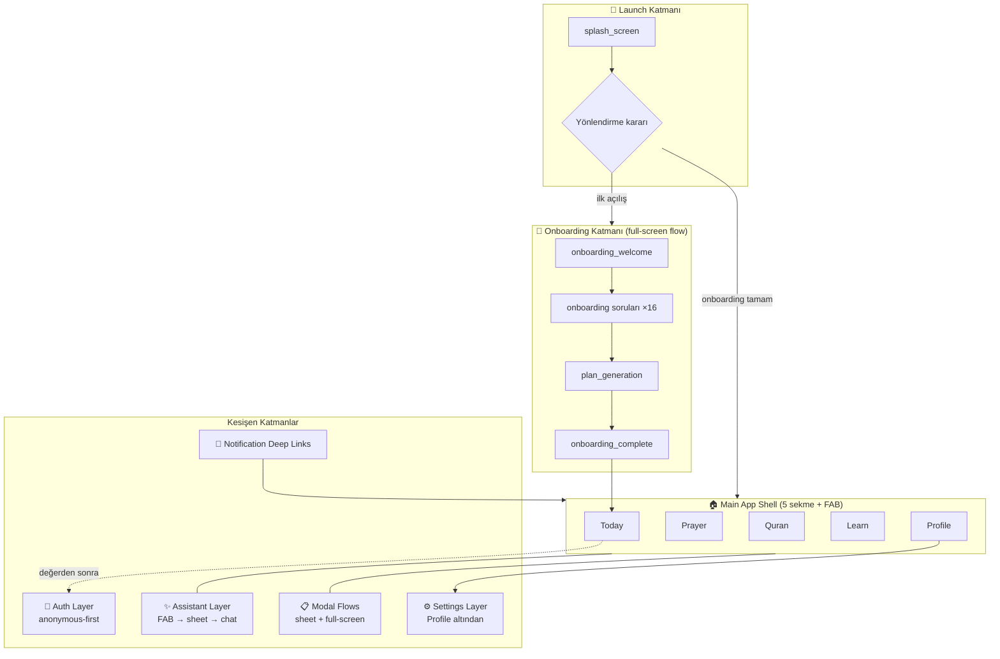

# Bismillah — Bilgi Mimarisi ve Navigasyon Spesifikasyonu

| | |
|---|---|
| **Doküman** | 05_INFORMATION_ARCHITECTURE.md |
| **Versiyon** | 1.0 |
| **Tarih** | 2026-07-08 |
| **Durum** | Onaylı temel — Flutter/GoRouter mimarisi bu dokümana göre kurulur |
| **Bağlı dokümanlar** | [CLAUDE.md](../CLAUDE.md) · [01_PRODUCT_PRD.md](01_PRODUCT_PRD.md) · [02_BRAND_GUIDELINES.md](02_BRAND_GUIDELINES.md) · [03_DESIGN_SYSTEM.md](03_DESIGN_SYSTEM.md) · [04_ONBOARDING_FLOW.md](04_ONBOARDING_FLOW.md) |

---

## İçindekiler

1. [Bilgi Mimarisi Genel Bakış](#1-bilgi-mimarisi-genel-bakış)
2. [Navigasyon İlkeleri](#2-navigasyon-i̇lkeleri)
3. [Üst Seviye Uygulama Yapısı](#3-üst-seviye-uygulama-yapısı)
4. [Ana Sekmeler](#4-ana-sekmeler)
5. [Ekran Envanteri (Screen Inventory)](#5-ekran-envanteri-screen-inventory)
6. [Route Mimarisi](#6-route-mimarisi)
7. [Uygulama Açılış Akışı](#7-uygulama-açılış-akışı)
8. [Onboarding'den Ana Uygulamaya Geçiş](#8-onboardingden-ana-uygulamaya-geçiş)
9. [Asistan Katmanı Mimarisi](#9-asistan-katmanı-mimarisi)
10. [Modal ve Bottom Sheet Sistemi](#10-modal-ve-bottom-sheet-sistemi)
11. [Kullanıcı Akışları (User Flows)](#11-kullanıcı-akışları-user-flows)
12. [Deep Link Stratejisi](#12-deep-link-stratejisi)
13. [Çevrimdışı Navigasyon Davranışı](#13-çevrimdışı-navigasyon-davranışı)
14. [Auth ve Anonim Kullanıcı Navigasyonu](#14-auth-ve-anonim-kullanıcı-navigasyonu)
15. [Ayarlar Mimarisi](#15-ayarlar-mimarisi)
16. [Kutsal İçerik Navigasyon Kuralları](#16-kutsal-i̇çerik-navigasyon-kuralları)
17. [Kişiselleştirme ve Navigasyon](#17-kişiselleştirme-ve-navigasyon)
18. [Boş, Hata ve Yükleme Navigasyon Durumları](#18-boş-hata-ve-yükleme-navigasyon-durumları)
19. [Yerelleştirme ve RTL Navigasyon Kuralları](#19-yerelleştirme-ve-rtl-navigasyon-kuralları)
20. [Navigasyon Analytics](#20-navigasyon-analytics)
21. [Performans Gereksinimleri](#21-performans-gereksinimleri)
22. [Erişilebilirlik Gereksinimleri](#22-erişilebilirlik-gereksinimleri)
23. [MVP vs Gelecek Navigasyon Kapsamı](#23-mvp-vs-gelecek-navigasyon-kapsamı)
24. [IA QA Kontrol Listesi](#24-ia-qa-kontrol-listesi)
25. [Kabul Kriterleri](#25-kabul-kriterleri)
26. [Nihai Bilgi Mimarisi Yönü](#26-nihai-bilgi-mimarisi-yönü)

---

## 1. Bilgi Mimarisi Genel Bakış

Bu doküman, Bismillah'ın **haritasıdır**: hangi ekranlar var, nerede yaşıyorlar, birbirlerine nasıl bağlanıyorlar ve kullanıcı hangi işte hangi yoldan geçiyor. Flutter mimarisine (feature klasörleri, GoRouter yapılandırması) geçmeden önce çizilmesi zorunlu olan plandır — çünkü kod, haritası olmayan bir şehirde yol yapmaya benzemesin.

**Zincirdeki yeri:** PRD §25–26 sekme yapısını ve navigasyon kararlarını verdi; Tasarım Sistemi §13 navigasyon bileşenlerini tanımladı; Onboarding Flow §5 giriş akışını ekran ekran belirledi. Bu doküman hepsini **tek tutarlı ekran envanteri + route mimarisi + akış kütüphanesi** hâlinde birleştirir. Çelişki hâlinde sıra: CLAUDE.md → PRD → Marka → Tasarım Sistemi → Onboarding → bu doküman.

**Temel navigasyon kararının gerekçesi** (PRD §25'ten devralınır ve burada bağlanır): ana yapı **5 sekmedir** (Today, Prayer, Quran, Learn, Profile) ve **AI Asistan bir sekme DEĞİLDİR**, her ekrandan erişilebilen kalıcı eşlikçi giriş noktasıdır. Dört gerekçe:

1. **5 sekme mobil ergonominin üst sınırıdır** — 6. sekme hem dokunma hedeflerini küçültür hem bilişsel yükü artırır.
2. **Asistan merkez değil, destektir** — sekme yapmak onu "uygulamanın yarısı" gibi konumlar; oysa ürünün merkezi ibadet eylemidir, sohbet değil.
3. **Asistan bağlamsal çalışmalıdır** — Kur'an ekranında sureyi, Today'de planı konuşmalıdır; sabit bir sekme bu bağlamı koparır.
4. **Ana davranış chat değil, ibadet aksiyonudur** — kuzey yıldızı metriği (WCW) sohbet değil, tamamlanan ibadet eylemi sayar.

---

## 2. Navigasyon İlkeleri

1. **Her ekran "Şimdi ne yapmalıyım?" sorusuna cevap verir** — ekrandan çıkan her yol, kullanıcıyı bir sonraki anlamlı adıma taşır; çıkmaz sokak ekran yoktur.
2. **Günlük eylemler ≤2 dokunuş uzaktadır** — namaz kaydı, plan kartı tamamlama, zikir başlatma: uygulama açılışından en fazla iki dokunuş (PRD §26 dokunuş bütçesi bağlayıcıdır).
3. **Alt navigasyon sade ve sabittir** — 5 sekme hiçbir koşulda değişmez, yeniden sıralanmaz, rozetle bağırmaz; kişiselleştirme sekmeleri değil içerikleri değiştirir (§17).
4. **Asistan her yerde erişilebilir ama asla baskın değildir** — FAB mütevazıdır, kaydırmada yarı saydamlaşır, kutsal yüzeylerde gizlenir, kendiliğinden asla açılmaz.
5. **Kutsal içerik yüzeylerinde dikkat dağıtıcılar gizlenir** — Kur'an okuma yüzeyi ve zikir sayacında alt navigasyon + FAB kaybolur (§16).
6. **Kullanıcı asla kaybolmaz** — her iç ekranda görünür geri yolu; sekmeye yeniden dokunuş köke döndürür; sistem geri tuşu iç ekrandan uygulamayı kapatmaz.
7. **Deep linkler tam hedefe iner** — bildirim, kullanıcıyı "uygulamaya" değil, eylemin kendisine götürür (namaz bildirimi → tek dokunuş kayıt sheet'i).
8. **RTL'de navigasyon aynalanır** — sekme sırası, geri yönü, FAB konumu, geçiş yönleri; fiziksel yön öğeleri (kıble) hariç (§19).

---

## 3. Üst Seviye Uygulama Yapısı



**Katman sözleşmeleri:** Launch katmanı yalnız yönlendirme kararı verir (UI minimal — logo + zemin, <1sn hedef); Onboarding katmanı shell dışında yaşar (alt navigasyon yok); Assistant/Auth/Modal katmanları shell'in ÜZERİNE açılır (sekme durumu korunur); Settings, Profile sekmesinin alt ağacıdır ama `/settings` kökünden de erişilebilir (deep link ve asistan yönlendirmeleri için).

---

## 4. Ana Sekmeler

### 4.1 Today 🏠

| Alan | İçerik |
|---|---|
| **Görev (Purpose)** | Günün kişisel planını ve tek sonraki adımı göstermek — ürünün kalbi |
| **Birincil kullanıcı işleri** | Bugün ne yapacağımı görmek · plan eylemlerini tamamlamak · ilerlememi hissetmek |
| **MVP ekranları** | `today_home` (tek ekran — kartlar kompozisyondur, alt ekran değildir); `daily_ayah_detail` (ayet kartından push) |
| **Gelecek ekranlar** | Aylık özet töreni (V1.x), Ramazan panosu (V2 — Today'in sezonluk kompozisyonu olarak, ayrı sekme DEĞİL) |
| **Kart yapısı** | Selamlama + ilerleme halkası + ≤4 kart (DS §14); kompozisyon profile göre (Onboarding §10) |
| **Profil varyasyonu** | Beginner: tek namaz + ders · Returning: tek sıcak eylem · Advanced: tam panel · Low-time: tek mikro kart (Onboarding §10 eşleme tablosu bağlayıcı) |
| **Aldığı deep linkler** | Plan hatırlatma → `today_home`; Kur'an görevi → `today_home` (ilgili kart vurgulu); günlük ayet → `daily_ayah_detail` |
| **Boş durum** | Yoktur — Today asla boş olamaz; en kötü durumda tek davet kartı (plan üretilmemişse onboarding'e köprü) |
| **Kısıtlar** | Ekranda ≤4 kart; en üst kart daima "şimdi yapılabilir"; XP/istatistik yoğunluğu Today'e taşınmaz (Profil'in işi) |

### 4.2 Prayer 🕌

| Alan | İçerik |
|---|---|
| **Görev** | İbadet araç seti: vakitler, namaz takibi, kıble, zikir, dua |
| **Birincil işler** | Vakti görmek · namazı kaydetmek · zikir çekmek · dua bulmak |
| **MVP ekranları** | `prayer_home` (vakit listesi + takip) · `prayer_times_detail` (aylık görünüm + yöntem) · `qibla_screen` · `dhikr_home` · `dhikr_counter` (full-screen modal) · `dua_library` · `dua_detail` |
| **Gelecek ekranlar** | Kaza takibi genişletmesi (V1.x), sünnet istatistikleri (V2) |
| **Giriş noktaları** | Sekme · Today namaz kartı · namaz bildirimi deep link'i · asistan yönlendirmesi |
| **Boş durumlar** | Şehir seçilmemiş → "Şehrini seç" kartı (vakitler yerine); zikir hiç yapılmamış → davet kartı (DS §26) |
| **Kısıtlar** | Kaçırılan vakit ASLA kırmızı (DS §4); zikir sayacında alt nav + FAB gizli; dua detayında kaynak bloğu zorunlu |

**Not — zikir ve duanın Prayer altında olması:** PRD §25 kararı korunur; "ibadet eylemleri" tek zihinsel çatıda toplanır, sekme sayısı 5'te kalır.

### 4.3 Quran 📖

| Alan | İçerik |
|---|---|
| **Görev** | Kur'an ilişkisinin evi: hedef, takip, ilerleme, günlük ayet |
| **Birincil işler** | Bugünkü okuma hedefini görmek/kaydetmek · kaldığım yeri bulmak · ilerlememi görmek |
| **MVP ekranları** | `quran_home` (hedef + devam kartı + haftalık tutarlılık) · `quran_progress` (genel ilerleme/cüz görünümü) · `daily_ayah_detail` (arşivle) |
| **Gelecek ekranlar** | **V2: tam Kur'an okuyucu** (`quran_reader` — mushaf/çeviri modları, sesli tilavet), hatim planlayıcı (`hatim_planner`), ezber modülü |
| **Giriş noktaları** | Sekme · Today Kur'an kartı · okuma hatırlatması deep link'i |
| **Boş durum** | Hiç okuma kaydı yok → "İlk sayfa hâlâ en güzel sayfadır" daveti (DS §26) |
| **Kısıtlar** | MVP'de okuma kaydı manueldir (PRD §27.6); V2 okuyucusu bu sekmenin ALT ekranı olarak eklenir (sekme yapısı değişmez); okuma yüzeyinde oyunlaştırma yok (DS §16) |

### 4.4 Learn 🎓

| Alan | İçerik |
|---|---|
| **Görev** | Yapılandırılmış öğrenme: temeller, günlük hadis, yansımalar |
| **Birincil işler** | Sıradaki dersimi görmek · günlük hadisi okumak · temellerden öğrenmek |
| **MVP ekranları** | `learn_home` (yol + günlük hadis) · `lesson_detail` · `daily_hadith_detail` |
| **Gelecek ekranlar** | Çoklu öğrenme yolları (V1.x), âlim onaylı içerik rozetleri (V3), Elif-Ba modülü (V2 adayı) |
| **Giriş noktaları** | Sekme · Today ders kartı (beginner/learning profillerinde) · asistan ders önerisi |
| **Boş durum** | Yol bitirilmişse → "Yeni yol yakında" + günlük hadis arşivine davet |
| **Kısıtlar** | Ders içerikleri sınıf etiketli (hadis/yansıma/görüş — DS §34); "kilitli ders" ikonografisi yok (DS §12) |

### 4.5 Profile 👤

| Alan | İçerik |
|---|---|
| **Görev** | Kimlik, büyüme kanıtı ve kontrol: istatistik, başarılar, hedefler, ayarlar |
| **Birincil işler** | İlerlememi görmek · hedeflerimi düzenlemek · ayarları yönetmek · hesabımı yönetmek |
| **MVP ekranları** | `profile_home` · `stats_overview` · `achievements` · `goal_settings` · Settings ağacı (§15) |
| **Gelecek ekranlar** | Aylık rapor arşivi (V2), aile grubu yönetimi (V2), Bismillah+ yönetimi (V2) |
| **Giriş noktaları** | Sekme · haftalık yansıma bildirimi → `stats_overview` · başarı bildirimi → `achievements` |
| **Boş durum** | 1. gün kullanıcısı → istatistikte vaat dili ("Birkaç gün sonra yolculuğun burada görünecek") |
| **Kısıtlar** | İstatistik motive eder, utandırmaz (DS §20); hesap silme akışı suçlayıcı ekran içermez |

---

## 5. Ekran Envanteri (Screen Inventory)

MVP ekranlarının tam listesi. Öncelik: **P0** = MVP zorunlu · **P1** = MVP kalite çıtası (beta'da günler sonra gelebilir).

| Screen ID | Ad | Katman/Sekme | Amaç | Öncelik | Route önerisi | Giriş noktaları | Çıkış noktaları | Veri bağımlılığı | Offline | Erişilebilirlik notu |
|---|---|---|---|---|---|---|---|---|---|---|
| `splash_screen` | Açılış | Launch | Yönlendirme kararı + marka anı | P0 | `/` | Soğuk açılış | onboarding VEYA shell | Lokal onboarding durumu | ✅ Tam | Logo dekoratif; okuyucu "Bismillah yükleniyor" |
| `language_gate` | Dil kapısı | Onboarding | İlk dil seçimi (onboarding_language) | P0 | `/onboarding/language` | splash (ilk açılış) | Sonraki soru | — | ✅ | Her seçenek kendi `lang` etiketiyle |
| `onboarding_welcome` | Karşılama | Onboarding | Sıcak ilk temas | P0 | `/onboarding/welcome` | splash | language | — | ✅ | Başlık header semantiği |
| `onboarding_question` | Soru şablonu | Onboarding | 16 soru (Onboarding §5; tek şablon, parametrik) | P0 | `/onboarding/q/:questionId` | Önceki soru | Sonraki soru / generation | Isar (anlık yazım) | ✅ | Onboarding §16 kuralları |
| `onboarding_plan_generation` | Plan üretimi | Onboarding | Tören anı | P0 | `/onboarding/generating` | Son soru | complete | Lokal kural motoru | ✅ | Aşama metinleri sırayla duyurulur |
| `onboarding_complete` | Tamamlanma | Onboarding | Plan özeti + geçiş | P0 | `/onboarding/complete` | generation | today_home | Üretilen plan | ✅ | — |
| `today_home` | Bugün | Today | Kişisel plan panosu | P0 | `/today` | Shell varsayılanı, deep linkler | Tüm sekmeler, kart detayları | Plan + vakitler + içerik cache | ✅ Cache'ten | Kart sırası okuyucuda mantıklı |
| `daily_ayah_detail` | Günlük ayet | Today/Quran | Ayet tam görünüm + arşiv | P1 | `/quran/daily-ayah/:ayahId` | Today kartı, Quran, bildirim | Geri | İçerik cache (30 gün) | ✅ | Arapça `lang=ar`; Kur'an sınıf imzası |
| `prayer_home` | Namaz | Prayer | Vakitler + günlük takip | P0 | `/prayer` | Sekme, Today kartı, bildirim | qibla, times_detail, dhikr, duas | Vakit hesabı (lokal) + kayıtlar | ✅ Tam | Vakit durumu cümleyle okunur |
| `prayer_times_detail` | Vakit detayı | Prayer | Aylık vakitler + yöntem | P1 | `/prayer/times` | prayer_home | Geri, settings | Vakit hesabı | ✅ | Tablo satırları okunabilir |
| `qibla_screen` | Kıble | Prayer | Pusula | P1 | `/prayer/qibla` | prayer_home | Geri | Pusula sensörü + konum | ✅ (konum kayıtlıysa) | Açı sesli okunur; kalibrasyon ipucu |
| `dhikr_home` | Zikir | Prayer | Set listesi + ilerleme | P0 | `/prayer/dhikr` | prayer_home, Today kartı, bildirim | dhikr_counter | Set içerikleri (paketli) | ✅ Tam | Set kartları 56dp+ |
| `dhikr_counter` | Zikir sayacı | Modal (full) | Tam ekran sayaç | P0 | `/prayer/dhikr/session/:setId` | dhikr_home, Today kartı | Tamamlanma → geri | Set + sayaç durumu | ✅ Tam | Görmeden kullanılabilir (haptik+ses bildirimi) |
| `dua_library` | Dua kütüphanesi | Prayer | Kategoriler + arama | P0 | `/prayer/duas` | prayer_home, asistan | dua_detail | Dua içeriği (paketli) | ✅ Tam | Arama klavye erişilebilir |
| `dua_detail` | Dua detayı | Prayer | Tam dua blokları | P0 | `/prayer/duas/:duaId` | library, favoriler, bildirim | Geri, favori | Dua içeriği | ✅ | Blok sırası okuyucuda korunur |
| `quran_home` | Kur'an | Quran | Hedef + devam + tutarlılık | P0 | `/quran` | Sekme, Today kartı | progress, ayah_detail, kayıt sheet | Hedef + kayıtlar | ✅ | — |
| `quran_progress` | Kur'an ilerleme | Quran | Genel ilerleme/cüz | P1 | `/quran/progress` | quran_home | Geri | Kayıt geçmişi | ✅ | Grafik verisi metinle özetlenir |
| `learn_home` | Öğren | Learn | Yol + günlük hadis | P0 | `/learn` | Sekme, Today ders kartı | lesson_detail, hadith_detail | Ders içeriği (cache) | ✅ Cache'ten | — |
| `lesson_detail` | Ders | Learn | Ders içeriği | P0 | `/learn/lesson/:lessonId` | learn_home, Today | Geri, sonraki ders | Ders içeriği | ✅ (indirilmişse) | İçerik blokları sıralı okunur |
| `daily_hadith_detail` | Günlük hadis | Learn | Hadis + kaynak/derece | P1 | `/learn/daily-hadith/:hadithId` | learn_home, Today kartı | Geri | İçerik cache | ✅ | Hadis sınıf imzası zorunlu |
| `profile_home` | Profil | Profile | Kimlik + özet + girişler | P0 | `/profile` | Sekme | stats, achievements, goals, settings | Kullanıcı verisi | ✅ | — |
| `stats_overview` | İstatistikler | Profile | Haftalık/aylık görünüm | P1 | `/profile/stats` | profile_home, haftalık bildirim | Geri | Kayıt geçmişi | ✅ | Grafikler metin özetli |
| `achievements` | Başarılar | Profile | Rozet galerisi | P1 | `/profile/achievements` | profile_home, başarı bildirimi | Rozet detay sheet | Başarı verisi | ✅ | Kazanılmamış rozet "yolda" diye okunur |
| `goal_settings` | Hedef ayarları | Profile | Plan/hedef düzenleme | P0 | `/profile/goals` | profile_home, asistan önerisi | Geri | Profil + plan | ✅ | — |
| `settings_home` | Ayarlar | Settings | Ayar listesi kökü | P0 | `/settings` | profile_home | Alt ayarlar | — | ✅ | Liste satırları 48dp |
| `notification_settings` | Bildirim ayarları | Settings | Tür bazlı kontrol + sessiz saat | P0 | `/settings/notifications` | settings_home, bildirim eğitim kartı | Geri | İzin durumu | ✅ | Toggle etiketleri açık |
| `language_settings` | Dil | Settings | TR/EN/AR geçişi | P0 | `/settings/language` | settings_home | Geri (anlık uygulanır) | — | ✅ | Dil adları kendi dilinde |
| `prayer_calc_settings` | Vakit hesabı | Settings | Yöntem + mezhep + konum | P0 | `/settings/prayer-calculation` | settings_home, prayer_times_detail | Geri | Konum | ✅ | — |
| `account_settings` | Hesap | Settings | Giriş/çıkış, veri, silme | P0 | `/settings/account` | settings_home | auth, silme akışı | Auth durumu | Kısmi (silme online) | Silme akışı net onaylı |
| `assistant_sheet` | Asistan sheet | Assistant | Bağlamsal yarım ekran | P0 | `/assistant` (sheet sunumu) | FAB (her ekran) | Genişlet → chat, kapat | Bağlam + AI servisi | ❌ Zarif düşüş | Odak sheet'e kilitlenir |
| `assistant_chat` | Asistan sohbet | Assistant | Tam ekran sohbet | P0 | `/assistant/chat` | assistant_sheet | Geri | AI servisi + geçmiş | ❌ Geçmiş okunur | Balonlar sıralı; AI çipi okunur |
| `auth_prompt` | Kayıt daveti | Auth | Değerden sonra davet sheet'i | P0 | `/auth` (sheet) | İlk Today sonrası, Profil | sign_in, kapat | — | ❌ (davet ertelenir) | Kapatma dokunuşu erişilebilir |
| `auth_sign_in` | Giriş | Auth | Apple/Google/E-posta seçimi | P0 | `/auth/sign-in` | auth_prompt, account_settings | email, geri | Firebase Auth | ❌ | Sağlayıcı butonları etiketli |
| `auth_email` | E-posta girişi | Auth | E-posta akışı | P0 | `/auth/email` | auth_sign_in | Geri, tamam | Firebase Auth | ❌ | Form hataları liveRegion |
| `offline_state` | Çevrimdışı şerit | Kesişen | Sessiz bilgi şeridi (ekran değil, overlay) | P1 | — (route değil) | Bağlantı kaybı | Otomatik kaybolur | Bağlantı durumu | ✅ | Okuyucuya bir kez duyurulur |

*(Not: `onboarding_question` tek parametrik şablon ekrandır — 16 soru ayrı ekran olarak kodlanmaz; Onboarding §5 alanları parametredir.)*

---

## 6. Route Mimarisi

GoRouter yapısı (kod değil, sözleşme): **Root** altında iki ana dal — `/onboarding` (shell dışı full-screen flow) ve **StatefulShellRoute** (5 sekme, her biri kendi navigator yığınıyla). Modal/sheet sunumları route olarak tanımlanır (deep link edilebilirlik için) ama sunum tipi sheet/full-screen modal'dır.

| Route | Amaç | Parent | Sunum | Auth? | Offline? | Deep link? | Not |
|---|---|---|---|---|---|---|---|
| `/` | Splash + yönlendirme | root | Tam ekran | ❌ | ✅ | ❌ | Karar mantığı §7 |
| `/onboarding/welcome` | Karşılama | `/onboarding` | Full-screen flow | ❌ | ✅ | ❌ | Shell dışı |
| `/onboarding/q/:questionId` | Soru şablonu | `/onboarding` | Full-screen flow | ❌ | ✅ | ❌ | 16 soru parametrik |
| `/onboarding/generating` | Plan töreni | `/onboarding` | Full-screen | ❌ | ✅ | ❌ | Geri kilitli (tören kesilmez, atlanabilir) |
| `/onboarding/complete` | Özet | `/onboarding` | Full-screen | ❌ | ✅ | ❌ | — |
| `/today` | Bugün panosu | shell/tab1 | Tab kökü | ❌ | ✅ | ✅ | Shell varsayılan sekmesi |
| `/prayer` | Namaz evi | shell/tab2 | Tab kökü | ❌ | ✅ | ✅ | — |
| `/prayer/times` | Vakit detayı | `/prayer` | Push | ❌ | ✅ | ✅ | — |
| `/prayer/qibla` | Kıble | `/prayer` | Push | ❌ | ✅ | ✅ | Sensör gerekli |
| `/prayer/log` | Hızlı namaz kaydı | `/prayer` | **Bottom sheet** | ❌ | ✅ | ✅ | Bildirimin ana hedefi |
| `/prayer/dhikr` | Zikir listesi | `/prayer` | Push | ❌ | ✅ | ✅ | — |
| `/prayer/dhikr/session/:setId` | Sayaç | `/prayer/dhikr` | **Full-screen modal** | ❌ | ✅ | ✅ | Nav+FAB gizli |
| `/prayer/duas` | Dua kütüphanesi | `/prayer` | Push | ❌ | ✅ | ✅ | — |
| `/prayer/duas/:duaId` | Dua detayı | `/prayer/duas` | Push | ❌ | ✅ | ✅ | Kaynak bloğu zorunlu |
| `/quran` | Kur'an evi | shell/tab3 | Tab kökü | ❌ | ✅ | ✅ | — |
| `/quran/progress` | İlerleme | `/quran` | Push | ❌ | ✅ | ✅ | — |
| `/quran/log` | Okuma kaydı | `/quran` | **Bottom sheet** | ❌ | ✅ | ✅ | — |
| `/quran/daily-ayah/:ayahId` | Günlük ayet | `/quran` | Push | ❌ | ✅ | ✅ | Kur'an sınıf imzası |
| `/learn` | Öğren evi | shell/tab4 | Tab kökü | ❌ | ✅ | ✅ | — |
| `/learn/lesson/:lessonId` | Ders | `/learn` | Push | ❌ | ✅* | ✅ | *İndirilmiş içerik |
| `/learn/daily-hadith/:hadithId` | Günlük hadis | `/learn` | Push | ❌ | ✅ | ✅ | Hadis sınıf imzası |
| `/profile` | Profil evi | shell/tab5 | Tab kökü | ❌ | ✅ | ✅ | — |
| `/profile/stats` | İstatistik | `/profile` | Push | ❌ | ✅ | ✅ | Haftalık yansıma hedefi |
| `/profile/achievements` | Başarılar | `/profile` | Push | ❌ | ✅ | ✅ | — |
| `/profile/goals` | Hedefler | `/profile` | Push | ❌ | ✅ | ❌ | — |
| `/settings` | Ayarlar kökü | `/profile` altı (bağımsız erişilebilir) | Push | ❌ | ✅ | ✅ | Asistan yönlendirme hedefi |
| `/settings/language` | Dil | `/settings` | Push | ❌ | ✅ | ✅ | — |
| `/settings/notifications` | Bildirimler | `/settings` | Push | ❌ | ✅ | ✅ | Eğitim kartı hedefi |
| `/settings/prayer-calculation` | Vakit hesabı | `/settings` | Push | ❌ | ✅ | ❌ | — |
| `/settings/account` | Hesap | `/settings` | Push | ❌ | Kısmi | ❌ | Silme online gerektirir |
| `/premium` *(v1.1)* | Bismillah+ paywall | root overlay | **Full-screen modal** | ❌ | Entitlement cache okunur; satın alma online | Sınırlı (yalnız doğal dönüşüm köprüleri) | Yalnız doğal conversion anlarında açılır (08 §8); recovery/kutsal içerik/onboarding yığınından AÇILAMAZ |
| `/settings/subscription` *(v1.1)* | Abonelik yönetimi | `/settings` | Push | ❌ | Durum cache'ten; restore online | ✅ | Durum + restore purchases + store yönetim köprüsü |
| `/assistant` | Bağlamsal sheet | root overlay | **Bottom sheet** | ❌ | Zarif düşüş | ❌ | Bağlam parametresi taşır |
| `/assistant/chat` | Tam sohbet | `/assistant` | Full-screen | ❌ | Geçmiş okunur | ❌ | — |
| `/auth` | Kayıt daveti | root overlay | **Bottom sheet** | ❌ | ❌ | ✅ (hatırlatma) | Kapatılabilir |
| `/auth/sign-in` | Giriş | `/auth` | Sheet içi / push | ❌ | ❌ | ❌ | — |
| `/auth/email` | E-posta | `/auth/sign-in` | Push | ❌ | ❌ | ❌ | — |
| `*` (error) | Bilinmeyen route | root | Yönlendirme | ❌ | ✅ | — | `/today`e düşer + `route_error` eventi (§18) |

**Kural sözleşmeleri:** hiçbir MVP route'u auth gerektirmez (anonymous-first, §14); tüm deep-link-eligible route'lar onboarding tamamlanmamışsa önce onboarding'e yönlendirir ve hedefi bekletir (§12); route adları küçük-tire (kebab-case), ID parametreleri `:camelCase`.

---

## 7. Uygulama Açılış Akışı

```mermaid
flowchart TD
    A[Soğuk açılış: splash] --> B{Onboarding durumu?}
    B -->|hiç başlamamış| C[/onboarding/welcome/]
    B -->|yarım kalmış| D[Kaldığı soru + 'Baştan başla' seçeneği]
    B -->|tamamlanmış| E{Hesap durumu?}
    E -->|anonim| F[/today/ — tam deneyim]
    E -->|kayıtlı| F
    E -->|hesap silinmiş / auth geçersiz| G[Yeni anonim oturum + /today/<br/>lokal veri varsa korunur]
    F --> H{Bağlantı?}
    H -->|çevrimiçi| I[Sessiz senkron başlar]
    H -->|çevrimdışı| J[Cache ile tam deneyim + sessiz şerit]
    C -.->|dil seçilmiş ama sorular yarım| D
    K[Firebase unavailable] -.-> F
```

| Durum | Davranış |
|---|---|
| **İlk kez açılış** | splash → `/onboarding/welcome`; izin/kayıt duvarı yok |
| **Onboarding yarım** | Kaldığı sorudan devam + üstte "Baştan başla" (Onboarding §15); 30+ gün geçmişse nazik teyit ekranı |
| **Onboarding tamam + auth yok** | Doğrudan `/today` — anonim oturum tam deneyim |
| **Kayıtlı kullanıcı** | `/today` + arka planda senkron |
| **Çevrimdışı kullanıcı** | `/today` cache'ten açılır; vakitler lokal hesaplanır; sessiz çevrimdışı şeridi |
| **Dil seçilmiş, onboarding yarım** | Dil korunur, kalan sorulardan devam |
| **Hesap silinmiş** | Auth token geçersiz → yeni anonim oturum + `/today`; kullanıcıya teknik hata gösterilmez; lokal veri (varsa) yeni oturuma bağlanır |
| **Firebase unavailable** | Uygulama TAM çalışır (offline-first): plan, vakitler, zikir, dua lokaldir; yalnız asistan/senkron zarif düşüş gösterir |

**Performans sözleşmesi:** splash → ilk etkileşimli ekran <2sn (Constitution); yönlendirme kararı lokal veriyle verilir (ağ beklenmez).

---

## 8. Onboarding'den Ana Uygulamaya Geçiş

Sıralama sözleşmesi (Onboarding §11 — değiştirilemez):

1. **Plan generation** (`/onboarding/generating`) — tören, 2.5–3.5sn, lokal üretim
2. **Onboarding complete** (`/onboarding/complete`) — insan diliyle plan özeti + "Panoma git"
3. **İlk Today** (`/today`) — onboarding yığını TEMİZLENİR (geri tuşu onboarding'e dönmez); Today kompozisyonu profile göre (Onboarding §10)
4. **İlk eyleme davet** — en üst kart şimdi yapılabilir; onboarding bitiminden ilk tamamlanabilir eyleme ≤2 dokunuş
5. **Auth prompt** (`/auth` sheet) — Today görüntülendikten sonra; **ana akışı kesmez**: sheet kapatılabilir, altındaki Today aynen durur, hiçbir özellik kilitlenmez

**Auth'un akışı kesmemesi ilkesi:** kayıt daveti bir *kapı* değil *el uzatma*dır. Sheet açıkken bile kullanıcı sürükleyip kapatarak plana devam edebilir; "Daha sonra" hiçbir işlevi eksiltmez; ikinci (ve son) otomatik davet ≥3 gün sonra (Onboarding §11).

---

## 9. Asistan Katmanı Mimarisi

**Konum:** Asistan, sekme ağacının DIŞINDA, shell üzerine açılan bağımsız katmandır. Route'ları (`/assistant`, `/assistant/chat`) vardır ama alt navigasyonda temsil edilmez.

| Öğe | Kural |
|---|---|
| **FAB (yüzen düğme)** | 56dp, okuma yönü tarafında, alt navın üstünde (DS §9/§13); kaydırmada yarı saydam; kendiliğinden asla açılmaz/zıplamaz |
| **Bağlamsal sheet** | FAB → yarım ekran sheet; açıldığı ekranın bağlamını taşır (Kur'an'da sure önerisi, Today'de plan yardımı — DS §22); route: `/assistant?context=<screenId>` |
| **Tam ekran chat** | Sheet'ten genişleme; üst başlıkta sınır alt yazısı ("Öğrenmene yardım ederim — hüküm vermem") |
| **Giriş noktaları** | FAB (birincil) · AI Insight kartı "devam et" · plan önerisi kartı · Today tanışma kartı (tek seferlik, Onboarding §21) |
| **FAB'ın GİZLENDİĞİ yüzeyler** | `dhikr_counter` (sayaç) · Kur'an metin okuma yüzeyi (`daily_ayah_detail` dahil tam metin görünümü) · onboarding akışı · kutlama modalleri · auth akışı |
| **AI etiket kuralı** | Dini içerik taşıyan her asistan çıktısı "AI açıklaması" çipiyle (DS §22/§34); sohbette alıntılanan ayet/hadis/dua bağımsız kaynak kartına çıkar — balon içinde render edilmez |
| **Âlim yönlendirme akışı** | Fetva-türü soru → reddediş balonu (anlayış→sınır→yapabileceği→yönlendirme) + opsiyonel "Bu konuyu öğrenme kaynağı olarak aç" köprüsü; navigasyon hedefi yoktur (harici âlim listesi MVP'de YOK — kullanıcı kendi çevresine yönlendirilir) |
| **Plan önerisi kartı akışı** | Asistan öneri üretir → sohbet içi öneri kartı (mevcut→önerilen) → "Uygula" → `goal_settings` güncellenir + teyit; asistan kendiliğinden plan DEĞİŞTİREMEZ (DS §22) |
| **Offline durumu** | FAB görünür kalır; dokunuşta zarif düşüş sheet'i: "Asistan şu an ulaşılamıyor" + offline alternatif köprüleri (dualar, zikir) |

---

## 10. Modal ve Bottom Sheet Sistemi

Karar matrisi — hangi sunum ne zaman:

| Sunum | Ne zaman | Örnekler | Gerekçe |
|---|---|---|---|
| **Bottom sheet** | Bağlamı KAYBETMEMESİ gereken hızlı işler (≤30sn, tek karar) | Hızlı namaz kaydı (`/prayer/log`) · hedef düzenleme · asistan bağlamsal sheet · seri onarımı teklifi · auth daveti (`/auth`) · okuma kaydı (`/quran/log`) | Kullanıcı "yerinde kalır"; altındaki ekran görünür — iş bitince kaldığı yere döner; iptal maliyeti sıfır |
| **Full-screen modal** | Tören ve odak anları — dünyanın geri kalanının kaybolması GEREKEN deneyimler | Onboarding · zikir sayacı · başarı kutlaması · aylık özet · plan üretimi · (V2) paywall | Sükûnet/odak tasarımı; alt nav ve FAB gizlenir; çıkış daima görünür |
| **Push route** | Hiyerarşik içerik gezintisi — "derine in, geri dön" modeli | Dua detayı · ders detayı · istatistikler · ayarlar ağacı · Kur'an ilerleme · vakit detayı | Sekme yığınında doğal yer; geri davranışı öngörülebilir; durum korunur |

**Ek kurallar:** sheet üstünde sheet açılmaz (istisna: sheet → tam ekrana genişleme); full-screen modal içinden yalnız kendi akışının ekranlarına gidilir (modal içinden sekme değiştirilemez); Android geri tuşu sheet'i kapatır, modal'da akışın "çıkış" davranışını uygular.

**Paywall yerleşim kuralları (v1.1):** `/premium` bir route'tur ama navigasyonun doğal akışını KESEMEZ — hiçbir ekran geçişi paywall'a "uğramak" zorunda bırakılamaz. Paywall; recovery kompozisyonu, kaçırılmış ibadet bağlamı, kutsal içerik yüzeyleri veya onboarding yığını içinde AÇILMAZ; ilk 14 günde otomatik açılmaz; yalnız doğal dönüşüm anlarından (08 §8) kontrollü `push` ile açılır ve tek dokunuşla kapanır.

---

## 11. Kullanıcı Akışları (User Flows)

| # | Akış | Tetik | Adımlar (ekranlar) | Başarı durumu | Hata/uç durumu | Analytics |
|---|---|---|---|---|---|---|
| 1 | **İlk açılış → ilk eylem** | İlk kurulum | splash → onboarding (20 ekran) → today_home → en üst kart dokunuşu | İlk eylem tamamlandı (kayıt/ders/zikir) | Onboarding yarım → devam mantığı | `onboarding_completed` → `first_action_completed` |
| 2 | **Bildirimden namaz kaydı** | Vakit bildirimi | Bildirim → `/prayer/log` sheet (tek dokunuş) → onay animasyonu → kapanış | Kayıt ≤2 dokunuş (bildirim dahil) | Onboarding eksik → önce onboarding, hedef bekletilir | `notification_opened` → `prayer_logged{source:notification}` |
| 3 | **Today'den namaz kaydı** | Kullanıcı | today_home → namaz kartı halka dokunuşu → optimistic işaret | Anında görsel onay + haptik | Çevrimdışı → lokal yazım, sessiz senkron | `prayer_logged{source:dashboard}` |
| 4 | **Kur'an görevi tamamlama** | Today kartı / hatırlatma | today_home → Kur'an kartı → `/quran/log` sheet → miktar + onay | Kayıt + halka ilerlemesi | Hedef yoksa → hedef kurulum daveti | `quran_session_logged` |
| 5 | **Zikir oturumu** | Today/dhikr_home | dhikr_home → set seçimi → `dhikr_counter` (full modal) → sayım → tamamlanma | "Allah kabul etsin" + kayıt | Yarım bırakma → ilerleme korunur, sonra devam | `dhikr_set_completed` |
| 6 | **Dua bul + favorile** | Kullanıcı ihtiyacı | prayer_home → dua_library → kategori/arama → dua_detail → favori | Favori kaydedildi (offline dahil) | Arama boş → davet dili boş durumu | `dua_viewed` → `dua_favorited` |
| 7 | **Asistana soru sorma** | Merak/ihtiyaç | Herhangi ekran → FAB → assistant_sheet → (genişlet) assistant_chat → soru → cevap | Etiketli cevap; kaynaklar ayrı kartta | Offline → zarif düşüş + alternatifler; fetva sorusu → yönlendirme balonu | `fab_assistant_opened` → `assistant_message_sent` |
| 8 | **Günlük planı ayarlama** | Kullanıcı/asistan önerisi | profile_home → goal_settings → düzenle → kaydet (VEYA asistan öneri kartı → Uygula) | "Yarından itibaren" teyidi | Çakışan değerler → güvenli sınırlar (plan motoru kuralları) | `plan_resized{source}` |
| 9 | **Aradan sonra dönüş** | 3+ gün sonra açılış | splash → today_home (recovery kompozisyonu: tek sıcak kart) → mikro eylem | İlk eylem + isteğe bağlı seri onarım sheet'i | Kullanıcı onarımı reddeder → sessiz kabul, baskı yok | `streak_recovered` VEYA sessiz `plan_action_completed` |
| 10 | **Haftalık istatistik görüntüleme** | Haftalık yansıma bildirimi / merak | Bildirim → `/profile/stats` → haftalık görünüm | İnsani özet cümlesi görüldü | Veri az (yeni kullanıcı) → vaat dili | `screen_viewed{stats}` |
| 11 | **Dil değiştirme** | Kullanıcı | profile → settings → language_settings → seçim | ANINDA tüm uygulama + yön değişimi; onay diyaloğu yok | RTL geçişte açık sheet'ler kapanır (durum korunur) | `settings_changed{language}` |
| 12 | **Anonim → kayıtlı geçiş** | Auth daveti / Profil | auth_prompt sheet → auth_sign_in → sağlayıcı → hesap bağlama | %100 veri migrasyonu + teyit | Mevcut hesap çakışması → kullanıcıya seçim sunulur (sessiz üzerine yazma YASAK) | `auth_completed{method}` |
| 13 | **Bildirimleri kapatma** | Kullanıcı | settings → notification_settings → tür bazlı kapat / tümünü kapat | 2 dokunuşta kapanış; suçlama metni yok | Sistem izni zaten kapalı → durum dürüstçe gösterilir + sistem ayarına köprü | `notification_type_disabled{type}` |
| 14 | **Hesap silme** | Kullanıcı | settings → account_settings → "Hesabı sil" → onay (net, tek adım) → silme → veda ekranı | Veri silindi teyidi; veda saygılı ("Kapımız hep açık") | Offline → "bağlantı gerekli" dürüst mesajı; kısmi silme YOK (atomik) | `account_deleted` (son event) |
| 15 | **30. gün özeti → Bismillah+ görüntüleme** *(v1.1)* | Aylık özet töreni sonrası davet | Aylık özet modalı → "derinleştir" daveti → `/premium` (full modal) → inceleme → CTA veya ✕ | Paywall görüldü, karar kullanıcının; ✕ hiçbir şeyi bozmaz | Kapatma sonrası 7 gün otomatik gösterim yok (08 §9) | `premium_paywall_viewed{source:monthly_review}` |
| 16 | **Ücretsiz deneme başlatma** *(v1.1)* | Paywall CTA | `/premium` → paket seçimi → store satın alma diyaloğu → onay → teşekkür durumu | Entitlement aktif; premium özellikler anında açık | Ödeme hatası → insani mesaj + tekrar dene (DS §27 dili) | `premium_trial_started` |
| 17 | **Satın alımı geri yükleme** *(v1.1)* | Yeni cihaz / yeniden kurulum | `/settings/subscription` → "Satın alımı geri yükle" → store doğrulama → durum güncellenir | Entitlement geri geldi teyidi | Bulunamadı → dürüst mesaj + destek yolu; offline → "bağlantı gerekli" | `premium_restore_completed` |
| 18 | **Abonelik yönetimi / iptal** *(v1.1)* | Kullanıcı | `/settings/subscription` → durum görünümü → "Aboneliği yönet" → store abonelik sayfası (handoff) | Store'da yönetim; dönüşte durum senkron | İptal edene güvence metni: "verilerin ve ücretsiz deneyimin aynen durur" | `premium_subscription_cancel_intent` |

---

## 12. Deep Link Stratejisi

Şema: `bismillah://` (uygulama içi) + HTTPS App/Universal Links (V1.x web köprüsü — *varsayım: web sitesi yayınlandığında*). Tüm bildirimler deep link taşır (PRD §32: bildirim → eylem ≤1 dokunuş).

| Deep link | Kaynak | Hedef route | Onboarding şartı | Auth şartı | Offline davranışı | Fallback |
|---|---|---|---|---|---|---|
| Namaz hatırlatması | Lokal bildirim | `/prayer/log?prayer=asr` (sheet) | ✅ (eksikse önce onboarding, hedef bekletilir) | ❌ | ✅ Tam çalışır | `/prayer` |
| Kur'an hatırlatması | Lokal bildirim | `/today?highlight=quran` | ✅ | ❌ | ✅ | `/today` |
| Zikir hatırlatması | Lokal bildirim | `/prayer/dhikr/session/:setId` | ✅ | ❌ | ✅ | `/prayer/dhikr` |
| Dua önerisi | FCM (nadir) | `/prayer/duas/:duaId` | ✅ | ❌ | ✅ (paketli içerik) | `/prayer/duas` |
| Haftalık yansıma | Lokal bildirim | `/profile/stats?period=week` | ✅ | ❌ | ✅ | `/profile` |
| Başarı bildirimi | Lokal | `/profile/achievements?badge=:id` | ✅ | ❌ | ✅ | `/profile/achievements` |
| Auth hatırlatması | Lokal (maks 1) | `/auth` (sheet, Today üstünde) | ✅ | ❌ | ❌ → sessizce ertelenir | `/today` |
| Ramazan bildirimi *(V2)* | Lokal | `/today` (Ramazan kompozisyonu) | ✅ | ❌ | ✅ | `/today` |
| 30-gün özeti → Bismillah+ *(v1.1)* | Uygulama içi köprü (aylık özet daveti; bildirim DEĞİL) | `/premium` | ✅ | ❌ | Cache görüntülenir; satın alma online | `/today` |
| Abonelik ayarları *(v1.1)* | Uygulama içi / store dönüşü | `/settings/subscription` | ✅ | ❌ | ✅ (durum cache'ten) | `/settings` |

**Ortak kurallar:** deep link soğuk açılışta doğru sekme yığınını kurar (Today sekmesi altında `/prayer/log` açılmaz — Prayer sekmesi aktive edilir); hedef içerik silinmiş/bulunamıyorsa §18 "hedef bulunamadı" davranışı; onboarding yarımsa link hedefi saklanır ve onboarding bitince otomatik açılır; hiçbir deep link auth duvarına çarpmaz (MVP'de auth'suz her şey çalışır).

---

## 13. Çevrimdışı Navigasyon Davranışı

Offline-first sözleşmesi (PRD §38): **bağlantı, navigasyonun ön koşulu değildir.**

| Alan | Davranış |
|---|---|
| Onboarding | %100 offline (şehir listesi paketli, plan motoru lokal) |
| Plan üretimi | Lokal kural motoru — ağ çağrısı yok |
| Today | Cache'ten tam render; eylemler lokal yazılır |
| Namaz vakitleri | Konum kayıtlıysa tamamen lokal hesap; bildirimler lokal zamanlanmış |
| Zikir + Dua | Paketli içerik — %100 offline |
| Kur'an takip | Lokal kayıt + yer imi |
| Learn | İndirilen/cache'lenen dersler açılır; inmemiş içerik dürüst boş durum + "bağlanınca hazır" |
| AI Asistan | ÇALIŞMAZ — zarif düşüş sheet'i + offline alternatif köprüleri (§9) |
| Auth | Davet ertelenir; giriş denemeleri dürüst hata (§27-DS dili) |
| Premium/ödeme (v1.1 — launch'ta canlı) | Satın alma/restore çalışmaz — dürüst mesaj, tekrar deneme; entitlement durumu son bilinen cache'ten görünür, premium özellikler offline kullanılmaya devam eder |
| Senkron durumu | Ayarlar'da sessiz satır; ana akışta yalnız ince bilgi şeridi (kapatılabilir, kırmızı değil) |

**Navigasyon kuralı:** offline'da hiçbir route engellenmez — route açılır, içerik kendi boş/düşüş durumunu gösterir. "İnternet yok" tam ekran duvarı Bismillah'ta yoktur.

---

## 14. Auth ve Anonim Kullanıcı Navigasyonu

**Anonymous-first sözleşmesi:** MVP'de **auth gerektiren tek bir route yoktur.** Firebase anonymous session ilk açılışta sessizce kurulur; kullanıcı süresiz anonim kalabilir.

| Konu | Karar |
|---|---|
| **Anonim erişim** | Tüm sekmeler, tüm ekranlar, asistan, tüm ibadet araçları — kısıtsız |
| **Auth ne zaman istenir** | (1) İlk Today sonrası davet sheet'i; (2) ≥3 gün sonra bir kez daha; (3) sonrası yalnız Profil'de sessiz "Hesap oluştur" satırı; (4) kullanıcı kendi isterse |
| **Auth prompt yerleri** | `/auth` sheet (Today üstünde) · `account_settings` · gelecekte cihaz değişimi senaryosu |
| **Auth GEREKTİRMEYEN MVP özellikleri** | Hepsi (yukarıdaki sözleşme) |
| **Auth GEREKTİREN gelecek özellikler** | Bismillah+ satın alma (V2 — RevenueCat hesap eşlemesi), aile grupları (V2), cihazlar arası senkron (fiilen — anonim veri tek cihazda yaşar ve kullanıcıya bu dürüstçe söylenir) |
| **Account linking** | Anonim oturum kalıcı hesaba YÜKSELTİLİR (linkWithCredential yaklaşımı); veri kaybı sıfır; yeni oturum yaratılmaz |
| **Mevcut hesap çakışması** | Kayıt sırasında sağlayıcı hesabı zaten varsa: kullanıcıya iki verinin özeti gösterilir → "Hangisiyle devam edelim?" seçimi; sessiz üzerine yazma yasak (Onboarding §11) |
| **Sign out** | account_settings → çıkış → yeni anonim oturum + `/today`; lokal veri cihazda kalır (kullanıcıya söylenir); "çıkış = veri kaybı" korkutması yok |
| **Hesap silme** | account_settings → net onay → Firestore + Auth + yedek silme (atomik, online) → veda ekranı → yeni anonim oturum; akış §11-14 |

---

## 15. Ayarlar Mimarisi

`/settings` kökü — bölümler ve route'lar:

| Bölüm | Route | İçerik |
|---|---|---|
| **Hesap** | `/settings/account` | Giriş durumu, hesap bağlama, çıkış, veri dışa aktarma talebi, hesap silme |
| **Abonelik** *(v1.1)* | `/settings/subscription` | Bismillah+ durumu, satın alımı geri yükleme, store abonelik yönetimi köprüsü |
| **Dil** | `/settings/language` | TR/EN/AR; anlık uygulama + RTL geçişi |
| **Bildirimler** | `/settings/notifications` | Tür bazlı toggle'lar (vakit/Kur'an/zikir/plan/yansıma), ezan öncesi süre, sessiz saatler, örnek önizlemeler |
| **Namaz vakti hesabı** | `/settings/prayer-calculation` | Yöntem (Diyanet/MWL/ISNA/Umm al-Qura/Mısır), Asr mezhep tercihi, konum yönetimi (GPS/şehir) |
| **Kur'an görünümü** | `/settings/quran-display` | Kur'an yazı boyutu (bağımsız ölçek), meal göster/gizle, meal seçimi, transliterasyon |
| **Zikir tercihleri** | `/settings/dhikr` | Haptik aç/kapat, sayaç ses bildirimi (erişilebilirlik), varsayılan setler |
| **Erişilebilirlik** | `/settings/accessibility` | Azaltılmış hareket (sistem + uygulama içi), haptik yoğunluğu, "sade mod" (oyunlaştırma gizleme — DS §21) |
| **Gizlilik** | `/settings/privacy` | Gizlilik politikası (insan dili), analitik tercihi, veri kullanımı açıklaması |
| **Veri** | `/settings/account` altında | Dışa aktarma (makine-okunur) + silme (PRD §35) |
| **Hakkında** | `/settings/about` | Sürüm, lisanslar (font/içerik kaynakları), teşekkür, iletişim |

**Kurallar:** ayar listesi tek seviye derinliktedir (ayar içinde ayar labirenti yok); her ayar değişikliği anında uygulanır (kaydet butonu yok, istisna: hesap silme onayı); her toggle'ın yanında tek satır insani açıklama.

---

## 16. Kutsal İçerik Navigasyon Kuralları

1. **Kur'an metin yüzeyi dikkat dağıtmasızdır:** `daily_ayah_detail` tam metin görünümünde ve (V2) `quran_reader`'da alt navigasyon + FAB + her tür rozet/sayaç gizlenir; yalnız içerik + minimal üst çubuk (geri + ayarlar).
2. **FAB gizleme listesi** (§9): zikir sayacı, Kur'an metin yüzeyleri, kutlamalar, onboarding, auth.
3. **Kaynak her zaman görünür:** ayet/hadis/dua detay ekranlarında kaynak bloğu viewport'a sığar (kaydırma gerektirmez — *varsayım: standart telefon boyutunda*); kaynaksız içerik render edilemez (DS §34 şema kuralı).
4. **AI metni ile kutsal metin karışmaz:** asistan sohbetinde ayet/hadis bağımsız kaynak kartına çıkar; kaynak kartından dokunuş → ilgili tam detay ekranına push (sohbete geri dönüş korunur).
5. **Paylaşım akışı saygılıdır:** ayet/dua paylaşım kartı tam metin + kaynak + edepli görsel şablonla üretilir; ayeti kırpan, süsleyen, üzerine promosyon bindiren şablon yoktur; paylaşım menüsünde "kopyala" tam metni kaynağıyla kopyalar.
6. **Geri navigasyon kaybettirmez:** Kur'an/zikir tam ekranlarından çıkış her zaman geldiği bağlama döner (Today'den gelinen sayaç Today'e, dhikr_home'dan gelinen dhikr_home'a); tören modalleri kapanınca altta bıraktığı ekran aynen durur.

---

## 17. Kişiselleştirme ve Navigasyon

**Anayasa kuralı: kişiselleştirme SEKMELERİ DEĞİŞTİRMEZ.** 5 sekme, sıraları ve içerdikleri route ağacı tüm profillerde aynıdır. Kişiselleştirme yalnız şunları değiştirir: kart kompozisyonu/sırası (Today), kart görünürlüğü, boş durum metinleri, bildirim varsayılanları, asistan bağlam açılışları.

| Profil | Navigasyon etkisi |
|---|---|
| Beginner | Today'de Learn kartı önde; Learn sekmesi boş durumları "temeller"e davet eder |
| Quran-focused | Today Kur'an kartı üstte; okuma hatırlatması deep link'leri Kur'an görevine iner |
| Low-time | Today tek kart; diğer modüller sekmelerden keşfedilebilir kalır (gizlenmez, sadece Today'e itilmez) |
| Returning | Today recovery kompozisyonu; stats/seri yüzeyleri ilk hafta Today'de görünmez (Profil'den erişilebilir kalır — SAKLANMAZ, sadece öne çıkarılmaz) |
| Advanced | Today tam panel; haftalık özet kartı Today'de |

**Gerekçe:** sabit sekme yapısı öğrenilebilirlik ve güven verir ("uygulama benden bir şey saklamıyor"); kişiselleştirme *vurgu* meselesidir, *erişim* meselesi değil. Hiçbir profil hiçbir ekrana erişimi kaybetmez.

---

## 18. Boş, Hata ve Yükleme Navigasyon Durumları

| Durum | Kullanıcıya görünen | Route davranışı | Kurtarma eylemi | Analytics |
|---|---|---|---|---|
| Konum eksik | Prayer'da "Şehrini seç" kartı (vakitler yerine) | `/prayer` normal açılır | "Şehir seç" → arama sheet'i | `screen_viewed{prayer, state:no_location}` |
| Kur'an ilerlemesi yok | Davet boş durumu (DS §26) | Normal | "İlk okumayı kaydet" sheet'i | `screen_viewed{quran, state:empty}` |
| Favori dua yok | Davet boş durumu | Normal | "Duaları keşfet" → library | — |
| Asistan ulaşılamıyor | Zarif düşüş sheet'i | `/assistant` açılır, düşüş içeriği | "Tekrar dene" + offline alternatifler | `assistant_unavailable` |
| Senkron bekliyor | Ayarlar'da sessiz satır; ana akışta ince şerit | Engel yok | Otomatik; elle "şimdi eşitle" Ayarlar'da | `sync_pending` (sessiz) |
| İçerik mevcut değil (inmemiş ders) | "Bağlanınca hazır" dürüst durumu | Route açılır | "Tekrar dene" | `content_unavailable{type}` |
| Auth başarısız | İnsani hata + alternatif yöntem | Sheet açık kalır | "Tekrar dene" / başka sağlayıcı | `auth_failed{method, reason_class}` |
| Deep link hedefi bulunamadı | Hedefin ana ekranına iniş + sessiz bilgi ("Bu içerik artık mevcut değil") | Fallback route (§12 tablosu) | Ana ekranda devam | `deep_link_failed{target}` |
| Silinmiş içerik (favori dua kaldırılmış vb.) | "Bu içerik güncellendi/kaldırıldı" nazik kartı | Liste görünümüne dönüş | Benzer içerik önerisi | `content_unavailable{deleted}` |
| Bilinmeyen route | Kullanıcı hiçbir şey görmez → `/today`e iniş | Error route yönlendirmesi | — | `route_error{path}` |

---

## 19. Yerelleştirme ve RTL Navigasyon Kuralları

- **Sekme etiketleri:** TR: Bugün · Namaz · Kur'an · Öğren · Profil — EN: Today · Prayer · Quran · Learn · Profile — AR: اليوم · الصلاة · القرآن · تعلّم · الملف; etiketler kısaltılmaz, `type.navLabel` esner.
- **Route'lar dilden bağımsızdır:** route adları her yerelde aynıdır (`/prayer` sabit); yerelleştirme yalnız görünen metindedir — deep link'ler dil değişiminde kırılmaz.
- **RTL alt navigasyon:** Arapça'da sekme sırası aynalanır (اليوم en sağda başlar); aktiflik göstergesi ve geçiş animasyon yönleri ayna.
- **Geri yönü:** RTL'de geri oku sağı gösterir ve sağ kenardan swipe-back; push animasyonu soldan girer.
- **FAB konumu:** LTR sağ-alt, RTL sol-alt (DS §9).
- **Karışık Latin/Arapça etiketler:** "Bismillah+" gibi Latin öğeler Arapça UI'da bidi izolasyonuyla; sekme/başlık metinlerinde Latin marka adı yön bozmaz.
- **Namaz adları:** §33-DS sözlüğü bağlayıcı (TR: Sabah/Öğle/İkindi/Akşam/Yatsı · EN: Fajr/Dhuhr/Asr/Maghrib/Isha · AR: الفجر/الظهر/العصر/المغرب/العشاء).
- **Tarih formatları:** yerel biçim + hicri karşılık; başlıklarda tarih kısaltmaları yerele göre.
- **Metin genişlemesi:** sekme etiketleri ve başlıklar %35 genişlemeye dayanıklı; navigasyonda kırpma yasak (DS §33).

---

## 20. Navigasyon Analytics

PII kuralları PRD §40 / Onboarding §13 ile aynıdır (route parametrelerindeki içerik ID'leri gönderilir, kullanıcı içeriği gönderilmez).

| Event | Tetik | Parametreler | Neden önemli | Gizlilik notu |
|---|---|---|---|---|
| `screen_viewed` | Her route görünümü | `screen_id`, `source`, `state` (normal/empty/error) | Ekran bazlı kullanım haritası; ölü ekran tespiti | Ekran ID'si — içerik değil |
| `tab_selected` | Sekme dokunuşu | `tab`, `previous_tab` | Sekme dağılımı; Today merkezliliğinin doğrulanması | — |
| `fab_assistant_opened` | FAB dokunuşu | `source_screen` | Asistan erişim deseni; bağlam kullanımı | — |
| `bottom_sheet_opened` | Sheet açılışı | `sheet_id`, `source` | Hızlı-iş modelinin kullanımı | — |
| `modal_opened` | Full-screen modal | `modal_id` | Tören anları frekansı | — |
| `deep_link_opened` | Deep link işlendi | `target_route`, `source` (notification/external) | Bildirim→eylem köprüsünün sağlığı | Link parametre içerikleri loglanmaz |
| `deep_link_failed` | Hedef bulunamadı | `target_route`, `reason` | Kırık link/silinmiş içerik tespiti | — |
| `route_error` | Bilinmeyen route | `path` | Router sağlığı | — |
| `settings_changed` | Ayar değişimi | `setting_key`, `value_bucket` | Varsayılanların isabeti | Değerler kova (dil, yöntem); serbest değer yok |
| `auth_prompt_opened` | Auth sheet | `trigger` | Davet zamanlaması optimizasyonu | — |
| `auth_completed` | Kayıt/giriş | `method` | Dönüşüm | E-posta loglanmaz |
| `offline_route_opened` | Offline'da route açılışı | `screen_id` | Offline deneyim kullanım oranı — offline-first yatırımının kanıtı | — |

---

## 21. Performans Gereksinimleri

| Metrik | Hedef | Not |
|---|---|---|
| Soğuk açılış → ilk etkileşim | <2sn (Constitution) | Splash karar mantığı lokal; ağ beklenmez |
| İlk route render | <1sn (warm) | Today cache-first açılır |
| Sekme geçişi | <100ms, 60fps | Sekmeler `StatefulShellRoute` ile canlı tutulur (cached tabs); yeniden inşa edilmez |
| Lazy loading | Sekme içerikleri ilk ziyarette yüklenir | Ağır listeler (dua kütüphanesi) sanal listeyle |
| Skeleton kuralı | >400ms yüklemede iskelet; altında hiçbir gösterge | DS §28 |
| Asistan sheet açılışı | <200ms (sheet UI) | AI cevabı ayrı — ilk token <2sn hedefi (PRD §27.11) |
| Zikir sayacı tepkisi | Dokunuş→sayım <16ms (tek frame) | Sayaç ekranında ağır iş yasak; haptik senkron |
| Kur'an metni render | İlk boya <300ms; kaydırma 60fps | Font önceden yüklenir (FontLoader); metin sayfalama V2 okuyucuda |
| Ağır rebuild kaçınma | Riverpod seçici dinleme; Today kart listesi granüler provider'lar | Mimari dokümanına devredilir |
| Deep link soğuk açılış | Hedefe <3sn | Yığın kurulumu + cache açılışı dahil |

---

## 22. Erişilebilirlik Gereksinimleri

- **Route duyuruları:** her ekran geçişinde ekran adı okuyucuya duyurulur ("Namaz ekranı"); sheet açılışı "alt sayfa açıldı, kapatmak için…" kalıbıyla.
- **Sekme semantiği:** alt navigasyon `tab` rolü + "5'te 2, Namaz" konum bilgisi; aktif sekme "seçili" durumuyla.
- **Modal odak tuzağı:** full-screen modal ve sheet açıkken odak içeride döner; kapanışta odak tetikleyen öğeye geri döner.
- **Sheet odak sırası:** tutamaç → başlık → içerik → eylemler; arka plan içeriği okuyucudan gizlenir.
- **Geri netliği:** geri düğmesi her ekranda "geri, <önceki ekran adı>" etiketiyle.
- **Klavye navigasyonu:** harici klavyede tab sırası görsel sırayla uyumlu; sekmeler ok tuşlarıyla gezilebilir.
- **Büyük metin:** sekme etiketleri %200'de kırpılmadan (gerekirse iki satır); navigasyon yüksekliği esner.
- **Azaltılmış hareket:** geçiş animasyonları opaklığa döner (DS §29); sheet'ler animasyonsuz belirir.
- **RTL okuyucu sırası:** Arapça'da odak ve okuma sırası sağdan sola; sekme konum bilgisi ayna sırayla.
- **Dokunma hedefleri:** sekmeler ≥48dp; FAB 56dp; sheet tutamacı görsel 32dp / hedef 48dp.

---

## 23. MVP vs Gelecek Navigasyon Kapsamı

**MVP (bu doküman):** 5 sekme + Assistant katmanı + Onboarding akışı + Prayer ağacı (vakit/kıble/zikir/dua) + Quran takip + Learn temelleri + Profile/stats/settings + auth katmanı + bildirim deep link'leri + **Premium/Bismillah+ katmanı (v1.1 — launch günü satışta: `/premium` full-screen modal + `/settings/subscription`; sekme YOK, davet kartları Today/Profile'da; yerleşim kuralları §10)**.

**V2 genişlemeleri — IA'ya etkisi:**

| Özellik | IA'ya nasıl eklenir |
|---|---|
| Premium derinleştirme (aile planı, Ramazan+, segmentasyon) | Mevcut `/premium` + `/settings/subscription` ağacının üstüne — temel paywall MVP'de canlı (v1.1); V2 yalnız içerik/paket derinliği ekler |
| Ramazan modu | Today'in sezonluk KOMPOZİSYONU + `/today` altında Ramazan detay ekranları; ayrı sekme değil (sezon bitince iz bırakmadan kapanır) |
| Hatim planlayıcı | `/quran/hatim` push ağacı — Quran sekmesinin doğal derinleşmesi |
| Tam Kur'an okuyucu | `/quran/reader/:surahId` — Quran altı; okuma yüzeyi kutsal içerik kurallarına (§16) tabi |
| Aile grupları | `/profile/family` ağacı + davet deep link'leri |
| Widget'lar | Route eklemez; mevcut deep link'leri kullanır (widget dokunuşu → `/prayer/log` vb.) — deep link mimarisi bugünden buna hazır |
| Koyu tema | IA etkisi yok (tema katmanı) |

**V3 genişlemeleri:** Kids mode → ayrı shell varyantı (profil geçişiyle; ana IA'ya 6. sekme EKLEMEZ); Hajj/Umrah modu → Ramazan modeliyle sezonluk kompozisyon + `/hajj` ağacı; sesli asistan → Assistant katmanının giriş yöntemi genişler (route yapısı aynı); topluluk meydan okumaları → `/profile/challenges` VEYA Today kartları (karar V3'te); âlim onaylı içerik → route değil, içerik rozetleme katmanı.

**Koruma ilkesi:** hiçbir gelecek özellik 5 sekme yapısını bozamaz; genişleme daima (a) mevcut sekme altına push ağacı, (b) sezonluk Today kompozisyonu veya (c) modal katman olarak gelir.

---

## 24. IA QA Kontrol Listesi

**Product clarity**
- [ ] Her ekranın tek net görevi var; envanterdeki amaç cümlesiyle uyumlu
- [ ] MVP/V2/V3 sınırı net; kapsam sızıntısı yok

**Navigation simplicity**
- [ ] Günlük eylemler ≤2 dokunuş; hiçbir eylem >4 dokunuş derinlikte
- [ ] 5 sekme sabit; sekme yeniden dokunuşu köke dönüyor

**Route consistency**
- [ ] Route adları kebab-case; parametreler tutarlı; envanter ↔ route tablosu birebir
- [ ] Bilinmeyen route `/today`e düşüyor + `route_error`

**Deep link behavior**
- [ ] Tüm bildirim linkleri tam hedefe iniyor; soğuk açılışta doğru yığın kuruluyor
- [ ] Onboarding-yarım senaryosunda hedef bekletiliyor

**Offline behavior**
- [ ] Hiçbir route offline'da engellenmiyor; düşüş durumları içerik seviyesinde
- [ ] "İnternet yok" tam ekran duvarı hiçbir yerde yok

**Accessibility**
- [ ] Route duyuruları, sekme semantiği, modal odak tuzağı, %200 metin testi

**RTL**
- [ ] Sekme sırası/geri yönü/FAB konumu Arapça'da aynalı; ekran görüntüsü kanıtlı

**Sacred content**
- [ ] FAB gizleme listesi uygulanıyor; Kur'an yüzeyi dikkat dağıtmasız; paylaşım şablonu edepli

**Personalization**
- [ ] Kişiselleştirme sekme yapısını değiştirmiyor; hiçbir profil erişim kaybetmiyor

**Auth**
- [ ] Sıfır auth-duvarlı MVP route'u; davet frekans kuralı; migrasyon kayıpsız

**Analytics**
- [ ] §20 eventleri parametreleriyle; PII sızıntısı yok

**Performance**
- [ ] Soğuk açılış <2sn; sekme geçişi cached; sayaç tek-frame tepki

**Future scalability**
- [ ] V2/V3 özellikleri mevcut ağaca §23 desenleriyle eklenebiliyor; 5 sekme korunuyor

---

## 25. Kabul Kriterleri

1. Tüm MVP ekranları envanterde (§5) — 30+ ekran, alanları eksiksiz
2. Tüm route önerileri tanımlı (§6) ve envanterle tutarlı
3. 5 sekme yapısı korunmuş; hiçbir bölümde 6. sekme önerisi yok
4. AI Asistan sekme değil — katman mimarisi (§9) eksiksiz
5. Onboarding → Today geçişi net; onboarding yığını temizleniyor (§8)
6. Auth-after-value korunmuş; sıfır auth-duvarlı MVP route'u (§14)
7. Deep link stratejisi kaynak→hedef→fallback üçlüsüyle tanımlı (§12)
8. Offline davranışı route seviyesinde tanımlı; engellenen route yok (§13)
9. Settings mimarisi 10 bölümüyle tanımlı (§15)
10. Kutsal içerik navigasyon kuralları (FAB gizleme, kaynak görünürlüğü, saygılı paylaşım) tanımlı (§16)
11. RTL ve erişilebilirlik kuralları navigasyon seviyesinde tanımlı (§19, §22)
12. V2/V3 genişleme desenleri belirlenmiş; koruma ilkesi yazılı (§23)

---

## 26. Nihai Bilgi Mimarisi Yönü

Bu mimarinin tek ölçüsü şudur:

> **Kullanıcı Bismillah'ta hiçbir zaman "nereye gideceğim?" diye düşünmemeli. Uygulama her zaman ona sakin, kişisel ve anlamlı bir sonraki adımı göstermeli.**

Bunun mimari karşılığı üç karardır: **Today her şeyin kalbidir** — gün oradan başlar, oraya döner; diğer dört sekme birer derinleşme yoludur, birer görev listesi değil. **Asistan her yerdedir ama hiçbir yerde baskın değildir** — bir eşlikçinin olması gerektiği gibi: çağrılınca gelir, kutsal anlarda sessizce çekilir. **Yapı sabittir, içerik kişiseldir** — beş sekme herkese aynı güveni verir; kartlar, sıralar ve vurgular her kullanıcıya kendi yolunu gösterir.

Bir kullanıcı gece yatmadan zikrini çekmek istediğinde iki dokunuş ötededir. Bir bildirim geldiğinde, eylemin kendisi tek dokunuş ötededir. Bir sohbet, bir soru, bir merak — filiz her ekranın köşesinde sessizce bekler. Ve Kur'an açıldığında, bütün uygulama kenara çekilir.

Harita budur. Bundan sonra yazılacak her route, açılacak her ekran ve eklenecek her özellik bu haritanın deseninden türer — desenle çelişen hiçbir kestirme, hiçbir "geçici çözüm" bu mimariye giremez.

---

*Dokümanın sonu. Flutter/GoRouter uygulaması bu spesifikasyona birebir uyar; çelişki hâlinde sıra: CLAUDE.md → 01_PRODUCT_PRD.md → 02_BRAND_GUIDELINES.md → 03_DESIGN_SYSTEM.md → 04_ONBOARDING_FLOW.md → bu doküman.*
