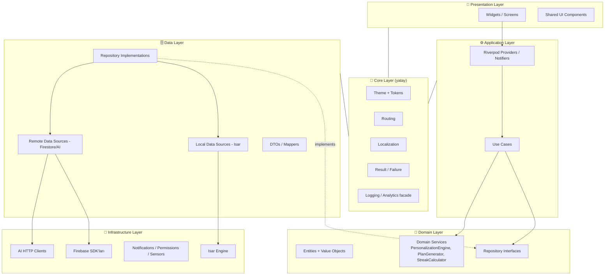
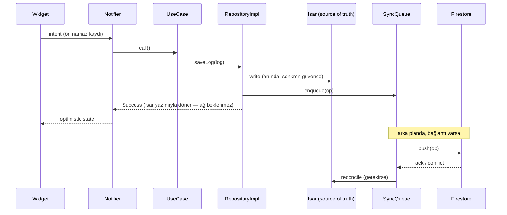
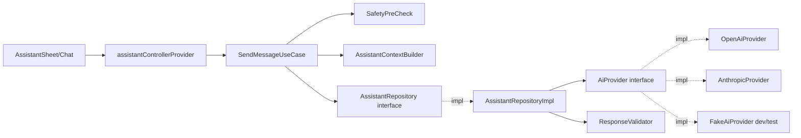

# Bismillah — Flutter Mimari Spesifikasyonu

| | |
|---|---|
| **Doküman** | 06_FLUTTER_ARCHITECTURE.md |
| **Versiyon** | 1.0 |
| **Tarih** | 2026-07-08 |
| **Durum** | Onaylı temel — tüm Flutter geliştirmesi bu teknik anayasaya uyar |
| **Bağlı dokümanlar** | [CLAUDE.md](../CLAUDE.md) · [01_PRODUCT_PRD.md](01_PRODUCT_PRD.md) · [02_BRAND_GUIDELINES.md](02_BRAND_GUIDELINES.md) · [03_DESIGN_SYSTEM.md](03_DESIGN_SYSTEM.md) · [04_ONBOARDING_FLOW.md](04_ONBOARDING_FLOW.md) · [05_INFORMATION_ARCHITECTURE.md](05_INFORMATION_ARCHITECTURE.md) |

---

## İçindekiler

1. [Flutter Mimarisi Genel Bakış](#1-flutter-mimarisi-genel-bakış)
2. [Mimari Hedefler](#2-mimari-hedefler)
3. [Mimari İlkeler](#3-mimari-i̇lkeler)
4. [Yüksek Seviye Mimari](#4-yüksek-seviye-mimari)
5. [Clean Architecture Modeli](#5-clean-architecture-modeli)
6. [Feature-First Klasör Yapısı](#6-feature-first-klasör-yapısı)
7. [Core Modül Mimarisi](#7-core-modül-mimarisi)
8. [App Modül Mimarisi](#8-app-modül-mimarisi)
9. [Design System Uygulama Stratejisi](#9-design-system-uygulama-stratejisi)
10. [Paylaşılan UI Bileşen Stratejisi](#10-paylaşılan-ui-bileşen-stratejisi)
11. [Riverpod ile State Management](#11-riverpod-ile-state-management)
12. [GoRouter ile Routing Mimarisi](#12-gorouter-ile-routing-mimarisi)
13. [Navigasyon State Korunması](#13-navigasyon-state-korunması)
14. [Offline-First Mimari](#14-offline-first-mimari)
15. [Isar ile Lokal Veritabanı Mimarisi](#15-isar-ile-lokal-veritabanı-mimarisi)
16. [Firebase Mimarisi](#16-firebase-mimarisi)
17. [Auth Mimarisi](#17-auth-mimarisi)
18. [Localization Mimarisi](#18-localization-mimarisi)
19. [Kutsal İçerik Rendering Mimarisi](#19-kutsal-i̇çerik-rendering-mimarisi)
20. [AI Provider Abstraction](#20-ai-provider-abstraction)
21. [Analytics Mimarisi](#21-analytics-mimarisi)
22. [Hata Yönetimi Mimarisi](#22-hata-yönetimi-mimarisi)
23. [İzin Mimarisi](#23-i̇zin-mimarisi)
24. [Bildirim Mimarisi](#24-bildirim-mimarisi)
25. [Namaz Vakti Mimarisi](#25-namaz-vakti-mimarisi)
26. [Feature Mimari Detayları](#26-feature-mimari-detayları)
27. [Veri Akışı Örnekleri](#27-veri-akışı-örnekleri)
28. [Test Stratejisi](#28-test-stratejisi)
29. [Kalite Kapıları (Quality Gates)](#29-kalite-kapıları-quality-gates)
30. [Performans Kuralları](#30-performans-kuralları)
31. [Güvenlik ve Gizlilik Kuralları](#31-güvenlik-ve-gizlilik-kuralları)
32. [Geliştirme İş Akışı](#32-geliştirme-i̇ş-akışı)
33. [Package Stratejisi](#33-package-stratejisi)
34. [Build Flavors ve Ortamlar](#34-build-flavors-ve-ortamlar)
35. [Dokümantasyon Kuralları](#35-dokümantasyon-kuralları)
36. [Migrasyon ve Gelecek Ölçeklenebilirlik](#36-migrasyon-ve-gelecek-ölçeklenebilirlik)
37. [Flutter Mimari QA Kontrol Listesi](#37-flutter-mimari-qa-kontrol-listesi)
38. [Kabul Kriterleri](#38-kabul-kriterleri)
39. [Nihai Flutter Mimari Yönü](#39-nihai-flutter-mimari-yönü)

---

## 1. Flutter Mimarisi Genel Bakış

Bu doküman, Bismillah'ın **teknik anayasasıdır**: ilk `flutter create` komutundan önce, kodun nasıl organize edileceğini, verinin nasıl akacağını ve kalitenin nasıl garanti edileceğini sabitler.

**Önceki dokümanların mimariye yön verme biçimi:**

| Kaynak doküman | Mimariye dayattığı gereksinim |
|---|---|
| **PRD** (§23, §27, §38) | Kişiselleştirme motoru ayrı domain katmanı; offline-first veri akışı; 18 MVP modülünün feature sınırları |
| **Marka Kılavuzu** (§8–11, §21) | Metin varyant sistemi (ton tercihi) mimari bir yetenek; merhamet dili state tasarımına işler (hata/boş durumlar) |
| **Tasarım Sistemi** (§4–9, §36–37) | Token'lar `ThemeExtension` olarak; sabit değer yasağı lint seviyesinde; bileşen kütüphanesi `shared/` altında feature-bağımsız |
| **Onboarding Flow** (§9, §14) | Lokal plan üretim motoru; anlık Isar yazımı; anonim-önce veri modeli |
| **Bilgi Mimarisi** (§6, §9, §13) | `StatefulShellRoute` ile 5 sekme; Assistant overlay katmanı; hiçbir route'un auth/ağ duvarına çarpmaması |

Çelişki hâlinde öncelik: CLAUDE.md → PRD → Marka → Tasarım Sistemi → Onboarding → IA → bu doküman. Bu dokümanla çelişen kod, "çalışıyor" olsa bile merge edilmez.

---

## 2. Mimari Hedefler

1. **Scalable** — 18 MVP modülünden V3'ün aile/çocuk/hac modüllerine, klasör yapısı ve katmanlar değişmeden büyüyebilmek.
2. **Maintainable** — bir feature'ı okuyan geliştirici, diğer feature'ların iç yapısını bilmeden çalışabilmeli (feature izolasyonu).
3. **Testable** — domain katmanı Flutter'sız test edilebilir; provider'lar mock repository'lerle test edilebilir; UI golden testlerle sabitlenir.
4. **Offline-first** — Isar tek doğruluk kaynağı (source of truth); Firestore senkron katmanı; hiçbir çekirdek akış ağ beklemez.
5. **Privacy-aware** — ibadet verisi rejimi (PRD §35) veri katmanında zorlanır: PII ve dini profil verisi analytics/log sınırlarını mimari olarak geçemez.
6. **Localization-ready** — TR/EN/AR ilk commit'ten itibaren; sabit string lint yasağı.
7. **RTL-ready** — `start/end` zorunluluğu; RTL golden testleri.
8. **Design-system-driven** — token dışı renk/boşluk/süre değeri derleme öncesi yakalanır.
9. **Feature-first** — kod ürün diliyle örtüşür: `features/prayer` klasörü PRD §27.4'ün karşılığıdır.
10. **Clean Architecture aligned** — bağımlılık yönü daima içeri (domain'e) doğru.
11. **AI-provider-agnostic** — OpenAI ↔ Anthropic geçişi tek modül değişikliğidir; UI ve domain etkilenmez.
12. **Firebase-ready** — Firebase entegrasyonları infrastructure katmanında izole; Firebase'siz test mümkün.
13. **Future premium-ready** — RevenueCat entitlement modeli MVP'de iskelet olarak kurulur (PRD §45.7).

---

## 3. Mimari İlkeler

Bağlayıcı mühendislik ilkeleri — ihlali code review'da red sebebidir:

1. **Readable code over clever code** (Constitution) — akıllıca görünen tek satır yerine okunabilir üç satır.
2. **Hardcoded renk yasak** — `Color(0xFF...)` yalnız `core/theme/` içinde yaşar; widget'lar `context` üzerinden token okur (custom lint kuralı).
3. **Hardcoded spacing yasak** — `EdgeInsets.all(13)` gibi değerler yasak; yalnız `AppSpacing` token'ları.
4. **Hardcoded string yasak** — kullanıcıya görünen her metin ARB'den gelir; lint: `avoid_hardcoded_strings` *(varsayım: custom_lint ile yazılacak kural seti)*.
5. **Widget içinde business logic yasak** — widget yalnızca state'i render eder ve intent (kullanıcı niyeti) iletir.
6. **UI'dan doğrudan Firebase çağrısı yasak** — `FirebaseFirestore.instance` yalnız data source sınıflarında görünebilir.
7. **UI'dan doğrudan Isar çağrısı yasak** — aynı kural; Isar yalnız local data source'larda.
8. **Veri erişiminin sahibi repository'dir** — provider'lar ve use case'ler data source'ları değil repository interface'lerini bilir.
9. **İş kurallarının sahibi use case'dir** — "seri nasıl hesaplanır", "plan nasıl küçülür" gibi kurallar tek yerde yaşar.
10. **Provider state açığa çıkarır, karar vermez** — provider ince bir orkestrasyon katmanıdır; ağır mantık domain'e iner.
11. **Widget state render eder** — `if (state is Loading)` dallanmasından fazlası widget'a ait değildir.
12. **Kutsal içerik katı rendering kurallarına tabidir** — `SacredContent` render pipeline'ı (§19) dışında ayet/hadis/dua metni ekrana çizilemez.
13. **AI metni Kur'an/Hadis/Dua ile görsel olarak karıştırılamaz** — `AiExplanationLabel` olmadan dini içerikli AI çıktısı render edilemez; bu kural bileşen API'sine gömülüdür (etiketsiz kullanım derlenmez).

---

## 4. Yüksek Seviye Mimari



| Katman | Sorumluluk | Buraya ait | Buraya ait DEĞİL | Örnek sınıflar | Bağımlılık yönü |
|---|---|---|---|---|---|
| **Presentation** | State'i çizmek, intent iletmek | Screens, widget'lar, animasyonlar | İş kuralı, veri erişimi, Firebase/Isar | `TodayScreen`, `PrayerCard`, `DhikrCounterScreen` | → Application |
| **Application** | Orkestrasyon: intent → use case → state | Provider'lar, Notifier'lar, use case'ler | UI kodu, SDK çağrıları | `TodayDashboardNotifier`, `LogPrayerUseCase` | → Domain |
| **Domain** | Ürünün saf iş bilgisi | Entity, value object, repo interface, domain service | Flutter importu, JSON, SDK | `PrayerLog`, `DailyPlan`, `PlanGenerator`, `PrayerRepository` (interface) | → hiçbir yere (merkez) |
| **Data** | Repository sözleşmelerini gerçeklemek | Repo impl, data source, DTO, mapper, sync queue | İş kuralı, UI | `PrayerRepositoryImpl`, `PrayerLocalDataSource`, `PrayerLogDto` | → Domain (interface'lere) + Infrastructure |
| **Infrastructure** | Dış dünya SDK'ları | Firebase/Isar/bildirim/sensör/AI istemci sarmalayıcıları | İş kuralı, ürün bilgisi | `FirebaseAuthService`, `IsarDatabase`, `LocalNotificationService` | → dışarıya (SDK'lar) |
| **Core** | Yatay altyapı: tema, routing, l10n, hata, log | Token'lar, router config, ARB altyapısı, `Result`, facade'ler | Feature'a özgü herhangi bir şey | `AppTheme`, `AppRouter`, `Result<T>`, `AnalyticsService` | Tüm katmanlar kullanır; core kimseyi bilmez |

---

## 5. Clean Architecture Modeli

Yapı taşları ve isimlendirme sözleşmesi:

| Yapı taşı | Sözleşme | Örnek (prayer feature) |
|---|---|---|
| **Entity** | Saf Dart, immutable, iş kimliği taşır | `PrayerLog`, `PrayerTime`, `DailyPlan`, `StreakState` |
| **Value Object** | Doğrulama içeren küçük tipler | `PrayerName` (enum+meta), `HijriDate`, `CityLocation` |
| **Repository Interface** | Domain'de tanımlı soyut sözleşme | `PrayerRepository`, `PlanRepository` |
| **Use Case** | Tek iş, tek `call()` | `LogPrayerUseCase`, `GetTodayPrayerTimesUseCase`, `RecoverStreakUseCase` |
| **DTO / Model** | Data katmanında; JSON/Isar eşlemesi | `PrayerLogDto`, `PrayerLogIsarModel` |
| **Data Source** | Tek kaynağa konuşur | `PrayerLocalDataSource` (Isar), `PrayerRemoteDataSource` (Firestore) |
| **Repository Impl** | Local+remote'u offline-first stratejiyle birleştirir | `PrayerRepositoryImpl` |
| **Provider / Notifier** | State açığa çıkarır | `prayerLogControllerProvider` (`AsyncNotifier`) |
| **Widget** | Render + intent | `PrayerHomeScreen`, `PrayerCompletionToggle` |

**Örnek akış — namaz kaydı (özet; detay §27):**

`PrayerCompletionToggle` (dokunuş) → `PrayerLogController.logPrayer(PrayerName.asr)` → `LogPrayerUseCase` (kural: mükerrer kayıt kontrolü, seri etkisi hesabı `StreakCalculator` ile) → `PrayerRepository.saveLog(log)` → `PrayerRepositoryImpl`: önce `PrayerLocalDataSource.write` (Isar, anında) + `SyncQueue.enqueue` → provider state güncellenir (optimistic) → widget yeni state'i çizer → `AnalyticsService.log(prayerLogged)`.

Kural: bu zincirin hiçbir halkası atlanamaz — widget'tan repository'ye, use case'den Isar'a doğrudan sıçrama yasaktır.

---

## 6. Feature-First Klasör Yapısı

```
lib/
├── app/                    # Uygulama kabuğu: bootstrap, tema kurulumu, router bağlama
├── core/                   # Yatay altyapı (§7) — feature bilmez
├── features/
│   ├── onboarding/
│   ├── today/
│   ├── prayer/             # vakitler + takip + kıble
│   ├── quran/
│   ├── dhikr/
│   ├── dua/
│   ├── learn/
│   ├── profile/            # profil + istatistik + başarılar
│   ├── assistant/
│   ├── auth/
│   ├── settings/
│   ├── plan/               # plan motoru + kişiselleştirme (Today'den ayrı: birden çok feature kullanır)
│   ├── gamification/       # XP/seviye/seri/rozet (kesişen habit motoru)
│   └── premium/            # Bismillah+ (v1.1 — launch günü satışta): entitlement, paywall, abonelik yönetimi
├── l10n/                   # ARB dosyaları: app_tr.arb, app_en.arb, app_ar.arb
└── shared/                 # Paylaşılan UI bileşen kütüphanesi (DS §10 aileleri)
```

*(Karar notu: IA'daki "zikir/dua Prayer sekmesi altında" bilgisi navigasyon gerçeğidir; kod organizasyonunda `dhikr` ve `dua` bağımsız feature'lardır — sekme yerleşimi router'ın işidir, klasörün değil. `plan` ve `gamification` feature'ları PRD §41'in "kişiselleştirme ayrı domain katmanı" gereğinin karşılığıdır.)*

| Klasör | Amaç | Ait olan | Ait OLMAYAN |
|---|---|---|---|
| `app/` | Kompozisyon kökü | `BismillahApp`, bootstrap, flavor config | İş mantığı, ekranlar |
| `core/` | Feature-bağımsız altyapı | §7 modülleri | Feature'a özgü kod, ekranlar |
| `features/<f>/` | Dikey ürün dilimi | O feature'ın 4 katmanı | Başka feature'dan import (yalnız domain sözleşmeleri üzerinden konuşulur) |
| `l10n/` | Çeviri kaynakları | ARB + üretilen sınıflar | Elle yazılmış metin sınıfları |
| `shared/` | Tasarım sistemi bileşenleri | `AppButton`, `SacredContentCard`… | Feature state'i bilen bileşen |

**Feature içi yapı (örnek `features/prayer/`):**

```
features/prayer/
├── domain/          # entities/, value_objects/, repositories/ (interface), services/
├── application/     # use_cases/, providers/ (Notifier'lar)
├── data/            # models/ (DTO+Isar), datasources/ (local/remote), repositories/ (impl)
└── presentation/    # screens/, widgets/ (yalnız bu feature'a özgü olanlar)
```

- `domain/` — saf Dart; `flutter/` importu lint ile yasak.
- `application/` — use case'ler + Riverpod provider'ları; UI importu yasak.
- `data/` — DTO/mapper/datasource/repo-impl; UI importu yasak.
- `presentation/` — ekranlar ve feature-özel widget'lar; `shared/` bileşenlerini kompoze eder.

**Feature'lar arası iletişim kuralı:** feature A, feature B'nin yalnız `domain/` sözleşmelerini (entity + repository interface) kullanabilir; B'nin data/presentation katmanına import lint ile yasaktır. Örnek: `today`, `plan`'ın `DailyPlan` entity'sini ve `PlanRepository` interface'ini bilir — `PlanRepositoryImpl`'i asla.

---

## 7. Core Modül Mimarisi

| Modül | Sorumluluk | Sınır |
|---|---|---|
| `core/theme/` | `AppTheme`, `ColorScheme`, `TextTheme`, `ThemeExtension` sınıfları | Token değerlerinin TEK yaşadığı yer; feature teması yok |
| `core/design_tokens/` | Ham token sabitleri (DS §36 tablosunun Dart karşılığı): `AppColors`, `AppSpacing`, `AppRadius`, `AppShadows`, `AppMotion`, `AppSizes` | Yalnız `core/theme` ve `shared/` bunları doğrudan okur; feature'lar `Theme.of(context)` üzerinden erişir |
| `core/routing/` | `AppRouter` (GoRouter config), route adları sabitleri, redirect mantığı, deep link çözümleme | Ekran içerikleri değil, yalnız harita (IA §6) |
| `core/localization/` | Locale provider, RTL yardımcıları, bidi utils, tarih/hicri formatlayıcılar | Metinlerin kendisi değil (onlar `l10n/`) |
| `core/errors/` | `AppException` hiyerarşisi, `Failure` tipleri, kullanıcı-mesajı eşleyici | Feature'a özgü hata metni değil (ARB'de) |
| `core/result/` | `Result<T>` (sealed: `Success<T>` / `FailureResult`) | — |
| `core/logging/` | `AppLogger` facade; debug/release davranış ayrımı; hassas veri filtresi | Doğrudan `print` tüm projede yasak |
| `core/analytics/` | `AnalyticsService` interface + event sözlüğü sabitleri (PRD §40 taksonomisi) | Firebase implementasyonu `infrastructure` tarafında (data source olarak) |
| `core/permissions/` | `PermissionService` soyutlaması + izin durum modeli | Eğitim ekranları feature'larda; sistem çağrısı burada |
| `core/network/` | Bağlantı durumu izleyici (`connectivityProvider`), API istemci tabanı | İş mantığı yok |
| `core/sync/` | `SyncQueue` altyapısı, senkron durum modeli, çakışma çözüm stratejisi arayüzü | Feature-özel merge kuralları feature data katmanında |
| `core/storage/` | Isar açılışı, şema kaydı, migration çatısı; secure storage sarmalayıcı | Koleksiyon tanımları feature data katmanlarında |
| `core/constants/` | Uygulama geneli sabitler (ör. `maxTodayCards = 4`) | Sihirli sayıların çöplüğü değil — her sabit dokümana referans verir |
| `core/utils/` | Saf yardımcılar (debounce, clock soyutlaması `AppClock` — test edilebilir zaman) | "Utils çöplüğü" yasak; üç kullanımdan az yardımcı feature'ında kalır |

---

## 8. App Modül Mimarisi

`app/` uygulamanın kompozisyon köküdür — sıralı bootstrap sorumlulukları:

1. **Bootstrap** (`bootstrap.dart`): flavor config yükle → `WidgetsFlutterBinding` → Isar aç (şemalar + migration) → Firebase initialize (başarısızsa offline modda devam — IA §7 Firebase-unavailable kuralı) → Crashlytics bağla (release'te) → anonim auth garanti et (yoksa sessiz oluştur) → bildirim servisini hazırla (izin İSTEMEDEN) → sync engine'i başlat.
2. **ProviderScope**: kök `ProviderScope` + flavor'a göre override'lar (ör. dev'de fake AI provider).
3. **Theme setup**: `AppTheme.light` (+ V2'de `.dark`) `MaterialApp.router`'a bağlanır.
4. **Localization setup**: `localizationsDelegates`, `supportedLocales: [tr, en, ar]`, `localeProvider` dinlemesi.
5. **Router setup**: `AppRouter` tekil örneği; auth/onboarding redirect'leri provider'lardan beslenir.
6. **Global lifecycle**: `AppLifecycleListener` — foreground'a dönüşte vakit yeniden hesaplama + sync tetikleme; arka plana geçişte bekleyen yazımların flush'ı.
7. **Error boundary**: `FlutterError.onError` + `PlatformDispatcher.onError` → Crashlytics (hassas veri filtresinden geçerek, §31); kullanıcıya ham hata asla gösterilmez.
8. **Offline sync startup**: açılışta bekleyen kuyruk sessizce işlenir; UI bloklanmaz.

**Performans sözleşmesi:** bootstrap'ta ağ BEKLENMEZ (Firebase init dahi timeout'ludur); soğuk açılış <2sn hedefi ilk frame'in cache verisiyle çizilmesine dayanır.

---

## 9. Design System Uygulama Stratejisi

DS §36 token tablosunun Flutter eşlemesi:

| DS kavramı | Flutter karşılığı | Not |
|---|---|---|
| `color.*` (15 token) | `AppColors` (ham) → `ColorScheme` + `AppColorsExtension extends ThemeExtension` | Material `ColorScheme` alanlarına eşlenemeyenler (`primarySoft`, `accentGold`, `textTertiary`…) extension'da |
| `type.*` (15 token) | `AppTypography` → `TextTheme` (DS §5'teki eşleme) + `AppTextExtension` (`quran`, `dua`, `stat` gibi Material-dışı stiller) | Kur'an/dua stilleri `TextTheme`'e sığmaz — extension zorunlu |
| `space.*` | `AppSpacing` (statik sabitler: `AppSpacing.s4 = 16` …) | `ThemeExtension` gerekmez (temalar arası değişmez) |
| `radius.*` | `AppRadius` | — |
| `shadow.*` | `AppShadows` (`List<BoxShadow>` setleri) | Koyu temada yüzey tonuyla değişir → `ThemeExtension` |
| `motion.*` | `AppMotion` (`Duration` + `Curve` çiftleri) | Reduced-motion çözümü tek yardımcıda: `AppMotion.of(context)` sıfır süre döner |
| `size.*` | `AppSizes` | Dokunma hedefi sabitleri dahil |

**Bağlayıcı kurallar (lint + review):** widget içinde hex yasak; rastgele padding yasak; token dışı font size yasak; **altın buton diye bir widget yoktur** (`AppButton` API'sinde altın varyant tanımlı değildir — yanlış kullanım derlenemez); ibadet kaçırma durumları `error` rengine BAĞLANAMAZ (`PrayerStatus → renk` eşlemesi tek yerde, `shared/` içinde yaşar ve nötr token döner); Kur'an metni yalnız `QuranTextBlock` bileşeniyle, `type.quran` token'ıyla render edilir.

**Koyu tema hazırlığı (DS §35):** tüm renk erişimi `ColorScheme`/extension üzerinden olduğu için V2'de koyu tema = ikinci `AppTheme.dark` tanımı; widget değişikliği sıfır hedeflenir.

---

## 10. Paylaşılan UI Bileşen Stratejisi

Tüm bileşenler `shared/` altında, DS'nin 5-bölümlü şablonuna (amaç/anatomi/durumlar/erişilebilirlik/yap-yapma) uygun ve DS §38'in 10 kabul kriterine tabidir.

| Bileşen | Amaç | Zorunlu durumlar | Erişilebilirlik | DS dayanağı |
|---|---|---|---|---|
| `AppButton` | Primary/Secondary/Ghost/Text/Icon/Destructive varyantları tek API'de | default, pressed, disabled, loading | 48dp hedef; loading'de semantik "yükleniyor" | DS §11 |
| `AppCard` | Standart kart kabuğu (`radius.lg` + `shadow.card`) | default, pressed, completed | Tüm yüzey dokunulabilirse tek semantik düğüm | DS §12 |
| `AppScaffold` | Ekran şablonu: safe area, zemin, FAB yuvası, alt nav boşluğu | — | Route duyurusu entegre | DS §9 |
| `AppBottomNav` | 5 sekme | aktif/pasif | Tab semantiği, "5'te 2" konumu | DS §13, IA §22 |
| `AppModalSheet` | Bottom sheet kabuğu (`radius.xl`, tutamaç) | açık, sürükleme | Odak tuzağı; kapatma erişilebilir | DS §13, IA §10 |
| `AppTextField` | Girişler | default, focus, error, disabled | Kalıcı etiket; hata liveRegion | DS §24 |
| `AppSegmentedControl` | 2–4 seçenek | seçili/pasif | Radio group semantiği | DS §24 |
| `AppProgressRing` | Günlük halka + kart içi mini halka | 0–%100, dolum animasyonu | Değer metinle duyurulur | DS §14 |
| `SacredContentCard` | İçerik sınıfına göre doğru imzayla render eden ÜST bileşen (§19) | sınıf başına imza | `lang` etiketi; kaynak okunur | DS §34 |
| `QuranTextBlock` | Ayet metni (Uthmanic Hafs, temiz zemin) | — | `lang=ar`; bağımsız yazı ölçeği | DS §16/§34 |
| `HadithCard` | Hadis + zorunlu kaynak-derece satırı | kaynaksız render DERLENMEZ (required param) | Derece okunur | DS §34 |
| `DuaBlock` | Arapça→transliterasyon→çeviri→kaynak sabit sırası | transliterasyon aç/kapat | Blok sırası okuyucuda korunur | DS §18 |
| `AiExplanationLabel` | Kalıcı "AI açıklaması" çipi | — | Okuyucu her AI balonunda duyurur | DS §22/§34 |
| `EmptyStateCard` | Davet dilli boş durum | — | İllüstrasyon dekoratif işaretli | DS §26 |
| `ErrorStateCard` | İnsani hata + kurtarma eylemi | retry-loading | Hata liveRegion | DS §27 |
| `LoadingSkeleton` | İskelet parlaması | — | Okuyucuya "yükleniyor" tek duyuru | DS §28 |
| `AssistantFab` | Filiz FAB; kaydırmada saydamlaşma; kutsal yüzeylerde gizlenme | görünür/saydam/gizli | 56dp; etiket "Bismillah Asistanı" | DS §13, IA §9 |

**Kural:** feature ekranları bu aileleri **kompoze eder**; kopyalayıp değiştiremez. Yeni ihtiyaç → önce `shared/` bileşenine parametre/varyant eklenir (DS güncellemesiyle birlikte, §35).

---

## 11. Riverpod ile State Management

**Provider tipi seçim tablosu:**

| İhtiyaç | Tip |
|---|---|
| Kullanıcı eylemiyle değişen async state (kayıt, plan) | `AsyncNotifierProvider` |
| Senkron UI state (seçili sekme, ton tercihi) | `NotifierProvider` |
| Tek seferlik async okuma (içerik yükleme) | `FutureProvider` |
| Sürekli akış (bağlantı durumu, auth state, Isar watch) | `StreamProvider` |
| Parametreli erişim (`duaId` ile dua) | `.family` |
| Bağımlılık enjeksiyonu (repository, service) | Sade `Provider` (DI görevi) |

**Ana provider haritası (isim → tip → sorumluluk):**

| Provider | Tip | Sorumluluk |
|---|---|---|
| `onboardingControllerProvider` | `AsyncNotifier` | Soru akışı state'i; her cevabı anında Isar'a yazar; devam/geri mantığı |
| `todayDashboardProvider` | `AsyncNotifier` | Günün kart kompozisyonu (plan + profil + vakit girdileriyle); pull-to-refresh |
| `prayerTimesProvider` | `FutureProvider.family(date)` | Verilen günün vakitleri (lokal hesap, §25) |
| `prayerLogControllerProvider` | `AsyncNotifier` | Kayıt/geri alma; optimistic update; seri etkisini tetikler |
| `quranProgressProvider` | `AsyncNotifier` | Hedef, yer imi, haftalık tutarlılık |
| `dhikrSessionControllerProvider` | `NotifierProvider.family(setId)` | Sayaç state'i (senkron — tek frame tepki için async katman yok; kalıcılaştırma arka planda) |
| `assistantControllerProvider` | `AsyncNotifier` | Sohbet state'i, mesaj gönderimi, guardrail sonuçları |
| `authStateProvider` | `StreamProvider` | Firebase auth durumu (anonim/kayıtlı) |
| `localeProvider` | `Notifier` | Aktif dil; değişim anında `MaterialApp` yeniden kurulur |
| `themeProvider` | `Notifier` | Tema modu (MVP: light; V2: dark) |
| `connectivityProvider` | `StreamProvider` | Çevrimiçi/çevrimdışı |
| `personalizationProfileProvider` | `NotifierProvider` | Aktif profil türü; davranış verisiyle güncellenir |
| `streakProvider` | `AsyncNotifier` | Seri durumu + onarım hakkı |
| `premiumStateProvider` *(v1.1)* | `StreamProvider` | Aktif entitlement durumu (`isPlus`); RevenueCat dinleyicisi + lokal cache; keepAlive |
| `purchaseControllerProvider` *(v1.1)* | `AsyncNotifier` | Satın alma/deneme/restore akış state'i; hata eşleme (ödeme hataları insani dille) |

**Kurallar:**

- **DI provider'la yapılır:** repository/service örnekleri `Provider` ile tanımlanır; testte `ProviderScope(overrides:)` ile mock'lanır. Ayrı DI kütüphanesi (get_it vb.) KULLANILMAZ — tek DI mekanizması Riverpod.
- **Global mutable state yasak:** tüm paylaşılan durum provider graph'ında; singleton/static state lint ile engellenir.
- **AutoDispose varsayılandır** — İSTİSNALAR: sekme kökü provider'ları (`todayDashboardProvider` vb.) ve oturum boyu yaşayanlar (`authStateProvider`, `localeProvider`) `keepAlive`. Gerekçe: sekmeler arası state korunması (IA §13).
- **`select` zorunluluğu:** geniş state nesnelerini dinleyen widget'lar yalnız ihtiyaç duydukları alanı `select` ile dinler (Today kart listesi granüler rebuild).
- **Test:** her Notifier, repository mock'larıyla birim test edilir; provider graph'ı `ProviderContainer` ile testte kurulur.

---

## 12. GoRouter ile Routing Mimarisi

IA §6 route tablosu birebir uygulanır; teknik strateji:

- **Root yapı:** `GoRouter` tek örnek (`core/routing/`); route adları string sabitleri olarak `AppRoutes` sınıfında (typo'ya kapalı).
- **Onboarding:** shell DIŞI route ağacı (`/onboarding/...`); tamamlanınca `context.go('/today')` — yığın temizlenir (IA §8).
- **StatefulShellRoute.indexedStack:** 5 branch (Today/Prayer/Quran/Learn/Profile); her branch kendi `navigatorKey`'iyle bağımsız yığın tutar.
- **Nested navigation:** sekme içi push'lar branch navigator'ında; `/settings` ağacı Profile branch'ine bağlı ama kök `/settings` path'iyle de çözülür (deep link için).
- **Modal routes:** full-screen modal'lar (`dhikr_counter`, kutlamalar) `parentNavigatorKey: rootNavigatorKey` ile kök navigator'da açılır (alt nav otomatik gizlenir).
- **Bottom sheet routes:** sheet'ler de route'tur (`/prayer/log`, `/auth`, `/assistant`) — deep link edilebilirlik için; sunum `showModalBottomSheet` köprüsüyle *(varsayım: custom `SheetPage` Page sınıfı ile — implementasyonda netleşir)*.
- **Deep link handling:** `bismillah://` şeması + (V1.x) App/Universal Links; link çözümleyici IA §12 tablosuna göre hedef + fallback üretir; onboarding yarımsa hedef `pendingDeepLinkProvider`'da bekletilir.
- **Unknown route fallback:** `errorBuilder` → `/today` yönlendirmesi + `route_error` eventi (kullanıcı hata ekranı görmez).
- **Redirect mantığı:** tek merkezi `redirect`: (1) onboarding tamamlanmamış + hedef shell içi → `/onboarding`; (2) başka redirect YOK — auth redirect'i yoktur çünkü auth-duvarlı route yoktur (IA §14).
- **Auth-after-value:** auth sheet'i redirect ile değil, Today'in ilk gösteriminden sonra kontrollü `push('/auth')` ile açılır.
- **Offline davranışı:** router bağlantı durumuna BAKMAZ; route'lar her zaman açılır (IA §13).
- **RTL geçişleri:** yön animasyonları `Directionality`'den türer; özel yön kodu yazılmaz.
- **Premium route'ları (v1.1):** `/premium` kök navigator'da full-screen modal (paywall); `/settings/subscription` Settings ağacında push — IA §6 tablosuyla birebir; `/premium` yalnız doğal dönüşüm anlarından kontrollü `push` ile açılır, hiçbir redirect paywall'a yönlendiremez (IA §10 yerleşim kuralları).

---

## 13. Navigasyon State Korunması

- **Her sekmenin kendi yığını:** `StatefulShellRoute.indexedStack` — sekme değişiminde yığınlar canlı kalır (Quran'da açık dua detayı, Prayer'a gidip dönünce aynen durur).
- **Sekmeye yeniden dokunuş köke döndürür:** `onTap` aynı index'e gelirse branch `goBranch(initialLocation: true)`.
- **Deep link doğru yığını kurar:** `/prayer/duas/:id` linki Prayer branch'ini aktive eder + yığını `prayer_home → dua_library → dua_detail` olarak kurar (geri tuşu mantıklı çalışır).
- **Onboarding yığını temizlenir:** tamamlanınca `go` (push değil); geri tuşu onboarding'e dönemez.
- **Modal kuralları:** full-screen modal içinden sekme değiştirilemez (kök navigator üstünde); sheet üstünde sheet açılmaz — istisna: sheet → tam ekrana genişleme (assistant).
- **Assistant sheet davranışı:** `/assistant` kök overlay; kapanınca altındaki route ve scroll konumu aynen korunur; sheet açıkken sekme değişimi sheet'i kapatır.
- **Kutsal yüzey gizlemeleri:** `AppScaffold`, route metadata'sından (`hidesChrome: true` — sayaç, Kur'an metin yüzeyi, kutlamalar) alt nav + FAB gizler; ekranlar bunu kendi başına yönetmez (tek merkezi kural, IA §16).

---

## 14. Offline-First Mimari



**Sözleşmeler:**

- **Local-first write:** her yazma önce Isar'a; başarı Isar yazımıyla tanımlanır. Firestore'a yazamama bir "hata" değil, bekleyen senkron durumudur.
- **Isar = source of truth:** UI daima Isar'dan (watch stream'leriyle) beslenir; Firestore'dan gelen veri önce Isar'a yazılır, UI oradan görür (tek yön: UI ← Isar ← sync).
- **Cached content:** günlük ayet/hadis 30 günlük paket hâlinde önden indirilir; dua/zikir setleri uygulama paketinde (asset) + remote güncelleme katmanı.
- **Offline onboarding + plan üretimi:** tamamen lokal (Onboarding §9); şehir listesi asset.
- **Offline vakitler:** hesaplama lokal kütüphaneyle (§25); bildirimler lokal zamanlanır.
- **AI offline fallback:** `assistantControllerProvider` bağlantı yoksa `AssistantUnavailable` state'i döner; UI zarif düşüş sheet'i gösterir (IA §9).
- **Sync queue:** Isar koleksiyonu olarak kalıcı kuyruk (`SyncOperation`: opType, payload ref, timestamp, retryCount); açılışta + bağlantı dönüşünde + periyodik işlenir; üstel geri çekilme (exponential backoff).
- **Çakışma çözümü:** varsayılan **last-write-wins (alan bazlı)**; İSTİSNA — ibadet kayıtları için domain kuralı: **"kayıt kaybolmaz"** — iki cihaz aynı vakti farklı işaretlediyse "kılındı" durumu kazanır; silme yalnız açık kullanıcı eylemiyle ve tombstone kaydıyla senkronlanır.
- **Sync status UI:** Ayarlar'da sessiz satır + ana akışta ince bilgi şeridi (DS §28); senkron hiçbir akışı bloklamaz.
- **Offline entitlement (v1.1):** entitlement durumu lokalde cache'lenir (Isar/RevenueCat cache); offline kullanıcı premium durumunu **son bilinen entitlement** üzerinden görür ve premium özellikleri kullanmaya devam eder; satın alma ve restore İŞLEMLERİ online gerektirir (dürüst "bağlantı gerekli" mesajıyla).

---

## 15. Isar ile Lokal Veritabanı Mimarisi

Koleksiyonlar (her feature kendi modelini `data/models/` altında tanımlar; şema kaydı `core/storage`'da toplanır):

| Koleksiyon | Amaç | Offline | Senkron? | Gizlilik |
|---|---|---|---|---|
| `UserProfileModel` | İsim, dil, konum (şehir), ton, onboarding cevapları | ✅ | ✅ Firestore'a | **Yüksek** (dini profil — Onboarding §14 rejimi) |
| `PersonalizationProfileModel` | Türetilmiş profil türü + davranış sinyalleri | ✅ | ✅ | **Yüksek** |
| `DailyPlanModel` | Günün planı + 30 günlük çatı | ✅ (lokal üretilir) | ✅ | **Yüksek** |
| `PrayerLogModel` | Vakit kayıtları (durum, zaman) | ✅ | ✅ | **Yüksek** |
| `QuranProgressModel` | Hedef, oturum kayıtları, yer imi | ✅ | ✅ | **Yüksek** |
| `DhikrSessionModel` | Set tamamlamaları, sayımlar | ✅ | ✅ | **Yüksek** |
| `DuaFavoriteModel` | Favori dua referansları | ✅ | ✅ | Orta |
| `AchievementModel` | Kazanılan rozetler + tarihçe | ✅ | ✅ | Orta |
| `StreakModel` | Seri durumu, onarım hakkı | ✅ | ✅ | Orta |
| `SettingsModel` | Bildirim/hesaplama/görünüm tercihleri | ✅ | ✅ (cihaz-bağımsız olanlar) | Düşük |
| `CachedContentModel` | Günlük ayet/hadis/ders içerik cache'i | ✅ | ⬇️ yalnız indirme | Düşük (içerik geneldir) |
| `SyncOperationModel` | Bekleyen senkron kuyruğu | ✅ | — (kuyruğun kendisi) | Payload'a bağlı — şifreli alan *(varsayım: platform keystore destekli)* |
| `AssistantMessageModel` | Sohbet geçmişi (yalnız kullanıcının kendi erişimi için) | ✅ | ✅ (kullanıcı geçmişi) | **Yüksek** — bağımsız silinebilir (PRD §35) |

**Kurallar:** Isar erişimi yalnız local data source sınıflarından; migration'lar sürümlü ve testli; "Yüksek" gizlilikli koleksiyonlar log'a ve analytics'e ASLA ham yazılmaz; hesap silme tüm koleksiyonları atomik temizler.

---

## 16. Firebase Mimarisi

Yüksek seviye roller (şema TASK 007/008'in konusudur — burada yazılmaz):

| Servis | Rol | Mimari konum |
|---|---|---|
| **Firebase Auth** | Anonim oturum + Apple/Google/E-posta; account linking | `infrastructure` → `AuthRemoteDataSource` |
| **Firestore** | Kullanıcı verisi senkron katmanı (Isar'ın buluttaki gölgesi) + remote içerik dağıtımı | `*RemoteDataSource` sınıfları; UI asla doğrudan görmez |
| **Firebase Storage** | Gelecek medya/içerik (ses, görsel) — MVP'de pasif | V2 |
| **Firebase Analytics** | Event taksonomisi (PRD §40) | `AnalyticsService` implementasyonu |
| **Crashlytics** | Crash + non-fatal raporlama (hassas veri filtresiyle, §31) | `app/` error boundary + `AppLogger` köprüsü |
| **FCM** | Yalnız remote içerik/yeniden-etkileşim bildirimleri (nadir); vakit bildirimleri LOKAL (PRD §32) | `NotificationService` |
| **Remote Config** | Gelecek: içerik bayrakları, kademeli özellik açılışı *(V1.x varsayımı)* | `core` feature-flag soyutlaması arkasında |
| **Security Rules** | Kullanıcı-bazlı veri izolasyonu — detay Firebase mimari dokümanında (TASK 007/008) | — |

**İlke:** Firebase'in tamamı değiştirilebilir bir "uzak uç"tur — repository interface'leri Firebase bilmez; Firebase kesintisinde uygulama tam çalışır (IA §7).

---

## 17. Auth Mimarisi

- **Anonim oturum:** bootstrap'ta garanti edilir (`signInAnonymously`); kullanıcı kimliği (uid) ilk andan itibaren stabildir — tüm Isar/Firestore verisi bu uid'e bağlanır.
- **Sign-in-after-value:** auth daveti UI kararıdır (IA §8); mimaride auth'un tek işlevi kimlik yükseltmedir.
- **Account linking:** `linkWithCredential` — anonim uid KORUNUR, veri taşıma gerekmez (en güvenli migrasyon: migrasyonsuzluk). E-posta/Apple/Google sağlayıcıları desteklenir.
- **Mevcut hesap çakışması:** `credential-already-in-use` yakalanır → kullanıcıya iki profil özeti + seçim sunulur (IA §14); seçime göre ya mevcut hesaba geçilir (lokal veri merge kurallarıyla taşınır) ya bağlama iptal edilir. Sessiz üzerine yazma yasak.
- **Sign out:** oturum kapatılır → YENİ anonim oturum açılır → lokal veri cihazda kalır (kullanıcıya bildirilir); "çıkış = sıfırlama" değildir.
- **Delete account:** online zorunlu; sıra: Firestore verisi → Auth kaydı → lokal koleksiyonlar; atomik değilse geri alınabilir aşamalandırma + tamamlanma teyidi; akış IA §11-14.
- **`authStateProvider`:** `StreamProvider` — `AuthState { anonymous(uid) | linked(uid, providers) }`; router bu provider'ı REDIRECT için kullanmaz (auth duvarı yok), yalnız UI durum gösterimi için.
- **Veri güvenliği:** linking sırasında hiçbir koleksiyon silinmez; çakışma çözümü tamamlanana dek yıkıcı işlem yapılmaz.

---

## 18. Localization Mimarisi

- **Altyapı:** Flutter `gen-l10n`; `l10n/app_tr.arb` (şablon), `app_en.arb`, `app_ar.arb`; ICU plural/select tam kullanım.
- **Sabit string yasağı:** kullanıcıya görünen metin yalnız `context.l10n.<key>`; lint kuralı + PR taraması.
- **Ton varyantları:** ton tercihi (gentle/motivating/minimal) metin anahtarı seviyesinde çözülür — varyantlı anahtar sözleşmesi: `todayGreeting_gentle`, `todayGreeting_motivating`… seçim `toneResolver` yardımıyla *(varsayım: ARB select yapısıyla da kurulabilir; implementasyonda netleşir)*.
- **Locale provider:** `localeProvider` — ilk değer: onboarding seçimi > cihaz dili (destekleniyorsa) > `en`; runtime değişim ANINDA (restart yok), açık sheet'ler kapatılır (IA §11-11).
- **RTL:** `Directionality` otomatik; tüm yerleşim `start/end` (lint: `avoid_left_right_edge_insets` *varsayım: custom kural*); RTL golden testleri zorunlu.
- **Bidi:** Latin marka adı/rakamlar Arapça metinde `Unicode isolate` işaretleriyle; yardımcılar `core/localization/bidi_utils`.
- **Arapça font geçişi:** `TextTheme` locale'e göre kurulur (Latin ↔ IBM Plex Sans Arabic); Kur'an/dua fontları locale'den BAĞIMSIZ sabit (DS §33).
- **Namaz adları:** DS §33 sözlüğü ARB'de tek kaynaklı.
- **Tarih/saat:** `intl` ile yerel biçim; hicri tarih için ayrı `HijriDate` value object + formatlayıcı (yöntem farkı ayarı destekli); Doğu Arap rakamları V1.x kullanıcı tercihi.
- **Test:** üç dilde golden testler; Türkçe İ dönüşüm testi (release blocker); metin taşma testleri %35 genişleme senaryosuyla.

---

## 19. Kutsal İçerik Rendering Mimarisi

Amacı: DS §34'ün "edep şemadadır" ilkesini **tip sistemiyle** zorlamak — yanlış render'ın derlenememesi.

**Domain modeli:**

- `ContentType` enum: `quran | hadith | dua | dhikr | scholarlyOpinion | aiExplanation | reflection`
- `SacredContent` (sealed hiyerarşi): `QuranVerse(surah, ayahRange, arabicText, translation, translationSource)` · `HadithText(collection, number, grading, text)` · `DuaText(arabic, transliteration, translation, source)` · `DhikrText(...)` · `ScholarlyNote(attribution, text)` — her alt tip kaynak metadata'sını **zorunlu constructor parametresi** olarak taşır.
- `AiExplanation(text)` — SacredContent hiyerarşisinin DIŞINDA ayrı tiptir; ikisini karıştıran kod yazılamaz.

**Rendering pipeline kuralları:**

1. **Sınıf başına bileşen:** `QuranTextBlock`, `HadithCard`, `DuaBlock`, `ScholarlyNoteCard`, `AiExplanationBubble` — her biri yalnız kendi tipini kabul eder (`QuranTextBlock(verse: QuranVerse)`).
2. **No source, no render:** kaynak alanları null olamaz (tip zorunluluğu); CMS/remote veri eksik gelirse mapper `ContentValidationError` üretir ve içerik render edilmez (ErrorStateCard değil — içerik sessizce listeden düşer + non-fatal rapor).
3. **AI, Kur'an/Hadis olarak render EDİLEMEZ:** `AiExplanation` tipi kutsal bileşenlerin parametresine uymaz; asistan çıktısındaki alıntılar yalnız doğrulanmış içerik kütüphanesinden `SacredContent` referansı olarak gelir ve bağımsız kaynak kartına çıkar (DS §22).
4. **Kırpma güvenliği:** `QuranTextBlock` `maxLines/ellipsis` parametresi SUNMAZ; önizleme gereken yerde anlam bütünlüğü korunmuş `previewText` alanı içerik verisinden gelir (editoryal karar, algoritmik kırpma değil).
5. **Dekor yasağı:** `QuranTextBlock` kendi temiz zeminini kendisi çizer — üst widget'ın arka plan deseni bileşenin altına giremez.
6. **Paylaşım:** `SacredContentShareBuilder` tek paylaşım üreticisi — çıktı daima tam metin + kaynak + edepli şablon (IA §16); bileşenler kendi paylaşımını üretemez.
7. **Doğrulama testi:** her içerik tipi için "kaynaksız veri render denemesi derlenmez/reddedilir" birim + widget testleri (§28).

---

## 20. AI Provider Abstraction



| Yapı | Sorumluluk |
|---|---|
| `AiProvider` (interface) | Tek sözleşme: `streamCompletion(request) → Stream<AiChunk>`; sağlayıcı-nötr istek/yanıt modelleri (`AiRequest`, `AiChunk`) |
| `OpenAiProvider` / `AnthropicProvider` | Sağlayıcı implementasyonları; **anahtarlar cihazda DEĞİL** — istekler server-side proxy'ye gider (Cloud Functions, §31; PRD §36) |
| `FakeAiProvider` | Dev/test: deterministik yanıtlar; UI geliştirmesi ağsız yürür |
| `AssistantRepository` | Sohbet geçmişi (Isar) + mesaj gönderim orkestrasyonu |
| `SendMessageUseCase` | Akış: SafetyPreCheck → ContextBuilder → provider → ResponseValidator → kalıcılaştırma |
| `SafetyPreCheck` | İstek öncesi sınıflandırma: fetva-türü/hassas konu tespiti → yönlendirme yanıtını LOKAL üretir (bu sorular modele hiç gitmeyebilir — maliyet + güvenlik) *(varsayım: kural tabanlı başlar, sunucu tarafında zenginleşir)* |
| `AssistantContextBuilder` | Sistem talimatı + kullanıcı bağlamı enjeksiyonu: profil türü, plan durumu, son aktivite ÖZETİ (ham ibadet logları gönderilmez — minimum gerekli bağlam) |
| `SystemPromptRepository` | Sistem talimatı sürümlü ve remote-güncellenebilir (Remote Config/Firestore) — kural değişikliği app release'i beklemez |
| `ResponseValidator` | Yanıt sonrası denetim: etiketleme zorunluluğu, kütüphane-dışı hadis alıntısı tespiti, yasaklı kalıplar; ihlalde yanıt düşürülür + güvenli yönlendirme metni gösterilir + non-fatal rapor |
| `ScholarReferralPolicy` | Reddediş kalıbının (anlayış→sınır→yapabileceği→yönlendirme) yapılandırılmış üreticisi |

**Ek kurallar:** offline'da `AssistantUnavailable` (UI zarif düşüş); loglara kullanıcı mesajı içeriği YAZILMAZ (yalnız topic_class + uzunluk); red-team test paketi release gate'idir (PRD §27.11) ve `FakeAiProvider` altyapısıyla CI'da koşulur; sağlayıcı seçimi flavor/remote config ile yapılır — kod değişikliği gerektirmez.

---

## 21. Analytics Mimarisi

- **`AnalyticsService`** (interface, `core/analytics`): `logEvent(AppEvent)` — event'ler serbest string değil, **tipli sözlük** (`AppEvent.prayerLogged(source: ...)` gibi factory'ler); PRD §40 + Onboarding §13 + IA §20 taksonomisi bu sözlüğün tek kaynağıdır.
- **`FirebaseAnalyticsService`**: tek gerçek implementasyon; dev flavor'da `DebugAnalyticsService` (konsola yazar, Firebase'e göndermez).
- **İsimlendirme:** snake_case, `<alan>_<eylem>` düzeni (`prayer_logged`, `onboarding_completed`); parametreler kova değerleri.
- **Screen tracking:** router observer'ı `screen_viewed` üretir (IA §20); manuel ekran eventi yazılmaz.
- **Gizlilik duvarı (mimari zorlama):** `AppEvent` parametre tipleri `String serbest metin` KABUL ETMEZ — yalnız enum/kova/sayı; PII (isim, şehir, e-posta) ve ham ibadet verisi tip sisteminden geçemez. İstisna denetimi: event sözlüğüne yeni alan eklemek code review'da gizlilik onayı gerektirir.
- **Dini pratik verisi:** yalnız aggregate/kova (PRD §35); `prayer_logged{which_prayer, status}` gönderilir, kullanıcının günlük deseni profillenmez.
- **Abonelik eventleri (v1.1):** `premium_paywall_viewed{source}`, `premium_trial_started`, `premium_purchase_completed{plan}`, `premium_purchase_failed{reason_class}`, `premium_restore_started`, `premium_restore_completed`, `premium_subscription_cancel_intent` — hepsi tipli sözlükte, PII'siz; gelir doğrulama eventleri ayrıca sunucudan (RevenueCat webhook → 07 §16 `entitlementSync`), istemci çifte sayım yapmaz.
- **Debug logging:** `AppLogger` dev'de ayrıntılı, release'te yalnız warning+ ve hassas-veri filtreli.

---

## 22. Hata Yönetimi Mimarisi

- **`Result<T>`** (sealed): domain/data sınırında istisna yerine `Success<T> | FailureResult(Failure)`; use case'ler `Result` döner.
- **`Failure` hiyerarşisi** (`core/errors`): `NetworkFailure`, `SyncFailure`, `PermissionFailure`, `AuthFailure`, `AiFailure(unavailable | guardrailViolation | rateLimited)`, `ContentValidationFailure`, `PaymentFailure` (V2), `UnexpectedFailure`.
- **Katman kuralları:** Infrastructure istisnaları data katmanında yakalanır ve `Failure`'a eşlenir; domain istisna fırlatmaz; presentation yalnız `Failure` görür.
- **Kullanıcıya eşleme:** `FailureMessageMapper` → ARB anahtarları (DS §27 insani metinleri); **ham exception/stack trace kullanıcıya asla gösterilmez**; her hata mesajı "verin güvende" teyidi + kurtarma eylemi taşır.
- **Crashlytics:** yakalanmamış hatalar fatal; yakalanan ama beklenmedik `UnexpectedFailure`'lar non-fatal olarak raporlanır (hassas veri filtresi §31); `ContentValidationFailure` ve `AiFailure.guardrailViolation` HER ZAMAN non-fatal raporlanır (içerik/AI sağlığı telemetrisi).
- **İbadet bağlamı istisnası:** ibadet akışlarındaki hatalar hiçbir koşulda suçlayıcı/alarmcı görsel dile eşlenmez (DS §4 kırmızı kuralı).

---

## 23. İzin Mimarisi

- **`PermissionService`** (`core/permissions`): durum modeli — `notRequested | educated | granted | denied | permanentlyDenied`; sistem API'sine tek geçit.
- **Altın kural mimaride:** `requestSystemPermission()` çağrısı `educated` durumundan geçmeden YAPILAMAZ (assert + review kuralı) — eğitim ekranı görülmeden sistem diyaloğu imkânsızdır (Onboarding §12).
- **Konum:** eğitim kartı → sistem izni → reddedilirse `manualCity` yolu; `permanentlyDenied`'da ayarlar deep link'i (`openAppSettings`) yalnız kullanıcı isterse.
- **Bildirim:** onboarding'de İSTENMEZ; ilk Today bağlam kartından; `reminderPreference=hiç` ise kart hiç gösterilmez.
- **`permissionStateProvider`:** her iznin durumunu açığa çıkarır; UI durumlara göre kart/boş durum seçer.
- **Denied davranışı:** sessiz kabul + manuel alternatif; ısrar/tekrar sorma yok (frekans kuralları Onboarding §12).

---

## 24. Bildirim Mimarisi

- **İki kanal:** vakit/plan bildirimleri = **lokal** (`flutter_local_notifications` sınıfı bir zamanlayıcı; offline garantisi PRD §32); içerik/yeniden-etkileşim = **FCM** (nadir, V1.x+).
- **`NotificationSchedulingService`:** günlük/haftalık pencerede gelecek vakitleri hesaplar (§25'e bağımlı) ve platform limitleri dahilinde toplu zamanlar; her yeniden hesap tetiğinde (konum/yöntem değişimi, gün dönümü, foreground dönüşü, timezone değişimi) kuyruk yeniden kurulur.
- **`notificationPreferenceProvider`:** tür bazlı tercihler + sessiz saatler; zamanlayıcı yalnız bu provider'ın süzgecinden geçen bildirimleri kurar.
- **Deep link payload:** her bildirim IA §12 tablosundaki route payload'ını taşır; işleme `core/routing` link çözümleyicisinde.
- **Timezone/DST:** zamanlama UTC değil YEREL duvar saatiyle (`tz` veritabanı); cihaz saat dilimi değişince tam yeniden kurulum.
- **No-spam politikası kodda:** frekans tavanları (günde ≤3 vakit-dışı) zamanlayıcı seviyesinde zorlanır — üst katman istese de aşamaz.
- **Analytics:** `notification_scheduled/sent/opened` + `notification_action_completed_30m` (PRD §40); ölçüm eylem-tamamlama odaklı.
- *(Detaylı bildirim davranış dokümanı ileride ayrı yazılabilir; bu bölüm mimari sözleşmedir.)*

---

## 25. Namaz Vakti Mimarisi

- **`PrayerTimeEngine`** (domain service): girdi `CityLocation + DateTime + CalculationSettings` → çıktı günün `PrayerTime` seti; TAMAMEN lokal ve deterministik (test edilebilir).
- **Hesaplama yöntemi soyutlaması:** `CalculationMethod` enum — Diyanet, MWL, ISNA, Umm al-Qura, Egyptian; astronomik hesap için yerleşik kütüphane *(§33: `adhan` sınıfı bir paket; Diyanet farkları için offset/özel parametre katmanı — varsayım: Diyanet uyumu referans tablolarıyla doğrulanacak, PRD §42-3)*.
- **Asr mezhep seçeneği:** `AsrMadhhab { standard | hanafi }` hesap parametresi.
- **Konum çözümü:** GPS → şehir merkezine yuvarlanır (gizlilik: koordinat saklanmaz, şehir saklanır) VEYA manuel şehir (asset veritabanından koordinat+timezone).
- **Timezone/DST:** şehir kaydı IANA timezone taşır; hesap yerel duvar saatinde; DST geçiş günleri test paketi zorunlu.
- **Seyahat davranışı:** foreground dönüşünde konum izni varsa sessiz kontrol — şehir değiştiyse nazik teyit ("Ankara'ya hoş geldin — vakitleri güncelleyelim mi?"); otomatik sessiz değişim YOK (kullanıcı kontrolü).
- **Bildirim bağımlılığı:** `NotificationSchedulingService` bu motorun çıktısını tüketir; motor değişiklik yayınlarsa kuyruk yeniden kurulur.
- **Doğruluk kapısı:** yöntem başına referans otorite karşılaştırma testleri (±1 dk, PRD §42-3) CI'da tablo-tabanlı koşar.

---

## 26. Feature Mimari Detayları

| Feature | Amaç | Domain entities | Use cases (örnek) | Repositories | Providers | Screens | Offline | Analytics | Test odağı |
|---|---|---|---|---|---|---|---|---|---|
| **onboarding** | Profil kurulumu | `OnboardingAnswers`, `OnboardingProgress` | `SaveAnswer`, `ResumeOnboarding`, `CompleteOnboarding` | `OnboardingRepository` | `onboardingControllerProvider` | welcome, question, generating, complete | ✅ Tam | Onboarding §13 seti | Devam mantığı, varsayılanlar, koşullu dal |
| **plan** | Kişiselleştirme + plan motoru | `DailyPlan`, `PlanItem`, `PersonalizationProfile` | `GeneratePlan`, `ResizePlan`, `DeriveProfile` | `PlanRepository` | `personalizationProfileProvider`, `dailyPlanProvider` | — (UI'sız feature) | ✅ Lokal motor | `plan_generated`, `plan_resized` | Profil türetimi 8 profil; hafta kavisi; zaman bütçesi |
| **today** | Günün panosu | `TodayComposition` | `ComposeToday`, `CompleteAction` | (plan+prayer+quran+dhikr sözleşmelerini tüketir) | `todayDashboardProvider` | today_home | ✅ Cache | `plan_action_completed` | Profil→kompozisyon eşlemesi (Onboarding §10) |
| **prayer** | Vakitler + takip + kıble | `PrayerTime`, `PrayerLog`, `CityLocation` | `GetTimes`, `LogPrayer`, `UndoLog` | `PrayerRepository`, `LocationRepository` | `prayerTimesProvider`, `prayerLogControllerProvider` | prayer_home, times_detail, qibla | ✅ Tam | `prayer_logged` | Hesap doğruluğu, DST, timezone |
| **quran** | Okuma ilişkisi | `QuranGoal`, `ReadingSession`, `Bookmark` | `LogSession`, `UpdateGoal`, `GetProgress` | `QuranRepository` | `quranProgressProvider` | quran_home, progress, daily_ayah | ✅ | `quran_session_logged` | Hedef türleri, yer imi kalıcılığı |
| **dhikr** | Zikir setleri + sayaç | `DhikrSet`, `DhikrSession` | `StartSession`, `IncrementCount`, `CompleteSet` | `DhikrRepository` | `dhikrSessionControllerProvider` | dhikr_home, dhikr_counter | ✅ Tam | `dhikr_set_completed` | Sayaç tepki süresi, debounce, yarım oturum |
| **dua** | Dua kütüphanesi | `Dua`, `DuaCategory` | `SearchDuas`, `ToggleFavorite` | `DuaRepository` | `duaLibraryProvider`, `duaFavoritesProvider` | dua_library, dua_detail | ✅ Paketli | `dua_viewed/favorited` | Üç dilde arama; kaynak zorunluluğu |
| **learn** | Dersler + günlük hadis | `Lesson`, `LearningPath`, `DailyHadith` | `GetNextLesson`, `CompleteLesson` | `LearnRepository` | `learnPathProvider` | learn_home, lesson_detail, hadith_detail | ✅ Cache | `lesson_completed` | İçerik sınıf imzaları |
| **gamification** | XP/seviye/seri/rozet | `XpLedger`, `Level`, `Streak`, `Achievement` | `AwardXp`, `EvaluateStreak`, `RecoverStreak`, `UnlockAchievement` | `GamificationRepository` | `streakProvider`, `achievementsProvider` | — (bileşenlerle yaşar) | ✅ | `streak_*`, `achievement_unlocked` | Seri kuralları (WCW hizası), onarım, cap'ler |
| **profile** | Kimlik + istatistik | `UserStats` | `GetWeeklyStats`, `GetMonthlyStats` | (diğer repo'ları tüketir) | `userStatsProvider` | profile_home, stats, achievements, goals | ✅ | `screen_viewed` | İstatistik doğruluğu = tracker verisi |
| **assistant** | AI eşlikçi | `AssistantMessage`, `AssistantContext` | `SendMessage`, `ApplyPlanSuggestion` | `AssistantRepository` | `assistantControllerProvider` | assistant_sheet, assistant_chat | ❌ Zarif düşüş | `assistant_*` | Guardrail'ler, etiketleme, red-team seti |
| **auth** | Kimlik yükseltme | `AuthState` | `LinkAccount`, `SignOut`, `DeleteAccount` | `AuthRepository` | `authStateProvider` | auth_prompt, sign_in, email | ❌ (ertelenir) | `auth_*` | Linking, çakışma, veri güvenliği |
| **premium** *(v1.1)* | Bismillah+ satış + entitlement | `PremiumEntitlement`, `SubscriptionPlan` | `StartTrialUseCase`, `RestorePurchasesUseCase`, `SyncEntitlementUseCase` | `PremiumRepository` (impl: `PremiumRepositoryImpl` → `RevenueCatDataSource`) | `premiumStateProvider`, `purchaseControllerProvider` | premium_paywall (`/premium`), subscription_settings | Entitlement cache offline; satın alma/restore online | `premium_*` (§21) | Entitlement doğruluğu, restore, anonim satın alma, etik kural uyumu (paywall açılış bağlamları) |
| **settings** | Tercihler | `AppSettings` | `UpdateSetting`, `ExportData` | `SettingsRepository` | `settingsProvider` ailesi | settings ağacı (IA §15) | ✅ | `settings_changed` | Anlık uygulama; dil geçişi |

---

## 27. Veri Akışı Örnekleri

### Örnek 1 — Kullanıcı Today'den namaz kaydeder

1. **Widget:** `PrayerCard` halka dokunuşu → `ref.read(prayerLogControllerProvider.notifier).logPrayer(PrayerName.asr)`.
2. **Provider:** `PrayerLogController` state'i optimistic günceller (halka anında dolar, `haptic.prayer`).
3. **Use case:** `LogPrayerUseCase` — mükerrer kontrol; `AppClock.now()` ile zaman; vakit penceresine göre `onTime/late` durumu belirler.
4. **Repository:** `PrayerRepositoryImpl.saveLog` → `PrayerLocalDataSource` Isar'a yazar (source of truth) → `SyncQueue.enqueue(prayerLogUpsert)`.
5. **Yan etkiler:** `GamificationRepository` üzerinden `AwardXp` + `EvaluateStreak` (use case zinciri — widget bunları bilmez); `todayDashboardProvider` Isar watch'ıyla kendiliğinden yenilenir.
6. **Sync:** bağlantı varsa kuyruk Firestore'a yazar; yoksa bekler.
7. **Analytics:** `AnalyticsService.log(AppEvent.prayerLogged(prayer: asr, status: onTime, source: dashboard))`.
8. **Hata yolu:** Isar yazımı başarısızsa (çok nadir) optimistic state geri alınır + `ErrorStateCard` dili; Firestore hatası kullanıcıya GÖRÜNMEZ (sync durumu sessiz).

### Örnek 2 — Onboarding plan üretir

1. **Controller:** `onboardingControllerProvider` son cevabı (`plan_confirmation`) Isar'a yazar → `CompleteOnboardingUseCase` tetiklenir.
2. **Profil türetimi:** `DeriveProfileUseCase` → `PersonalizationEngine` (domain service) Onboarding §8 öncelik sırasıyla `PersonalizationProfile` üretir.
3. **Plan üretimi:** `GeneratePlanUseCase` → `PlanGenerator` (domain service) Onboarding §9 kurallarıyla (taban=mevcut, zaman bütçesi, hedef ağırlığı, struggle koruması) 30 günlük `DailyPlan` çatısı + bugünün planını üretir — TAMAMEN lokal, deterministik, birim testli.
4. **Kalıcılaştırma:** `PlanRepository.save` → Isar + sync kuyruğu; `onboardingCompletedAt` yazılır.
5. **Tören:** generation ekranı `motion.gentle` aşamalarını oynatırken üretim çoktan bitmiştir (süre deneyimdir, bekleyiş değil).
6. **Geçiş:** `context.go('/today')` → `todayDashboardProvider` yeni planı Isar'dan okur → profil-uyumlu kompozisyon (Onboarding §10) çizilir.
7. **Analytics:** `plan_generated{profile_type, plan_size_minutes, wants_30day}` + `onboarding_completed{duration, skipped_count}`.

### Örnek 3 — Asistan bir soruyu cevaplar

1. **UI:** `AssistantSheet` (bağlam: quran_home) → kullanıcı mesajı → `assistantControllerProvider.send(text)`.
2. **Ön kontrol:** `SafetyPreCheck` sınıflandırır — fetva-türü ise model ÇAĞRILMAZ: `ScholarReferralPolicy` yapılandırılmış reddedişi lokal üretir → adım 6'ya.
3. **Bağlam:** `AssistantContextBuilder` — sistem talimatı (sürümlü) + profil türü + plan özeti + ekran bağlamı ("kullanıcı Yâsîn okuyor"); ham ibadet logları GÖNDERİLMEZ.
4. **Sağlayıcı:** `AssistantRepository` → `AiProvider.streamCompletion` (server-side proxy üzerinden); chunk'lar stream olarak akar (ilk token <2sn hedefi).
5. **Doğrulama:** `ResponseValidator` — etiket zorunluluğu, kütüphane-dışı hadis alıntısı, yasaklı kalıp taraması; ihlalde yanıt düşürülür → güvenli yönlendirme metni + non-fatal rapor.
6. **Render:** yanıt `AiExplanationBubble` içinde AI çipiyle; alıntılanan doğrulanmış içerik `SacredContentCard` olarak balonlar ARASINDA; Isar'a geçmiş yazılır.
7. **Düşüş yolları:** offline → `AssistantUnavailable` sheet'i; rate limit → nazik bekleme mesajı; hata → DS §27 dili.
8. **Analytics:** `assistant_message_sent{topic_class}` (+ yönlendirme olduysa `assistant_scholar_redirect`); mesaj içeriği hiçbir loga yazılmaz.

---

## 28. Test Stratejisi

| Test türü | Kapsam | Örnek alanlar |
|---|---|---|
| **Unit** | Domain services, use case'ler, mapper'lar | `PlanGenerator` (8 profil × 4 hafta), `StreakCalculator` (onarım, timezone), `PrayerTimeEngine` (yöntem tabloları, DST), `FailureMessageMapper` |
| **Provider** | Notifier'lar mock repo'larla | `prayerLogControllerProvider` optimistic+geri alma; `onboardingControllerProvider` devam mantığı |
| **Repository** | Impl + fake data source'lar | Offline yazım → kuyruk; çakışma merge kuralları ("kayıt kaybolmaz") |
| **Widget** | Shared bileşenler + kritik ekranlar | `AppButton` durumları; `PrayerCard` nötr geçmiş-vakit görseli; `HadithCard` kaynaksız render reddi |
| **Golden** | Görsel sabitleme | Today 8 profil kompozisyonu; TR/EN/AR × büyük metin × RTL matrisi; boş/hata durumları |
| **Integration** | Uçtan uca kritik yollar | Onboarding→plan→Today; bildirim deep link→kayıt sheet; anonim→linked auth |
| **Routing** | Redirect + yığın kurulumu | Deep link soğuk açılış yığını; onboarding yığın temizliği; bilinmeyen route fallback |
| **Localization** | Üç dil bütünlüğü | ARB anahtar eşliği; Türkçe İ; %35 genişleme taşmaları |
| **RTL** | Ayna doğruluğu | Golden RTL seti; bidi (Latin marka adı Arapça metinde) |
| **Accessibility** | Semantik + ölçek | Semantics ağacı denetimleri; %200 metin; dokunma hedefi ≥48dp taraması |
| **Sacred content** | Rendering güvenliği | Tip zorlaması testleri; AI-metni-kutsal-bileşende derlenmezliği; paylaşım çıktısı kaynak içerir |
| **AI safety** | Red-team seti | Fetva/hadis-uydurma/otorite-iddiası promptları → %100 reddediş+yönlendirme; `ResponseValidator` ihlal yakalama |
| **Offline sync** | Kuyruk + reconcile | Ağsız 10 gün senaryosu; çift cihaz çakışması; kuyruk retry/backoff |

**Kapsam hedefi:** domain katmanı ≥%90 satır kapsamı; kritik use case'ler %100 dal kapsamı *(varsayım: CI eşiği olarak başlar, gerçek veriyle ayarlanır)*.

---

## 29. Kalite Kapıları (Quality Gates)

Her PR merge öncesi (CI + review):

1. `flutter analyze` sıfır uyarıyla geçer (custom lint seti dahil)
2. Hardcoded renk/spacing/string taraması temiz
3. Widget'tan doğrudan Firebase/Isar çağrısı yok (import lint'i)
4. Design token kullanımı doğrulanmış (yeni UI golden testli)
5. RTL golden'ları güncel ve geçiyor
6. Büyük metin (%200) golden'ları geçiyor
7. Kutsal içerik: yeni içerik yüzeyi varsa kaynak görünürlük testi eklenmiş
8. AI çıktı yüzeyi varsa etiket testi eklenmiş
9. Offline davranış: yeni veri yolu varsa ağsız test senaryosu eklenmiş
10. Kritik yol testleri (unit+provider) yeşil; kapsam eşiği düşmemiş
11. Türkçe İ dönüşüm testi yeşil (release blocker)
12. Dokümantasyon güncellemesi yapılmış (§35 kuralı)

---

## 30. Performans Kuralları

- **Soğuk açılış <2sn** (Constitution): bootstrap ağ beklemez; ilk frame cache verisiyle; font'lar (özellikle Uthmanic Hafs + Amiri) `FontLoader` ile async ön-yüklenir, Kur'an yüzeyi açılmadan hazır olur.
- **Sekme geçişi:** `IndexedStack` (StatefulShellRoute) — yeniden inşa yok; geçiş <100ms.
- **Rebuild disiplini:** `select` zorunluluğu (§11); Today kartları ayrı provider'lardan beslenir (bir kartın güncellenmesi listeyi yeniden çizmez); `const` constructor'lar lint ile teşvik.
- **Lazy loading:** feature içerikleri ilk erişimde; dua kütüphanesi sanal liste (`ListView.builder`).
- **Cache stratejisi:** içerik cache'i Isar'da TTL'li; görseller (illüstrasyonlar) asset — ağ görseli MVP'de yok.
- **Kur'an metni:** tek ayet/kısa pasaj MVP'de sorun değil; V2 okuyucu için sayfa bazlı sanallaştırma şimdiden mimari not.
- **Zikir sayacı:** dokunuş→sayım tek frame (<16ms): senkron `Notifier`, kalıcılaştırma debounce'lu arka plan yazımı; sayaç ekranında animasyon dışında iş yok.
- **Skeleton kuralı:** >400ms'de iskelet (DS §28); iskelet layout'u gerçek içerikle aynı (layout shift yok).
- **Bellek:** büyük listelerde `autoDispose`; görsel cache sınırı; profil: DevTools ile release-mode ölçüm her sürümde.

---

## 31. Güvenlik ve Gizlilik Kuralları

1. **API anahtarı client'ta yaşamaz:** AI ve hassas servisler server-side proxy (Cloud Functions) arkasında; app binary'sinde yalnız Firebase public config bulunur (PRD §36).
2. **Secure config:** flavor config'leri repo'da şifresiz SIR içermez; imzalama anahtarları ve servis hesapları CI secret store'da (§32).
3. **Hassas veri işleme:** "Yüksek" sınıfı koleksiyonlar (§15) — loglanmaz, analytics'e ham gitmez, üçüncü tarafla paylaşılmaz.
4. **Lokal depolama:** Isar dosyası uygulama sandbox'ında; hassas alanlar için platform keystore destekli şifreleme katmanı *(varsayım: `SyncOperation` payload'ları ve asistan geçmişi öncelikli)*.
5. **Analytics gizliliği:** tip sistemli PII duvarı (§21).
6. **Dini pratik verisi hassasiyeti:** PRD §35 rejimi veri katmanında zorlanır; yeni veri alanı eklemek gizlilik sınıflandırması zorunluluğu taşır.
7. **Hesap silme:** tam ve doğrulanabilir (§17); "soft delete + sonsuz saklama" YASAK.
8. **Loglama kısıtları:** `AppLogger` hassas-alan filtreli; kullanıcı adı/şehir/mesaj içeriği/ibadet detayı log satırına giremez (filtre testli).
9. **AI sohbet gizliliği:** içerik yalnız yanıt üretimi için işlenir; sağlayıcı sözleşmesinde no-training şartı (PRD §35); geçmiş kullanıcı tarafından bağımsız silinebilir.
10. **Crash raporları:** breadcrumb'lar ekran adı düzeyinde; serbest metin breadcrumb yasak; hata mesajlarına kullanıcı verisi interpolasyonu yasak.

---

## 32. Geliştirme İş Akışı

- **Branch stratejisi:** `main` (korumalı, her zaman yayınlanabilir) ← `feature/<task>-<kısa-ad>` dalları; uzun ömürlü develop dalı YOK (küçük, sık merge).
- **Commit stili:** Conventional Commits (`feat(prayer): ...`, `fix(today): ...`); Türkçe gövde serbest, tip/scope İngilizce.
- **PR checklist:** §29 kalite kapıları + ekran görüntüsü/golden diff (UI değişiminde TR+AR ikilisi) + dokümantasyon güncellemesi işareti.
- **Code review:** en az bir onay; mimari ihlaller (katman sızıntısı, token dışı değer) tartışmasız red; review'da "işe yarıyor" yeterli gerekçe değildir.
- **Dokümantasyon kuralı:** §35 — kod ve doküman aynı PR'da değişir.
- **Merge öncesi test:** CI'da tam test paketi + analyze; kırmızı CI'da merge fiziken kapalı.
- **Repo hijyeni:** üretilen dosyalar (`*.g.dart`, ARB çıktıları) commit politikası tek tip *(varsayım: üretilenler commit'lenir — CI basitliği; implementasyonda kesinleşir)*; `docs/` klasörü kodun yanında yaşar.
- **Ortam ayrımı:** §34 flavor'ları; dev cihazda prod Firebase'e bağlanmak yasak.
- **Secrets yönetimi:** `.env`/config dosyaları gitignore'da; CI secret store; anahtar rotasyon prosedürü yazılı.

---

## 33. Package Stratejisi

Kategoriler ve önerilen paketler (versiyon YAZILMAZ; seçim implementasyon PR'ında sabitlenir):

| Kategori | Öneri | Not |
|---|---|---|
| State management | `flutter_riverpod` (+ `riverpod_generator` *varsayım: kod üretimi tercih edilirse*) | Tek DI + state mekanizması |
| Routing | `go_router` | StatefulShellRoute desteği şart |
| Firebase | `firebase_core`, `firebase_auth`, `cloud_firestore`, `firebase_analytics`, `firebase_crashlytics`, `firebase_messaging`, (`firebase_remote_config` V1.x) | — |
| Lokal DB | `isar`, `isar_flutter_libs` | Constitution kararı |
| Localization | Flutter `gen-l10n` + `intl` | Ek paket gerekmez |
| Bildirim | `flutter_local_notifications` + `timezone` | Lokal zamanlama + tz veritabanı |
| İzinler | `permission_handler` | Tek geçit `PermissionService` arkasında |
| Tarih/hicri | `hijri` sınıfı bir paket VEYA in-house `HijriDate` *(varsayım: doğruluk testinden geçen seçilir)* | Yöntem offset ayarı şart |
| Namaz hesabı | `adhan` (adhan-dart) | Diyanet uyum katmanı üstüne yazılır (§25) |
| Analytics | `firebase_analytics` (facade arkasında) | — |
| Ödeme (MVP — v1.1) | `purchases_flutter` (RevenueCat) | Launch günü canlı; kullanım YALNIZ infrastructure katmanında (`RevenueCatDataSource`), UI/domain RevenueCat bilmez |
| AI HTTP | `dio` (proxy istemcisi) + SSE/stream desteği | Sağlayıcı SDK'sı client'a GİRMEZ (anahtar yok) |
| UI yardımcıları | `flutter_svg` (ikonlar), `gap` *(opsiyonel)* | Minimal tutulur — Constitution bağımlılık disiplini |
| Test | `mocktail`, `golden_toolkit` *(varsayım)*, `integration_test` | — |
| Lint | `flutter_lints` + `custom_lint` (proje kuralları) | §3 yasakları için |

**İlke:** her yeni paket bir "bağımlılık gerekçesi" satırıyla PR'a girer; tek kullanımlık paket yerine 20 satır in-house kod tercih edilir.

---

## 34. Build Flavors ve Ortamlar

| Özellik | `dev` | `staging` | `production` |
|---|---|---|---|
| Firebase projesi | `bismillah-dev` | `bismillah-staging` | `bismillah-prod` |
| App adı | Bismillah Dev | Bismillah Beta | Bismillah |
| Bundle/App ID | `com.bismillah.app.dev` | `com.bismillah.app.staging` | `com.bismillah.app` |
| Logging | Verbose, konsol | Info, Crashlytics açık | Warning+, Crashlytics |
| Analytics | `DebugAnalyticsService` (Firebase'e gitmez) | Firebase (debug işaretli) | Firebase |
| AI provider | `FakeAiProvider` varsayılan; gerçek proxy opsiyonel | Staging proxy | Prod proxy |
| RevenueCat (MVP — v1.1) | Sandbox | Sandbox | Prod |
| Crashlytics | Kapalı | Açık | Açık |

Flavor seçimi derleme argümanıyla (`--dart-define=FLAVOR=`); config `app/` bootstrap'ında tek `AppConfig` nesnesine çözülür; koşullu `if (kDebugMode)` dağınıklığı yerine config nesnesi kullanılır.

---

## 35. Dokümantasyon Kuralları

Kod ve doküman aynı PR'da yaşar — "sonra güncelleriz" yoktur:

| Değişiklik | Güncellenecek doküman |
|---|---|
| Mimari değişiklik (katman, akış, sözleşme) | Bu doküman (06) |
| Yeni/değişen shared bileşen | 03_DESIGN_SYSTEM.md (bileşen bölümü) |
| Yeni route / navigasyon değişikliği | 05_INFORMATION_ARCHITECTURE.md (envanter + route tablosu) |
| MVP kapsam değişikliği | 01_PRODUCT_PRD.md (§27/§28 — trade-out kuralıyla) |
| Kutsal içerik kuralı/şeması değişikliği | 03 §34 + (gelecek) içerik sistemi dokümanı |
| AI davranış/guardrail değişikliği | Bu doküman §20 + (gelecek) AI spesifikasyonu |
| Onboarding soru/akış değişikliği | 04_ONBOARDING_FLOW.md |

---

## 36. Migrasyon ve Gelecek Ölçeklenebilirlik

| Gelecek özellik | Mimari hazırlık |
|---|---|
| **Premium (MVP'ye alındı — v1.1)** | `features/premium/` MVP kapsamında canlı (§26); entitlement kontrolü tek `PremiumGate` sözleşmesiyle (`premiumStateProvider.isPlus`); V2 genişlemesi (aile planı, Ramazan+, segmentasyon) aynı feature'ın üstüne kurulur — yeniden yazım yok |
| **Ramazan modu (V2)** | `plan` motoruna sezon parametresi + Today kompozisyon varyantı — yeni feature klasörü GEREKMEZ (IA §23 sezonluk kompozisyon deseni) |
| **Tam Kur'an okuyucu (V2)** | `quran/presentation` altına reader ekranları; metin sanallaştırma notu (§30); içerik dağıtımı `CachedContent` + Storage |
| **Hatim planlayıcı (V2)** | `plan` motorunun uzun-arc modu (`PlanGenerator` zaten hafta kavisli) + `quran` hedef türü |
| **Aile grupları (V2)** | Yeni `family` feature'ı; Firestore paylaşımlı koleksiyon modeli TASK 007/008 şemasında yer ayrılır |
| **Kids mode (V3)** | Ayrı shell varyantı (IA §23); tema/token sistemi ikinci görsel dile hazır (ThemeExtension mimarisi) |
| **Sesli asistan (V3)** | `AiProvider` sözleşmesine ses modalitesi eklenir; `SafetyPreCheck`/`ResponseValidator` pipeline'ı aynen kullanılır |
| **Âlim onaylı içerik (V3)** | `SacredContent` metadata'sına `reviewBadge` alanı — rendering pipeline değişmeden rozet gösterir |
| **Koyu tema (V2)** | `AppTheme.dark` tanımı (§9) — widget değişikliği sıfır hedefi |
| **Widget'lar (V2)** | Deep link altyapısı hazır (IA §12); platform widget'ları mevcut route'lara bağlanır; veri erişimi Isar'dan platform kanalıyla |

---

## 37. Flutter Mimari QA Kontrol Listesi

**Architecture** — [ ] Katman sınırları korunuyor (import lint) · [ ] Bağımlılık yönü içeri · [ ] Feature'lar arası yalnız domain sözleşmesi
**State** — [ ] Doğru provider tipi · [ ] autoDispose/keepAlive bilinçli · [ ] `select` kullanımı · [ ] Global mutable state yok
**Routing** — [ ] IA route tablosuyla birebir · [ ] Deep link yığın kurulumu · [ ] Onboarding yığın temizliği
**Design system** — [ ] Token dışı değer yok · [ ] Shared bileşen kompozisyonu · [ ] Golden güncel
**Offline-first** — [ ] Local-first yazım · [ ] Kuyruk davranışı · [ ] Ağsız uçtan uca senaryo
**Firebase** — [ ] UI'dan doğrudan çağrı yok · [ ] Firebase'siz çalışma (dev fake'leri)
**Auth** — [ ] Anonim garanti · [ ] Linking kayıpsız · [ ] Auth duvarı yok
**Localization** — [ ] ARB eksiksiz üç dil · [ ] Sabit string yok · [ ] Türkçe İ testi
**RTL** — [ ] start/end · [ ] RTL golden'ları · [ ] Bidi doğruluğu
**Sacred content** — [ ] Tip zorlaması · [ ] Kaynak görünür · [ ] AI etiketi · [ ] Dekor yasağı
**AI** — [ ] Proxy üzerinden · [ ] Guardrail pipeline · [ ] İçerik loglanmıyor · [ ] Red-team seti yeşil
**Analytics** — [ ] Tipli event sözlüğü · [ ] PII duvarı · [ ] Yeni event gizlilik onaylı
**Testing** — [ ] Kapsam eşikleri · [ ] Kritik yol entegrasyonları
**Performance** — [ ] <2sn açılış · [ ] Sayaç tek frame · [ ] Rebuild disiplini
**Privacy** — [ ] Yüksek-hassasiyet verisi log/analytics dışı · [ ] Silme akışı tam
**Documentation** — [ ] §35 eşleşen doküman güncellemesi aynı PR'da

---

## 38. Kabul Kriterleri

1. Klasör yapısı net: `app/core/features/l10n/shared` + feature içi 4 katman (§6)
2. Katmanlar ve sorumlulukları net (§4); bağımlılık yönü diyagramla sabit
3. Riverpod stratejisi net: tip seçim tablosu + 13 ana provider + DI kuralı (§11)
4. GoRouter stratejisi IA §6 ile birebir uyumlu (§12–13)
5. Design System Flutter'a çevrilmiş: token→ThemeExtension eşleme tablosu (§9)
6. Offline-first strateji net: sequence diyagramı + çakışma kuralları (§14)
7. Isar/Firestore rolleri ayrılmış: source of truth vs sync layer (§14–16)
8. Anonymous-first auth net: linking, çakışma, silme (§17)
9. Localization/RTL teknik yaklaşımı net (§18)
10. Kutsal içerik rendering kuralları tip sistemiyle zorlanmış (§19)
11. AI provider abstraction net: interface seti + guardrail pipeline (§20)
12. Test stratejisi 13 test türüyle tanımlı (§28)
13. Kalite kapıları 12 maddeyle CI'a çevrilebilir (§29)
14. Gelecek ölçeklenebilirlik 10 özellik için haritalanmış (§36)

---

## 39. Nihai Flutter Mimari Yönü

Bu mimarinin var oluş amacı tek cümledir:

> **Bismillah'ın Flutter mimarisi, güzel ekranlar üretmekten önce güvenilir, ölçeklenebilir, merhametli, offline-first ve İslami hassasiyetlere saygılı bir ürün inşa etmeyi garanti etmelidir.**

Bu garanti üç mekanizmayla verilir. **Birincisi, doğru davranış varsayılan davranıştır:** token dışı renk derlenmez, kaynaksız hadis render edilmez, etiketiz AI metni yazılamaz, eğitimsiz sistem izni istenemez. Mimari, ekibin dikkatine güvenmek yerine yanlışı imkânsızlaştırmayı seçer. **İkincisi, kullanıcının en zayıf anı mimarinin en güçlü anıdır:** uçakta, çekimsiz köyde, gece 02.00'de — Isar tek doğruluk kaynağı olduğu için uygulama her koşulda tam çalışır; merhamet dili hata state'lerine, nötr renkler kaçırılan vakitlere kadar sistemin içindedir. **Üçüncüsü, yarının özellikleri bugünün mimarisine sığar:** Ramazan modu bir kompozisyon varyantı, koyu tema bir tema tanımı, sesli asistan bir modalite eklemesidir — hiçbiri yeniden yazım değildir.

Kod yazacak herkes için özet şudur: bu mimaride kestirme yoktur, çünkü kestirmelerin faturası her zaman kullanıcının güvenine kesilir. Yavaş görünen yol — katmanlar, sözleşmeler, testler — aslında hızlı yoldur; çünkü Bismillah yıllarca, milyonlarca kullanıcıyla, her gün açılan bir uygulama olmak için inşa ediliyor.

---

*Dokümanın sonu. İlk Flutter commit'i bu mimariye uygun iskeletle atılır; çelişki hâlinde sıra: CLAUDE.md → 01 → 02 → 03 → 04 → 05 → bu doküman.*
