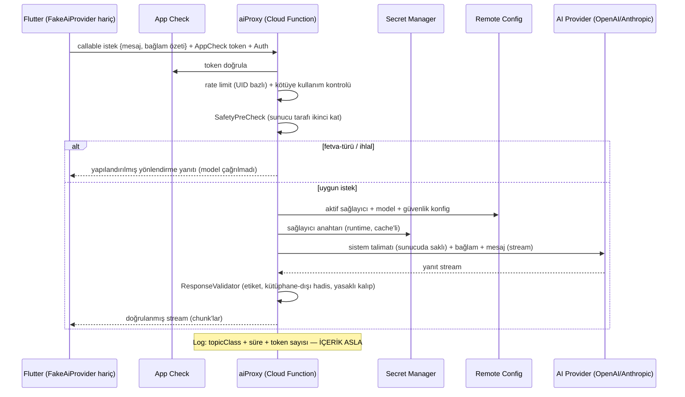

# Bismillah — Firebase Mimari Spesifikasyonu

| | |
|---|---|
| **Doküman** | 07_FIREBASE_ARCHITECTURE.md |
| **Versiyon** | 1.0 |
| **Tarih** | 2026-07-08 |
| **Durum** | Onaylı temel — tüm Firebase/backend çalışması bu dokümana uyar |
| **Bağlı dokümanlar** | [CLAUDE.md](../CLAUDE.md) · [01_PRODUCT_PRD.md](01_PRODUCT_PRD.md) · [04_ONBOARDING_FLOW.md](04_ONBOARDING_FLOW.md) · [05_INFORMATION_ARCHITECTURE.md](05_INFORMATION_ARCHITECTURE.md) · [06_FLUTTER_ARCHITECTURE.md](06_FLUTTER_ARCHITECTURE.md) |

---

## İçindekiler

1. [Firebase Mimarisi Genel Bakış](#1-firebase-mimarisi-genel-bakış)
2. [Firebase Mimari Hedefleri](#2-firebase-mimari-hedefleri)
3. [Firebase Servisleri ve Sorumlulukları](#3-firebase-servisleri-ve-sorumlulukları)
4. [Firebase Proje Ortamları](#4-firebase-proje-ortamları)
5. [Authentication Mimarisi](#5-authentication-mimarisi)
6. [Kullanıcı Kimlik Modeli](#6-kullanıcı-kimlik-modeli)
7. [Firestore Veri Mimarisi Genel Bakış](#7-firestore-veri-mimarisi-genel-bakış)
8. [Firestore Collection Tasarımı](#8-firestore-collection-tasarımı)
9. [Kullanıcı Profil Veri Modeli](#9-kullanıcı-profil-veri-modeli)
10. [İbadet Verisi Modeli](#10-i̇badet-verisi-modeli)
11. [İçerik Veri Modeli](#11-i̇çerik-veri-modeli)
12. [Firestore Sync Stratejisi](#12-firestore-sync-stratejisi)
13. [Çakışma Çözüm Stratejisi](#13-çakışma-çözüm-stratejisi)
14. [Security Rules İlkeleri](#14-security-rules-i̇lkeleri)
15. [Security Rules Test Stratejisi](#15-security-rules-test-stratejisi)
16. [Cloud Functions Mimarisi](#16-cloud-functions-mimarisi)
17. [AI Proxy Mimarisi](#17-ai-proxy-mimarisi)
18. [App Check Stratejisi](#18-app-check-stratejisi)
19. [Analytics Mimarisi](#19-analytics-mimarisi)
20. [Crashlytics Mimarisi](#20-crashlytics-mimarisi)
21. [FCM ve Bildirim Stratejisi](#21-fcm-ve-bildirim-stratejisi)
22. [Remote Config Stratejisi](#22-remote-config-stratejisi)
23. [Firebase Storage Stratejisi](#23-firebase-storage-stratejisi)
24. [Veri Gizliliği ve Hassasiyet Sınıflandırması](#24-veri-gizliliği-ve-hassasiyet-sınıflandırması)
25. [Hesap Silme Mimarisi](#25-hesap-silme-mimarisi)
26. [Veri Dışa Aktarma Mimarisi](#26-veri-dışa-aktarma-mimarisi)
27. [Admin ve İçerik Yönetim Modeli](#27-admin-ve-i̇çerik-yönetim-modeli)
28. [Kutsal İçerik Yayınlama Kuralları](#28-kutsal-i̇çerik-yayınlama-kuralları)
29. [Maliyet ve Ölçekleme Stratejisi](#29-maliyet-ve-ölçekleme-stratejisi)
30. [İzleme ve Gözlemlenebilirlik](#30-i̇zleme-ve-gözlemlenebilirlik)
31. [Yedekleme ve Kurtarma Stratejisi](#31-yedekleme-ve-kurtarma-stratejisi)
32. [Uyumluluk ve Hukuki Hazırlık](#32-uyumluluk-ve-hukuki-hazırlık)
33. [Firebase Emulator ve Lokal Geliştirme](#33-firebase-emulator-ve-lokal-geliştirme)
34. [CI/CD ve Deployment Stratejisi](#34-cicd-ve-deployment-stratejisi)
35. [Secrets ve Konfigürasyon Yönetimi](#35-secrets-ve-konfigürasyon-yönetimi)
36. [Risk Kaydı](#36-risk-kaydı)
37. [Firebase QA Kontrol Listesi](#37-firebase-qa-kontrol-listesi)
38. [Kabul Kriterleri](#38-kabul-kriterleri)
39. [Nihai Firebase Mimari Yönü](#39-nihai-firebase-mimari-yönü)

---

## 1. Firebase Mimarisi Genel Bakış

**Temel karar (bağlayıcı):** Firebase, Bismillah'ta "gerçek zamanlı ana veritabanı" DEĞİLDİR. Flutter mimarisinin (06 §14) sabitlediği gibi **Isar lokal source of truth'tur; Firebase, offline-first mobil uygulamanın güvenli cloud sync ve backend servis katmanıdır.** UI hiçbir zaman doğrudan Firestore'dan beslenmez; veri akışı daima `UI ← Isar ← sync ← Firestore` yönündedir.

**Firebase'in Bismillah için NE OLDUĞU:** kimlik sağlayıcı (anonim-önce), kullanıcı verisinin bulut gölgesi (cihaz kaybı/değişimi güvencesi), içerik dağıtım kanalı (günlük ayet/hadis/dersler), AI proxy barınağı (Cloud Functions), telemetri altyapısı (Analytics/Crashlytics) ve nadir uzak bildirim kanalı (FCM).

**Firebase'in NE OLMADIĞI:** uygulamanın çalışması için ön koşul (Firebase tamamen kesilse uygulama tam çalışır — IA §7), gerçek zamanlı UI veri kaynağı, namaz bildirimi mekanizması (bildirimler lokal — PRD §32), analitik için ham ibadet verisi deposu, AI anahtarlarının istemciye dağıtım yolu.

**Doküman ilişkileri:** PRD §35–§41 gizlilik/teknik gereksinimleri, Onboarding §14 veri modeli ve gizlilik dereceleri, IA §14 anonymous-first navigasyon sözleşmesi, Flutter Mimarisi §14–§17 Isar-first sync ve auth sözleşmeleri bu dokümanın girdileridir. Çelişki hâlinde sıra: CLAUDE.md → 01 → 04 → 05 → 06 → bu doküman.

---

## 2. Firebase Mimari Hedefleri

1. **Offline-first desteği** — Firebase, senkronu *sonradan* yapılabilir kılar; hiçbir çekirdek akışın ön koşulu değildir.
2. **Anonymous-first auth** — ilk açılışta sessiz anonim kimlik; kayıt, değerden sonra ve isteğe bağlı.
3. **Güvenli kullanıcı izolasyonu** — Security Rules ile `users/{uid}` altındaki her belge yalnız sahibine açık.
4. **Privacy-aware depolama** — ibadet verisi yüksek hassasiyetli sınıfta; PII ile dini profil verisi ayrık; minimizasyon varsayılan.
5. **AI anahtar koruması** — anahtarlar yalnız Cloud Functions ortamında (Secret Manager); istemci binary'sinde sıfır gizli anahtar.
6. **Ölçeklenebilir Firestore yapısı** — kullanıcı-başına subcollection modeli; hot document yok; content/user ayrımı net.
7. **Düşük maliyetli MVP** — Isar-first mimari Firestore okuma sayısını yapısal olarak düşürür (§29).
8. **Premium desteği (v1.1 — launch'ta canlı)** — RevenueCat entitlement senkronu `entitlementSync` function'ı ve `users/{uid}` premium meta alanlarıyla MVP kapsamında (§9, §16).
9. **Hassas verisiz analytics** — tipli event sözlüğü (06 §21); PII ve ham ibadet logu Analytics'e giremez.
10. **Hassas içeriksiz crash raporu** — breadcrumb'lar ekran adı düzeyinde; serbest metin yasak.
11. **Remote içerik dağıtımı** — kutsal içerik sürümlü ve doğrulanmış olarak `content/` ağacından; app release'i beklemeyen düzeltme.
12. **Gelecek çoklu cihaz senkronu** — sync metadata ve tombstone modeli bugünden çoklu cihaza hazır (V1.x+).
13. **GDPR/KVKK hazırlığı** — silme bugün tam; dışa aktarma mimarisi tanımlı (V1.x); rıza/opt-out alanları ayrılmış.

---

## 3. Firebase Servisleri ve Sorumlulukları

| Servis | Amaç | MVP kullanımı | Gelecek | Bununla YAPILMAZ | Gizlilik/güvenlik notu |
|---|---|---|---|---|---|
| **Firebase Auth** | Kimlik: anonim + Apple/Google/E-posta | Anonim varsayılan; linking | Aile hesap bağları (V2) | Route kilitleme (auth duvarı yok) | UID dışında PII minimum; e-posta yalnız Auth kaydında |
| **Cloud Firestore** | Kullanıcı verisi sync + içerik dağıtımı | `users/` sync, `content/` okuma | Aile grupları, premium meta | UI'nin doğrudan veri kaynağı olmak; analitik depo | Rules ile tam izolasyon; ibadet verisi yüksek hassasiyet |
| **Firebase Storage** | Medya/asset barındırma | Pasif (MVP'de kullanılmıyor) | Kur'an sesi, ders medyası, içerik paketleri | Kullanıcı ibadet verisi dosyası saklamak | Admin-only write; public read yalnız onaylı asset |
| **Firebase Analytics** | Ürün telemetrisi | PRD §40 taksonomisi | Abonelik hunisi (V2) | PII/ham ibadet verisi göndermek | Tipli event duvarı (06 §21) |
| **Crashlytics** | Crash + non-fatal | Fatal, guardrail/validasyon non-fatal'ları | — | Hassas metin loglamak | Breadcrumb ekran-adı düzeyi |
| **FCM** | Uzak bildirim | Pasif-yakın (token altyapısı hazır; kampanya yok) | İçerik duyuruları, yeniden-etkileşim (nadir) | Namaz vakti bildirimi (LOKAL olacak) | Token, hesap silmede silinir |
| **Cloud Functions** | Sunucu mantığı | AI proxy, silme yardımcısı, içerik doğrulama | Premium sync, export, aile davetleri | İstemcinin yapabileceği işi sunucuya taşımak (maliyet) | Secret Manager; App Check zorunlu |
| **Remote Config** | Uzak yapılandırma | Feature flag, AI sağlayıcı seçimi, güvenlik konfigürasyonu | Ramazan aktivasyonu, min sürüm | Kutsal içerik kaynağı olmak; güvenlik kararı taşımak | Hedefleme hassas veriyle yapılmaz |
| **App Check** | İstemci doğrulama | Dev'de debug provider; kademeli enforcement (§18) | Tam enforcement | — | Functions + Firestore koruması |
| **Emulator Suite** | Lokal geliştirme/test | Auth+Firestore+Functions emülatörleri; rules testleri | Storage emülatörü | Prod verisiyle lokal test | Seed data sentetik |

---

## 4. Firebase Proje Ortamları

Üç ayrı Firebase PROJESİ (aynı projede ayrı app değil — veri ve kural izolasyonu için):

| Özellik | Development | Staging | Production |
|---|---|---|---|
| Proje ayrımı | Ayrı proje (ör. `bismillah-dev` *örnek addır*) | Ayrı proje (`bismillah-staging`) | Ayrı proje (`bismillah-prod`) |
| Bundle/App ID | `com.bismillah.app.dev` | `com.bismillah.app.staging` | `com.bismillah.app` |
| App adı | Bismillah Dev | Bismillah Beta | Bismillah |
| Analytics | `DebugAnalyticsService` (Firebase'e gitmez, 06 §34) | Firebase (debug işaretli) | Firebase |
| Crashlytics | Kapalı | Açık | Açık |
| AI proxy | `FakeAiProvider` varsayılan; dev proxy opsiyonel | Staging proxy (staging anahtarları) | Prod proxy |
| Test verisi | Serbest sentetik; periyodik temizlik | Sentetik + beta gerçek kullanıcıları (bilgilendirilmiş) | Yalnız gerçek |
| Remote Config | Serbest deneme | Prod adayı değerler | Değişiklik onay süreçli (§34) |
| Rules sıkılığı | Prod ile AYNI kural seti (gevşek dev kuralı YASAK — yanlış güven üretir) | Prod ile aynı | Tam |
| Emulator | Birincil geliştirme yolu | CI rules/function testleri | — |

**İlke:** dev cihaz prod projesine bağlanamaz (config fiziksel olarak ayrı); kural/function dağıtımı ortam sırasıyla ilerler (dev → staging → prod, §34).

---

## 5. Authentication Mimarisi

- **İlk açılışta anonim auth:** bootstrap'ta `signInAnonymously` garanti edilir (06 §8); başarısızsa (ağ yok) uygulama lokal kimlikle çalışır ve ilk bağlantıda anonim oturum sessizce kurulur — kullanıcı hiçbir şey fark etmez.
- **Sign-in-after-value:** kayıt daveti ilk Today sonrası (IA §8); Firebase tarafında bunun tek anlamı `linkWithCredential` çağrısının zamanlamasıdır.
- **Sağlayıcılar:** Sign in with Apple, Google, E-posta/şifre (e-posta doğrulamalı). Telefon auth MVP'de YOK *(maliyet + SMS güvenilirliği; V2 değerlendirmesi)*.
- **Anonim hesap bağlama:** `linkWithCredential` ile anonim UID **korunur** — Firestore ağacı taşınmaz, kimlik yükseltilir (§6). En güvenli migrasyon, migrasyonsuzluktur.
- **Mevcut hesap çakışması:** `credential-already-in-use` → istemci iki profilin özetini gösterir, kullanıcı seçer (06 §17). Seçim "mevcut hesaba geç" ise: lokal veri, hedef UID altına merge kurallarıyla (§13) yazılır; anonim ağaç temizlenir. Sessiz üzerine yazma yasak.
- **Sign out:** oturum kapanır → YENİ anonim oturum → lokal Isar verisi cihazda kalır; eski hesabın Firestore verisi buluta bağlı kalır (tekrar girişte döner).
- **Hesap silme:** §25'teki tam akış; Auth kaydı en son silinir (silme yetkisi kaybolmadan veri temizliği biter).
- **Auth state ↔ Isar senkronu:** `authStateProvider` (06 §17) UID değişimlerini yayınlar; Isar kayıtları aktif UID'ye bağlıdır; UID değişiminde (çakışma çözümü senaryosu) sync engine yeniden eşler.
- **Auth neden MVP route'u kilitlemez:** ürün sözleşmesi (PRD §22, IA §14) — ibadet araçlarına erişim kimlik koşuluna bağlanamaz; teknik karşılığı: Rules'ta `request.auth.uid == userId` koşulu anonim UID için de aynen çalışır — anonim kullanıcı "ikinci sınıf" değildir.

---

## 6. Kullanıcı Kimlik Modeli

| Kimlik | Tanım | Yaşam döngüsü |
|---|---|---|
| **Firebase UID** | Tek kalıcı kimlik anahtarı; tüm Firestore yolları `users/{uid}` | Anonim doğar, linking'le yükselir, silmede yok olur |
| **Anonymous UID** | İlk açılışta üretilen UID — "geçici" DEĞİL, gerçek kimliktir | Linking'de KORUNUR (bağlayıcı karar) |
| **Linked UID** | Aynı UID + `linkedProviders` listesi (apple/google/password) | Çoklu sağlayıcı bağlanabilir |
| **Device-local identity** | Ağ yokken ilk açılış senaryosunda geçici lokal ID | İlk anonim auth'ta gerçek UID'ye rebind edilir; Firestore'a hiç yazılmamıştır (sorunsuz) |
| **Isar local user ID** | Lokal kayıtların sahiplik alanı = aktif Firebase UID | UID değişiminde (nadir: çakışma çözümü) sync engine remap eder |
| **Firestore user document** | `users/{uid}` kök belgesi (§9) | Oluşturma: ilk sync'te; silme: §25 |

**Bağlayıcı karar:** anonim → kalıcı geçişte **veri taşıma değil kimlik yükseltme** (`linkWithCredential`). Veri taşıma yalnız çakışma çözümü senaryosunda ve merge kurallarıyla yapılır. **Çoklu cihaz (gelecek):** aynı UID iki cihazda → her cihazın Isar'ı aynı Firestore ağacından beslenir; çakışmalar §13 kurallarıyla; MVP'de resmi destek yok ama model buna hazır *(varsayım: V1.x'te resmileşir)*.

---

## 7. Firestore Veri Mimarisi Genel Bakış

İki ayrık ağaç — **kullanıcı verisi** (yazan: kullanıcı, okuyan: yalnız sahibi) ve **global içerik** (yazan: admin, okuyan: herkes):

| Yol | Amaç | Sahip | Okuma/yazma | Sync yönü | Hassasiyet | Offline |
|---|---|---|---|---|---|---|
| `users/{uid}` | Kök profil belgesi | Kullanıcı | Yalnız sahibi | ↕ çift yön | Orta+Yüksek karışık (§9 ayrımı) | Isar birincil |
| `users/{uid}/plans` | Günlük/30-günlük planlar | Kullanıcı | Sahibi | ↕ | **Yüksek** | Lokal üretilir, sonra gölgelenir |
| `users/{uid}/prayerLogs` | Vakit kayıtları | Kullanıcı | Sahibi | ↕ | **Yüksek** | Isar birincil |
| `users/{uid}/quranProgress` | Hedef/oturum/yer imi | Kullanıcı | Sahibi | ↕ | **Yüksek** | Isar birincil |
| `users/{uid}/dhikrSessions` | Zikir tamamlamaları | Kullanıcı | Sahibi | ↕ | **Yüksek** | Isar birincil |
| `users/{uid}/duaFavorites` | Favori referansları | Kullanıcı | Sahibi | ↕ | Orta | Isar birincil |
| `users/{uid}/achievements` | Rozet kayıtları | Kullanıcı | Sahibi | ↕ | Orta | Isar birincil |
| `users/{uid}/settings` | Cihaz-bağımsız tercihler | Kullanıcı | Sahibi | ↕ | Düşük | Isar birincil |
| `users/{uid}/syncMeta` | Sync durum/imleç belgeleri | Sistem (istemci yazar) | Sahibi | ↕ | Düşük | Sync altyapısı |
| `users/{uid}/assistantMessages` | Sohbet geçmişi | Kullanıcı | Sahibi | ↑ ağırlıklı (geçmiş yedeği) | **Yüksek** | Isar birincil; bağımsız silinebilir |
| `content/quran/*` | Ayet referans/meta + meal metinleri | Admin | Herkes okur, admin yazar | ⬇ içerik çekme | Public | 30 günlük paket cache |
| `content/duas/*` | Dua kütüphanesi | Admin | Herkes okur | ⬇ | Public | Asset + remote güncelleme |
| `content/dhikrSets/*` | Zikir setleri | Admin | Herkes okur | ⬇ | Public | Asset + remote |
| `content/lessons/*` | Dersler/öğrenme yolları | Admin | Herkes okur | ⬇ | Public | İndirilen cache |
| `content/dailyAyahs/*` | Günlük ayet rotasyonu | Admin | Herkes okur | ⬇ | Public | 30 günlük paket |
| `content/dailyHadith/*` | Günlük hadis/yansıma | Admin | Herkes okur | ⬇ | Public | 30 günlük paket |
| `content/appConfig` | İçerik sürüm işaretçileri, kademeli dağıtım meta | Admin | Herkes okur | ⬇ | Public | Cache |

---

## 8. Firestore Collection Tasarımı

| Collection path | Belge amacı | Örnek alanlar | Read | Write | Sync yönü | Index ihtiyacı | TTL/arşiv | Hassasiyet |
|---|---|---|---|---|---|---|---|---|
| `users/{uid}` | Profil kökü | `language, displayName, city, personalizationProfileType, createdAt, updatedAt, accountStatus, linkedProviders, schemaVersion` | Sahibi | Sahibi (sistem alanları hariç, §14) | ↕ | — | Silmede tam temizlik | Karışık (§9) |
| `users/{uid}/plans/{planId}` | Gün planı / 30-gün çatısı | `date, items[], profileType, sizeMinutes, completedCount, updatedAt` | Sahibi | Sahibi | ↕ | `date` üzerinde tek alan | 90 gün sonra arşiv özeti *(varsayım)* | Yüksek |
| `users/{uid}/prayerLogs/{yyyy-mm-dd}` | Günün 5 vakti TEK belgede (yazma maliyeti ↓, çakışma yüzeyi ↓) | `date, entries{fajr: {status, loggedAt}, ...}, updatedAt, deviceId` | Sahibi | Sahibi | ↕ | `date` | Kalıcı (kullanıcının tarihi) | Yüksek |
| `users/{uid}/quranProgress/{docId}` | `goal` belgesi + oturum belgeleri | `goalType, dailyTarget, bookmark{surah, ayah}, sessions` günlük belge | Sahibi | Sahibi | ↕ | `date` | Kalıcı | Yüksek |
| `users/{uid}/dhikrSessions/{yyyy-mm-dd}` | Günün zikir tamamlamaları tek belgede | `date, completedSets[], counts{}, updatedAt` | Sahibi | Sahibi | ↕ | `date` | Kalıcı | Yüksek |
| `users/{uid}/duaFavorites/{duaId}` | Favori işareti | `duaId, addedAt, deleted (tombstone)` | Sahibi | Sahibi | ↕ | — | Tombstone 30 gün sonra temizlenir | Orta |
| `users/{uid}/achievements/{achievementId}` | Kazanım | `achievementId, earnedAt, context` | Sahibi | Sahibi | ↕ | — | Kalıcı | Orta |
| `users/{uid}/settings/{scope}` | Tercih grupları (`notifications`, `prayerCalc`, `display`) | scope'a göre | Sahibi | Sahibi | ↕ | — | Kalıcı | Düşük |
| `users/{uid}/syncMeta/{deviceId}` | Cihaz sync imleci | `lastPushAt, lastPullAt, appVersion, platform` | Sahibi | Sahibi | ↕ | — | Cihaz başına tek belge | Düşük |
| `users/{uid}/assistantMessages/{messageId}` | Sohbet mesajı | `role, textEncrypted?*, topicClass, createdAt, deleted` *(varsayım: alan-düzeyi şifreleme değerlendirilir)* | Sahibi | Sahibi + proxy function | ↑ | `createdAt` | Kullanıcı bağımsız silebilir | Yüksek |
| `content/dailyAyahs/{dayKey}` | Günün ayeti | §11 metadata + `arabicText, translations{tr,en,ar}, reflection` | Herkes (auth'lu) | Yalnız admin claim | ⬇ | `dayKey` | Sürümlü, silinmez | Public |
| `content/duas/{duaId}` | Dua | §11 metadata + bloklar | Herkes | Admin | ⬇ | `category, language` composite | Sürümlü | Public |
| `content/dhikrSets/{setId}` | Zikir seti | §11 + `items[], targetCounts` | Herkes | Admin | ⬇ | — | Sürümlü | Public |
| `content/lessons/{lessonId}` | Ders | §11 + `pathId, order, blocks[]` | Herkes | Admin | ⬇ | `pathId+order` composite | Sürümlü | Public |
| `content/dailyHadith/{dayKey}` | Günün hadisi | §11 + `grading` ZORUNLU | Herkes | Admin | ⬇ | `dayKey` | Sürümlü | Public |
| `content/appConfig/{configId}` | İçerik sürümleri, paket işaretçileri | `contentVersion, minPackVersion` | Herkes | Admin | ⬇ | — | Sürümlü | Public |

**Tasarım notları:** gün-başına-tek-belge deseni (prayerLogs, dhikrSessions) yazma sayısını ve çakışma yüzeyini düşürür (§29); `content/` okumaları istemcide agresif cache'lenir (real-time listener YOK — §29); `schemaVersion` alanı her kullanıcı belgesinde (ileri migrasyonlar için).

---

## 9. Kullanıcı Profil Veri Modeli

`users/{uid}` kök belgesi — **PII ile dini profil ayrımı stratejisi:** kök belge yalnız operasyonel + düşük/orta hassasiyet alanları taşır; dini profil türevi (`personalizationProfileType`) tek kova değeri olarak burada duyulur ama ONBOARDING HAM CEVAPLARI kökte değil `users/{uid}/settings/onboarding` alt belgesinde yaşar — böylece kök belgeyi okuyan herhangi bir gelecek sistem yüzeyi (destek araçları, aile özellikleri) ham dini cevaplara otomatik erişemez.

| Alan | Tip | Not |
|---|---|---|
| `language` | string enum (tr/en/ar) | Düşük hassasiyet |
| `displayName` | string? | **PII** — Analytics'e asla; boşsa isimsiz hitap |
| `city` / `country` | string? / ISO string? | Şehir düzeyi (koordinat YOK — PRD §35) |
| `locationMethod` | enum (gps/manual/skipped) | Operasyonel |
| `onboardingCompleted` | bool + `onboardingCompletedAt` timestamp | — |
| `personalizationProfileType` | enum (8 profil) | **Yüksek** (dini türev) — Rules gereği kullanıcı yazabilir ama Analytics'e yalnız kova olarak gider |
| `tonePreference` | enum | Düşük |
| `createdAt` | timestamp | **Sistem alanı** — istemci değiştiremez (§14) |
| `updatedAt` | timestamp | Sunucu zamanıyla (serverTimestamp) |
| `accountStatus` | enum (active/deleting/deleted-tombstone) | Silme akışı durumu (§25) |
| `linkedProviders` | string[] | apple/google/password |
| `schemaVersion` | int | Migrasyon desteği |
| `plusStatus` *(v1.1)* | enum (none/trial/active/expired/grace) | **Yalnız `entitlementSync` function yazar** — istemci yazamaz (§14-12) |
| `plusUntil` *(v1.1)* | timestamp? | Entitlement bitişi; yalnız server yazar |
| `plusSource` *(v1.1)* | enum (appstore/playstore/promo) | Yalnız server yazar |
| `revenueCatAppUserId` *(v1.1)* | string | RC eşleme anahtarı; yalnız server yazar |
| `subscriptionUpdatedAt` *(v1.1)* | timestamp | Son webhook işleme zamanı; yalnız server yazar |

**Premium meta gizlilik notu (v1.1):** ödeme kartı verisi HİÇBİR ZAMAN Firebase'de tutulmaz (ödeme store + RevenueCat tarafındadır); uygulama backend'inde store/RevenueCat ödeme kaydı minimumda tutulur — yalnız yukarıdaki entitlement durum alanları saklanır, işlem/fatura detayı saklanmaz.

---

## 10. İbadet Verisi Modeli

Tüm ibadet verileri **yüksek hassasiyetli** sınıftadır (PRD §35 rejimi):

| Veri | Hassasiyet | Minimizasyon kuralı | Yazma deseni | Çakışma davranışı | Silme | Analytics kısıtı |
|---|---|---|---|---|---|---|
| **Prayer logs** | Yüksek | Yalnız durum+zaman; not/konum alanı YOK | Gün-belgesi upsert (sync kuyruğundan) | "Completed wins" (§13) | Hesap silmede tam; tekil düzeltme tombstone'la | Yalnız kova event (`prayer_logged{which, status}`); desen profillemesi yapılmaz |
| **Quran progress** | Yüksek | Sayfa/ayet sayısı + yer imi; okunan İÇERİK kaydı tutulmaz ("ne okuduğu" değil "ne kadar okuduğu") | Günlük oturum upsert | Oturum birleşimi: iki cihazın oturumları TOPLANIR (kayıp yok) | Tam | Kova event |
| **Dhikr sessions** | Yüksek | Set ID + adet; serbest metin custom zikir içeriği yalnız kullanıcı ağacında | Gün-belgesi upsert | Toplama (max sayım kazanır) | Tam | Kova event |
| **Dua favorites** | Orta | Yalnız `duaId` referansı | Tekil belge + tombstone | LWW + tombstone önceliği | Tam | `dua_favorited{category}` |
| **Daily plan completion** | Yüksek | Item tamamlanma bitleri | Plan belgesi güncelleme | "Completed wins" | Tam | `plan_action_completed{type}` |
| **Achievements** | Orta | Rozet ID + tarih | Insert-only | Insert çakışmaz (idempotent ID) | Tam | `achievement_unlocked{id}` |
| **Streak state** | Orta | Sayı + onarım hakkı | Tek belge upsert | Deterministik yeniden hesap: çakışmada iki tarafın log'larından YENİDEN HESAPLANIR (state değil kaynak veri kazanır) | Tam | `streak_*` kova |

**Ortak kurallar:** ibadet verisi Cloud Functions loglarına yazılamaz; destek/debug amaçlı okunması admin panelinden bile varsayılan kapalıdır *(varsayım: V2 destek aracı tasarımında "kullanıcı onayı ile geçici erişim" modeli)*; üçüncü taraf SDK'lara bu koleksiyonlardan veri akmaz.

---

## 11. İçerik Veri Modeli

Her içerik belgesi **zorunlu metadata zarfı** taşır (06 §19 tip sisteminin bulut karşılığı):

| Alan | Zorunluluk | Not |
|---|---|---|
| `contentType` | ✅ | `quran / hadith / dua / dhikr / lesson / reflection / scholarlyNote / dailyAyah` |
| `language` | ✅ | İçerik dili / çeviri setleri |
| `source` | ✅ (Kur'an/hadis/dua/zikir için) | Kaynak eser/koleksiyon |
| `sourceReference` | ✅ | Ayet no / hadis no / sayfa |
| `grading` | ✅ hadis için | Sahih/Hasan vb. — YOKSA YAYINLANAMAZ |
| `reviewedBy` | Gelecek (V3) | Âlim/kurum onay rozeti alanı — şimdiden şemada |
| `version` | ✅ | Monoton artan; istemci uyumluluk kontrolü |
| `status` | ✅ | `draft / inReview / published / retracted` — istemci yalnız `published` okur |
| `createdAt` / `updatedAt` | ✅ | Sunucu zamanı |

**Bağlayıcı kurallar:** **No source, no render** — kaynak alanı eksik belge `published` durumuna GEÇEMEZ (content validation hook, §16); derecesiz hadis yayınlanamaz; **AI üretimi metin `quran/hadith/dua` contentType'ıyla ASLA saklanamaz** (yayın hook'u reddeder; AI açıklamaları içerik ağacına girmez — onlar runtime çıktısıdır); kutsal içerik SÜRÜMLÜdür — düzeltme yeni versiyon + `retracted` işareti, sessiz üzerine yazma yok (düzeltme şeffaflığı, PRD §44).

---

## 12. Firestore Sync Stratejisi

```mermaid
sequenceDiagram
    participant UI as UI (Isar watch)
    participant I as Isar (source of truth)
    participant Q as SyncQueue (Isar koleksiyonu)
    participant SE as SyncEngine (istemci)
    participant FS as Firestore
    Note over UI,I: Yazma yolu
    UI->>I: yerel yazım (anında)
    I->>Q: operasyon kuyruğa
    Note over SE,FS: Push (bağlantı varken)
    SE->>Q: sıradaki op'ları al (batch)
    SE->>FS: batched write (≤500 op)
    FS-->>SE: ack / hata
    SE->>Q: ack'lenenleri sil; hatalıya backoff
    Note over SE,FS: Pull (açılış + periyodik + foreground)
    SE->>FS: updatedAt > lastPullAt sorgusu (cihaz imleci)
    FS-->>SE: değişen belgeler
    SE->>I: merge kurallarıyla (§13) Isar'a yaz
    I-->>UI: watch stream → UI kendiliğinden yenilenir
    SE->>FS: syncMeta/{deviceId} imleç güncelle
```

- **Isar-first:** her yazma önce Isar; kuyruk kalıcıdır (uygulama ölse de bekler).
- **Push:** batched write'larla (maliyet + atomiklik); ack gelmeden kuyruktan silinmez (at-least-once); belge yazımları idempotent (deterministik belge ID'leri — gün anahtarı, duaId).
- **Pull:** real-time listener YOK (maliyet, §29); açılışta + foreground dönüşünde + periyodik (ör. 15 dk *varsayım*) `updatedAt` imleç sorgusu.
- **Tombstone:** silmeler `deleted: true + deletedAt` işaretiyle senkronlanır; fiziksel temizlik 30 gün sonra *(varsayım)* scheduled function ile.
- **Retry/backoff:** üstel geri çekilme + jitter; kalıcı hata (permission-denied) kuyruğu bloklamaz — op karantinaya alınır + non-fatal rapor.
- **Sync metadata:** cihaz başına imleç (`syncMeta/{deviceId}`); saat kayması riskine karşı imleçler sunucu zaman damgalarıyla çalışır.
- **Çoklu cihaz (gelecek):** aynı model iki cihazda çalışır; pull sıklığı artırılabilir; gerçek zamanlılık gerekmez (ibadet verisi anlık yarış verisi değildir).

---

## 13. Çakışma Çözüm Stratejisi

| Veri | Kural | Gerekçe |
|---|---|---|
| **Prayer logs** | Domain merge: entry bazında **"completed wins"** — bir cihaz "kılındı" dediyse kılındı kalır; durum yalnız açık kullanıcı geri-almasıyla (tombstone'lu) düşer | İbadet kaydı kaybolamaz (06 §14) |
| **Quran sessions** | Oturumlar TOPLANIR (union by sessionId) | İki cihazın okuması da gerçek |
| **Dhikr counts** | Set bazında max/union | Sayım kaybolmaz |
| **Plan completion** | Item bazında completed wins | — |
| **Streak** | State merge EDİLMEZ — kaynak loglardan deterministik YENİDEN HESAP | Türev veri çakıştırılmaz, türetilir |
| **Settings** | Alan bazlı LWW (updatedAt) | Tercihte son niyet geçerli |
| **Profile** | Alan bazlı LWW; `createdAt` dokunulmaz | — |
| **Dua favorites** | Tombstone > add (silme niyeti güçlüdür); eşit zamanda LWW | — |
| **Assistant messages** | Append-only — çakışma yok (mesaj ID'leri benzersiz); silme tombstone | Sohbet geçmişi düzenlenmez |
| **Achievements** | Insert-only idempotent | — |
| **Çoklu cihaz offline ıraksaması (gelecek)** | Yukarıdaki kurallar simetriktir — hangi cihaz önce senkronlarsa sonuç aynıdır (çakışma çözümü sıra-bağımsız/deterministik olmak ZORUNDA; test §15/06 §28) | Tutarlılık garantisi |

---

## 14. Security Rules İlkeleri

Rules kodu ayrı implementasyon PR'ında yazılır; tasarım ilkeleri bağlayıcıdır:

1. **Tam kullanıcı izolasyonu:** `users/{uid}/**` altındaki HER belge yalnız `request.auth.uid == uid` ile okunur/yazılır; anonim UID'ler dahil.
2. **Public içerik salt-okunur:** `content/**` herkes (auth'lu istemci) okur; hiçbir son kullanıcı yazamaz.
3. **Kutsal içerik yazımı admin claim ister:** `content/**` yazımı `request.auth.token.admin == true` (custom claim) gerektirir.
4. **Sistem alanları korunur:** `createdAt`, `accountStatus`, `schemaVersion` istemci tarafından değiştirilemez (create'te sunucu değeri, update'te immutable kontrolü).
5. **`createdAt` elle değiştirilemez** — açık kural olarak yazılır.
6. **Başka kullanıcının ibadet verisine erişim imkânsız:** izolasyon path-bazlı; sorgu bazlı sızıntı (collection group query) rules'ta ayrıca kapatılır.
7. **Assistant mesajları özeldir:** yalnız sahibi + AI proxy function'ın service context'i.
8. **Analytics verisi kullanıcı belgelerinde saklanmaz:** event'ler Firestore'a yazılmaz (Analytics ayrı sistemdir); rules bu karışımı yapısal olarak görmez ama içerik doğrulama hook'u user-ağacına telemetri alanı eklenmesini reddeder.
9. **Silinmiş hesap verisi erişilemez:** `accountStatus == deleting/deleted` durumunda tüm okuma/yazma reddedilir (silme yarışı koruması).
10. **CMS/içerik yazımları admin claim + status workflow:** `published` durumuna geçiş yalnız validation hook'undan geçen belgelerde (§16, §28).
11. **Şema doğrulaması mümkün olduğunca rules'ta:** zorunlu alan varlığı (`source`, `grading`) ve tip kontrolleri rules seviyesinde de tekrarlanır (derinlemesine savunma).
12. **Entitlement alanları yalnız trusted server yazar (v1.1):** `plusStatus`, `plusUntil`, `plusSource`, `revenueCatAppUserId`, `subscriptionUpdatedAt` alanlarını kullanıcı DOĞRUDAN manipüle edemez — bu alanların yazımı yalnız `entitlementSync` function'ının service context'ine açıktır; istemci update isteğinde bu alanlara dokunuş rules'ta reddedilir.

---

## 15. Security Rules Test Stratejisi

Emulator Suite + rules-unit-testing ile CI'da koşan zorunlu senaryolar:

| # | Senaryo | Beklenen |
|---|---|---|
| 1 | Kullanıcı kendi profilini okur | ✅ izin |
| 2 | Kullanıcı başka kullanıcının profilini okur | ❌ red |
| 3 | Kullanıcı kendi prayer log'unu yazar | ✅ |
| 4 | Kullanıcı başka kullanıcının prayer log'unu yazar/okur | ❌ |
| 5 | Anonim kullanıcı kendi verisine tam erişir | ✅ (anonim ≠ kısıtlı) |
| 6 | Auth'suz istek herhangi bir user belgesi okur | ❌ |
| 7 | Kullanıcı `content/duas` okur | ✅ |
| 8 | Kullanıcı `content/duas` yazar | ❌ |
| 9 | Admin claim'li kullanıcı content yazar | ✅ |
| 10 | Admin claim'siz "editor niyetli" kullanıcı content yazar | ❌ |
| 11 | `accountStatus=deleting` kullanıcının okuma denemesi | ❌ |
| 12 | `createdAt` değiştirme denemesi | ❌ |
| 13 | Collection group query ile başka kullanıcı verisi sızdırma | ❌ |
| 14 | Kaynaksız hadis belgesini `published` yazma denemesi | ❌ (rules şema kontrolü) |
| 15 | Kullanıcının kendi assistantMessages silme (tombstone) | ✅ |

Kural değişikliği = test değişikliği aynı PR'da; testler geçmeden rules deploy edilemez (§34).

---

## 16. Cloud Functions Mimarisi

| Function | Tür | Tetik | Auth şartı | Güvenlik | Maliyet notu | Hata davranışı |
|---|---|---|---|---|---|---|
| **`aiProxy`** (MVP) | Callable (streaming) | İstemci çağrısı | Auth zorunlu (anonim dahil) + App Check | Anahtarlar Secret Manager'da; rate limit UID bazlı; içerik loglanmaz | En yüksek maliyet kalemi — §17/§29 kontrolleri | Zarif hata kodu → istemci düşüş UI'ı |
| **`deleteAccount`** (MVP) | Callable | Kullanıcı silme talebi | Auth zorunlu (sahibi) | Yalnız kendi UID'sini silebilir; idempotent | Nadir | Aşamalı; yarım kalırsa `deleting` durumu + retry (§25) |
| **`contentValidationHook`** (MVP) | Firestore trigger (content yazımı) | `content/**` write | Admin yazımı zaten şart | §11 zorunlu alan denetimi; ihlalde `status` düşürülür + audit log | Düşük | İhlal = yayın reddi + editor bildirimi |
| **`publishContent`** (MVP) | Callable (admin) | CMS yayın eylemi | Admin claim | Draft→published geçişinin TEK yolu; §28 workflow | Düşük | Doğrulama hatası detaylı döner |
| **`syncHelper`** *(opsiyonel — varsayım: yalnız batched merge'ün istemcide çözülemediği durumda eklenir)* | Callable | İstemci | Auth | Kendi UID'siyle sınırlı | Düşük | — |
| **`entitlementSync`** (MVP — v1.1, Bismillah+ launch'ta satışta) | HTTP (RevenueCat webhook) | Webhook | Webhook imza doğrulama | RevenueCat webhook'larını alır; entitlement state'ini `users/{uid}` premium meta alanlarına (§9) yazar; abonelik analytics eventlerini SUNUCU tarafında üretir (çifte sayım yok) | Düşük — invocation olarak izlenir (§29) | Retry'lı; idempotent (webhook tekrar teslimatına dayanıklı) |
| `ramadanScheduler` (V2) | Scheduled | Cron | — | Sezonluk içerik işaretçileri | Düşük | — |
| `familyInvite` (V2) | Callable | Davet akışı | Auth | Davet token modeli | Düşük | — |
| `pushCampaign` (V1.x+) | Scheduled/manual | Kampanya | Admin | Frekans tavanları sunucuda da zorlanır | Düşük | — |
| `dataExport` (V1.x) | Callable + Task | Kullanıcı talebi | Auth (sahibi) | §26 modeli | Orta | Süreli link; hata bildirimi |
| `contentReviewWorkflow` (V3) | Firestore trigger | Review durum geçişleri | Reviewer claim | §27 rolleri | Düşük | — |
| `tombstoneCleaner` (MVP+) | Scheduled | Günlük | — | 30 gün+ tombstone temizliği | Düşük | İdempotent |

**Ortak ilkeler:** her function App Check ister (§18); loglara kullanıcı içeriği yazılamaz (§20/§31-06); istemcinin lokal yapabildiği iş function'a TAŞINMAZ (maliyet + offline ilkesi); tüm callable'lar idempotency anahtarı kabul eder.

---

## 17. AI Proxy Mimarisi



- **Anahtar güvenliği:** istemcide sıfır AI anahtarı; anahtarlar Secret Manager'da, yalnız `aiProxy` runtime'ı okur.
- **Sağlayıcı seçimi:** Remote Config ile (`aiProvider: openai|anthropic`) — istemci güncellemesi gerektirmez; istek/yanıt biçimi function içinde normalize edilir (06 §20 `AiRequest/AiChunk` sözleşmesinin sunucu ucu).
- **Sistem talimatı sunucuda:** sürümlü; Remote Config/Firestore'dan; istemciye asla inmez (prompt sızıntısı + kural bütünlüğü).
- **Çift katlı güvenlik:** istemci `SafetyPreCheck` (hızlı, offline yönlendirme) + sunucu pre-check (bypass'a dayanıklı) + sunucu `ResponseValidator`. İstemci kontrolü UX içindir, güvenlik sınırı SUNUCUDUR.
- **Âlim yönlendirme:** yönlendirme yanıtları function'da şablonludur (dil parametreli) — tutarlı, denetlenebilir.
- **Rate limiting:** UID bazlı dakika/gün tavanları (free allowance PRD §27.11); aşımda nazik `rateLimited` kodu.
- **Abuse önleme:** App Check + Auth zorunlu; anonim UID'lerde IP+cihaz sinyalli anomali tespiti *(varsayım: eşikler beta verisiyle)*.
- **Loglama:** topicClass, gecikme, token sayısı, guardrail sonucu — mesaj içeriği HİÇBİR logda yok.
- **Offline:** istemci tarafı düşüş (06 §27-3); proxy'nin offline senaryosu yoktur (çağrı hiç çıkmaz).
- **Red-team:** CI'da `FakeAiProvider` ile istemci seti (06 §28) + staging'de gerçek proxy'ye karşı periyodik red-team koşusu *(release gate)*.

---

## 18. App Check Stratejisi

- **Neden:** `aiProxy` maliyetli ve kötüye kullanılabilir; Firestore kullanıcı ağacı scriptlenmiş erişime kapanmalı. App Check, isteklerin gerçek uygulama binary'sinden geldiğini doğrular.
- **MVP kurulumu:** Play Integrity (Android) + App Attest/DeviceCheck (iOS); dev'de debug provider (emülatör dostu).
- **Enforcement takvimi:** (1) MVP beta — "monitor" modu (metrik toplanır, red yok); (2) genel yayın — `aiProxy` için TAM enforcement; (3) yayın +2 hafta — Firestore/Functions genelinde enforcement *(varsayım: metrik temizse öne çekilir)*.
- **Functions koruması:** tüm callable'lar App Check token'ı doğrular; enforcement öncesi de token yokluğu loglanır.
- **Firestore koruması:** enforcement ile rules öncesi katman.
- **FCM:** token kaydı standart akışta; App Check FCM send API'sini etkilemez (sunucudan gönderim).
- **Etkinleştirilmezse riskler:** AI proxy'nin bot'larla sömürülmesi (maliyet patlaması), scriptli Firestore taraması, sahte istemcilerle kota tüketimi — bu yüzden enforcement MVP yayın kriteridir (`aiProxy` için).

---

## 19. Analytics Mimarisi

06 §21 tipli sözlük mimarisi aynen; Firebase tarafı sözleşmeleri:

- **Event taksonomisi:** PRD §40 + Onboarding §13 + IA §20 — tek sözlük, `AppEvent` factory'leri.
- **PII yasak:** isim/e-posta/şehir/serbest metin parametre olarak GÖNDERİLEMEZ (tip duvarı istemcide; bu doküman sunucu/rapor tarafında da yasaklar: BigQuery export'unda PII kolonu oluşamaz).
- **Ham ibadet logu yasak:** yalnız kova event'leri; kullanıcı-günü desen analizi yapılmaz.
- **User properties:** İZİNLİ — `profile_type (kova)`, `language`, `app_version`, `plan_size_bucket`; YASAK — `displayName`, `city`, ibadet sayıları, `struggle` ham değeri.
- **Onboarding/navigasyon/habit/notification/AI eventleri:** ilgili doküman setleriyle birebir; yeni event = sözlük PR'ı + gizlilik onayı.
- **Abonelik eventleri (MVP — v1.1):** gelir-doğrulama eventleri RevenueCat webhook → `entitlementSync` üzerinden SUNUCU tarafında üretilir; istemci yalnız davranış eventlerini (paywall görüntüleme, akış adımları) atar — çifte sayım yapılmaz.
- **Consent/opt-out (V1.x):** `settings/privacy` altında analitik tercihi; kapalıysa `AnalyticsService` no-op — mimari bugünden destekler.
- **Debug vs prod:** dev'de Firebase'e gönderim yok (06 §34); staging debug-işaretli; DebugView yalnız staging'de.

---

## 20. Crashlytics Mimarisi

- **Fatal:** yakalanmamış hatalar otomatik.
- **Non-fatal:** `UnexpectedFailure`, `ContentValidationFailure`, `AiFailure.guardrailViolation`, kalıcı sync hataları — hepsi non-fatal API'siyle raporlanır (içerik/AI/sync sağlık telemetrisi).
- **Hassas metin yasağı:** crash log'larına AI mesaj içeriği, kullanıcı adı/e-posta/şehir, ibadet detayı, serbest metin breadcrumb GİREMEZ; breadcrumb'lar ekran adı + eylem türü düzeyinde (06 §31); custom key'ler kova değerli.
- **Ortam etiketi:** flavor (dev kapalı/staging/prod) + `appVersion` + `contentVersion` custom key'leri.
- **Release tracking:** sürüm bazlı crash-free oranı ≥%99.8 hedefi (PRD §16) sürüm kapısıdır; kötüleşen sürümde kademeli dağıtım durdurulur.

---

## 21. FCM ve Bildirim Stratejisi

| Konu | Karar |
|---|---|
| **Namaz bildirimleri** | **LOKAL zamanlanır** (istemci, 06 §24). Gerekçe: offline güvenilirlik (uçakta bile ezan vakti bildirilir), FCM teslimat garantisizliği, gizlilik (vakit deseni sunucuya çıkmaz), maliyet |
| **Kur'an/zikir/plan hatırlatmaları** | Lokal (aynı gerekçeler) |
| **FCM kullanım alanı** | NADİR uzak bildirimler: kritik duyuru, (V1.x+) içerik duyurusu, (V2) Ramazan kampanya penceresi — haftalar mertebesinde seyrek |
| **No-spam** | Sunucu tarafında da frekans tavanı (kampanya sistemi kullanıcı başına ay-bazlı limit); PRD §32 tavanları çift taraflı zorlanır |
| **Sessiz saatler** | Kampanyalar kullanıcı yerel sessiz saatlerine saygılı (gönderim penceresi hesaplı) |
| **Deep link payload** | IA §12 route sözleşmesi: `{route, params}`; istemci link çözümleyicisi işler |
| **Token saklama** | `users/{uid}/settings/notifications` altında cihaz-token eşlemesi; yalnız sahibi okur |
| **Token silme** | Hesap silmede token'lar ve eşlemeleri silinir (§25); sign-out'ta token devre dışı bırakılır |
| **Analytics** | `notification_sent/opened/action_completed_30m` (PRD §40); FCM kampanya ölçümü de aynı sözlükten |

---

## 22. Remote Config Stratejisi

**MVP kullanımı:** feature flag'ler (kademeli özellik açılışı), AI sağlayıcı seçimi (§17), asistan güvenlik konfigürasyonu (eşikler, yasaklı kalıp listesi sürümü), bakım mesajı (nadir).

**V1.x/V2:** onboarding metin denemeleri (kopya varyantı — duygusal güvenlik kuralları içinde), soft rollout yüzdeleri, minimum desteklenen sürüm, Ramazan modu aktivasyon tarihi.

**KULLANILMAZ:** kutsal içerik kaynağı olarak (içerik `content/` ağacında sürümlü yaşar — Remote Config yalnız işaretçi taşıyabilir); güvenlik kararı taşımak (rules/claims'in yerine geçemez); hassas kullanıcı hedeflemesi (dini profil alanlarıyla segmentasyon YASAK); paywall fiyat/erişim manipülasyonu (dürüst monetizasyon — PRD §34).

**Operasyon:** prod değişiklikleri onay süreçli (§34); her parametre dokümante; istemci daima güvenli varsayılanla çalışır (Remote Config erişilemezse uygulama tam işlevsel).

---

## 23. Firebase Storage Stratejisi

**MVP:** kullanılmıyor (içerik Firestore + app asset'leri; görsel yok, ses yok). Bucket'lar kurulur ama boş kalır — kural seti "her şey kapalı" ile başlar.

**Gelecek kullanım:** Kur'an sesi (V2 okuyucu), ders medyası, indirilebilir içerik paketleri (bandwidth optimizasyonu), paylaşım kartı asset şablonları, (belirsiz) profil görselleri — *karar: MVP ve V2'de kullanıcı yüklemesi YOK; profil görseli ihtiyacı baş harf avatar'la çözülür*.

**Kural ilkeleri:** onaylı içerik asset'leri public-read; yazım admin-only; kullanıcı yüklemeleri MVP/V2'de tamamen kapalı; ibadet verisi DOSYA olarak asla Storage'a yazılmaz; erişim App Check'e tabi.

---

## 24. Veri Gizliliği ve Hassasiyet Sınıflandırması

| Sınıf | Örnekler | Depolama | Analytics? | Log? | Silme | Export (gelecek) |
|---|---|---|---|---|---|---|
| **Public content** | Ayet/hadis/dua içerikleri | `content/` + istemci cache | ✅ (içerik ID'si) | ✅ | Sürümleme (silinmez) | — |
| **Düşük — ayarlar** | Dil, tema, bildirim tercihleri | Isar + `settings/` | ✅ kova | ✅ (değer kova) | Hesapla birlikte | ✅ |
| **Orta — kişisel bilgi** | `displayName`, şehir, e-posta (Auth'ta) | Isar + `users/{uid}` kökü / Auth | ❌ | ❌ | Hesapla birlikte | ✅ |
| **Yüksek — ibadet verisi** | Prayer logs, Kur'an ilerleme, zikir, plan, dini profil, onboarding cevapları | Isar + `users/{uid}` alt koleksiyonları | Yalnız kova event | ❌ ASLA | Hesapla birlikte + tekil silme hakları | ✅ |
| **Yüksek — AI sohbet** | assistantMessages | Isar + `users/{uid}/assistantMessages` | Yalnız topicClass | ❌ ASLA | Bağımsız silinebilir + hesapla | ✅ |
| **Sistem operasyonel** | syncMeta, cihaz/token, schemaVersion | `syncMeta/`, settings | ✅ (teknik) | ✅ | Hesapla birlikte | — |

Bu tablo; rules tasarımı (§14), function loglama kuralları (§16), analytics duvarı (§19) ve silme kapsamı (§25) için ortak referanstır.

---

## 25. Hesap Silme Mimarisi

Akış (istemci UI'ı IA §11-14; backend sorumluluğu burada):

1. **Talep:** istemci `deleteAccount` callable'ını çağırır (auth'lu; yalnız kendi UID'si).
2. **Doğrulama:** function, UID eşleşmesini ve yakın-zamanlı auth'u (recent sign-in; anonim kullanıcıda oturumun kendisi yeterli) doğrular.
3. **Durum işareti:** `users/{uid}.accountStatus = deleting` — rules bu andan itibaren tüm erişimi keser (yarış koruması).
4. **Firestore silme:** tüm alt koleksiyonlar batch'lerle silinir (assistantMessages dahil); büyük ağaçlarda sayfalı silme.
5. **Storage:** MVP'de yok; ileride kullanıcıya bağlı her nesne silinir.
6. **FCM token'ları:** token kayıtları silinir; cihaz aboneliklerinden düşülür.
7. **Analytics sınırı:** geçmiş aggregate event'ler geri çekilemez (platform kısıtı) — bunlar zaten PII'siz/kovadır; kullanıcıya gizlilik politikasında açıkça anlatılır. `user_id` bağlantısı silinir (analytics reset).
8. **Auth kaydı:** en son Auth kullanıcısı silinir.
9. **İstemci koordinasyonu:** function başarı dönünce istemci TÜM Isar koleksiyonlarını temizler + yeni anonim oturum açar; function başarısızsa lokal veri SİLİNMEZ (yarım silme yok).
10. **Hata kurtarma:** function idempotent; yarım kalan silme `deleting` durumunda kalır ve scheduled retry tamamlar; kullanıcıya "silme sürüyor" durumu dürüstçe gösterilir.
11. **Tombstone:** `users/{uid}` yerine minimal tombstone belge (`accountStatus: deleted, deletedAt`) 30 gün tutulur *(varsayım: kötüye kullanım/yanlışlık itirazı penceresi)* — içinde HİÇBİR kullanıcı verisi yoktur; sonra tam temizlenir.
12. **Hukuki not:** yedeklerdeki kalıntılar yedek rotasyon süresi içinde doğal olarak düşer (§31); politika metninde şeffafça belirtilir. *(Bu doküman hukuki tavsiye değildir.)*

---

## 26. Veri Dışa Aktarma Mimarisi

**MVP erteleme gerekçesi:** silme hakkı bugün tam karşılanıyor; export, doğru yapılmadığında (güvensiz link, aşırı kapsam) kendisi bir gizlilik riski — aceleye getirilmez. **V1.x hedefi** *(varsayım)*.

Mimari model: kullanıcı talebi → `dataExport` callable → Cloud Task ile asenkron üretim → kapsam: §24 tablosunda "Export ✅" sınıfları (profil, ayarlar, ibadet kayıtları, favoriler, başarılar, AI sohbet geçmişi) → format: **JSON (makine-okunur, şema sürümlü)** + insan-okunur özet *(varsayım: JSON birincil; CSV türevleri sonra)* → çıktı geçici Storage nesnesi → **imzalı, süreli (24 saat) indirme linki** yalnız talep sahibine → link kullanımı/expiry loglanır → nesne otomatik silinir. Riskler: link paylaşımı (süre + tek kullanım azaltır), export dosyasının cihazda korunmasız kalması (kullanıcıya uyarı metni).

---

## 27. Admin ve İçerik Yönetim Modeli

- **Roller (custom claims):** `admin` (tam içerik + yayın), `contentEditor` (draft yazma/düzenleme, YAYIN YETKİSİZ), `reviewer` (V3 — âlim/uzman onayı, `reviewedBy` alanını yalnız bu rol yazar).
- **Claim atama:** yalnız proje sahibi tarafından, admin SDK ile, denetim kaydıyla; claim'ler UI'dan atanamaz.
- **Yayın workflow'u:** `draft → inReview → published → (retracted)`; geçişler yalnız `publishContent` callable'ı ile (doğrudan status yazımı rules'ta kapalı); her geçiş `contentValidationHook` denetiminden geçer.
- **Kaynak doğrulama:** §11 zorunlu alanları hook'ta; hadis grading kontrolü özel kural (dereceleme sözlüğünden geçerli değer).
- **Versiyonlama:** her yayın yeni `version`; önceki sürümler `contentHistory` alt koleksiyonunda saklanır *(varsayım: belge boyutu büyürse ayrı arşiv koleksiyonu)*.
- **Audit log:** her içerik yazımı/yayını `auditLogs/` koleksiyonuna (kim, ne, ne zaman, önceki sürüm ref) — admin dahil herkes izlenir.
- **Rollback:** `retracted` işareti + önceki sürümün yeniden yayını tek callable eylemi; istemciler `contentVersion` işaretçisiyle (appConfig) hızlı geri döner.

---

## 28. Kutsal İçerik Yayınlama Kuralları

1. **Kur'an metni gündelik düzenlemeye kapalıdır:** Kur'an içerik belgeleri kanonik kaynaktan toplu içe aktarımla girer; alan-düzeyi elle düzenleme yalnız `admin` + zorunlu ikinci onay + audit ile (yazım hatası düzeltmesi bile denetimli).
2. **Hadis = kaynak + derece, yoksa yayın yok** (hook + rules çift kontrol).
3. **Dua = kaynak zorunlu** (ayet/hadis referansı).
4. **İlmî not = atıf zorunlu** (âlim/eser).
5. **AI metni kutsal içerik olarak yayınlanamaz:** `contentType ∈ {quran, hadith, dua, dhikr}` belgelerinde üretim kaynağı işareti `verified-import/editorial` olmalı; hook, işaretsiz/AI-kaynaklı girişi reddeder.
6. **Durum workflow'u:** §27; `published` dışı içerik istemciye İNMEZ (istemci sorguları status filtreli + rules destekli).
7. **Review şartı:** hadis/dua/ders içerikleri en az bir `contentEditor` + `admin` onayı; V3'te `reviewer` katmanı eklenir.
8. **Sürüm geçmişi:** düzeltmeler yeni sürümle; `retracted` içerik istemcide sessizce düşer (IA §18 "silinmiş içerik" durumu) + PRD §44 gereği düzeltme kaydı public changelog'a işlenir.
9. **Render uyumluluğu:** yayın hook'u, belgenin istemci render şemasıyla (06 §19 tipleri) uyumunu doğrular — istemcinin çizemeyeceği içerik yayınlanamaz (şema sürüm eşiği `minAppVersion` alanıyla).

---

## 29. Maliyet ve Ölçekleme Stratejisi

| Kalem | Strateji |
|---|---|
| **Firestore okuma** | Isar-first mimari okumaları yapısal düşürür: UI okumaları %100 lokal; Firestore okuma yalnız pull sync (imleç sorgusu) + içerik güncelleme. Real-time listener KULLANILMAZ (sürekli okuma maliyeti + gereksizlik) |
| **Firestore yazma** | Gün-başına-tek-belge deseni (§8); batched write; debounce'lu upsert (bir günde 5 vakit = 1 belgeye ≤5 update, ayrı 5 belge değil) |
| **İçerik dağıtımı** | 30 günlük paket çekimi (tek toplu okuma) + `contentVersion` işaretçisiyle koşullu güncelleme; içerik istemcide uzun TTL cache |
| **AI maliyeti** | Proxy'de UID bazlı allowance (PRD §27.11); fetva-türü sorular modele gitmeden lokal/sunucu şablon yanıtı (§17); yaygın beginner soruları için yanıt cache'i *(V1.x varsayım)*; Remote Config ile model/maliyet ayarı anlık |
| **Rate limitler** | Functions üzerinde UID+IP bazlı; App Check ile bot eliminasyonu |
| **FCM** | Zaten nadir; maliyet ihmal edilebilir |
| **Storage** | MVP'de sıfır; V2 medya CDN-cache'li dağıtım |
| **Analytics** | Firebase Analytics ücretsiz katman; BigQuery export'u yalnız prod ve şema disipliniyle *(V1.x)* |
| **RevenueCat webhook (v1.1)** | `entitlementSync` invocation maliyeti ihmal edilebilir (abonelik olayı hacmi düşük) ama function invocation metriği olarak izlenir; anomali (webhook fırtınası) alarmı |
| **Ortam disiplini** | Dev iş yükü emülatörde (bulut maliyeti sıfır); staging kotaları alarmlı |
| **İzleme** | Günlük okuma/yazma/function-invocation bütçe alarmları (§30); "maliyet regresyonu" release kriteri |

---

## 30. İzleme ve Gözlemlenebilirlik

- **Crashlytics:** crash-free oranı sürüm kapısı (§20).
- **Functions logları:** yapılandırılmış (JSON) log; `aiProxy` için gecikme/token/guardrail metrikleri; hata oranı alarmı.
- **Firestore kullanım:** okuma/yazma/silme günlük grafikleri + bütçe alarmları (ani artış = muhtemel bug/abuse).
- **AI proxy hataları:** sağlayıcı hata oranı, rate-limit isabetleri, guardrail ihlal sayısı — haftalık gözden geçirme (PRD güven metrikleri).
- **Sync sağlığı:** istemciden `sync_failure` non-fatal'ları + kuyruğu 24 saatten eski op sayısı (istemci telemetrisi) — offline-first'ün sağlık göstergesi.
- **Rules red'leri:** denied read/write metrikleri (Cloud Monitoring) — sıçrama = ya bug ya saldırı.
- **Bildirim:** teslim/açılma/eylem-tamamlama oranları (PRD §40 tanımıyla).
- **İçerik doğrulama:** hook red sayısı + nedenleri (CMS kalite göstergesi).
- **Alerting (V1.x):** bütçe, hata oranı, güvenlik anomalisi alarmları on-call kanalına *(varsayım: başlangıçta e-posta/Slack)*.

---

## 31. Yedekleme ve Kurtarma Stratejisi

- **Firestore export yedekleri:** prod'da zamanlanmış export (günlük, 30 gün rotasyon) *(V1.x kurulumu; MVP betasında haftalık manuel — varsayım)*.
- **İçerik sürümlemesi = birinci savunma:** kutsal içerik hatası yedekten değil sürüm geçmişinden döner (dakikalar, §27 rollback).
- **Kötü içerik geri alma:** `retracted` + işaretçi güncelleme → istemciler cache TTL'i içinde temizlenir; acil durumda `contentVersion` zorunlu yenileme.
- **Silme-yedek gerilimi:** silinen kullanıcı verisi yedeklerde rotasyon süresince kalabilir — politika metninde şeffaf; yedekten geri yükleme prosedürü silinmiş-hesap tombstone listesini yeniden uygular (restore sonrası silinmişler tekrar silinir).
- **Felaket kurtarma:** Firestore çok bölgeli dayanıklılığı + export'lar; RTO/RPO hedefleri V1.x'te resmileşir *(varsayım: RPO ≤24s, RTO ≤4s başlangıç hedefi)*; en kötü senaryoda bile istemciler Isar'la çalışmaya devam eder — kullanıcı veri kaybı yaşamaz, senkron gecikir.
- **Admin hatası kurtarma:** audit log + sürüm geçmişi + rules'un istemci-yazımını sınırlaması; yıkıcı toplu işlemler (koleksiyon silme) yalnız script + iki kişi onayı prosedürüyle.

---

## 32. Uyumluluk ve Hukuki Hazırlık

*(Teknik hazırlık dokümanıdır; hukuki tavsiye değildir.)*

- **Veri minimizasyonu:** §24 sınıflandırması + "yeni alan = gizlilik sınıfı zorunlu" kuralı (06 §31).
- **Amaç sınırlaması:** ibadet verisi yalnız ürün işlevi için; reklam/satış/üçüncü taraf zenginleştirme kalıcı yasak (PRD §35).
- **Silme:** bugün tam (§25); KVKK/GDPR silme taleplerine uygulama içinden self-servis cevap.
- **Export:** V1.x mimarisi hazır (§26) — erişim hakkı taleplerine altyapı.
- **Rıza netliği:** izinler bağlamsal ve açıklamalı (Onboarding §12); gizlilik politikası üç dilde insan diliyle (PRD §35).
- **Analytics opt-out:** V1.x'te ayar; mimari bugünden no-op destekli (§19).
- **Çocuk modu ihtiyatı:** MVP 13+; V3 kids mode ayrı çocuk-verisi tasarımı (COPPA/GDPR-K) yapılmadan hiçbir çocuk özelliği açılmaz (PRD §35).
- **AI sohbet gizliliği:** no-training sözleşme şartı sağlayıcıyla (PRD §35); sohbet verisi bağımsız silinebilir; proxy loglarında içerik yok.
- **Dini pratik verisi:** özel nitelikli veri muamelesi — en dar erişim, en kısa yol, en az kopya.

---

## 33. Firebase Emulator ve Lokal Geliştirme

- **Emülatör seti:** Auth + Firestore + Functions (MVP); Storage V2'de eklenir.
- **Birincil geliştirme yolu:** dev flavor varsayılan olarak emülatöre bağlanır (buluta değil) — maliyet sıfır, veri izolasyonu tam.
- **Rules testleri:** §15 senaryoları `@firebase/rules-unit-testing` ile emülatörde; CI'da zorunlu.
- **Functions testleri:** `aiProxy` FakeAiProvider'a karşı emülatörde; guardrail birim testleri.
- **Seed data:** sentetik kullanıcı + içerik seti (script'li); gerçek kullanıcı verisi lokal ortama ASLA kopyalanmaz.
- **Dev AI:** istemcide `FakeAiProvider` (06 §20); emülatör function'ı da fake sağlayıcıyla çalışabilir (uçtan uca akış testi, anahtar gerekmez).
- **CI entegrasyonu:** her PR'da emülatörlü test koşusu (rules + functions + sync entegrasyonları); emülatör sürümleri sabitlenir.

---

## 34. CI/CD ve Deployment Stratejisi

- **Ortam sırası:** dev (emülatör/serbest) → staging (otomatik deploy) → prod (manuel onay) — atlama yok.
- **Rules deploy kontrolü:** rules değişikliği → §15 test paketi yeşil → staging deploy → smoke → prod onaylı deploy; prod rules deploy'u tek başına yapılamaz (iki kişi kuralı *varsayım: ekip büyüyünce; solo dönemde zorunlu checklist*).
- **Functions deploy kontrolü:** birim + emülatör testleri → staging canary → prod; sürüm etiketi (`functions-vX.Y.Z`).
- **Deploy öncesi emülatör testi:** CI pipeline'ında zorunlu adım.
- **Rollback:** functions önceki sürüme tek komut dönüş; rules git geçmişinden önceki sürümün yeniden deploy'u; içerik rollback'i §27.
- **Version tagging:** rules/functions/content-schema sürümleri git tag'leriyle; istemci `schemaVersion` uyumluluğu release notunda.
- **Secrets:** §35; CI secret store; PR loglarında maskeatlama denetimi.
- **GitHub Actions (varsayım: CI sağlayıcısı):** `firebase-tools` ile deploy adımları; prod job'u environment protection + manuel onay.

---

## 35. Secrets ve Konfigürasyon Yönetimi

- **AI sağlayıcı anahtarları:** YALNIZ Google Secret Manager; function runtime'ı IAM ile okur; istemcide, repo'da, CI log'unda asla.
- **Firebase istemci config'i:** (`google-services.json` / `GoogleService-Info.plist`) gizli DEĞİLDİR ama ortam karışmasın diye flavor bazlı ayrık dosyalar; prod config dev build'e giremez (build script kontrolü).
- **Function env:** Secret Manager referanslı; düz-metin env değişkeninde sır yok.
- **Repo kuralı:** `.env*`, servis hesabı JSON'ları gitignore; pre-commit secret taraması *(varsayım: gitleaks sınıfı araç)*.
- **Lokal dev:** geliştirici sırları lokal keychain/`.env.local`; paylaşımlı sır dosyası yok — her geliştirici kendi dev anahtarını üretir.
- **Staging/prod ayrımı:** ayrı Secret Manager kayıtları; staging anahtarı prod'a erişemez.
- **Rotasyon:** AI anahtarları takvimli rotasyon (çeyreklik *varsayım*) + şüphe durumunda anında; rotasyon runbook'u yazılı.

---

## 36. Risk Kaydı

| # | Risk | Etki | Olasılık | Azaltım | Sahip |
|---|---|---|---|---|---|
| 1 | Firestore maliyet büyümesi | Orta | Orta | Isar-first, listener yasağı, gün-belgesi deseni, bütçe alarmları (§29) | Backend lead |
| 2 | Security rules hatalı konfigürasyonu | **Kritik** | Düşük-Orta | §15 zorunlu test paketi; prod deploy çift kontrol; denied-metrik izleme | Backend lead |
| 3 | AI proxy kötüye kullanımı | Yüksek (maliyet+itibar) | Orta | App Check enforcement, UID rate limit, allowance, anomali izleme (§17–18) | Backend lead |
| 4 | Loglarda hassas veri | Yüksek | Orta | Log filtre testleri, yapılandırılmış log şeması, içerik-yasağı kuralları (§16, §20) | Tüm ekip |
| 5 | Account linking veri kaybı | Yüksek | Düşük | UID-koruma modeli (taşıma yok); çakışmada kullanıcı seçimi; linking testleri | Mobile lead |
| 6 | Sync çakışma bug'ları | Yüksek | Orta | Deterministik merge kuralları (§13), sıra-bağımsızlık testleri, kuyruk telemetrisi | Mobile lead |
| 7 | İçerik yayın hatası (yanlış hadis/kaynak) | **Kritik** (güven) | Orta | Validation hook + workflow + audit + hızlı rollback (§27–28); PRD §42-2 süreciyle | İçerik sorumlusu |
| 8 | FCM spam algısı | Orta | Düşük | FCM zaten nadir; sunucu frekans tavanı; kampanya onay süreci (§21) | Ürün |
| 9 | Vendor lock-in (Firebase) | Orta | Orta (bilinçli kabul) | Repository soyutlaması (06): Firestore yalnız data source; Isar-first sayesinde geçiş yolu var; karar: MVP hızı için kabul edilmiş risk | Mimari |
| 10 | Offline/online ıraksaması | Orta | Orta | İmleçli pull, tombstone modeli, yeniden-hesap kuralı (streak), uzun-offline test senaryoları | Mobile lead |
| 11 | App Check yanlış konfigürasyonu (gerçek kullanıcıyı bloklama) | Yüksek | Düşük | Monitor-önce-enforce takvimi (§18); metrik eşiği görülmeden enforcement yok | Backend lead |

---

## 37. Firebase QA Kontrol Listesi

**Auth** — [ ] Anonim oturum ilk açılışta garanti · [ ] Linking UID koruyor · [ ] Çakışmada kullanıcı seçimi · [ ] Silme akışı idempotent
**Firestore** — [ ] UI doğrudan Firestore okumuyor · [ ] Gün-belgesi desenleri uygulanmış · [ ] `schemaVersion` her kullanıcı belgesinde
**Security rules** — [ ] §15 senaryoları CI'da yeşil · [ ] Sistem alanları immutable · [ ] Collection group sızıntısı kapalı
**Cloud Functions** — [ ] App Check doğrulaması · [ ] İdempotency · [ ] İçerik loglanmıyor
**AI proxy** — [ ] Anahtar yalnız Secret Manager · [ ] Çift katlı guardrail · [ ] Rate limit + allowance · [ ] Red-team seti yeşil
**Analytics** — [ ] Tipli sözlük dışı event yok · [ ] User property yasak listesi uygulanıyor
**Crashlytics** — [ ] Hassas metin filtresi testli · [ ] Ortam/sürüm etiketleri
**FCM** — [ ] Namaz bildirimi FCM'de DEĞİL · [ ] Token silme akışta · [ ] Frekans tavanı sunucuda
**Remote Config** — [ ] Güvenli varsayılanlar · [ ] Yasak kullanım alanları ihlal edilmemiş
**Storage** — [ ] MVP'de kapalı kural seti
**Privacy** — [ ] §24 sınıflandırması yeni alanlara uygulanmış · [ ] Silme kapsamı tam
**Offline sync** — [ ] Kuyruk kalıcı · [ ] Merge kuralları sıra-bağımsız · [ ] Firebase kesintisinde tam çalışma
**Emulator** — [ ] Dev varsayılan emülatör · [ ] Seed sentetik · [ ] CI emülatör testleri
**Deployment** — [ ] dev→staging→prod sırası · [ ] Prod manuel onay · [ ] Rollback denenmiş

---

## 38. Kabul Kriterleri

1. Firebase servis rolleri tablo hâlinde net (§3); "ne olmadığı" yazılı (§1)
2. Üç-proje ortam stratejisi net (§4)
3. Anonymous-first auth + linking + çakışma modeli net (§5–6)
4. Firestore collection yapısı alan örnekleriyle tanımlı (§7–8)
5. Kullanıcı verisi / içerik verisi ağaçları ayrık (§7)
6. Security rules ilkeleri 11 maddeyle net (§14)
7. Emulator rules test stratejisi 15 senaryoyla net (§15)
8. Cloud Functions MVP/gelecek rolleri tablolu (§16)
9. AI proxy mimarisi sequence diyagramıyla net (§17)
10. Analytics gizlilik sınırları net (§19)
11. Crashlytics hassas veri kuralları net (§20)
12. FCM/lokal bildirim ayrımı gerekçeli (§21)
13. Remote Config sınırları (kullan/kullanma) net (§22)
14. Hesap silme mimarisi 12 adımla net (§25)
15. Maliyet/ölçekleme stratejisi kalem kalem (§29)
16. Compliance hazırlığı düşünülmüş (§32)

---

## 39. Nihai Firebase Mimari Yönü

Bu mimarinin özü tek cümledir:

> **Firebase, Bismillah'ta kullanıcıyı buluta bağımlı kılan bir merkez değil; offline-first, gizlilik odaklı ve güvenilir bir İslami yaşam uygulamasını destekleyen sessiz backend omurgasıdır.**

Sessizliğin üç anlamı vardır. **Kullanıcı onu hissetmez:** uçakta zikrini çeker, çekimsiz köyde vaktini bilir, kayıt olmadan aylarca kullanır — Firebase kesilse bile ibadeti aksamaz; bulut, verisinin sadık bir gölgesidir. **Verisi fısıldanmaz:** ibadet kayıtları en dar yoldan, en az kopyayla, yalnız sahibinin erişebildiği bir ağaçta yaşar; hiçbir log, hiçbir analitik, hiçbir üçüncü taraf onun secdesini saymaz. **Otorite taklit edilmez:** AI anahtarları sunucuda kilitli, guardrail'ler çift katlı, kutsal içerik sürümlü ve denetimli — sistemin hiçbir parçası, hesabına yazılmamış bir sözü din diye taşıyamaz.

Backend'e dokunan herkes için ölçüt şudur: eklediğin her collection, yazdığın her function, açtığın her kural bu sessizliği ya korur ya bozar. Bozanı — metrikleri ne derse desin — bu mimariye sokmuyoruz.

---

*Dokümanın sonu. Security rules, Cloud Functions ve CMS implementasyonları bu spesifikasyona uyar; çelişki hâlinde sıra: CLAUDE.md → 01 → 04 → 05 → 06 → bu doküman.*
