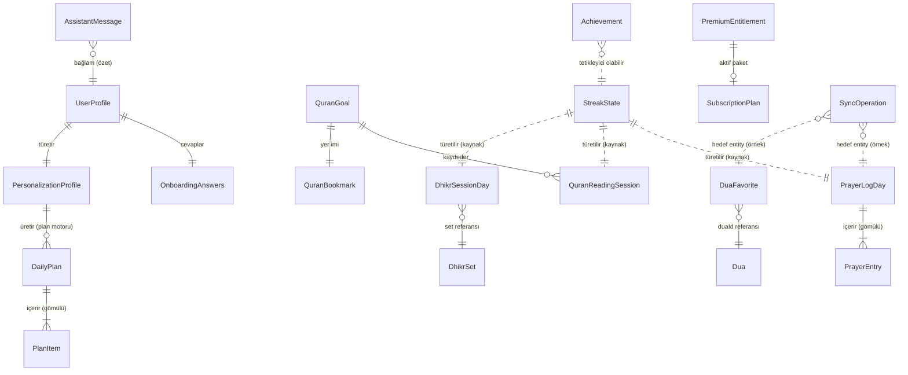
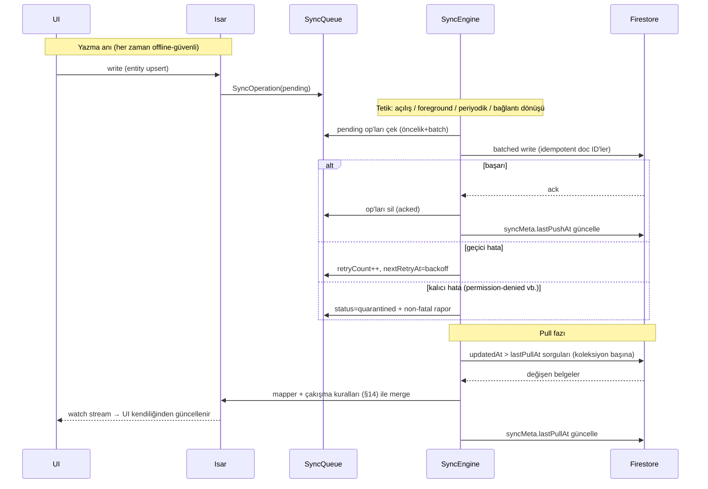

# Bismillah — Veri Modeli ve Senkronizasyon Spesifikasyonu

| | |
|---|---|
| **Doküman** | 10_DATA_MODEL_AND_SYNC_SPECIFICATION.md |
| **Versiyon** | 1.1 — implementation hardening notları eklendi (TASK 010B): Isar map yasağı, DB paket korkuluğu, AI limit otoritesi, entitlement saat sağlamlaştırması, attribution write-once, tombstone payload güvenliği |
| **Tarih** | 2026-07-08 |
| **Durum** | Onaylı temel — tüm veri katmanı implementasyonu bu sözleşmeye uyar |
| **Bağlı dokümanlar** | [CLAUDE.md](../CLAUDE.md) · [01_PRODUCT_PRD.md](01_PRODUCT_PRD.md) · [04_ONBOARDING_FLOW.md](04_ONBOARDING_FLOW.md) · [06_FLUTTER_ARCHITECTURE.md](06_FLUTTER_ARCHITECTURE.md) · [07_FIREBASE_ARCHITECTURE.md](07_FIREBASE_ARCHITECTURE.md) · [08_BUSINESS_MODEL_AND_GROWTH_STRATEGY.md](08_BUSINESS_MODEL_AND_GROWTH_STRATEGY.md) · [09_BUSINESS_ALIGNMENT_CHANGELOG.md](09_BUSINESS_ALIGNMENT_CHANGELOG.md) |

---

## İçindekiler

1. [Veri Modeli Genel Bakış](#1-veri-modeli-genel-bakış)
2. [Veri Modelleme İlkeleri](#2-veri-modelleme-i̇lkeleri)
3. [Veri Sahiplik Matrisi](#3-veri-sahiplik-matrisi)
4. [Çekirdek Domain Entity'leri](#4-çekirdek-domain-entityleri)
5. [Entity İlişki Haritası](#5-entity-i̇lişki-haritası)
6. [Kimlik (ID) Stratejisi](#6-kimlik-id-stratejisi)
7. [Isar Lokal Veritabanı Modeli](#7-isar-lokal-veritabanı-modeli)
8. [Firestore Veri Modeli](#8-firestore-veri-modeli)
9. [Isar ↔ Firestore Eşlemesi](#9-isar--firestore-eşlemesi)
10. [Sync Mimarisi Genel Bakış](#10-sync-mimarisi-genel-bakış)
11. [SyncOperation Modeli](#11-syncoperation-modeli)
12. [Push Sync Akışı](#12-push-sync-akışı)
13. [Pull Sync Akışı](#13-pull-sync-akışı)
14. [Çakışma Çözüm Kuralları](#14-çakışma-çözüm-kuralları)
15. [Tombstone ve Silme Modeli](#15-tombstone-ve-silme-modeli)
16. [Premium Entitlement Veri Modeli](#16-premium-entitlement-veri-modeli)
17. [Paid Attribution Veri Modeli](#17-paid-attribution-veri-modeli)
18. [Analytics Veri Sınırı](#18-analytics-veri-sınırı)
19. [Gizlilik Hassasiyet Sınıflandırması](#19-gizlilik-hassasiyet-sınıflandırması)
20. [Kutsal İçerik Veri Modeli](#20-kutsal-i̇çerik-veri-modeli)
21. [Türetilmiş Veri Modeli](#21-türetilmiş-veri-modeli)
22. [Migration ve Şema Sürümleme](#22-migration-ve-şema-sürümleme)
23. [Yedekleme, Export ve Silme Sözleşmeleri](#23-yedekleme-export-ve-silme-sözleşmeleri)
24. [Veri Doğrulama Kuralları](#24-veri-doğrulama-kuralları)
25. [Index Stratejisi](#25-index-stratejisi)
26. [Veri Erişim Desenleri](#26-veri-erişim-desenleri)
27. [Uç Durumlar (Edge Cases)](#27-uç-durumlar-edge-cases)
28. [Test Stratejisi](#28-test-stratejisi)
29. [Data QA Kontrol Listesi](#29-data-qa-kontrol-listesi)
30. [Kabul Kriterleri](#30-kabul-kriterleri)
31. [Nihai Veri Modeli Yönü](#31-nihai-veri-modeli-yönü)

---

## 1. Veri Modeli Genel Bakış

Bu doküman, Bismillah'ın **veri sözleşmesidir**: hangi veri nerede doğar, nerede yaşar, nereye gölgelenir, kiminle çakışır ve nasıl ölür — hepsi burada tek yerde sabitlenir. Kod yazılmadan önce bu sözleşmenin var olma nedeni basittir: veri modeli hataları, UI hatalarının aksine, kullanıcı verisiyle birlikte kalıcılaşır.

**Doküman zincirindeki yeri:** Flutter Mimarisi (06 §14–15) Isar-first ilkesini ve katman sınırlarını verdi; Firebase Mimarisi (07 §7–13) bulut ağacını ve sync ilkelerini verdi; İş Modeli (08/09) premium entitlement ve paid attribution ihtiyacını ekledi; Onboarding (04 §14) profil alanlarını tanımladı. Bu doküman hepsini **alan seviyesinde tek eşlemede** birleştirir. Çelişki hâlinde sıra: CLAUDE.md → 01 → 04 → 06 → 07 → 08 → bu doküman.

**Isar-first, Firestore-shadow modeli (özet):** Isar lokal source of truth'tur — her okuma ve yazma önce oradadır; UI yalnız Isar watch/read ile beslenir. Firestore, verinin buluttaki **gölgesidir**: cihaz kaybına karşı güvence, (gelecekte) çoklu cihaz köprüsü ve içerik dağıtım kanalı. Gölge kaybolsa (Firebase kesintisi) ürün tam çalışır; kaynak kaybolsa (cihaz kaybı) gölgeden geri doğar. Real-time listener MVP'de yoktur; push sync `SyncQueue` ile, pull sync imleç sorgularıyla yapılır.

---

## 2. Veri Modelleme İlkeleri

1. **Local-first:** verinin doğum yeri Isar'dır; "önce buluta yaz, sonra cache'le" deseni bu projede YASAKTIR.
2. **Privacy-by-design:** her yeni alan, tanımlandığı anda hassasiyet sınıfı (§19) alır; sınıfsız alan şemaya giremez.
3. **Data minimization:** bir alan "belki lazım olur" diye eklenmez; her alanın tüketicisi (ekran/kural/metrik) bu dokümanda gösterilebilir olmalıdır. Kur'an'da "ne okuduğu" değil "ne kadar okuduğu"; namazda not/konum YOK (07 §10).
4. **Source of truth netliği:** her entity'nin tek doğruluk kaynağı vardır (Isar / server / içerik CMS'i); iki kaynaklı alan yoktur.
5. **Sync-safe ID'ler:** tüm ID'ler cihazda üretilebilir ve deterministiktir (§6); "sunucudan ID bekleyen" yazma yolu yoktur.
6. **Deterministik çakışma çözümü:** merge kuralları sıra-bağımsızdır — hangi cihaz önce senkronlarsa sonuç aynıdır; bu bir test zorunluluğudur (§14, §28).
7. **Ham hassas analytics yasağı:** analytics'e giden her parametre kova/enum/sayıdır (§18); tip sistemi serbest metin kabul etmez (06 §21).
8. **UI'nin doğrudan Firestore bağımlılığı yok:** hiçbir provider/widget Firestore tipini import etmez.
9. **İlk günden şema sürümleme:** her Isar koleksiyonu ve her Firestore kullanıcı belgesi `schemaVersion` taşır (§22).
10. **Kutsal içerik doğrulaması:** "no source, no render" kuralı veri modelinde zorunlu alanlarla temsil edilir (§20); eksik metadata'lı içerik istemci mapper'ında düşer.
11. **Premium entitlement server-owned:** istemci entitlement VEREMEZ; Isar'daki kopya yalnız cache'tir (§16).
12. **Offline kurtarılabilirlik:** cihaz 30 gün offline kalsa hiçbir kullanıcı verisi kaybolmaz; kuyruk kalıcıdır, çakışmalar dönüşte deterministik çözülür.

---

## 3. Veri Sahiplik Matrisi

| Kategori | Sahip | Lokal (Isar) | Firestore | Sync yönü | Hassasiyet | Silme davranışı | Analytics |
|---|---|---|---|---|---|---|---|
| **User-owned local data** (UI tercihi, cihaz ayarı, sayaç ara durumu) | Kullanıcı/cihaz | ✅ | ❌ | — (local-only) | Düşük | Uygulama silmeyle gider | ❌ (gerekirse kova event) |
| **User-owned synced data** (ibadet kayıtları, plan, profil, favoriler, ayarlar) | Kullanıcı | ✅ kaynak | ✅ gölge | ↕ çift yön | Orta–Yüksek | Hesap silmede her iki tarafta tam silme | Yalnız kova event |
| **Public content data** (dualar, dersler, günlük ayet/hadis) | İçerik ekibi | ✅ cache | ✅ kaynak | ⬇ yalnız çekme | Public | Sürümleme/retract; silinmez | İçerik ID'si serbest |
| **Server-owned entitlement data** (plusStatus vb.) | Server (RevenueCat→function) | ✅ cache | ✅ kaynak | ⬇ (+webhook yazar) | Orta | Hesap silmede silinir; RC tarafı §23 sınırı | Sunucu-taraflı event |
| **Local-only UI state** (açık sekme, scroll konumu, taslak metin) | Cihaz | RAM/Isar geçici | ❌ | — | Düşük | Oturumla gider | ❌ |
| **Derived data** (streak, istatistik, Today kompozisyonu) | Hesaplama motoru | ✅ (cache olarak) | Kısmen (streak gölge) | Kaynaktan yeniden hesap (§21) | Orta | Kaynakla birlikte gider | Kova event |
| **Analytics-only events** | Telemetri | ❌ (gönder-unut) | ❌ (Firestore'a yazılmaz) | → Firebase Analytics | Kova düzeyi | Platform sınırları (07 §25-7) | Kendisi |
| **Admin-owned content** (CMS taslakları, audit log) | Admin | ❌ | ✅ | — (istemci görmez; yalnız `published` iner) | İç operasyon | Sürüm geçmişi korunur | ❌ |

---

## 4. Çekirdek Domain Entity'leri

| Entity | Amaç | Anahtar alanlar | Source of truth | Sync | Hassasiyet | Türetilmiş/Saklanan | Not |
|---|---|---|---|---|---|---|---|
| `UserProfile` | Kimlik + temel profil | uid, language, displayName?, city?, country?, locationMethod, tonePreference, createdAt, accountStatus, linkedProviders, schemaVersion | Isar | ↕ | Orta (PII: displayName) | Saklanan | Onboarding ham cevapları BURADA DEĞİL (§8) |
| `OnboardingAnswers` | 16 sorunun cevapları | prayerRoutine, prayerCount, quranHabit, arabicAbility, translationHabit, dhikrInterest, duaHabit, growthGoal, mainStruggle, dailyTime, reminderPreference, wantsThirtyDayPlan, completedAt | Isar | ↕ (settings/onboarding alt belgesine) | **Yüksek** | Saklanan | Alan seti 04 §14 ile birebir |
| `PersonalizationProfile` | Türetilmiş profil türü + davranış sinyalleri | profileType (8 kova), derivedAt, behaviorSignals{completionRate7d, activeHourBucket} | Motor (lokal) | ↕ | **Yüksek** | Türetilmiş (saklanan cache) | Çakışmada yeniden türetilir (§21) |
| `DailyPlan` | Bir günün planı | dayKey, items[], profileType, sizeMinutes, weekIndex, generatedBy(rule-engine ver.) | Isar | ↕ | **Yüksek** | Saklanan | 30 günlük çatı = 30 DailyPlan referans iskeleti |
| `PlanItem` | Plan içi tek eylem | itemId, type(prayer/quran/dhikr/dua/lesson/reflection), targetRef, sizeParam, completed, completedAt? | DailyPlan içinde gömülü | (planla) | **Yüksek** | Saklanan | Ayrı koleksiyon DEĞİL — plan belgesinde dizi |
| `PrayerLogDay` | Bir günün namaz kaydı | dayKey, entries{5 vakit + sünnet?}, updatedAt, deviceId | Isar | ↕ | **Yüksek** | Saklanan | Gün-başına-tek-belge (07 §8) |
| `PrayerEntry` | Tek vakit kaydı | prayerName, status(onTime/late/qada/none), loggedAt?, undone? | PrayerLogDay içinde gömülü | (günle) | **Yüksek** | Saklanan | "Completed wins" birimi |
| `PrayerTimeSet` | Bir günün vakit hesabı | dayKey, city, method, madhab, times{5+imsak}, timezone | Hesap motoru | — (LOCAL-ONLY; her cihaz kendi hesaplar) | Düşük | Türetilmiş | ASLA sync edilmez — vakit deseni buluta çıkmaz |
| `QuranGoal` | Okuma hedefi | goalType(ayah/page/minute), dailyTarget, startedAt, updatedAt | Isar | ↕ | **Yüksek** | Saklanan | — |
| `QuranReadingSession` | Tek okuma kaydı | sessionId, dayKey, amount, unit, loggedAt | Isar | ↕ (gün belgesinde dizi) | **Yüksek** | Saklanan | İçerik değil miktar (§2-3) |
| `QuranBookmark` | Kaldığı yer | surah, ayah, updatedAt | Isar | ↕ | **Yüksek** | Saklanan | Tek yer imi (MVP) |
| `DhikrSet` | Zikir seti tanımı | setId, items[], targetCounts, source refs | İçerik (preset) / Isar (custom) | ⬇ preset · ↕ custom | Public / **Yüksek** (custom) | Saklanan | Custom set kullanıcı ağacında |
| `DhikrSessionDay` | Günün zikir tamamlamaları | dayKey, completedSets[], counts{setId:max}, updatedAt | Isar | ↕ | **Yüksek** | Saklanan | Gün-belgesi deseni |
| `Dua` | Dua içeriği | duaId, category, arabic, transliteration, translations{}, source, sourceReference | İçerik CMS | ⬇ | Public | Saklanan | §20 metadata zorunlu |
| `DuaFavorite` | Favori işareti | duaId, addedAt, deleted, deletedAt? | Isar | ↕ | Orta | Saklanan | Tombstone'lu |
| `Lesson` | Ders içeriği | lessonId, pathId, order, blocks[], durationMin | İçerik CMS | ⬇ | Public | Saklanan | — |
| `LearningPath` | Öğrenme yolu | pathId, lessonIds[], level | İçerik CMS | ⬇ | Public | Saklanan | Kullanıcı ilerlemesi ayrı (lesson completion → plan/achievement verisi) |
| `Achievement` | Kazanılmış rozet | achievementId, earnedAt, context{trigger} | Isar | ↕ | Orta | Saklanan | Insert-only, idempotent ID |
| `StreakState` | Seri durumu | current, longest, lastActiveDay, repairAvailable, repairedDays[] | Motor | ↕ (gölge) | Orta | **Türetilmiş** — kaynak: log'lar | Çakışmada MERGE EDİLMEZ, yeniden hesaplanır |
| `AppSettings` | Tercihler (scope'lu) | scope(notifications/prayerCalc/display/privacy), alanlar scope'a göre, updatedAt | Isar | ↕ (cihaz-bağımsız olanlar) | Düşük | Saklanan | Haptik gibi cihaz-özel alanlar local-only işaretli |
| `AssistantMessage` | Sohbet mesajı | messageId, role, text, topicClass, createdAt, deleted | Isar | ↑ ağırlıklı | **Yüksek** | Saklanan | Append-only; bağımsız silinebilir |
| `PremiumEntitlement` | Bismillah+ durumu | §16 alan seti | **Server** (RC→function) | ⬇ cache | Orta | Saklanan (cache) | İstemci yazamaz |
| `SubscriptionPlan` | Paket tanımı | productId, period, priceLabel, offeringId | RevenueCat | ⬇ cache | Public | Saklanan (cache) | Fiyat GÖSTERİM verisi; hesaplama store'da |
| `SyncOperation` | Bekleyen sync işi | §11 alan seti | Isar | — (kuyruğun kendisi) | Payload'a göre | Saklanan | — |
| `ContentItem` | Genel içerik zarfı | contentId, contentType, version, status, language, payload | İçerik CMS | ⬇ | Public | Saklanan | §20 zarfı |
| `SacredContent` | Kutsal içerik alt tipleri | §20 | İçerik CMS | ⬇ | Public | Saklanan | Tip zorlaması 06 §19 |
| `AnalyticsEvent` | Tipli telemetri eventi | eventName, params{kova}, timestamp | — (gönder-unut) | → Analytics | Kova | — | Isar/Firestore'a YAZILMAZ |

---

## 5. Entity İlişki Haritası

*(Nokta çizgiler türetme/referans ilişkisidir, sahiplik değildir. PlanItem ve PrayerEntry gömülü tiplerdir — ayrı koleksiyon açılmaz; bu, sync birimini gün/plan belgesi yapar ve çakışma yüzeyini küçültür.)*

---

## 6. Kimlik (ID) Stratejisi

| ID | Üretim | Kullanım | Not |
|---|---|---|---|
| **Firebase UID** | Firebase Auth (anonim dahil) | Tüm kullanıcı verisinin sahiplik anahtarı; `users/{uid}` | Linking'de KORUNUR (07 §6) |
| **Anonymous UID** | İlk açılışta `signInAnonymously` | = Firebase UID | "Geçici" değildir |
| **Local temporary ID** | Ağ yokken ilk açılış | Isar kayıtlarının geçici sahibi | İlk anonim auth'ta gerçek UID'ye remap; Firestore'a hiç yazılmamıştır |
| **Device ID** | İlk açılışta UUID v4, cihazda kalıcı | `syncMeta/{deviceId}`, PrayerLogDay.deviceId | Reklam ID'si DEĞİLDİR; cihaz donanım kimliği kullanılmaz |
| **Deterministic doc ID** | İş kuralından türetilir | Gün-bazlı belgeler | İdempotent upsert'ün temeli |
| **Date-based ID (`dayKey`)** | `yyyy-MM-dd` (kullanıcının o anki YEREL günü) | `prayerLogs/2026-07-08`, `dhikrSessions/…`, `plans/…` | Timezone kuralı: dayKey yazım anındaki yerel güne kilitlenir, sonradan kaymaz (§27 clock skew) |
| **UUID v4** | Cihazda | `sessionId`, `messageId`, `operationId`, custom `setId` | Çakışmasız dağıtık üretim |
| **Composite ID** | `{dayKey}` yeterli olmayan nadir durumlar | ör. `quranProgress/goal` sabit + `sessions-{dayKey}` | Desen: `{tip}-{anahtar}` |
| **Content ID** | CMS üretir, anlamlı-sabit | `dua-morning-001`, `lesson-foundations-03` | İçerik sürümü ID'yi DEĞİŞTİRMEZ (`version` alanı artar) |
| **RevenueCat app user ID** | RC SDK; Firebase UID ile alias'lanır | Entitlement eşleme | §16 |
| **Idempotency key** | `operationId` + `payloadHash` | Push sync tekrar-teslim güvenliği | §11 |
| **Sync operation ID** | UUID v4 | Kuyruk kaydı | — |

**Örnek desenler:** `users/{uid}/prayerLogs/2026-07-08` · `users/{uid}/plans/2026-07-08` · `users/{uid}/dhikrSessions/2026-07-08` · `users/{uid}/assistantMessages/{uuid}` · `users/{uid}/syncMeta/{deviceUuid}` · `users/{uid}/duaFavorites/dua-morning-001`.

---

## 7. Isar Lokal Veritabanı Modeli

| Collection | Amaç | Anahtar alanlar | Index'ler | İlişki/link | Sync? | Hassasiyet | Silme | Migration notu |
|---|---|---|---|---|---|---|---|---|
| `UserProfileModel` | Profil kökü | uid, language, displayName?, city?, tonePreference, accountStatus, schemaVersion | uid (unique) | — | ✅ | Orta (PII) | Hesap silmede purge | displayName nullable kalmalı |
| `OnboardingAnswersModel` | Ham cevaplar | 04 §14 alan seti + completedAt | uid | UserProfile'a mantıksal bağ | ✅ (settings/onboarding) | **Yüksek** | Purge | Yeni soru = nullable alan + varsayılan |
| `PersonalizationProfileModel` | Profil türü cache | profileType, derivedAt, behaviorSignals | uid | — | ✅ | **Yüksek** | Purge | Türetilmiş — migration'da yeniden hesap yeterli |
| `DailyPlanModel` | Gün planları | dayKey, items[] (embedded), sizeMinutes, weekIndex | dayKey (unique), updatedAt | — | ✅ | **Yüksek** | Purge | PlanItem embedded şema sürümüyle |
| `PrayerLogDayModel` | Namaz gün kayıtları | dayKey, entries (embedded), updatedAt, deviceId | dayKey (unique), updatedAt | — | ✅ | **Yüksek** | Purge; tekil düzeltme tombstone | entries map genişleyebilir (sünnet) |
| `QuranProgressModel` | Hedef+oturum+yer imi | goalType, dailyTarget, bookmark, sessions[dayKey] | updatedAt, dayKey | — | ✅ | **Yüksek** | Purge | Oturum dizisi gün-belgeli |
| `DhikrSessionDayModel` | Zikir gün kayıtları | dayKey, completedSets[], counts{} | dayKey (unique), updatedAt | DhikrSet referansı | ✅ | **Yüksek** | Purge | — |
| `DuaFavoriteModel` | Favoriler | duaId, addedAt, deleted, deletedAt | duaId (unique), deleted | Dua (content) ref | ✅ | Orta | Tombstone → purge | — |
| `AchievementModel` | Rozetler | achievementId, earnedAt, context | achievementId (unique) | — | ✅ | Orta | Purge | Insert-only |
| `StreakModel` | Seri cache | current, longest, lastActiveDay, repairAvailable, repairedDays | — | Kaynak: log koleksiyonları | ✅ (gölge) | Orta | Purge | Migration'da yeniden hesap |
| `SettingsModel` | Scope'lu ayarlar | scope, alanlar, isDeviceLocal flag, updatedAt | scope (unique) | — | ✅ (isDeviceLocal=false olanlar) | Düşük | Purge | Scope bazlı genişleme |
| `AssistantMessageModel` | Sohbet geçmişi | messageId, role, text, topicClass, createdAt, deleted | createdAt, deleted | — | ↑ | **Yüksek** | Bağımsız silinebilir + purge | Text alanı şifreleme adayı (§19) |
| `PremiumEntitlementModel` | Entitlement CACHE | §16 alan seti + lastEntitlementCheckAt | — (tek kayıt) | SubscriptionPlanCache ref | ⬇ cache | Orta | Purge | İstemci yazımı yalnız cache güncellemesi |
| `SubscriptionPlanCacheModel` | Paket gösterim cache'i | productId, period, priceLabel, offeringId, fetchedAt | productId | — | ⬇ cache | Public | Purge | Fiyat metni gösterim amaçlı |
| `CachedContentModel` | İçerik cache | contentId, contentType, version, status, language, payload, fetchedAt, ttl | contentId+language (composite), contentType, dayKey | — | ⬇ | Public | TTL/purge | Payload şema sürümlü zarf (§20) |
| `SyncOperationModel` | Sync kuyruğu | §11 alan seti | status, nextRetryAt, entityType | Hedef entity ref | — | Payload'a göre (şifreli alan adayı) | Ack'te silinir; hesap silmede purge | Kuyruk şeması ayrıca sürümlü (§22) |
| `AttributionModel` | Paid attribution (tek kayıt) | §17 alan seti | — | — | ✅ (kova alanlar, users/{uid} meta *varsayım*) | Orta | Purge | PII'siz |
| `AppMetaModel` | Uygulama meta (tek kayıt) | isarSchemaVersion, lastMigrationAt, deviceId, firstOpenAt, lastPullAt genel | — | — | — (local-only) | Düşük | Uygulamayla | Migration çapası (§22) |

**Not:** `PrayerTimeSetModel` bilinçli olarak YOKTUR — vakitler her açılışta deterministik hesaplanır (hafif) ve yalnız RAM/bildirim zamanlayıcısında yaşar; vakit deseni kalıcılaştırılmaz *(karar: gizlilik + basitlik; hesap maliyeti ihmal edilebilir)*.

**⚠️ Implementation hardening — Isar map-benzeri alan kuralı (v1.1, bağlayıcı):** Bu dokümanda kavramsal olarak `entries{}`, `counts{}`, `behaviorSignals{}`, scope'lu ayar alanları ve esnek payload'lar map gösterimiyle anlatılmıştır; ancak Isar modellerinde **ham `Map` alanı KULLANILAMAZ** (ignore edilip kontrollü serialize edilmedikçe). İmplementasyon şu dört biçimden birini seçer: (a) **embedded object listesi**, (b) **sabit embedded alanlar**, (c) **normalize edilmiş çocuk kayıtları**, (d) **kontrollü mapper'lı serialized JSON**. Somut kararlar: `PrayerEntry` seti için **sabit/embedded yapı** (5 vakit + opsiyonel sünnet alanları — keyfi map değil); zikir sayımları için **embedded `DhikrCountEntryModel { setId, count }` listesi**; ayar scope'ları için **scope başına tipli settings modeli veya kontrollü JSON**; `behaviorSignals` için sabit alanlı embedded nesne. Domain modeli map-benzeri kavramları anlatmaya devam edebilir; **Isar modelleri yalnız Isar'ın desteklediği depolama biçimlerini kullanır.**

**⚠️ Implementation hardening — lokal veritabanı paket seçim korkuluğu (v1.1):** İmplementasyona başlamadan önce kullanılacak lokal DB paketinin güncel pub.dev sağlığı (bakım durumu, sürüm uyumluluğu) DOĞRULANIR. Mimari, UI'dan doğrudan Isar çağrısına değil **`LocalDatabase` soyutlamasına ve repository interface'lerine** dayanır; paket sağlığı orijinal Isar yerine bakımlı bir fork'a veya başka bir lokal DB'ye geçmeyi gerektirirse **domain/data sözleşmesi değişmez** — değişiklik infrastructure/local datasource katmanında kalır. Hiçbir implementasyon görevi, infrastructure/local datasource katmanı dışında pakete-özgü varsayım kodlayamaz.

---

## 8. Firestore Veri Modeli

*(07 §7–8 ile birebir; alan düzeyinde netleştirme.)*

| Path | Amaç | Örnek alanlar | Yazan | Sync yönü | Index | Hassasiyet | Offline |
|---|---|---|---|---|---|---|---|
| `users/{uid}` | Profil kökü + premium meta | language, displayName, city, country, locationMethod, tonePreference, personalizationProfileType, onboardingCompleted(At), createdAt🔒, updatedAt, accountStatus🔒, linkedProviders, schemaVersion🔒, **plusStatus🔒, plusUntil🔒, plusSource🔒, revenueCatAppUserId🔒, subscriptionUpdatedAt🔒**, attributionBucket? | Kullanıcı (🔒 alanlar: yalnız server) | ↕ (premium ⬇) | — | Orta+**Yüksek** karışık | Isar birincil |
| `users/{uid}/plans/{dayKey}` | Gün planı | dayKey, items[], profileType, sizeMinutes, weekIndex, updatedAt | Kullanıcı | ↕ | date/updatedAt | **Yüksek** | Lokal üretim |
| `users/{uid}/prayerLogs/{dayKey}` | Namaz gün belgesi | dayKey, entries{fajr:{status,loggedAt},…}, updatedAt, deviceId | Kullanıcı | ↕ | updatedAt | **Yüksek** | Isar birincil |
| `users/{uid}/quranProgress/{docId}` | `goal` + `sessions-{dayKey}` | goalType, dailyTarget, bookmark{surah,ayah} / sessions[], updatedAt | Kullanıcı | ↕ | updatedAt | **Yüksek** | Isar birincil |
| `users/{uid}/dhikrSessions/{dayKey}` | Zikir gün belgesi | dayKey, completedSets[], counts{}, updatedAt | Kullanıcı | ↕ | updatedAt | **Yüksek** | Isar birincil |
| `users/{uid}/duaFavorites/{duaId}` | Favori | duaId, addedAt, deleted, deletedAt | Kullanıcı | ↕ | updatedAt | Orta | Isar birincil |
| `users/{uid}/achievements/{achievementId}` | Rozet | achievementId, earnedAt, context | Kullanıcı | ↕ | — | Orta | Isar birincil |
| `users/{uid}/settings/{scope}` | Ayar grupları (`onboarding` dahil) | scope alanları, updatedAt | Kullanıcı | ↕ | updatedAt | Düşük (onboarding scope: **Yüksek**) | Isar birincil |
| `users/{uid}/assistantMessages/{messageId}` | Sohbet yedeği | role, text, topicClass, createdAt, deleted | Kullanıcı + proxy | ↑ | createdAt | **Yüksek** | Isar birincil |
| `users/{uid}/syncMeta/{deviceId}` | Cihaz sync imleci | lastPushAt, lastPullAt, appVersion, platform | Kullanıcı (cihaz) | ↕ | — | Düşük | Sync altyapısı |
| `content/duas/{duaId}` | Dua | §20 zarfı + bloklar | Admin | ⬇ | category+language | Public | Asset+cache |
| `content/dhikrSets/{setId}` | Preset zikir seti | §20 zarfı + items | Admin | ⬇ | — | Public | Asset+cache |
| `content/lessons/{lessonId}` | Ders | §20 zarfı + pathId, order, blocks | Admin | ⬇ | pathId+order | Public | İndirilen cache |
| `content/dailyAyahs/{dayKey}` | Günün ayeti | §20 zarfı + arabicText, translations, reflection | Admin | ⬇ | dayKey | Public | 30 günlük paket |
| `content/dailyHadith/{dayKey}` | Günün hadisi | §20 zarfı + grading (zorunlu) | Admin | ⬇ | dayKey | Public | 30 günlük paket |
| `content/appConfig/{configId}` | İçerik sürüm işaretçileri | contentVersion, minPackVersion, minAppSchemaVersion | Admin | ⬇ | — | Public | Cache |

---

## 9. Isar ↔ Firestore Eşlemesi

| Domain entity | Isar model | Firestore path | Yön | Mapper | Çakışma stratejisi | Not |
|---|---|---|---|---|---|---|
| UserProfile | UserProfileModel | `users/{uid}` (server alanları hariç) | ↕ | `UserProfileMapper` | Alan bazlı LWW; 🔒 alanlara dokunmaz | createdAt yalnız create'te |
| OnboardingAnswers | OnboardingAnswersModel | `users/{uid}/settings/onboarding` | ↕ | `OnboardingAnswersMapper` | LWW (tek yazar senaryosu) | Kök belgeye KOYULMAZ |
| PersonalizationProfile | PersonalizationProfileModel | `users/{uid}` (profileType) + `settings/personalization` | ↕ | `PersonalizationMapper` | Yeniden türetme (§21) | — |
| DailyPlan (+PlanItem) | DailyPlanModel | `users/{uid}/plans/{dayKey}` | ↕ | `DailyPlanMapper` | Item bazlı completed-wins | Embedded items |
| PrayerLogDay (+PrayerEntry) | PrayerLogDayModel | `users/{uid}/prayerLogs/{dayKey}` | ↕ | `PrayerLogMapper` | **Entry bazlı completed-wins** | §14-1 |
| QuranGoal/Session/Bookmark | QuranProgressModel | `users/{uid}/quranProgress/goal` + `sessions-{dayKey}` | ↕ | `QuranProgressMapper` | Goal: LWW · Sessions: union · Bookmark: LWW(updatedAt) | — |
| DhikrSessionDay | DhikrSessionDayModel | `users/{uid}/dhikrSessions/{dayKey}` | ↕ | `DhikrSessionMapper` | counts: max/union | — |
| DuaFavorite | DuaFavoriteModel | `users/{uid}/duaFavorites/{duaId}` | ↕ | `DuaFavoriteMapper` | Tombstone > add; eşitse LWW | — |
| Achievement | AchievementModel | `users/{uid}/achievements/{id}` | ↕ | `AchievementMapper` | Insert-only idempotent | — |
| StreakState | StreakModel | `users/{uid}` içinde streak özet alanları *(varsayım: kökte 3 alan)* | ↕ gölge | `StreakMapper` | MERGE YOK — kaynaktan yeniden hesap | §21 |
| AppSettings | SettingsModel | `users/{uid}/settings/{scope}` | ↕ (isDeviceLocal hariç) | `SettingsMapper` | Alan bazlı LWW | — |
| AssistantMessage | AssistantMessageModel | `users/{uid}/assistantMessages/{messageId}` | ↑ | `AssistantMessageMapper` | Append-only; delete tombstone | — |
| **PremiumEntitlement** | PremiumEntitlementModel | `users/{uid}` premium meta (🔒) | **⬇ yalnız** | `EntitlementMapper` | **Server kazanır — daima** | İstemci push'u YOK |
| SubscriptionPlan | SubscriptionPlanCacheModel | — (RevenueCat API) | ⬇ | `OfferingMapper` | Cache yenileme | Firestore'da tutulmaz |
| Attribution | AttributionModel | `users/{uid}.attributionBucket` *(kova özet — varsayım)* | ↑ tek seferlik | `AttributionMapper` | İlk yazım kazanır (immutable) | §17 |
| ContentItem/SacredContent | CachedContentModel | `content/**` | ⬇ | `ContentMapper` (+validasyon) | Yüksek `version` kazanır; `retracted` düşürür | §20 |
| SyncOperation | SyncOperationModel | — | — | — | — | Kuyruğun kendisi sync edilmez |

---

## 10. Sync Mimarisi Genel Bakış

Bileşenler: **SyncEngine** (orkestratör; açılış/foreground/periyodik tetikler), **SyncQueue** (kalıcı Isar kuyruğu), **Sync cursor** (cihaz başına `lastPullAt`/`lastPushAt`, `syncMeta/{deviceId}`), **Batch** (≤500 op'luk Firestore batched write), **Retry/Backoff** (üstel + jitter), **Quarantine** (kalıcı hatalı op'ların kuyruğu bloklamadan ayrılması), **Tombstone** (silme senkronu, §15), **Idempotency** (deterministik ID + `idempotencyKey` — tekrar teslim güvenli). **Real-time listener kuralı:** MVP'de HİÇBİR Firestore listener'ı yoktur; tüm pull imleç sorgusudur (07 §12).

---

## 11. SyncOperation Modeli

| Alan | Tip | Açıklama |
|---|---|---|
| `operationId` | UUID | Birincil anahtar |
| `uid` | string | Sahip kullanıcı (linking remap'inde güncellenir) |
| `deviceId` | UUID | Üreten cihaz |
| `entityType` | enum | prayerLogDay / dailyPlan / quranProgress / dhikrSessionDay / duaFavorite / achievement / settings / profile / assistantMessage / attribution |
| `entityId` | string | Hedef belge anahtarı (dayKey/duaId/uuid…) |
| `operationType` | enum | **upsert · patch · delete · tombstone · entitlementRefresh · contentRefresh** |
| `payloadRef` | string | Isar'daki güncel kayda referans (payload KOPYALANMAZ — tek doğruluk kaynağı korunur; push anında güncel hâl okunur) |
| `payloadHash` | string | Gönderim anındaki içerik hash'i (idempotency + değişiklik tespiti) |
| `createdAt` / `updatedAt` | timestamp | — |
| `retryCount` | int | Deneme sayısı |
| `nextRetryAt` | timestamp? | Backoff hedefi (üstel: 30s→2m→10m→1h→6h, jitter'lı *varsayım*) |
| `status` | enum | **pending · inFlight · acked · failedRetryable · quarantined · cancelled** |
| `lastErrorCode` | string? | Son hata sınıfı (kova; ham mesaj loglanmaz) |
| `idempotencyKey` | string | `operationId+payloadHash` türevi |
| `sensitivityClass` | enum | §19 sınıfı — kuyruk gözlemlenebilirliğinde payload'suz raporlama için |

**Kuyruk kuralları:** aynı `entityType+entityId` için bekleyen op'lar birleştirilir (son hâl kazanır — payloadRef zaten güncel kaydı gösterir); `acked` op anında silinir (kuyruk şişmez); `quarantined` op kuyruğu bloklamaz ve 7 gün sonra kullanıcıya sessiz "senkron sorunu" satırıyla görünür *(varsayım)*; `cancelled` yalnız hesap silme akışında kullanılır.

**⚠️ Implementation hardening — delete/tombstone payload güvenliği (v1.1, bağlayıcı):** `delete`/`tombstone` op'larında tombstone metadata'sı **remote acknowledgement gelene kadar hayatta kalmak zorundadır**. Lokal olarak silinen bir entity, tombstone op'u ack'lenmeden fiziksel purge EDİLEMEZ — `payloadRef` soft-deleted bir kayda işaret ediyorsa, o kayıt ack'e kadar SyncEngine tarafından sorgulanabilir kalır (soft-delete işaretli ama mevcut). Ack sonrası fiziksel purge serbesttir (§15 sırası). Minimum tombstone verisi: `entityType`, `entityId`, `deletedAt`, `deviceId`, `idempotencyKey` — bu beşli, kaynak kayıt purge edilse bile op içinde taşınabilir olmalıdır.

---

## 12. Push Sync Akışı

1. **Local write** — repository Isar'a yazar; UI optimistic güncellenir. *Edge:* Isar yazımı başarısızsa (disk dolu, §27) op üretilmez, kullanıcıya DS §27 hata dili.
2. **SyncOperation oluşturma** — aynı transaction bloğunda kuyruğa `pending` op. *Edge:* aynı entity için bekleyen op varsa birleştirilir (yeni op yaratılmaz, updatedAt tazelenir).
3. **Batch seçimi** — SyncEngine `pending` + `nextRetryAt<=now` op'ları önceliklendirir (ibadet kayıtları > ayarlar > attribution), entity başına son hâli alır, ≤500'lük batch kurar. *Edge:* uid'si aktif oturumla uyuşmayan op (linking remap bekleyen) atlanır.
4. **Firestore write** — batched, idempotent doc ID'lerle. *Edge:* kısmi batch hatası → Firestore batch atomiktir, tüm batch retry'a düşer.
5. **Acknowledgement** — başarı dönüşünde op'lar `acked`→silinir. *Edge:* yazım başarılı ama ack kaybolduysa (ağ koptu) → op retry'da kalır; idempotent ID sayesinde ikinci yazım zararsızdır (§27-2).
6. **Local sync state update** — `syncMeta.lastPushAt` + kuyruk metrikleri güncellenir.
7. **Failure handling** — hata sınıflandırılır: geçici (ağ/unavailable) → retryable; kalıcı (permission-denied, invalid-argument) → quarantine + non-fatal rapor. *Edge:* `accountStatus=deleting` kaynaklı red → tüm kuyruk `cancelled` (silme akışı devrede).
8. **Retry/backoff** — üstel + jitter; bağlantı dönüşü backoff'u sıfırlamaz ama beklemeden bir deneme tetikler. *Edge:* saat ileri alınmışsa `nextRetryAt` geçmişte kalır — zararsız (hemen dener).
9. **Quarantine** — `retryCount>8` *(varsayım)* veya kalıcı hata; op saklanır, veri Isar'da güvendedir; çözüm (ör. rules düzeltmesi) sonrası elle/otomatik yeniden kuyruğa alınabilir.

---

## 13. Pull Sync Akışı

**Tetikler:** app launch · foreground dönüşü · periyodik (15 dk *varsayım*) · manuel ("şimdi eşitle", Ayarlar) · **account linking sonrası** (tam pull — hedef hesabın verisi indirilir) · **restore purchase sonrası** (entitlement pull) · **app version upgrade** (şema uyum pull'u).

**Strateji:**

- **updatedAt cursor:** koleksiyon başına `where updatedAt > lastPullAt` sorgusu; sonuçlar mapper+çakışma kurallarıyla Isar'a merge edilir; en yüksek görülen `updatedAt` yeni imleç olur (sunucu zaman damgası — cihaz saatine güvenilmez).
- **Per-device syncMeta:** her cihazın kendi imleci; cihazlar birbirinin pull durumundan bağımsızdır.
- **Content version check:** `content/appConfig.contentVersion` okunur; lokal sürümden yüksekse ilgili içerik paketleri çekilir (günlük ayet/hadis 30 günlük toplu; dua/ders değişen belgeler).
- **User data pull:** kullanıcı alt koleksiyonları imleçli; kök belge her pull'da okunur (tek belge — premium meta dahil, ucuz).
- **Premium entitlement pull:** kök belgeden 🔒 alanlar → `PremiumEntitlementModel` cache güncellenir; ayrıca RevenueCat SDK kendi cache'ini yönetir — iki kaynak çelişirse **daha yeni `subscriptionUpdatedAt` kazanır** *(varsayım: RC SDK genelde daha taze)*.
- **Tombstone handling:** pull edilen `deleted:true` belgeler lokalde silme uygular (§15); tombstone işlendikten sonra lokal iz temizlenir.

---

## 14. Çakışma Çözüm Kuralları

| Veri | Çakışma tipi | Kural | Deterministik? | Gerekçe | Test şartı |
|---|---|---|---|---|---|
| Prayer logs | İki cihaz aynı vakti farklı işaretledi | **Entry bazlı completed-wins**; geri alma yalnız açık `undone` tombstone'uyla | ✅ | İbadet kaydı kaybolamaz | Çift cihaz simülasyonu, sıra-bağımsızlık |
| Quran reading sessions | Aynı güne iki cihazdan oturum | **Union by sessionId** (toplama) | ✅ | İki okuma da gerçek | Union sonrası toplam doğruluğu |
| Dhikr sessions | Aynı set iki cihazda sayıldı | Set bazında **max(count)** + completedSets union | ✅ | Sayım kaybolmaz | Max/union testi |
| Daily plan completion | Item iki cihazda farklı | Item bazlı completed-wins | ✅ | — | Item matrisi testi |
| **Streak state** | Gölge kopyalar çelişti | **MERGE EDİLMEZ** — kaynak log'lardan `StreakCalculator` ile yeniden hesap | ✅ | Türev veri çakıştırılmaz, türetilir | Yeniden hesap = her iki sıra için aynı sonuç |
| Dua favorites | Add vs delete yarışı | **Tombstone > add**; eşit zamanda LWW(updatedAt) | ✅ | Silme niyeti güçlüdür | Yarış senaryosu |
| Settings | Alan bazlı fark | Alan bazlı LWW (updatedAt, sunucu zamanı) | ✅ | Son niyet geçerli | Alan izolasyon testi |
| Profile | Alan bazlı fark | Alan bazlı LWW; 🔒 sistem alanları istemci merge'üne kapalı | ✅ | — | 🔒 alan koruması |
| Assistant messages | ID çakışması teorik olarak yok | **Append-only**; delete yalnız tombstone | ✅ | Sohbet düzenlenmez | Append-only ihlal testi |
| Achievements | Aynı rozet iki cihazda | Insert-only idempotent (aynı ID = tek kayıt; erken `earnedAt` kazanır) | ✅ | — | İdempotency testi |
| **Premium entitlement** | Cache vs server | **Server kazanır — koşulsuz**; istemci cache'i asla push edilmez | ✅ | Entitlement server-owned (§16) | Cache-manipülasyon testi (istemci değişikliği sync'te ezilir) |
| Attribution | İkinci yazım denemesi | **İlk yazım kazanır** (immutable) | ✅ | İlk dokunuş atıf gerçeğidir | Immutability testi |
| Content cache | Sürüm farkı | Yüksek `version` kazanır; `retracted` her sürümü düşürür | ✅ | İçerik tek kaynaklı | Retract yayılım testi |

---

## 15. Tombstone ve Silme Modeli

- **User-initiated delete (tekil):** favori kaldırma, zikir custom set silme, asistan mesajı silme → lokalde `deleted:true, deletedAt` işareti (soft delete) + `tombstone` op kuyruğa → Firestore belgesi tombstone'lanır.
- **Tombstone penceresi:** 30 gün *(varsayım, 07 ile hizalı)* — pencere içinde tüm cihazlar tombstone'u pull edip lokal silmeyi uygular; sonrasında `tombstoneCleaner` (07 §16) fiziksel siler.
- **Local purge:** tombstone işlendikten + push ack'lendikten sonra lokal kayıt fiziksel silinir (soft-delete kaydı süresiz taşınmaz). **Sıralama bağlayıcıdır (v1.1):** fiziksel purge ASLA tombstone op'unun ack'inden önce yapılamaz — silinen kayıt ack'e kadar soft-deleted hâlde sorgulanabilir kalır (§11 hardening notu).
- **Remote purge:** scheduled function; yalnız `deletedAt > 30 gün` tombstone'lar.
- **Account deletion:** 07 §25 akışı geçerli — sıralama: kuyruk `cancelled` → `accountStatus=deleting` → Firestore ağacı silinir → Auth silinir → **Isar tam purge** (tüm koleksiyonlar + kuyruk + cache) → yeni anonim oturum. Function başarısızsa lokal purge YAPILMAZ (yarım silme yok).
- **Deleted content fallback:** cache'lenmiş içerik `retracted` olursa istemci listeden düşürür; kullanıcı favorisi retracted içeriğe işaret ediyorsa IA §18 "içerik güncellendi/kaldırıldı" durumu gösterilir; favori kaydı korunur (içerik geri yayınlanabilir).
- **Assistant history deletion:** hesaptan bağımsız tek eylem — tüm mesajlar lokalde purge + Firestore'da toplu tombstone/silme (PRD §35 hakkı).
- **Purchase data sınırı:** RevenueCat/store tarafındaki satın alma kayıtları BİZİM silme akışımızla silinemez (yasal/finansal kayıt); kullanıcıya silme akışında bu sınır şeffaf söylenir; bizim tarafımızda tutulan entitlement meta alanları silinir.

---

## 16. Premium Entitlement Veri Modeli

**Domain tipleri:** `PremiumEntitlement` (durum kaydı) · `SubscriptionPlan` (paket tanımı, gösterim) · `TrialState` (none/active/used) · `PurchaseState` (idle/purchasing/success/failed) · `RestoreState` (idle/restoring/restored/notFound/failed) — son ikisi UI akış state'idir, KALICI DEĞİLDİR (Isar'a yazılmaz).

| Alan | Tip | Sahip | Not |
|---|---|---|---|
| `plusStatus` | enum: none/trial/active/expired/grace | Server | Tek karar alanı — `isPlus = status ∈ {trial, active, grace}` |
| `plusUntil` | timestamp? | Server | Cache geçerlilik değerlendirmesinde kullanılır |
| `plusSource` | enum: appstore/playstore/promo | Server | — |
| `revenueCatAppUserId` | string | Server | Firebase UID alias'ı |
| `subscriptionUpdatedAt` | timestamp | Server | Çakışmada tazelik ölçütü |
| `activeProductId` | string? | Server | Aktif paket |
| `originalPurchaseDate` | timestamp? | Server | — |
| `expirationDate` | timestamp? | Server | — |
| `willRenew` | bool | Server | İptal-niyet göstergesi (UI: "dönem sonuna dek aktif") |
| `trialUsed` | bool | Server | İkinci deneme engeli |
| `lastEntitlementCheckAt` | timestamp | **İstemci (cache meta)** | Cache tazeliği |
| `serverTimeAtLastEntitlementCheck` *(v1.1)* | timestamp | **İstemci (cache meta)** | Son GÜVENİLİR server doğrulamasının sunucu zamanı |
| `localTimeAtLastEntitlementCheck` *(v1.1)* | timestamp | **İstemci (cache meta)** | Aynı anın yerel monotonik referansı — geçen süre hesabının çapası |

**⚠️ Implementation hardening — saat manipülasyonuna karşı entitlement (v1.1, bağlayıcı):** Offline entitlement toleransı YALNIZCA kullanıcı tarafından değiştirilebilen cihaz saatine dayanamaz. Uygulama, tolerans kararını `plusUntil` ile duvar saatini karşılaştırarak DEĞİL, **son güvenilir server kontrolünden bu yana geçen yerel süreyi** (`localTimeAtLastEntitlementCheck` çapası, mümkünse monotonik saat) ölçerek verir. Entitlement durumu fazla bayatlamışsa (tolerans penceresi aşıldıysa) premium yüzeyler sert kesinti yerine nazik **"bağlanınca doğrulayalım"** durumu gösterir; kısa offline dönemlerde mevcut premium erişim ASLA aniden kaldırılmaz.

**Bağlayıcı kurallar:** istemci entitlement VEREMEZ — Isar'daki `PremiumEntitlementModel` salt cache'tir ve push sync'e GİRMEZ; doğruluk RevenueCat→`entitlementSync` function→Firestore zinciridir (07 §16, kural §14-12); offline'da son bilinen cache ile premium özellikler çalışmaya devam eder (`plusUntil` geçmişse bile makul tolerans penceresi — 3 gün *varsayım* — sonra nazikçe "doğrulamak için bağlan"); satın alma ve restore online zorunludur; **ödeme kartı verisi hiçbir katmanda saklanmaz** (Isar dahil); abonelik gelir-eventleri sunucu tarafından üretilir (06 §21, 07 §19).

---

## 17. Paid Attribution Veri Modeli

Aylık 1.500 TL paid growth bütçesinin (08 §14) ölçümü için MINIMUM attribution — gizlilik sınırları içinde:

| Alan | Tip | Not |
|---|---|---|
| `installSource` | enum kova: organic/paid_video/paid_store/paid_boost/paid_retargeting/unknown | Platform attribution API'sinden kovalanır |
| `campaignId` | string (kova/kod) | Kampanya kodu — kişisel değil operasyonel |
| `creativeId` | string (kod) | Kreatif testi eşlemesi |
| `adPlatform` | enum: tiktok/meta/google/none | — |
| `firstOpenAt` | timestamp | — |
| `onboardingCompletedFromPaid` | bool | Kova metriği |
| `activatedFromPaid` | bool | İlk gün ≥1 eylem |
| `trialStartedFromPaid` | bool | — |
| `paidConvertedFromPaid` | bool | Ödemeye dönüşüm |

**Kurallar:** PII yok (IDFA/GAID gibi reklam kimlikleri SAKLANMAZ; platform attribution'ı kovaya indirgenerek alınır *(varsayım: SKAdNetwork/Play Install Referrer düzeyi)*); **dini pratik verisiyle ham birleşim yasak** — "paid kullanıcıların namaz deseni" gibi kesişim sorguları üretilemez (yalnız kova: paid kohortun D7'si); attribution kova seviyesindedir ve `AttributionModel` tek immutable kayıttır; user-level attribution yalnız ürün optimizasyonu için minimum tutulur ve hesap silmede silinir; analytics eventlerine yalnız `campaign_bucket`/`source_bucket` parametreleri gider.

**⚠️ Implementation hardening — write-once koruması (v1.1, bağlayıcı):** Attribution alanları **write-once**'tır: ilk yazımdan sonra istemci bu alanları DEĞİŞTİREMEZ (repository API'si update yolu sunmaz). Firestore tarafında da (`users/{uid}.attributionBucket`) immutability mümkün olduğunca **rules veya server-side validasyonla** zorlanır (create-only; update reddedilir). Attribution verisi, kampanya KALİTESİ ölçümü içindir — kullanıcı-düzeyi dini profilleme için DEĞİLDİR; ham ibadet verisiyle birleşim her katmanda yasaktır.

---

## 18. Analytics Veri Sınırı

**İZİNLİ parametreler:** `screen_id` · `feature_id` · `source` (kova) · `conversion_step` · `plan_item_type` (kova) · `subscription_event_type` · `campaign_bucket` · `error_class` · `ai_topic_class` · `content_type` · sayısal kovalar (süre bandı, adet bandı).

**YASAK (tip sistemi + review çift duvarı):** `displayName` · e-posta · şehir (vakit yöntemi istatistiği gerekirse ülke kovası yeter) · ham seri zaman çizelgesi · birebir ibadet deseni (gün-gün namaz matrisi) · AI mesaj İÇERİĞİ · onboarding serbest metni · ödeme detayları · kullanıcının okuduğu spesifik Kur'an içeriği (sure/ayet bazında okuma telemetrisi YOK — yalnız "okuma yapıldı, miktar kovası").

**Event kategorileri:** onboarding (04 §13) · navigation (05 §20) · habit/prayer/quran/dhikr/dua (01 §40) · assistant (topic_class'lı) · premium (06 §21 — 7 event; gelir eventleri sunucudan) · paid growth (`paid_install_attributed{source_bucket}`, `paid_activation{campaign_bucket}` *(varsayım: adlar implementasyonda kesinleşir)*) · notification · error.

---

## 19. Gizlilik Hassasiyet Sınıflandırması

| Sınıf | Örnekler | Isar | Firestore | Analytics | Log | Export | Silme | Şifreleme |
|---|---|---|---|---|---|---|---|---|
| **Public** | İçerik (dua/ders/ayet), paket fiyat etiketi | Cache | `content/**` | ✅ (ID) | ✅ | — | Sürümleme | Gerekmez |
| **Low** | Dil, tema, bildirim tercihi, syncMeta, AppMeta | ✅ | ✅ | ✅ kova | ✅ kova | ✅ | Hesapla | Gerekmez |
| **Medium** | displayName, şehir/ülke, achievement, favoriler, attribution, entitlement meta | ✅ | ✅ | ❌ (attribution kovası hariç) | ❌ | ✅ | Hesapla | Platform sandbox yeterli |
| **High** | İbadet kayıtları, plan, onboarding cevapları, dini profil, AI sohbet | ✅ | `users/{uid}` alt ağacı | Yalnız kova event | ❌ ASLA | ✅ (uyarılı) | Hesapla + tekil haklar | AI sohbet + sync payload şifreleme adayı (keystore destekli) *(varsayım)* |
| **Restricted** | Ödeme kartı verisi, AI provider anahtarları, sistem sırları | ❌ SAKLANMAZ | ❌ SAKLANMAZ | ❌ | ❌ | — | — (hiç yok) | — (var olmayarak korunur) |

---

## 20. Kutsal İçerik Veri Modeli

**Tipler:** `QuranVerse` · `HadithText` · `DuaText` · `DhikrText` · `ScholarlyNote` · `Reflection` · `AiExplanation` *(sonuncusu SacredContent hiyerarşisi DIŞINDA — 06 §19; içerik ağacına asla yazılmaz, runtime çıktısıdır).*

**Zorunlu metadata zarfı** (her içerik belgesi/cache kaydı):

| Alan | Zorunluluk |
|---|---|
| `contentType` | ✅ |
| `source` | ✅ (Kur'an/hadis/dua/zikir) |
| `sourceReference` | ✅ |
| `grading` | ✅ hadis için — YOKSA YAYINLANAMAZ |
| `language` | ✅ |
| `version` | ✅ (monoton artan) |
| `status` | ✅ (draft/inReview/published/retracted) |
| `reviewedBy` | Gelecek (V3) — şemada bugünden yer var |
| `createdAt` / `updatedAt` | ✅ (sunucu zamanı) |

**Bağlayıcı kurallar:** no source, no render — istemci mapper'ı eksik metadata'lı içeriği `ContentValidationError` ile düşürür ve non-fatal raporlar; derecesiz hadis publish edilemez (CMS hook + rules + istemci üçlü savunma); AI metni `quran/hadith/dua` contentType'ıyla kaydedilemez (hiçbir katmanda); Kur'an metni gündelik düzenlemeye kapalıdır (07 §28-1); içerik sürümlüdür ve düzeltme yeni versiyondur; **istemci yalnız `published` tüketir** (sorgu filtresi + rules + mapper kontrolü).

---

## 21. Türetilmiş Veri Modeli

| Türetilmiş veri | Kaynak | Yeniden hesap tetiği | Saklama | Sync | Çakışma |
|---|---|---|---|---|---|
| `StreakState` | Prayer/Quran/Dhikr log'ları | Her qualifying eylem; gün dönümü; pull-merge sonrası | Isar cache + Firestore gölge | ↕ gölge | Merge yok → yeniden hesap |
| `WeeklyStats` | Log koleksiyonları | Görüntüleme anında (lazy) + haftalık özet üretimi | Hesaplanır (cache'siz) *(varsayım: performans gerektirirse günlük özet cache'i)* | ❌ | — (hesaplanır) |
| `MonthlyStats` | Log koleksiyonları | Ay sonu töreni + görüntüleme | Aylık özet cache (Isar) | ❌ *(V2'de rapor arşivi sync olabilir)* | Yeniden hesap |
| `TodayComposition` | Plan + profil + vakitler + içerik | Her Today açılışı; plan/kayıt değişimi | RAM (saklanmaz) | ❌ | — |
| `PersonalizationProfile` | Onboarding + davranış sinyalleri | Onboarding bitişi; haftalık davranış değerlendirmesi; plan resize | Isar (cache) + sync | ↕ | Yeniden türetme |
| `AchievementUnlockState` | Log'lar + streak + milestones | Her qualifying eylem | Achievement kayıtları saklanır; "unlock kontrolü" hesaplanır | ↕ (kayıtlar) | Insert-only |
| `PaidGrowthCohortSummary` | Analytics (sunucu tarafı) | Haftalık rapor | Ürün DIŞI (dashboard) — uygulamada saklanmaz | — | — |
| `AIUsageSummary` | assistantMessages sayaçları | Gün dönümü (limit takibi) + proxy yanıtından mutabakat | Isar (günlük sayaç — **yalnız UI gösterimi/optimistic geri bildirim**) | ❌ local-only | Server yanıtından yeniden senkronize edilir |

**⚠️ Implementation hardening — AI limit otoritesi (v1.1, bağlayıcı):** `AIUsageSummary` lokal cache'i YALNIZ UI gösterimi ve optimistic geri bildirim içindir. **Otoriter AI hakkı (allowance), rate limiting ve kötüye kullanım önleme Cloud Functions / AI proxy'de yaşar** (07 §17); istemci sayaçlarına maliyet kontrolü için GÜVENİLEMEZ (manipüle edilebilir). Asistan offline zaten çalışmadığı için kota kontrolü, online istek proxy'ye ulaştığında yapılır; proxy yanıtı güncel kullanım/kalan hak bilgisini döndürür ve lokal sayaç bu yanıttan mutabakatlanır (reconcile).

**Anayasa kuralı:** türetilmiş veri çakışmada ASLA merge edilmez — kaynak veriden yeniden hesaplanır. Bu, tüm istatistik/seri/rozet tutarlılığının tek güvencesidir.

---

## 22. Migration ve Şema Sürümleme

- **Isar schema version:** `AppMetaModel.isarSchemaVersion`; her koleksiyon değişikliği migration adımı gerektirir (sıralı, idempotent adımlar: v1→v2→v3).
- **Firestore schemaVersion:** `users/{uid}.schemaVersion` (🔒); istemci kendi desteklediği sürümden yüksek belge görürse alan-toleranslı okur (bilinmeyen alanları korur, ezmez) — *ileri uyumluluk kuralı: mapper'lar bilinmeyen alanları round-trip'te kaybetmez.*
- **AppMetaModel:** migration çapası — `isarSchemaVersion`, `lastMigrationAt`, `pendingMigrationStep?`.
- **Migration adımları:** açılışta, UI bloklanmadan önce, transaction'lı; adım başarılıysa sürüm ilerler.
- **Backward compatibility:** yeni alanlar nullable+varsayılanlı eklenir; alan silme iki sürümlü süreçtir (önce yazımı durdur, sonra kaldır).
- **Content schema version:** `content/appConfig.minAppSchemaVersion` — istemci şeması eskiyse yeni içerik formatı indirilmez, mevcut cache ile çalışılır + "güncelleme önerilir" sessiz işareti.
- **Premium entitlement migration:** cache modeli değişse bile güvenli — kaynak server olduğundan cache düşürülüp (drop) ilk pull'da yeniden doldurulabilir.
- **Sync queue migration:** kuyruk şeması ayrıca sürümlü; migration sırasında bekleyen op'lar KORUNUR (kuyruk drop'u veri kaybıdır, yasak); op şeması değiştiyse eski op'lar okunabilir kalmalı veya güvenle yeniden üretilmeli (payloadRef modeli bunu kolaylaştırır — payload zaten güncel Isar kaydından okunur).
- **Failed migration handling:** adım başarısızsa uygulama önceki sürüm şemasıyla SALT-OKUNUR moda düşmez — bunun yerine migration retry + non-fatal rapor; ikinci başarısızlıkta kullanıcıya dürüst durum + destek yolu (veri asla silinerek "çözülmez").
- **Test:** her migration adımı için önce-sonra fixture testi; doldurulmuş v(n) veritabanının v(n+1)'e kayıpsız geçişi CI'da (§28).

---

## 23. Yedekleme, Export ve Silme Sözleşmeleri

**Export (V1.x — 07 §26 modeli):** format JSON (şema sürümlü) + insan-okunur özet; kapsam: profil, onboarding cevapları, ayarlar, ibadet kayıtları, favoriler, rozetler, **AI sohbet geçmişi (ayrı opsiyon — kullanıcı dahil etmemeyi seçebilir)**; hassas veri uyarısı export ekranında ("bu dosya ibadet kayıtlarını içerir — güvenli sakla"); abonelik verisi sınırı: yalnız entitlement durumu export edilir, store/RC işlem kayıtları bizim veri setimizde yoktur.

**Silme:** lokal Isar purge (tüm koleksiyonlar + kuyruk + cache) · Firestore ağacı silme (07 §25 sıralaması) · assistant mesajları dahil · RevenueCat/ödeme kaydı sınırı kullanıcıya şeffaf (§15) · tombstone: veri içermeyen minimal kayıt 30 gün (07 §25-11) · audit/güvenlik metadata'sı: silme olayının kendisi (uid-hash + zaman) operasyonel kayıtta tutulur *(varsayım: kötüye kullanım itiraz penceresi için; kullanıcı verisi içermez)*.

---

## 24. Veri Doğrulama Kuralları

| Kural | Uygulama noktası |
|---|---|
| Zorunlu alanlar (entity constructor'ları) | Domain tipleri — eksik alan derlenmez (06 §19 yaklaşımı) |
| Enum kısıtları | Tüm kovalar enum; string serbest değer mapper'da reddedilir |
| Tarih kısıtları | `dayKey` regex + geçerli takvim günü; `loggedAt` gelecekte olamaz (±5 dk tolerans, clock skew §27) |
| Server-owned alan koruması | 🔒 alanlar istemci mapper'ında write-set'e giremez (tip düzeyinde ayrık DTO) + rules (07 §14-12) |
| İçerik kaynak doğrulaması | `ContentMapper` — no source, no render (§20) |
| Hadis grading doğrulaması | CMS hook + rules + mapper (üçlü) |
| Entitlement doğrulaması | `plusStatus` yalnız pull/webhook'tan; istemci `isPlus` HESAPLAR, yazamaz |
| Sync payload doğrulaması | Push öncesi şema kontrolü + `payloadHash`; bozuk payload op'u quarantine |
| Analytics event doğrulaması | Tipli sözlük (serbest string parametre derlenmez) + event adı allowlist |
| Ham hassas alan denetimi | CI taraması: High-sınıf alan adlarının (text, entries, answers…) analytics/log çağrılarında geçmesi build'i kırar *(varsayım: custom lint)* |
| Isar map-benzeri alan yasağı *(v1.1)* | Code review + lint: Isar modellerinde ham `Map` alanı reddedilir; §7 hardening notundaki dört meşru biçimden biri (embedded liste / sabit embedded / normalize çocuk kayıt / kontrollü JSON) kullanılmış olmalı |
| Attribution write-once doğrulaması *(v1.1)* | Repository API'sinde update yolu yok; Firestore'da create-only zorlaması (rules/server-side); ikinci yazım denemesi testte reddedilmeli (§17 hardening notu) |

---

## 25. Index Stratejisi

**Isar:** `dayKey` (tüm gün-belgesi koleksiyonlarında, unique) · `updatedAt` (pull-merge ve liste sıralamaları) · `status+nextRetryAt` (SyncOperation kuyruk taraması — en sıcak sorgu) · `entityType` (kuyruk birleştirme) · `contentType`, `contentId+language` (cache araması) · `deleted` (favori filtreleri) · `createdAt` (assistant geçmişi) · premium tek kayıt (index gereksiz). İlke: her index bir GERÇEK sorguya karşılık gelir; "belki lazım olur" index'i yazma maliyeti nedeniyle reddedilir.

**Firestore:** `updatedAt` tek-alan (her kullanıcı alt koleksiyonunda — pull sync'in tek sorgusu) · gün-bazlı loglar için `dayKey` doğal belge ID'si olduğundan ek index GEREKMEZ (ID ile doğrudan erişim) · `content`: `status+language+category` composite (dua listeleri), `pathId+order` (dersler), `dayKey` (günlük içerik) · collection group index'leri AÇILMAZ (07 §14-6 sızıntı yüzeyi). **Maliyet ilkesi:** composite index sayısı bilinçli minimumda; her yeni sorgu deseni önce "Isar'dan karşılanabilir mi?" sorusuyla sınanır — Firestore sorgusu son çaredir.

---

## 26. Veri Erişim Desenleri

| Desen | Okur | Yazar | Sync etkisi | Offline | Analytics sınırı |
|---|---|---|---|---|---|
| Today dashboard açılışı | Isar (plan+log+streak+içerik cache) | — | — | ✅ tam | `screen_viewed` |
| Namaz kaydı | Isar (gün belgesi) | Isar → kuyruk | 1 upsert op | ✅ | `prayer_logged{kova}` |
| Kur'an ilerleme oku/yaz | Isar | Isar → kuyruk | goal/session op | ✅ | `quran_session_logged{kova}` |
| Zikir sayacı | Isar (set) + RAM sayaç | Tamamlanınca Isar → kuyruk (debounce'lu tek yazım) | 1 op/set | ✅ | `dhikr_set_completed` |
| Dua favori toggle | Isar | Isar → kuyruk (tombstone'lu) | 1 op | ✅ | `dua_favorited{category}` |
| Asistan mesaj gönderimi | Isar (geçmiş) + bağlam özeti; lokal sayaç YALNIZ gösterim — otoriter kota kontrolü proxy'de (§21 hardening) | Isar (mesaj) → kuyruk (↑) + AI proxy çağrısı; sayaç proxy yanıtından mutabakatlanır | 1 op + ağ çağrısı | ❌ (zarif düşüş) | `assistant_message_sent{topic_class}` — içerik ASLA |
| Premium entitlement kontrolü | Isar cache (`isPlus`) | — | — | ✅ (cache + tolerans) | — |
| Paywall görüntüleme | SubscriptionPlanCache (+RC offering fetch) | — | — | Fiyat cache'ten; satın alma online | `premium_paywall_viewed{source}` |
| Restore purchase | RC SDK (online) | Entitlement cache güncelle | entitlement pull | ❌ | `premium_restore_*` |
| İçerik cache yenileme | appConfig version | CachedContent upsert | contentRefresh op (pull) | Cache ile devam | — |
| Paid attribution eventi | AttributionModel | Tek immutable yazım + kova event | 1 op (tek seferlik) | ✅ (ilk online'da push) | `paid_install_attributed{bucket}` |
| Ayar güncelleme | Isar | Isar → kuyruk | 1 op | ✅ | `settings_changed{key, kova}` |
| Hesap silme | — | `deleteAccount` function → tam purge | Kuyruk cancelled | ❌ (online zorunlu) | `account_deleted` (son event) |

---

## 27. Uç Durumlar (Edge Cases)

| # | Durum | Beklenen davranış |
|---|---|---|
| 1 | Sync ortasında uygulama öldürüldü | Op'lar `inFlight`ta kalır; açılışta `inFlight` → `pending`e döner (ack alınmadıysa yeniden denenir; idempotent ID çift yazımı zararsız kılar) |
| 2 | Duplicate sync operation | Idempotent belge ID + `payloadHash`: ikinci yazım aynı sonucu üretir; kuyruk birleştirme zaten aynı entity op'larını teke indirir |
| 3 | Firestore permission-denied | Op quarantine + non-fatal; veri Isar'da güvende; `accountStatus=deleting` kaynaklıysa kuyruk cancelled |
| 4 | Sync ortasında account linking | Push duraklatılır → linking tamamlanır (UID korunur, remap gerekmez; hedef-hesap-seçimi senaryosunda kuyruk op'ları yeni uid'e remap edilir) → tam pull → push devam |
| 5 | Offline'dayken satın alma tamamlandı (store arka planda işledi) | RC SDK ilk online'da entitlement'ı bildirir → cache güncellenir → webhook zaten server'ı güncellemiştir; kullanıcı offline dönemde cache toleransıyla premium görür |
| 6 | Restore purchase başarısız | `RestoreState.failed/notFound` → dürüst mesaj + destek yolu; cache DEĞİŞTİRİLMEZ (başarısız restore mevcut entitlement'ı bozamaz) |
| 7 | Bekleyen sync varken hesap silme | Silme akışı kuyruğu `cancelled` yapar; kullanıcıya "gönderilmemiş kayıtlar da silinecek" onayı gösterilir |
| 8 | Cache'lenmiş içerik retracted oldu | Pull'da `retracted` işlenir → cache düşer → IA §18 fallback; favori referansı korunur |
| 9 | İçerik sync'i sırasında dil değişimi | Devam eden içerik çekimi iptal edilir; yeni dil paketleri kuyruğa alınır; eski dil cache'i korunur (dil geri değişirse hazır) |
| 10 | Clock skew (cihaz saati yanlış) | Sunucu zaman damgaları (serverTimestamp) imleç ve LWW ölçütüdür; `loggedAt` yerel niyet zamanı olarak saklanır ama çakışma kararı sunucu zamanıyla; gelecek-tarihli `loggedAt` ±5 dk toleransla kırpılır |
| 11 | Cihaz timezone değişimi | `dayKey` yazım anındaki yerel güne kilitlidir — geriye dönük kaymaz; vakitler ve bildirim kuyruğu tam yeniden hesaplanır (06 §24); gün-sınırı çift kaydı entry-bazlı merge ile zararsız |
| 12 | Anonymous UID değişimi (çakışma çözümünde hedef hesaba geçiş) | Isar kayıtları + kuyruk op'ları yeni uid'e remap; remap atomik (transaction); yarım remap durumunda açılışta tamamlama adımı |
| 13 | Depolama dolu (Isar yazamıyor) | Yazma başarısız → optimistic geri alma + DS §27 dili ("cihazında yer açman gerekiyor"); kritik: sayaç/kayıt kaybı olmaz çünkü işlem hiç "başarılı" görünmemiştir |
| 14 | Isar migration başarısız | §22 — retry + rapor + dürüst durum; veri silinmez; salt-okunur "eski şema" moduna düşülmez, migration tamamlanana dek açılış migration ekranında bekler |
| 15 | AI mesajı lokale yazıldı ama gönderim başarısız | Mesaj `failed` işaretiyle geçmişte kalır + "yeniden dene" eylemi; sync kuyruğundaki yedekleme op'u mesaj durumundan bağımsız işler |
| 16 | Paid attribution alınamadı | `installSource=unknown` ile immutable kayıt; sonradan gelen attribution sinyali kaydı DEĞİŞTİREMEZ (ilk yazım kazanır) — kohort raporunda "unknown" ayrı kova |

---

## 28. Test Stratejisi

| Test türü | Örnek senaryolar |
|---|---|
| Entity unit | dayKey üretimi (timezone sınırları); PrayerEntry durum geçişleri; isPlus hesabı (status×until×tolerans matrisi) |
| Mapper | Round-trip kayıpsızlık (Isar→Firestore→Isar); bilinmeyen alan koruması; 🔒 alanların write-set dışı kalması |
| Isar repository | Watch stream doğruluğu; unique index çakışmaları; transaction atomikliği (write+enqueue) |
| Firestore emulator | Path/alan uyumu; batched write atomikliği; imleç sorgusu doğruluğu |
| Sync queue | Birleştirme (aynı entity 3 yazım → 1 op); backoff zamanlaması; quarantine geçişi; inFlight kurtarma (§27-1) |
| Conflict resolution | **Sıra-bağımsızlık:** her kural için (A→B) ve (B→A) aynı sonucu üretir — 12 veri tipi × çift yön matris |
| Tombstone | Tombstone>add yarışı; 30 gün pencere; retracted içerik yayılımı |
| Premium entitlement | Cache manipülasyonunun pull'da ezilmesi; offline tolerans penceresi; restore hata durumlarının cache'i bozmaması |
| Attribution | Immutability; unknown kovası; PII yokluğu şema testi |
| Analytics boundary | Yasak alan adlarının event çağrılarında derlenememesi/CI taraması; event allowlist |
| Sacred content validation | Kaynaksız dua/derecesiz hadis mapper reddi; retracted düşürme; yalnız-published tüketimi |
| Migration | v(n)→v(n+1) fixture'ları; kuyruklu migration (bekleyen op korunumu); başarısız adım retry |
| Offline integration | 10 gün offline senaryo: N kayıt → tek senkron → Firestore denkliği + streak doğruluğu; Firebase tamamen kapalıyken tam ürün akışı |

---

## 29. Data QA Kontrol Listesi

**Entity design** — [ ] Tek source of truth · [ ] Hassasiyet sınıfı atanmış · [ ] Türetilmiş/saklanan ayrımı net
**Isar model** — [ ] Index'ler gerçek sorgulara bağlı · [ ] Embedded/koleksiyon kararı doğru · [ ] schemaVersion/migration adımı var
**Firestore mapping** — [ ] Deterministik ID · [ ] 🔒 alanlar ayrık DTO'da · [ ] Round-trip testli
**Sync queue** — [ ] Transaction'lı enqueue · [ ] Birleştirme çalışıyor · [ ] Quarantine bloklamıyor
**Conflict** — [ ] Kural tabloda tanımlı · [ ] Sıra-bağımsızlık testi yeşil
**Privacy** — [ ] Yeni alan sınıflandırılmış · [ ] High-sınıf log/analytics'te yok · [ ] Restricted hiç saklanmıyor
**Analytics** — [ ] Yalnız kova parametre · [ ] Allowlist güncel
**Premium** — [ ] İstemci entitlement yazamıyor · [ ] Cache push'a girmiyor · [ ] Kart verisi hiçbir yerde yok
**Attribution** — [ ] Immutable · [ ] PII'siz · [ ] Dini veriyle ham birleşim yok
**Sacred content** — [ ] Metadata zarfı zorunlu · [ ] no-source-no-render mapper'da · [ ] Yalnız published iner
**Migration** — [ ] Fixture testi · [ ] Kuyruk korunumu · [ ] Başarısızlık yolu dürüst
**Deletion/export** — [ ] Purge kapsamı tam · [ ] Tombstone penceresi · [ ] RC sınırı şeffaf
**Testing** — [ ] §28 türleri CI'da · [ ] Offline entegrasyon senaryosu yeşil

---

## 30. Kabul Kriterleri

1. 27 domain entity amaç/kaynak/sync/hassasiyet kolonlarıyla tanımlı (§4)
2. 18 Isar koleksiyonu index ve migration notlarıyla tanımlı (§7)
3. Firestore path'leri alan örnekleri ve 🔒 işaretleriyle tanımlı (§8)
4. Isar↔Firestore eşlemesi mapper ve çakışma stratejisiyle 17 satırda net (§9)
5. SyncOperation modeli 15 alan + 6 op tipi + 6 status ile net (§11)
6. Push/pull akışları adım+edge-case'lerle yazılı (§12–13)
7. 13 veri tipi için çakışma kuralı deterministik ve test şartlı (§14)
8. Tombstone/silme modeli hesap silme dahil net (§15)
9. Premium entitlement modeli server-owned kurallarıyla net (§16)
10. Paid attribution modeli PII'siz ve immutable tanımlı (§17)
11. Analytics izinli/yasak sınırı açık listelerle net (§18)
12. 5 gizlilik sınıfı depolama/analytics/log/silme kolonlarıyla net (§19)
13. Kutsal içerik veri modeli zorunlu zarfla net (§20)
14. Migration/sürümleme stratejisi kuyruk korunumu dahil net (§22)
15. Test stratejisi 13 türle ve sıra-bağımsızlık şartıyla net (§28)

---

## 31. Nihai Veri Modeli Yönü

Bu veri modelinin pusulası tek cümledir:

> **Bismillah'ın veri modeli; kullanıcının ibadet yolculuğunu güvenle, gizlilikle ve offline-first şekilde taşımalı; premium ve growth hedeflerini desteklemeli ama hiçbir zaman kullanıcının dini hassasiyetini ticari bir veri nesnesine indirgememelidir.**

Bunun veri katmanındaki üç somut karşılığı vardır. **Kayıt kutsaldır:** bir secde kaydı hiçbir çakışmada, hiçbir migration'da, hiçbir kuyruğun düşürülmesinde kaybolmaz — "completed wins" bir mühendislik kuralı gibi görünür ama aslında bir emanet ahlakıdır. **Desen mahremdir:** kullanıcının hangi vakti ne sıklıkla kıldığı, hangi sureyi okuduğu, asistana ne sorduğu — bunlar kova metriklerine indirgenmeden hiçbir telemetriye, hiçbir loga, hiçbir reklam kesişimine çıkmaz; paid growth bütçesi bile yalnız anonim kohort kovalarıyla ölçülür. **Ticaret sınırlıdır:** entitlement server'ın sözüdür, kart verisi hiçbir katmanda yoktur ve premium alanları kullanıcı ağacında yaşasa da kullanıcının ibadet verisiyle asla ham birleştirilmez.

Bu sözleşmeye uyan kod, kullanıcıya şunu söyleyebilir: *"Verin senindir, cihazındadır, istediğinde gider, istediğinde silinir — ve biz onu asla senin aleyhine saymayız."* Uymayan kod, metrikleri ne olursa olsun, bu projeye giremez.

---

*Dokümanın sonu. Veri katmanı implementasyonu (Isar modelleri, mapper'lar, SyncEngine) bu sözleşmeye birebir uyar; çelişki hâlinde sıra: CLAUDE.md → 01 → 04 → 06 → 07 → 08 → bu doküman.*
